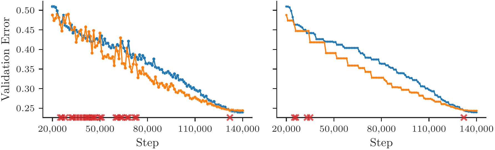
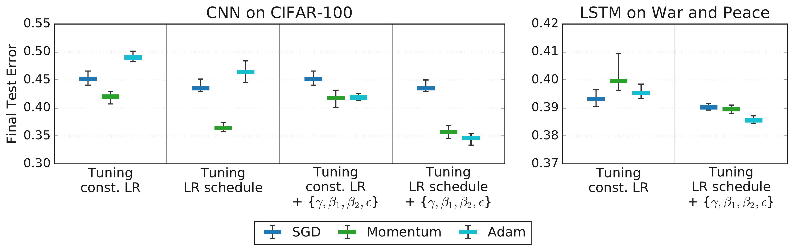
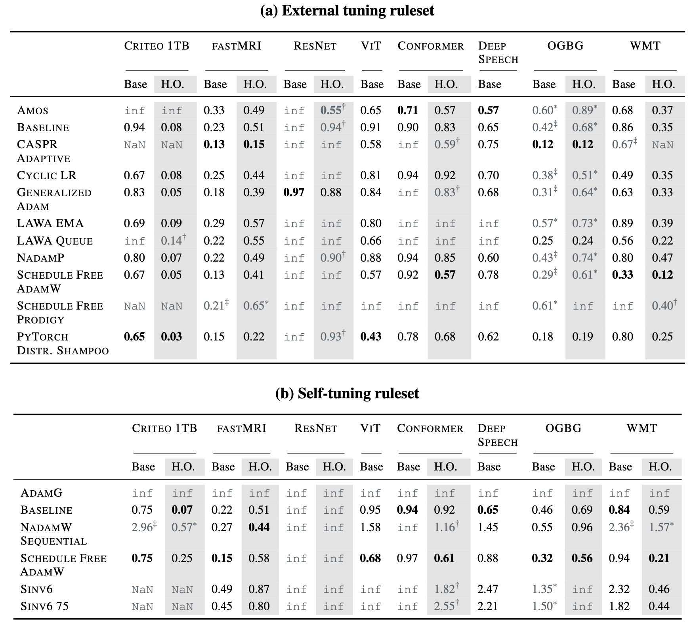

**Lecture 10 Cheat Sheet: Benchmarking Optimizers**

**I. Introduction: The Optimizer Comparison Problem**

*   **The Problem:** Determining if Optimizer A is truly "better/faster" than Optimizer B for complex deep learning models is **difficult**. Naive comparisons (loss curves, final values) are often **misleading**.
*   **Why?** Performance depends on subtle interactions: optimizer + specific workload + **hyperparameter selection process**.
*   **Context:** We've studied optimizers (SGD, Momentum, Adam, etc.) and theory (L6, L7, L9 mean estimation, NQM). Now we address *practical empirical comparison*.

---

**II. Challenge 1: Defining "Speed" - Crossing Curves**

*   **Ambiguity:** Simply plotting validation loss vs. time/steps is **ill-posed**. Curves frequently **intersect**, meaning which optimizer is "ahead" changes throughout training.
*   **Evidence (Dahl et al., 2023, Fig 1):**
    *    *(Representational Thumbnail)*
    *   *Shows:* Raw validation curves cross (left); even "best-so-far" (running minimum) curves cross (right). No clear winner from curve shape alone.
    *   *Quote:* "Figure 1: A direct comparison of training curves is ill-posed if they intersect. Left: The validation error for two different runs... Right: The best validation error obtained so far by each curve... the curves intersect multiple times..." (Dahl et al., 2023, p. 10)
*   **Solution: Time-to-Result (TTR)**
    *   *Definition:* Measure the **time** (wall-clock/steps on standard hardware) required to **first reach a pre-defined target performance value** (e.g., target validation error).
    *   *Benefit:* Provides a single, **unambiguous endpoint** for comparing speed. (Dahl et al., 2023, Sec 4.1).

---

**III. Challenge 2: The Hyperparameter Tuning Trap**

*   **Core Issue:** The **Hyperparameter Tuning Protocol** is arguably the **biggest confounder**. Optimizer performance comparisons are meaningless without specifying *how* HPs were chosen.
*   **The Protocol includes:**
    *   **Search Space:** Which HPs (LR, $\beta_1, \beta_2, \lambda, \epsilon$, schedule params...) are tuned & over what ranges?
    *   **Budget:** How many tuning trials are allowed?
    *   **Method:** How are trials sampled (random, grid, etc.)?
*   **Concept: Optimizer Inclusion Hierarchy (Choi et al., 2019b, Def 1):**
    *   *Definition:* $M \subseteq N$ if N can simulate M (e.g., SGD $\subseteq$ Momentum).
    *   *Theory:* With *infinite* tuning budget, N should perform $\ge$ M.
    *   *Practical Question:* Does this hold with *realistic, finite* tuning budgets? (Often not, if tuning is unfair/incomplete).
*   **Evidence 1: Tuning Protocol Reverses Rankings (Choi et al., 2019b, Fig 3):**
    *    *(Representational Thumbnail)*
    *   *Shows:* Prior finding (Adam < Momentum) occurred with **limited tuning** (LR only). When **more HPs were tuned fairly** for *both* optimizers, performance became comparable, contradicting the earlier result.
    *   *Quote:* "Figure 3: Tuning more hyperparameters removes the differences in test error between optimizers observed by Wilson et al. (2017). Tuning a subset... is sufficient to equalize performance... More extensive hyperparameter tuning... improves results for all optimizers and still does not produce any differences..." (Choi et al., 2019b, p. 7)
*   **Evidence 2: Protocol Sensitivity (Choi et al., 2019b, Fig 4):**
    *    *(Representational Thumbnail)*
    *   *Shows:* Optimizer rankings **change significantly** based on *which HPs* are included in the tuning protocol (compare left vs right bars per task). Rankings align with theory ($SGD \subseteq Momentum \subseteq Adam$) only under comprehensive tuning.
    *   *Quote:* "Figure 4: Tuning more hyperparameters changes optimizer rankings from Schneider et al. (2019) to rankings that are consistent with the inclusion relationships..." (Choi et al., 2019b, p. 8)
*   **CRITICAL TAKEAWAY:** The **Optimizer + its FULL Tuning Protocol** (Search Space, Budget, Method) is the unit being compared. Specifying only the optimizer name is insufficient. (Choi et al., 2019b, Sec 5).

---

**IV. Detailed Tuning Strategies from Sources**

*   **Goal:** Understand *specific mechanics* of tuning used in benchmarks/studies.

*   **1. AlgoPerf Benchmark Tuning Rulesets (Dahl et al., 2023; Kasimbeg et al., 2024)**
    *   **A. External Tuning:**
        *   *Simulates:* Limited parallel tuning budget.
        *   *Submitter Provides:* HP Search Space (or OptList).
        *   *Benchmark Runs:* N trials (e.g., 5) per study via **quasi-random search**. Selects best trial based on fastest time to *validation* target. Repeats M times (e.g., 5 studies) w/ different seeds.
        *   *Score:* **Median** TTR to *test* target across studies (using the best-validation trial from each study).
    *   **B. Self-Tuning:**
        *   *Simulates:* Fully automated algorithm.
        *   *Submitter Provides:* Algorithm (no external HPs). All tuning must be internal, "on the clock".
        *   *Benchmark Runs:* Once per study. Larger time budget (e.g., 3x). Repeats M times (e.g., 5 studies) w/ different seeds.
        *   *Score:* **Median** TTR to *test* target across studies.

*   **2. Choi et al. (2019b) Experimental Tuning:**
    *   *Goal:* Show protocol *choice* changes results.
    *   *Compared Protocols:*
        *   *"Limited Tuning":* Mimicked prior work => **LR only tuned**; other HPs **fixed** at defaults.
        *   *"Comprehensive Tuning":* Tuned **multiple HPs**: LR, schedule params, Momentum coeff, Adam $\beta_2, \epsilon$. Used **quasi-random search**, fixed budget (10-100 trials). Used **log-uniform search spaces** (explicit ranges in App D). Selected based on final validation perf. (Crucially decoupled Adam $\alpha_0, \epsilon$ tuning).
    *   *Finding:* Moving Limited $\rightarrow$ Comprehensive changed optimizer rankings.

---

**V. A Solution: Rigorous Benchmarking Principles (AlgoPerf Example)**

*   **Goal:** Standardized framework for fair comparison. AlgoPerf (Dahl et al., 2023).
*   **Key Principles:**
    1.  **Metric:** **Time-to-Result (TTR)** using pre-defined targets.
    2.  **Hardware:** **Standardized, fixed** hardware.
    3.  **Workloads:** **Diverse suite** + **Held-out variants** (test robustness).
    4.  **Isolation:** **Strict API** limits submissions to algorithm changes only.
    5.  **Tuning Rules:** **Explicit External vs. Self-Tuning** rulesets.
    6.  **Scoring:** Aggregate using **Performance Profiles**.
*   **Understanding Performance Profiles:**
    *    *(Representational Thumbnail - e.g., External Tuning)*
    *   *X-axis ($\tau$):* Slowdown factor relative to *best* on that workload ($\tau \ge 1$).
    *   *Y-axis (% Workloads):* Fraction solved *within* factor $\tau$ of best time.
    *   *Interpretation:* **Higher / Further Left = Better.** More problems solved faster relative to best.
    *   *Quote:* "In the performance profiles (b, d), each line represents a submission. A step at $\tau$ indicates that, for one workload, this submission reaches the target within $\tau$ times the runtime of the fastest submission..." (Kasimbeg et al., 2024, p. 4)

---

**VI. What We Learned: AlgoPerf Competition Results (Kasimbeg et al., 2024)**

*   **Overall Outcome (Kasimbeg et al., 2024, Fig 1):**
    *    *(Representational Thumbnail)*
    *   *Shows:* Leaderboards (a, c) & Profiles (b, d). Benchmark differentiates optimizers.
    *   *Winners:* Distributed Shampoo (External), ScheduleFreeAdamW (Self-Tuning).
*   **Finding 1: Advanced Preconditioning Works (External):**
    *   *Who:* Distributed Shampoo (non-diagonal preconditioning).
    *   *What:* ~28% faster avg. wall-clock vs NadamW baseline *when fairly tuned*.
    *   *Significance:* Shows practical benefit of advanced methods beyond Adam variants in a controlled setting. (Kasimbeg Sec 3).
*   **Finding 2: Hyperparameter-Free Progress (Self-Tuning):**
    *   *Who:* ScheduleFreeAdamW.
    *   *What:* ~10% faster than *external tuning baseline* on common tasks, *using zero external tuning*.
    *   *Significance:* Promising progress towards automated training. (Kasimbeg Sec 3.2).
*   **Finding 3: Robustness is Crucial:**
    *   *Evidence:* Kasimbeg Table 1 shows many failures (`inf`, `NaN`, `†`, `‡`) for various submissions.
    *    *(Representational Thumbnail)*
    *   *Shows:* Winners were *reliable* across workloads, not necessarily fastest everywhere. Robustness key to high aggregate score.
    *   *Quote:* "Table 1: Normalized submission runtimes... `inf` denotes... did not reach... target... `NaN` indicates an error... † indicates... held-out score is ignored... ‡ indicates... base workload score is ignored..." (Kasimbeg et al., 2024, p. 5)
*   **Other Lessons:** Fair cross-framework (JAX/PyTorch) comparison needs effort (Kasimbeg Sec 4). Benchmark design involves cost/benefit trade-offs (Kasimbeg Sec 5.1).

---

**VII. Conclusion**

*   **Bottom Line:** Comparing optimizers reliably **REQUIRES** standardized benchmarks.
*   **Reason:** Must control for workload, hardware, speed definition (TTR), and **explicitly account for the full tuning protocol**. Naive comparisons are misleading.
*   **Actionable Insight:** Treat **Optimizer + Tuning Protocol** as the **indivisible unit** of evaluation. Report protocols meticulously or use benchmarks.

---