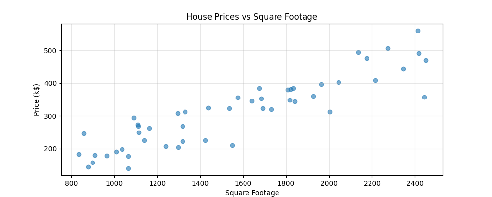
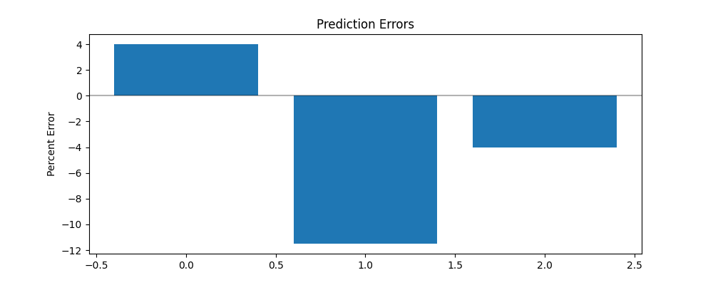
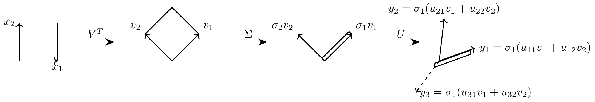

<br><br> <br><br> 

# STAT 4830: Numerical optimization for data science and ML
## Lecture 2: Linear Regression: Direct Methods
### Professor Damek Davis

---

# Overview

1. Introduction & Prediction with Features
2. Computing Predictions Efficiently
3. Finding Optimal Weights
4. Direct Solution Methods
5. Numerical Stability
6. QR Factorization


---

# Introduction

Last lecture: PyTorch's efficient handling of vectors and matrices
Today: Applying these tools to prediction - a core data science challenge

Four key steps:
1. Converting predictions into matrix operations
2. Formulating the optimization problem
3. Converting optimization into linear equations
4. Solving equations efficiently via direct methods

---

# Prediction with Multiple Features

Basic house price equation:
$$ \text{price} = w_1 \cdot \text{size} + w_2 \cdot \text{age} + w_3 \cdot \text{bedrooms} + w_4 \cdot \text{location} + \text{noise} $$

Vector notation:
$$ y = w^T x + \epsilon $$

Each weight has clear meaning:
- $w_1$: dollars per square foot
- $w_2$: price change per year of age
- $w_3$: value per bedroom
- $w_4$: location premium

---

# Feature Mapping and Error Analysis



- Linear relationships sometimes exist in real data
- Scatter represents noise/unexplained factors
- Simple but powerful approximation

---

# Code Example: House Price Prediction

```python
house = {
    'size': 1500,     # x₁: sq ft
    'age': 10,        # x₂: years
    'bedrooms': 3,    # x₃: count
    'location': 0.8   # x₄: some score
}
price = 500000  # y: dollars

def predict_price(house, weights):
    """Predict house price using linear combination of features"""
    return (
        weights[0] * house['size'] +      # dollars per sq ft
        weights[1] * house['age'] +       # price change per year
        weights[2] * house['bedrooms'] +  # value per bedroom
        weights[3] * house['location']    # location premium
    )
```

<!-- 
# Prediction Errors



Our model's performance:
- Errors range from 4% to 12%
- Systematic patterns?
- Can we do better? -->

---

# Computing Predictions Efficiently

Matrix multiplication for all predictions:
$$ \text{house}_1: [1500, 10, 3, 0.8] \cdot [w_1, w_2, w_3, w_4] = \text{prediction}_1 $$
$$ \text{house}_2: [2100, 2, 4, 0.9] \cdot [w_1, w_2, w_3, w_4] = \text{prediction}_2 $$
$$ \text{house}_3: [800, 50, 2, 0.3] \cdot [w_1, w_2, w_3, w_4] = \text{prediction}_3 $$

Feature matrix:
$$ X = \begin{bmatrix} 
\text{size}_1 & \text{age}_1 & \text{beds}_1 & \text{loc}_1 \\
\text{size}_2 & \text{age}_2 & \text{beds}_2 & \text{loc}_2 \\
\text{size}_3 & \text{age}_3 & \text{beds}_3 & \text{loc}_3
\end{bmatrix} = \begin{bmatrix}
1500 & 10 & 3 & 0.8 \\
2100 & 2 & 4 & 0.9 \\
800 & 50 & 2 & 0.3
\end{bmatrix} $$

---

# Performance Impact

```
Dataset Size | Loop Time  | Matrix Time | Speedup
------------------------------------------------
     1,000   |   0.21ms  |    0.01ms   |   21x
    10,000   |   1.79ms  |    0.05ms   |   34x
   100,000   |  19.39ms  |    0.58ms   |   33x
 1,000,000   | 196.33ms  |    5.43ms   |   36x
```

Why so fast?
- CPU's SIMD instructions
- Cache-friendly memory access
- Optimized BLAS libraries
- Critical for iterative methods later!


---
# Finding Optimal Weights: The Math in 1D

Remember our 10% error on house prices? Let's discover why calculus and linear algebra together give us a direct path to the best weights.

Simple example with two houses:
- House 1: 1000 sq ft → 300k dollars
- House 2: 2000 sq ft → 600k dollars

Notice: When size doubles (1000 → 2000), price doubles too (300k → 600k)

--- 
# Finding Optimal Weights in 1D

Error for a given weight $w$ (price per sq ft, in $k$):

$$ \text{error}(w) = (300 - 1000w)^2 + (600 - 2000w)^2 $$

To minimize: Set derivative to zero and solve
$$ -2(1000)(300 - 1000w) - 2(2000)(600 - 2000w) = 0 $$

Collecting terms:
$$ (1000^2 + 2000^2)w = 1000(300) + 2000(600) $$

In terms of data matrix:
$$ X^TXw = X^Ty $$

---

# More Generally: Calculus → Lin Alg

For multiple features, we minimize:
$$ \text{error} = \sum_{i=1}^n (y_i - w^T x_i)^2 $$

Taking partial derivatives:
$$ \frac{\partial}{\partial w_j} \text{error} = -2\sum_{i=1}^n x_{ij}(y_i - w^T x_i) = 0 $$

In matrix form:
$$ -2X^T(y - Xw) = 0 $$
$$ X^TXw = X^Ty $$

---

# The Normal Equations

> Calculus turns "minimize prediction error" into "solve the **normal equations**"

$$  X^TXw = X^Ty $$

$$ X^TX = \begin{bmatrix} 
\mathbf{size} \cdot \mathbf{size} & \mathbf{size} \cdot \mathbf{age} & \mathbf{size} \cdot \mathbf{beds} \\
\mathbf{age} \cdot \mathbf{size} & \mathbf{age} \cdot \mathbf{age} & \mathbf{age} \cdot \mathbf{beds} \\
\mathbf{beds} \cdot \mathbf{size} & \mathbf{beds} \cdot \mathbf{age} & \mathbf{beds} \cdot \mathbf{beds}
\end{bmatrix} $$

These equations have beautiful properties:
1. One equation per weight
2. Linear in the weights
3. Error vector $(X w_\star - y)$ at solution $w_\star$ becomes orthogonal to $X$

---

# The Normal Equations

> Calculus turns minimizing prediction error into solving linear equations

$$ X^TXw = X^Ty $$

System size depends on features, not data:
- $n$ houses, $p$ features
- $X$ is $n \times p$
- $X^TX$ is $p \times p$
- Even with millions of houses, system stays small!


---

# Structure of Normal Equations

When we multiply $X^TX$, each entry combines feature vectors:

$$ A = X^TX = \begin{bmatrix} 
\mathbf{size} \cdot \mathbf{size} & \mathbf{size} \cdot \mathbf{age} & \mathbf{size} \cdot \mathbf{beds} \\
\mathbf{age} \cdot \mathbf{size} & \mathbf{age} \cdot \mathbf{age} & \mathbf{age} \cdot \mathbf{beds} \\
\mathbf{beds} \cdot \mathbf{size} & \mathbf{beds} \cdot \mathbf{age} & \mathbf{beds} \cdot \mathbf{beds}
\end{bmatrix} $$

Properties:
- Diagonal entries sum squares (always positive)
- Off-diagonal entries show feature correlations
---
# Direct Solution Methods

Remember our plan:
1. Convert predictions into matrix operations ✓
2. Formulate optimization problem ✓
3. Convert to linear equations ✓
4. **Solve equations efficiently** ← We are here!

Today: Three methods for solving normal equations:
> Gaussian elimination, LU factorization, and QR factorization

---

# Direct Solution Methods


Example with three features:
```python
X = torch.tensor([
    [1500, 10, 3],    # house 1: size, age, bedrooms
    [2100, 2,  4],    # house 2
    [800,  50, 2],    # house 3
    [1800, 15, 3]     # house 4
])
y = torch.tensor([500000, 800000, 250000, 550000])
```

The normal equations $(X^TX)w = X^Ty$ give us a system $Aw = b$ where:
- $A = X^TX$ is square matrix (3 × 3)
- $b = X^Ty$ combines features and prices


---

# Key considerations:
- Computational Efficiency
> (1) measured by number of arithmetic operations, (2) critical for large systems, (3) affects running time directly
- Numerical Stability
> (1) how measurement errors get amplified, (2) critical when features are correlated, (3) can make fast methods unreliable


---

# Cost Analysis of Direct Methods

Two main costs:
1. Formation: Computing $X^TX$ and $X^Ty$
2. Solution: Solving the resulting system

With $n$ houses and $p$ features:
- Computing $X^TX$: $np^2$ operations ($p^2$ dot products of size $n$ vectors)
- Computing $X^Ty$: $np$ operations ($p$ dot products of size $n$ vectors)
- Solving $p \times p$ system: $\frac{2p^3}{3}$ operations (gaussian elimination)

---

# Cost Analysis of Direct Methods

Which dominates depends on problem size:
```python
# Many houses, few features: Formation dominates
n, p = 1000, 10  # 1000 houses, 10 features
formation_cost = n * p**2  # 100,000 operations
solution_cost = (2 * p**3) // 3  # ~667 operations

# Many houses, many features: Both costs significant
n, p = 1000, 100  # Same houses, more features
formation_cost = n * p**2  # 10 million operations
solution_cost = (2 * p**3) // 3  # ~667,000 operations

# Few houses, many features: Solution dominates!
n, p = 50, 200  # 50 houses, 200 features
formation_cost = n * p**2  # 2 million operations
solution_cost = (2 * p**3) // 3  # ~5.3 million operations
```

---

# Cost Analysis of Direct Methods
Key insights:
- n >> p: Formation cost dominates
- n ≈ p: Both costs matter
- n << p: Solution cost dominates

> Now let's recall a method you all know from lin alg: Gaussian elimination


---
# Gaussian Elimination Steps

Gaussian elimination solves equations by systematically removing variables. The idea is simple: 
> use one equation to eliminate a variable from the others, then repeat. 

We'll create zeros below the diagonal one column at a time, turning our system into an equivalent triangular form that's easy to solve by back-substitution.

---

# Gaussian Elimination Steps

Step 1: First Elimination
*Goal*: Create zeros in first column below $a_{11}$

*Compute multipliers*:
$$ m_{21} = \displaystyle\frac{a_{21}}{a_{11}} \quad \text{and} \quad m_{31} = \displaystyle\frac{a_{31}}{a_{11}} $$

*After row operations*:
$$ \begin{array}{c|c}
\begin{matrix} 
a_{11} & a_{12} & a_{13} \\[0.7em]
0 & a_{22}' & a_{23}' \\[0.7em]
0 & a_{32}' & a_{33}'
\end{matrix} &
\begin{matrix}
b_1 \\[0.7em]
b_2' \\[0.7em]
b_3'
\end{matrix}
\end{array} \qquad \text{(24 operations: 12 multiplications, 12 subtractions)} $$

---

# Gaussian Elimination: Step 2

Step 2: Second Elimination
*Goal*: Create zero in second column below $a_{22}'$

*Compute multiplier*:
$$ m_{32} = \displaystyle\frac{a_{32}'}{a_{22}'} $$

*After row operations*:
$$ \begin{array}{c|c}
\begin{matrix} 
a_{11} & a_{12} & a_{13} \\[0.7em]
0 & a_{22}' & a_{23}' \\[0.7em]
0 & 0 & a_{33}''
\end{matrix} &
\begin{matrix}
b_1 \\[0.7em]
b_2' \\[0.7em]
b_3''
\end{matrix}
\end{array} \qquad \text{(8 operations: 4 multiplications, 4 subtractions)} $$

---

# Gaussian Elimination: Back-substitution

Step 3: Back-substitution
$$ \begin{aligned}
w_3 &= \displaystyle\frac{b_3''}{a_{33}''} && \text{(1 division)} \\[0.7em]
w_2 &= \displaystyle\frac{b_2' - a_{23}'w_3}{a_{22}'} && \text{(2 ops + 1 division)} \\[0.7em]
w_1 &= \displaystyle\frac{b_1 - a_{12}w_2 - a_{13}w_3}{a_{11}} && \text{(4 ops + 1 division)}
\end{aligned} $$

Total operations:
- 6 divisions
- 19 multiplications
- 19 additions/subtractions

--- 
# Cost in general 

For our 3×3 system, we needed 6 divisions, 19 multiplications, and 19 additions or subtractions. Looking at how these counts arise reveals the pattern: 
> each elimination step processes one column, requiring operations proportional to the size of the remaining matrix. For an $p\times p$ system, this pattern leads to approximately $\frac{2p^3}{3}$ operations for elimination and another $\frac{p^2}{2}$ for back-substitution.

---


# LU Factorization

Imagine this scenario:
- You've just computed optimal weights for 1000 houses
- Then 100 new houses sell, with different prices
- Market conditions shift existing home values
- Seasonal patterns affect current listings
 
Each change means new optimal weights. Can we avoid redoing all our work?

LU factorization is 
> a clever way to reorganize Gaussian elimination that becomes especially valuable when we need to update our predictions with new house prices. Instead of solving the entire system again, we'll see how to reuse much of our previous work.

---

# LU Factorization

LU factorization is a factorization of the A into upper and lower triangular matrices:
$$ A = LU = \begin{bmatrix} 
1 & 0 & 0 \\
m_{21} & 1 & 0 \\
m_{31} & m_{32} & 1
\end{bmatrix}
\begin{bmatrix}
u_{11} & u_{12} & u_{13} \\
0 & u_{22} & u_{23} \\
0 & 0 & u_{33}
\end{bmatrix} $$

It is highly useful for solving linear equations, as we will see.

---

# Solving with LUw = b

1. Forward substitution ($Lv = b$), where ($v = Uw$):
$$ \begin{aligned}
v_1 &= b_1 \\
v_2 &= b_2 - m_{21}v_1 \\
v_3 &= b_3 - m_{31}v_1 - m_{32}v_2
\end{aligned} $$

2. Back substitution ($Uw = y$):
$$ \begin{aligned}
w_3 &= y_3/u_{33} \\
w_2 &= (y_2 - u_{23}w_3)/u_{22} \\
w_1 &= (y_1 - u_{12}w_2 - u_{13}w_3)/u_{11}
\end{aligned} $$

---

# LU Factorization: The Process

Step 1: Create zeros in first column
$$ \begin{bmatrix}
a_{11} & a_{12} & a_{13} \\[0.7em]
\times & a_{22} & a_{23} \\[0.7em]
\times & a_{32} & a_{33}
\end{bmatrix} \rightarrow
\begin{bmatrix}
a_{11} & a_{12} & a_{13} \\[0.7em]
0 & a_{22}' & a_{23}' \\[0.7em]
0 & a_{32}' & a_{33}'
\end{bmatrix} $$

Multipliers:
$$ m_{21} = \frac{a_{21}}{a_{11}} \quad \text{and} \quad m_{31} = \frac{a_{31}}{a_{11}} $$

---

# LU Factorization: Recording Our Work

After first column elimination:
- $a_{22}' = a_{22} - m_{21}a_{12}$ 
- $a_{23}' = a_{23} - m_{21}a_{13}$
- $a_{32}' = a_{32} - m_{31}a_{12}$
- $a_{33}' = a_{33} - m_{31}a_{13}$

$$ A = \begin{bmatrix}
a_{11} & a_{12} & a_{13} \\[0.7em]
a_{21} & a_{22} & a_{23} \\[0.7em]
a_{31} & a_{32} & a_{33}
\end{bmatrix} = 
\begin{bmatrix}
1 & 0 & 0 \\[0.7em]
m_{21} & 1 & 0 \\[0.7em]
m_{31} & 0 & 1
\end{bmatrix} \times
\begin{bmatrix}
a_{11} & a_{12} & a_{13} \\[0.7em]
0 & a_{22}' & a_{23}' \\[0.7em]
0 & a_{32}' & a_{33}'
\end{bmatrix} $$

Next step: eliminate $a_{32}'$ using $m_{32} = a_{32}'/a_{22}'$

---

# LU Factorization: Recording Our Work 

After second column elimination:
- $m_{32} = a_{32}'/a_{22}'$
- $a_{33}'' = a_{33}' - m_{32}a_{23}'$

$$ A = \underbrace{\begin{bmatrix}
1 & 0 & 0 \\[0.7em]
m_{21} & 1 & 0 \\[0.7em]
m_{31} & m_{32} & 1
\end{bmatrix}}_{\text{$L$ (elimination history)}} \times
\underbrace{\begin{bmatrix}
a_{11} & a_{12} & a_{13} \\[0.7em]
0 & a_{22}' & a_{23}' \\[0.7em]
0 & 0 & a_{33}''
\end{bmatrix}}_{\text{$U$ (eliminated system)}} $$


---

# LU Factorization: Why It's Useful

When market conditions change:
- Features ($X$) stay the same
- Only prices ($y$) change
- $A = X^TX$ remains unchanged
- Can reuse $L$ and $U$!

Example with daily updates for a year:
```
Operation        Without LU    With LU
First solution   677K ops      677K ops
365 updates      247M ops     3.7M ops
Savings                       98.5%
```

---

# LU Factorization: Implementation

```python
def solve_with_lu(X, y):
    """Initial solution with LU factorization"""
    # Form normal equations
    XtX = X.T @ X
    Xty = X.T @ y
    
    # Factor once
    L, U = torch.lu(XtX)
    
    # Solve two triangular systems
    y = torch.triangular_solve(Xty, L, upper=False)[0]
    w = torch.triangular_solve(y, U)[0]
    return w, L, U

def update_solution(L, U, X, y_new):
    """Fast update when only prices change"""
    Xty = X.T @ y_new
    y = torch.triangular_solve(Xty, L, upper=False)[0]
    return torch.triangular_solve(y, U)[0]
```

---

# LU Factorization: A Hidden Weakness

LU factorization is fast for updates, but inherits a critical issue:
- Correlated create unstable systems: small errors → large weight changes
- Called **ill-conditioning** and can lead to numerically inaccurate solutions.

Can happen in practice:
```python
# Square footage and rooms are highly correlated
X = torch.tensor([
    [1500, 6],    # 1500 sq ft ≈ 6 rooms, 1500/6 = 250
    [2000, 8],    # 2000 sq ft ≈ 8 rooms, 2000/8 = 250
    [1800, 7]     # 1800 sq ft ≈ 7 rooms, 1800/7 ~ 257
])
```
---

# Ill-conditioning: diagonal case 

Key insight: Matrix multiplication stretches space
- Some directions get stretched more than others
- This stretching can reveal hidden problems
- We can measure this stretching!

Example: Unit vectors get stretched differently
$$ \begin{bmatrix} 100 & 0 \\ 0 & 0.1 \end{bmatrix} 
\begin{bmatrix} 1 \\ 0 \end{bmatrix} = 
\begin{bmatrix} 100 \\ 0 \end{bmatrix} $$

$$ \begin{bmatrix} 100 & 0 \\ 0 & 0.1 \end{bmatrix} 
\begin{bmatrix} 0 \\ 1 \end{bmatrix} = 
\begin{bmatrix} 0 \\ 0.1 \end{bmatrix} $$

---

# Ill-conditioning: diagonal case 

For diagonal matrices, stretching is obvious:
$$ D = \begin{bmatrix} 100 & 0 \\ 0 & 0.1 \end{bmatrix} $$

- Horizontal direction: stretched by 100
- Vertical direction: shrunk to 0.1
- Ratio of stretching = 100/0.1 = 1000

This ratio is called the **condition number** $κ(D) = 1000$
- Large ratio → ill-conditioned
- Small ratio → well-conditioned

---

# Seeing Instability: diagonal case 

$$ D = \begin{bmatrix} 1 & 0 \\ 0 & 0.0001 \end{bmatrix} $$

Solving $Dx = y$ for two similar right-hand sides:
```python
D = torch.tensor([[1.0, 0.0], [0.0, 0.0001]])
y1 = torch.tensor([1.0, 0.0])
y2 = torch.tensor([1.0, 0.01])  # tiny change in second component

x1 = torch.solve(y1, D)[0]
x2 = torch.solve(y2, D)[0]

print(f"x1: {x1}")  # [1.0, 0.0]
print(f"x2: {x2}")  # [1.0, 100.0]  # huge change!
```

Small change in y → huge change in x in the direction of small stretching!


---

# More General Matrices

For non-diagonal matrices, stretching is hidden:
$$ A = \begin{bmatrix} 1 & 1 \\ 1 & 1.001 \end{bmatrix} $$

This matrix represents nearly perfectly correlated features:
- First feature ≈ second feature
- Their difference barely affects output
- Their sum has large effect

This creates very uneven stretching in different directions.

---

# From Diagonal to General Matrices

Key insight: SVD reveals the directions and amounts of stretching in any $n \times p$ matrix!

$$ A = U\Sigma V^T $$

Each part has a specific role:
1. $V^T$: rotates/reflects to directions of maximum/minimum stretching
2. $\Sigma$: stretches by singular values in those directions
3. $U$: rotates/reflects to final orientation (independent of $V$)

<div style="text-align: center"></div>

---

# The condition number

The diagonal elements of $\Sigma$ determine the stretching
$$ A = U\Sigma V^T $$

```python
A = torch.tensor([[1.0, 1.0], [1.0, 1.001]])
U, S, Vt = torch.linalg.svd(A)
print(f"Stretching amounts: {S}")  # [2.001, 0.001]
```
The tiny singular value (0.001) reveals the near dependency!

In general, we define the **condition number** as the ratio of the largest to smallest (nonzero) stretching:
$$ κ(A) = \sigma_{\text{max}}/\sigma_{\text{min}} $$


---


# Seeing Instability: Correlated Features

```python
# Features with condition number ≈ 4000
X = torch.tensor([[1.0, 1.0], [1.0, 1.001]])
U, s, Vt = torch.linalg.svd(X)
print(f"Singular values: {s}")  
# s ≈ [2.001, 0.0005]  # Ratio ≈ 4000!

# Original problem
w_true = torch.tensor([1.0, 0.0])
y1 = X @ w_true                    # y1 ≈ [1.000, 1.000]
w1 = torch.solve(X.T @ X @ w_true) # w1 ≈ [1.000, 0.000]

# Perturb along direction of small singular value
u2 = U[:, 1]                       # u2 ≈ [-0.707, 0.707]
perturbation = 0.001 * torch.norm(y1) * u2
y2 = y1 + perturbation            # y2 ≈ [0.999, 1.001]
                                  # (0.1% change in y)

# Solve perturbed system
w2 = torch.solve(X.T @ X @ y2)    # w2 ≈ [-1.001, 2.000]
                                  # (283% change in w!)
```

<!-- Key insights:
1. Tiny perturbation (0.1%) along u₂ (direction of small singular value)
2. Weights change dramatically (283%)
3. But predictions barely change (0.1%)
4. Normal equations make this worse by squaring condition number! -->

---

# Understanding the Instability

When solving $Ax = b$:
- Small changes in b's "small-stretch directions" force large changes in $x$ to compensate

Normal equations make this worse:
- $X^TX = V\Sigma^2 V^T$ squares the singular values (check!)
- Stretching ratios: 1:10000 → 1:100000000
- Makes an already sensitive problem much worse

---

# Question

> Is it possible to solve the linear regression problem without ever forming $X^TX$?


---


# A partial remedy: QR Factorization

Instead of squaring the condition number:
1. Work directly with $X$
2. Find orthogonal directions ($Q$)
3. Solve triangular system ($R$)

Benefits:
- Avoids squaring condition number
- More stable computations
- Still efficient


---
# QR Factorization: The Details

Instead of forming $X^TX$, decompose $X$ directly:
$$ X = QR $$

where:
- $Q$: orthogonal matrix (perpendicular columns)
- $R$: upper triangular matrix

```python
def solve_regression(X, y):
    """Solve linear regression using QR factorization"""
    Q, R = torch.qr(X)
    return torch.triangular_solve(Q.T @ y, R)[0]
```

---


# Properties of QR

$Q$ has special properties:
- Columns are perpendicular (orthogonal)
- Each column has length 1 (normalized)
- $Q^TQ = I$ (identity matrix)

Check orthogonality:
```python
print("Q^T @ Q =\n", Q.T @ Q)

# Output:
# tensor([[1.0000, 0.0000, 0.0000],
#         [0.0000, 1.0000, 0.0000],
#         [0.0000, 0.0000, 1.0000]])
```

---

# Structure of R

For a data matrix $X$ with $n$ rows and $p$ columns:

$$ R = \begin{bmatrix}
r_{11} & r_{12} & r_{13} \\
0 & r_{22} & r_{23} \\
0 & 0 & r_{33} \\
\hline
0 & 0 & 0 \\
\vdots & \vdots & \vdots \\
0 & 0 & 0
\end{bmatrix} \begin{array}{l}
\leftarrow \text{upper triangular } p \times p \text{ part} \\
\\
\leftarrow \text{zeros in remaining rows}
\end{array} $$

Key insight:
- Only need top $p \times p$ part for solving
- Bottom rows are all zeros
- Much more efficient than working with full $n \times n$ matrices!

---

# Solving with QR: The Key Insight

Start with original problem and QR decomposition:
$$ Xw = y \quad \text{becomes} \quad QRw = y $$

> Key insight: Multiply both sides by $Q^T$ to "untangle" equations

Why this works:
$$ \begin{aligned}
Q^T(QRw) &= Q^Ty \\
(Q^TQ)Rw &= Q^Ty \\
IRw &= Q^Ty \\
Rw &= Q^Ty
\end{aligned} $$

Beautiful result: Problem becomes triangular without forming $X^TX$!

---

# Solving with QR: A 4×3 Example

With 4 houses and 3 features:
- $X$ is $4 \times 3$ (houses × features)
- $Q$ is $4 \times 4$ (orthogonal)
- $R$ is $4 \times 3$ (same shape as $X$)
- Only need top $3 \times 3$ part of $R$

The system $Rw = Q^Ty$ becomes:

$$ \begin{bmatrix}
r_{11} & r_{12} & r_{13} \\
0 & r_{22} & r_{23} \\
0 & 0 & r_{33}
\end{bmatrix}
\begin{bmatrix} w_1 \\ w_2 \\ w_3 \end{bmatrix} =
\begin{bmatrix} c_1 \\ c_2 \\ c_3 \end{bmatrix} $$

where $c = Q^Ty$

---

# Back Substitution with QR

Solve from bottom up:

$$ \begin{aligned}
w_3 &= c_3/r_{33} \\
w_2 &= (c_2 - r_{23}w_3)/r_{22} \\
w_1 &= (c_1 - r_{12}w_2 - r_{13}w_3)/r_{11}
\end{aligned} $$

Clean implementation:
```python
def solve_regression(X, y):
    """Solve linear regression using QR factorization"""
    Q, R = torch.qr(X)
    return torch.triangular_solve(Q.T @ y, R)[0]
```

---

# QR vs Normal Equations: Cost

Operation counts:
- Normal Equations + LU: $np^2$ to form $X^TX$, then $\frac{2p^3}{3}$ to factor
- QR: $2np^2$ to factor $X$ directly

When $n \gg p$ (many more houses than features):
- Formation cost $np^2$ dominates
- LU theoretically twice as fast
- But numerical stability often more important!

---

# QR vs LU: A Stability Experiment

Generate synthetic house data with correlated features:
```python
# Features: sq ft, age, bedrooms + correlated feature
X = torch.stack([sqft, age, bedrooms], dim=1)
X = torch.cat([X, X[:, 0:1] + noise], dim=1)  # Add correlated feature
```

The normal equations change the condition number through the formation of $X^TX$. Our experiment quantifies this: $\kappa(X) = 6,262$ increases to $\kappa(X^TX) = 39.2$ million.

QR factorization preserves the original condition number by operating directly on $X$. The numerical advantage manifests in the prediction accuracy and weight estimates.


---

# QR vs LU: A Stability Experiment (cont.)


Weight estimates for price per square foot (true weight: $200):
- LU result: $209.25 (4.6% error)
- QR result: $199.97 (0.015% error)

Root Mean Square Error (RMSE) quantifies average prediction error:
- LU: $138.04 per house
- QR: $101.08 per house

---

# QR vs LU: Stability Analysis

Both methods stable in their formulations:
- LU: Stable for solving $(X^TX)w = X^Ty$
- QR: Stable for solving original $Xw = y$

1. Well-conditioned case ($\kappa(X) \approx 1$): Normal equations with LU suffice (2x speed)
2. Ill-conditioned case (our example): QR's higher cost justified by accuracy

> Modern implementations use thin QR ($Q$ is $n \times p$)
> Reduces cost while preserving stability benefits

---

# The Limits of Direct Methods

Direct methods face hard constraint:
- Must complete entire computation before any solution and high memory.
- Minutes of waiting for large problems
- Impractical for massive applications

This motivates iterative methods:
- Produce increasingly accurate predictions over time
- Trade perfect accuracy for faster results
- Essential for massive datasets

We'll explore these methods next lecture!

---

# Puzzle

> Supopse you computed the SVD of a matrix $A$. How many operations does it take to solve the system $Ax = b$?