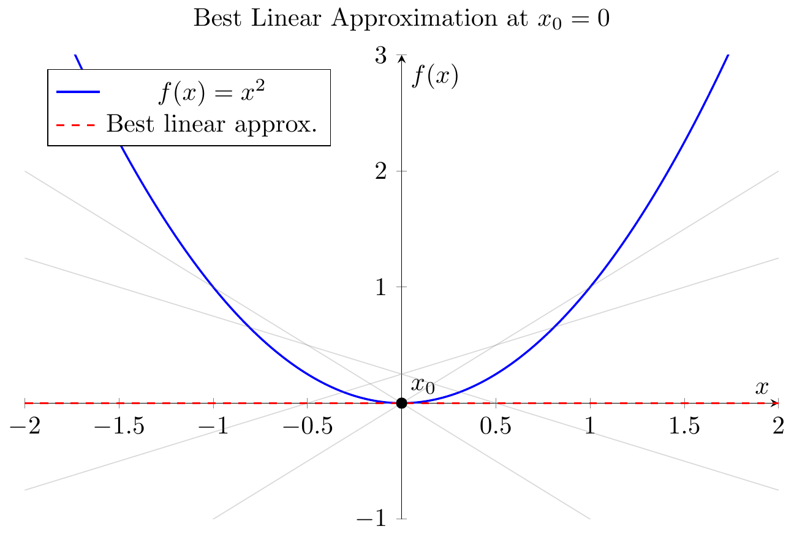
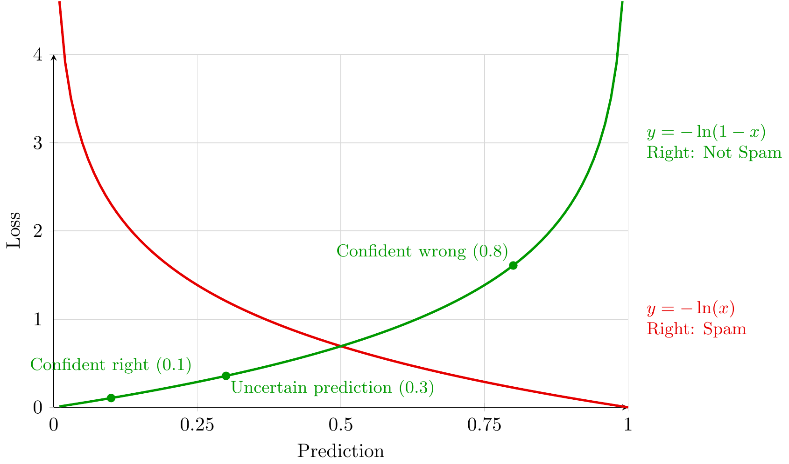
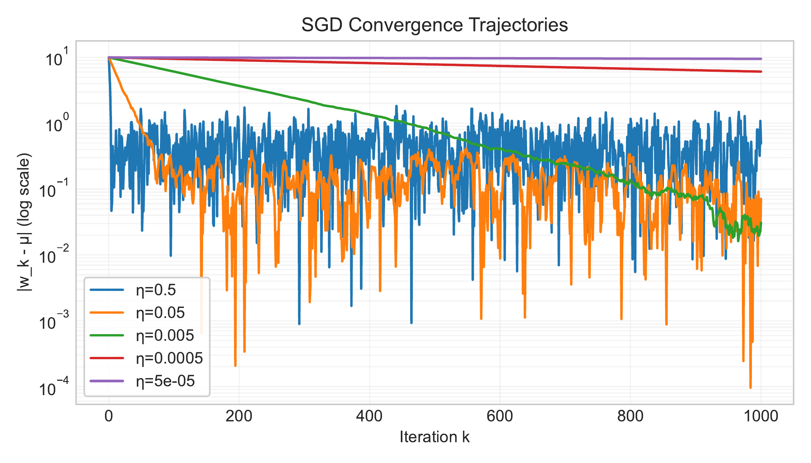
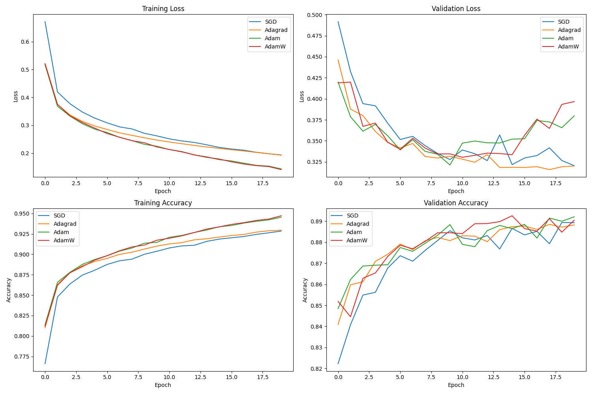
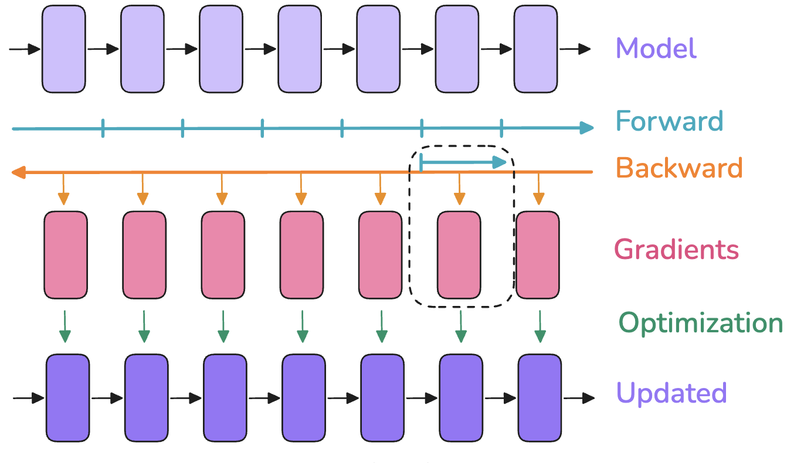

# Stat 4830 Recap: Optimization in PyTorch - Cheat Sheet

**Overall Goal:** Consolidate understanding of numerical optimization for ML/Data Science using PyTorch, aiming to become an **intelligent consumer** of these methods.

---

## 1. Introduction

*   **Purpose:** Final recap of Stat 4830. Consolidate concepts and skills.
*   **Course Theme:** Formulating & solving numerical optimization problems for ML/Data Science. Emphasis on **practical PyTorch implementation**.
*   **Project Role:** Provided hands-on application experience.
*   **Syllabus Goal:** "Become an **intelligent consumer** of numerical methods and software for solving modern optimization problems." This recap reinforces that goal.

---

## 2. Key Concepts & Skills

### PyTorch Fundamentals
*   Started with basics: Tensors, Linear Algebra ([Lecture 1](../1/notes.md)).
*   Core Concept: **Automatic Differentiation (`autograd`)** ([Lecture 4](../4/notes.md)).
*   Calculus View: Derivative/Jacobian = **Best Linear Approximation**; `autograd` implements chain rule ([Lecture 5](../5/notes.md)).
    
    *   *Figure 2.1: Derivative as best linear approx. Tangent line gives closest linear fit near a point. ([Lecture 5](../5/notes.md))*
        
    *   *Figure 2.2: Computational graph for Least Squares loss $L(w) = \frac{1}{2}\|Xw - y\|^2$. `autograd` builds this graph during the forward pass and uses it to compute gradients via the chain rule during `backward()`. ([Lecture 4](../4/notes.md))*
*   Key Tools: `nn.Module` (models), `DataLoader` (data), `torch.optim` (optimizers), `torch.optim.lr_scheduler` (schedules) ([Lecture 8](../8/notes.md)).

### Problem Formulation
*   Goal: Minimize objective $L(w)$, typically average loss $L(w) = \frac{1}{n}\sum_{i=1}^n \ell(w, z_i)$.
*   Examples:
    *   Linear Regression: $\ell(w, x_i, y_i) = \frac{1}{2}(w^T x_i - y_i)^2$ ([L2](../2/notes.md), [L3](../3/notes.md)).
    *   Classification: Cross-Entropy Loss ([L0](../0/notes.md), [L4](../4/notes.md)).
        
        *   *Figure 2.3: Cross-entropy loss guides classification by penalizing confident wrong predictions heavily. ([Lecture 0](../0/notes.md))*

### Gradient Descent (GD) vs. Stochastic GD (SGD)
*   GD Update: $w_{k+1} = w_k - \alpha \nabla L(w_k)$ ([L3](../3/notes.md)).
*   Problem: Computing full $\nabla L(w)$ is $O(n)$ cost - infeasible for large $n$.
    
    *   *Figure 2.4: Memory/Compute scaling. Direct methods need $O(p^2)$ memory, GD needs $O(n)$ compute/step. SGD avoids these. ([Lecture 3](../3/notes.md))*
*   SGD Solution: Use estimate $g(w_k)$ from mini-batch/sample: $w_{k+1} = w_k - \alpha g(w_k)$ ([L6](../6/notes.md), [L8](../8/notes.md)).

### Understanding SGD Behavior (via NQM etc.)
*   Converges **in expectation**.
*   Constant $\alpha \implies$ convergence to **noise floor** (steady-state error), size $\propto \alpha/B$ ([L6](../6/notes.md), [L7](../7/notes.md)). Need decreasing $\alpha$ for exact convergence.
    
    *   *Figure 2.5: SGD noise floor with constant $\eta$. Error decreases then plateaus. ([Lecture 6](../6/notes.md))*
*   **Conditioning number $\kappa$** affects speed ([L2](../2/notes.md), [L3](../3/notes.md), [L7](../7/notes.md)). Poor conditioning $\implies$ slow convergence / oscillations.
    
    *   *Figure 2.6: High conditioning ($\kappa=50$) causes GD to zigzag, especially with larger steps. ([Lecture 3](../3/notes.md))*

### SGD Variants (Insights from NQM [L7](../7/notes.md))
*   **Momentum:** Reduces initial error (good for large B / low noise). Can increase noise floor.
*   **EMA:** Reduces steady-state risk (good for small B / high noise). Minimal effect on initial rate.
*   **Preconditioning:** Addresses poor conditioning $\kappa$ (good for large B). Can amplify noise.

### Adaptive Methods & Practical Tools
*   **Adaptive Opt:** Adagrad, Adam, AdamW adjust LR per parameter ([L9](../9/notes.md)). Useful for varied scales/complex landscapes.
    
    *   *Figure 2.7: Adaptive methods (Adam/AdamW) often converge faster initially on tasks like Fashion MNIST. ([Lecture 9](../9/notes.md))*
*   **Standard Practice:** Weight Decay (regularization) & Learning Rate Schedules are essential ([L8](../8/notes.md)).

### Practical Tuning & Evaluation
*   **Process Matters:** Systematic tuning (Deep Learning Tuning Playbook, [L11](../11/notes.md)). Incremental changes, Exploration > Exploitation, Scientific/Nuisance/Fixed parameters.
    
    *   *Figure 2.8: Iterative tuning workflow: structure exploration before exploitation. ([Lecture 11](../11/notes.md))*
*   **Fair Comparison:** Optimizer comparisons depend heavily on the **tuning protocol** (space, budget) ([L10](../10/notes.md)). Use benchmarks, Time-to-Result metric. Key to being an **intelligent consumer**.
    
    *   *Figure 2.9: Tuning protocol matters! Differences seen with limited tuning vanish with fair, comprehensive tuning. (Choi et al. 2019b, [L10](../10/notes.md))*

### Scaling Large Models ([L12](../12/notes.md))
*   Bottleneck: **Activation Memory**. Grows with batch size `b`, sequence length `s`.
*   Solution 1: **Activation Recomputation** (Gradient Checkpointing) - trade compute for memory.
    
    *   *Figure 2.10: Recompute activations during backward pass instead of storing all. Saves memory. ([Lecture 12](../12/notes.md))*
*   Solution 2: **Parallelism Strategies**. Combine:
    *   Data Parallelism (DP / ZeRO / FSDP) - Replicate model, shard data/state.
    *   Pipeline Parallelism (PP) - Shard layers across devices.
    *   Tensor Parallelism (TP / SP) - Shard ops/tensors within layers.
    
    *   *Figure 2.11: Combining parallelism (DP, PP, TP etc.) is needed for state-of-the-art scale. ([Lecture 12](../12/notes.md))*

---

## 3. How Did We Measure Up? (Learning Outcomes from [L0](../0/notes.md))

*   **Goal:** Foster ability as an **intelligent consumer** of optimization methods.
*   **1. Modeling & Formulation:** Practiced framing ML problems as $L(w) = \frac{1}{n}\sum \ell(w, z_i)$. Project required this. Less focus on RL formulations in lectures. **(Achieved, with caveats)**
*   **2. Algorithm Selection & Analysis:** Covered SGD variants, Adam/W. Analyzed tradeoffs (NQM, conditioning). Discussed benchmarking. Quasi-Newton less covered. **(Largely Achieved)**
*   **3. Software Proficiency:** Heavy PyTorch focus (`autograd`, `nn`, `optim`). Project demanded implementation. **(Core Achievement)**
*   **4. Optimization in Practice:** Emphasized tuning playbook, practical hyperparameters (LR schedules, WD), evaluation. Less formal theory. **(Core Achievement)**
*   **5. Research Methods:** Discussed benchmarking. Project simulated research workflow. Scaling addressed constraints. Privacy/specific constraints not covered. **(Partially Achieved)**

---

## 4. What We Didn't Cover

*   **Convex Optimization Theory:** Formal properties, duality, detailed convergence rates, specialized solvers (CVXPY).
*   **Other Formulations:** Compressive Sensing, Diffusion Models (in lectures).
*   **Reinforcement Learning (RL):** Briefly introduced ([L13](../13/notes.md) draft), but requires dedicated study.
*   **Advanced Opt Topics:** Higher-order methods (Newton), Constrained Opt (Projections, Proximal), Privacy-Preserving Opt, Scaling Laws (MuP).

---

## 5. Where to Go From Here

*   **Coursework:** Advanced Optimization (Convex), Reinforcement Learning, Domain-specific ML (NLP, Vision).
*   **Project:** Refine course project $\rightarrow$ paper, portfolio, open-source.
*   **Theory:** Textbooks (Boyd & Vandenberghe, Nocedal & Wright), research papers.
*   **Systems:** Distributed computing, GPU programming (CUDA), large-scale training engineering.
*   **Contribute:** Open-source libraries (PyTorch, Jax, Hugging Face).

---

## 6. Conclusion

*   **Core Message:** Numerical optimization + PyTorch = powerful, practical framework for ML/Data Science. Aim: Become an **intelligent consumer**.
*   **Personal Note 1:** Enjoyed high interaction via project meetings. Impressed by project ambition & diligence. Fun seeing concepts applied creatively.
*   **Personal Note 2:** Enjoyed discussing practical optimization relevance (esp. for AI). Appreciated insightful questions. Potential for Part 2 course (Adv. Methods, RL).
*   **Personal Note 3:** Course was experimental. Plan to refine/update for Spring 2026, streamlining content.
*   **Final Thanks:** Thank you for your participation and effort.

---
