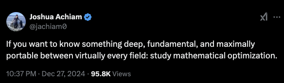

# Stat 4830: Numerical optimization for data science and machine learning 

AKA: Optimization in PyTorch

> I'm currently developing this course for Spring 2025. I am literally pushing my thoughts to this public repo as soon as I have them. Be prepared for the course to look rough until the semester starts.

*See a rough outline of the course [here](section/0/notes.md#tentative-course-structure).* 

For lecture notes see [table of contents](toc.md).

**ED/Canvas:** If you have not been added to the course on ED or Canvas, please email me from your Penn email and I'll add you.

**Office Hours:** Tuesdays 12:30-1:30 PM

## Table of contents
- [High-level thoughts on the course](#high-level-thoughts-on-the-course)
- [Overview](#overview)
- [Pre-requisites](#pre-requisites)
- [Deliverable: a final project due on week 3](#deliverable-a-final-project-due-on-week-3)
- [Textbooks, readings, and software libraries](#textbooks-readings-and-software-libraries)
- [Brief historical perspective on optimization](#brief-historical-perspective-on-optimization)

## High-level thoughts on the course

* **Why am I excited about this course?** Optimization works! Everything you learn about solving optimization problems numerically will be useful in your career, whether you're a data scientist, AI researcher, or an engineer of any kind. Understanding how optimization methods work and how to use them will actually help you solve *real* problems. 

   To quote [Joshua Achiam](https://x.com/jachiam0/status/1872849427653902744) (OpenAI):
   > If you want to know something deep, fundamental, and maximally portable between virtually every field: study mathematical optimization.

   

* **Who is this course meant for?** This is an experimental undergraduate course meant for students who are (roughly) in their junior or senior year. The course should also be beneficial to PhD students who wish to apply optimization techniques in their research.
* **What is the goal of the course?** By the end of the course, my goal is for you to be able to *intelligently apply numerical optimization techniques* in a research project in machine learning, data science, or related fields. We will discuss optimization theory in the course, but that will not be the focus.
* **Production vs. Research-level code?** We will mainly be coding Python notebooks developing research-level code that focuses on the intricacies of optimization methods. Taking research-level code to production is a separate skill that we will not focus on in this course. 
* **Are there similar courses at Penn or other universities?** Not that I am aware of—if you find some, let me know! I will develop this course from scratch and adapt it to student interests as we go.
* **Which IDE should I use?** For local development, use [Cursor](https://www.cursor.com/). For remote development, use [Google Colab](https://colab.research.google.com/). 

## Overview 
Optimization is the modeling language in which modern data science, machine learning, and sequential decision-making problems are formulated and solved numerically. This course will teach you how to formulate these problems mathematically, choose appropriate algorithms to solve them, and implement and tune the algorithms in PyTorch. Tentative topics include:
* Optimization-based formulations of statistical estimation and inverse problems in data science; predictive and generative models in machine learning; and control, bandit, and reinforcement learning problems in sequential decision-making. 
* A high-level tour of the foundations of mathematical optimization, viewed as an algorithmic discipline, and what to expect from theory; key considerations such as convexity, smoothness, saddle points, and stochasticity; classical formulations, such as linear, quadratic, and semidefinite programs; numerical solvers such as CVXPY.
* Popular optimization methods such as (online and stochastic) gradient methods, (quasi) Newton methods, algorithmic extensions to constrained, regularized, and distributed problems, as well as optimization methods that preserve privacy of sensitive data. 
* Modern software libraries such as PyTorch and Jax and the principles underlying "automatic differentiation" techniques. Best practices in tuning optimization methods, e.g., in deep learning problems.

By the end of this course, you will become an intelligent consumer of numerical methods and software for solving modern optimization problems. 

## Pre-requisites
* Basic calculus and linear algebra (Math 2400)
* Basic Probability (Stat 4300)
* Programming experience in a scripting language such as Python. Basic comfort in iteration and functions. 

## Deliverable: a final project due on week 3

# Final Project Structure

VERY detailed instructions on how to get started with your project are available at the following link: [STAT-4830-project-base](https://github.com/damek/STAT-4830-project-base)

### Timeline and milestones

Deliverables (Due Fridays):
- Week 3 (Jan 31): Report Draft 1 + Code + Self Critique
- Week 4 (Feb 7): Slides Draft 1
- Week 5 (Feb 14): Report Draft 2 + Code + Self Critique
- Week 6 (Feb 21): Slides Draft 2
- Week 7 (Feb 28): Report Draft 3 + Code + Self Critique
- Week 8: ⚡ Lightning Talks in Class (Mar 5/7) & Slides Draft 3 due Friday ⚡
- Spring Break (Mar 8-16)
- Week 9 (Mar 21): Report Draft 4 + Code + Self Critique
- Week 10 (Mar 28): Slides Draft 4
- Week 11 (Apr 4): Report Draft 5 + Code + Self Critique
- Week 12 (Apr 11): Slides Draft 5
- Week 13: Final Presentations in Class (Apr 22/24) & Report Draft 6 + Code + Self Critique due Friday (Apr 18)
- Week 14 (Apr 29): Final Report + Code + Self Critique Due

Note: Instructions for peer feedback will be added throughout the semester for each deliverable.

**Why this approach?**  
Final projects often become a single rushed deliverable. We’ll break the project into regular drafts and feedback cycles so your team can iterate, improve, and build something more substantial and refined. You’ll have multiple checkpoints, each with opportunities for critique and revision. By the end, you’ll have a polished piece of work you can showcase—something worthy of your portfolio or internship applications.

### Deliverable format

1. **GitHub repository**  
   - Centralize all materials: your written report, code, and presentation slides.  
   - Be sure to include a clear README with instructions for reproducing results.

2. **Executable demo**  
   - Provide a runnable demonstration in Google Colab. If your overall code is extensive, create a minimal Colab notebook that shows core functionality or key results.

3. **Written report**  
   - By default, structure it like a short conference-style paper (e.g., 8 pages + supplementary).  
   - If you have a more creative format in mind, just run it by me first.

### Feedback loop

- I will meet with each group about three times:
  1. **Week 3**: Check project scope and direction.
  2. **Mid-Semester**: Reflect on progress and address challenges.
  3. **Late-Semester**: Final check-in before presentations.

- Additional questions are welcome anytime.

### Rules

- **Group size**: 3–4 students. This fosters collaboration while keeping the workload balanced.  
- **LLM usage**: You should use large language models in your work to help with writing, brainstorming, and coding. But verify outputs critically—don’t rely on them blindly.

By developing your projects in iterative steps, you will receive feedback multiple times and have a better chance of creating something valuable. This also help me shape the course content based on your areas of interest, ensuring that lectures and assignments align well with your goals.

<!-- * **Homework (20%)**. There will be approximately two homework assignments on which you will demonstrate your understanding of the theory and programming components of the course. Gradescope will be used for homework submission and grading.
* **Quizzes (20%)**. Regular quizzes will be administered throughout the course. 
* **Course project (60%)**. Students will work together in groups of 3-5 students. The size of the team will be taken into account when assigning grades. Larger teams must have more substantial projects. Project teams will be formed in the first four weeks of the semester. There are a series of milestones. 
  * (10%) Initial project proposal.
  * (10%) Midterm project presentation. 
  * (40%) Final project report, presentation, and software deliverable (details below). -->

### Course project ideas
In the course project, you will apply the optimization skills you learned in the course. For example, your final project could include: 
* Training/fine-tuning a model: A detailed write-up of your strategy for training or fine-tuning a model (e.g., language, code, math, or vision model). Describe failures, successes, and rabbit holes. Illustrate the use of the final model. Use GPUs to scale up. Compare multiple optimization methods and choose one with the "best" performance.
* Reproducibility: A detailed write-up of your attempt to reproduce, falsify, or improve numerical results from the optimization literature. 
* Augmenting an existing research project: Let's say you're already working on a research project with Penn faculty that includes an optimization component. We can likely find a way to align your project in the course with your research project by improving the optimization component of your project. We must discuss a bit to ensure the optimization component is extensive enough for course credit.
* Improving optimizers on an existing/new benchmark: Several benchmarks have recently been proposed for optimization methods in ML. For example, (1) in [Modded-NanoGPT repo](https://github.com/KellerJordan/modded-nanogpt), some independent researchers are attempting to train small versions of GPT as fast as possible; (2) in [the AlgoPerf repo](https://github.com/mlcommons/algorithmic-efficiency) the ML Commons project is benchmarking optimization methods for training deep learning models. A potential project is to improve existing methods on such benchmarks or develop your own and set the initial records. 
* Educational tools and software: Educational resources illustrating advanced concepts related to but not covered in the course material. The project should be polished: the instructor should be comfortable including the deliverable in future versions of the course with little to no modification. 
* AI for math software: 
  * In research, we often need to prove or disprove inequalities of the form $LHS(x) \leq RHS(x)$ for some variable $x$. One way to do this is to use optimization software to minimize $RHS(x) - LHS(x)$. If the value is less than zero, than we've disproved the inequality. It would be highly useful to develop software that can do this automatically with optimization methods.  Often these are difficult nonconvex optimization problems so you'll have to use all the tricks from the course to solve them + use an LLM to formulate the problem or relaxations thereof. This would be really cool to have!
* AutoOPT tools: Combined with an LLM, automatically formulate and tune optimization methods for a given task.

I will post more project ideas adapted to student interests in the course's first weeks. Each project must include a Google Colab (or equivalent) walkthrough of your results and claims. I must approve the scope of the project.

## Textbooks, readings, and software libraries
This course material will be self-contained outside of the prerequisites, but there will be no official textbook. Some material will draw on recent research published in academic conferences and journals. Some will draw on software libraries that are mature or in development. Below, I have instead listed several resources that we may draw – more will be added throughout the course:

### Optimization

#### General background

1. Beck, A. (2014). Introduction to nonlinear optimization: Theory, algorithms, and applications with MATLAB. Society for Industrial and Applied Mathematics.

2. Nocedal, J., & Wright, S. J. (1999). Numerical optimization. Springer.

3. Boyd, S., & Vandenberghe, L. (2004). Convex optimization. Cambridge University Press.

4. Hazan, E. (2016). Introduction to online convex optimization. Foundations and Trends® in Optimization, 2(3-4), 157-325.

5. UCLA course ECE236C - Optimization Methods for Large-Scale Systems
   [https://www.seas.ucla.edu/~vandenbe/ee236c.html](https://www.seas.ucla.edu/~vandenbe/ee236c.html)

#### Numerical optimization in machine learning

1. Google Research. (n.d.). Deep learning tuning playbook.
   [https://github.com/google-research/tuning_playbook](https://github.com/google-research/tuning_playbook)

2. Google Research. (2023). Benchmarking neural network training algorithms and the ML commons library.
   [https://arxiv.org/abs/2306.07179](https://arxiv.org/abs/2306.07179)
   [https://github.com/mlcommons/algorithmic-efficiency/tree/main](https://github.com/mlcommons/algorithmic-efficiency/tree/main)

3. Moreau, T., et al. (2022). Benchopt: Reproducible, efficient and collaborative optimization benchmarks.
   [https://github.com/benchopt/benchopt](https://github.com/benchopt/benchopt)

4. Schmidt, R., et al. (2021). Descending through a Crowded Valley - Benchmarking Deep Learning Optimizers.
   [https://proceedings.mlr.press/v139/schmidt21a](https://proceedings.mlr.press/v139/schmidt21a)

### Software and tutorials

#### Convex optimization in Python: CVXPY

CVXPY: Convex optimization, for everyone.
[https://www.cvxpy.org/](https://www.cvxpy.org/)

#### PyTorch, Jax, and auto differentiation

1. PyTorch (The full library): [https://pytorch.org/](https://pytorch.org/)

2. Numerical implementation of optimizers in PyTorch:
   [https://pytorch.org/docs/stable/optim.html#algorithms](https://pytorch.org/docs/stable/optim.html#algorithms)

3. Jax library: [https://github.com/google/jax](https://github.com/google/jax)

4. Micrograd: A tiny educational "auto differentiation" library
   [https://github.com/karpathy/micrograd](https://github.com/karpathy/micrograd)

#### Scalable linear algebra

CoLA: a framework for scalable linear algebra that exploits structure often found in machine learning problems.
[https://github.com/wilson-labs/cola](https://github.com/wilson-labs/cola)

#### Transformers and diffusion models

1. MinGPT: A PyTorch re-implementation of GPT
   [https://github.com/karpathy/minGPT](https://github.com/karpathy/minGPT)

2. The annotated diffusion model
   [https://huggingface.co/blog/annotated-diffusion](https://huggingface.co/blog/annotated-diffusion)

3. Repository containing resources and papers for diffusion models
   [https://diff-usion.github.io/Awesome-Diffusion-Models/](https://diff-usion.github.io/Awesome-Diffusion-Models/)

#### Version control: git and github

GitHub Docs: Hello World
[https://docs.github.com/en/get-started/start-your-journey/hello-world](https://docs.github.com/en/get-started/start-your-journey/hello-world)

#### Training visualization

Weights and Biases
[https://wandb.ai/site](https://wandb.ai/site)

#### Puzzles!

Sasha Rush's has luckily made a series of open source puzzles for helping you understand GPUs, automatic differentiation, and optimization.
1. Tensor puzzles: https://github.com/srush/Tensor-Puzzles

2. GPU Puzzles: https://github.com/srush/GPU-Puzzles 

3. Autodiff Puzzles: https://github.com/srush/Autodiff-Puzzles/

# Brief historical perspective on optimization

It's useful to appreciate how optimization evolved as an algorithmic discipline over the last seventy years:

- Mid-20th Century: Linear Programming emerged as a critical tool in operations research, fueled by George Dantzig’s simplex method. This was pivotal for industrial logistics, military planning, and resource allocation.
- 1960s–1990s: Convex optimization grew more important, driven by work on gradient-based methods, interior-point methods, and software that could solve large-scale linear and convex problems.
- 2000s: Tools like CVX (MATLAB-based) made formulating and solving standard convex problems more accessible to a broad audience—i.e., “specify your problem in a solver-friendly language, and let the solver handle it.”
- Modern Era: Deep learning frameworks (e.g., PyTorch, TensorFlow, Jax) have shifted the emphasis to a “build and iterate” approach. Instead of specifying problems in a polished convex form, we often “get our hands dirty” with nonconvex models, direct gradient-based methods, and custom loss functions. This iterative exploration is precisely what enabled the explosion of large language models (LLMs) and other powerful neural architectures.

In this course, we will appreciate both sides: solver-based approaches for classical, well-structured problems (via CVXPY) and more flexible, high-powered frameworks (via PyTorch) for data-driven, nonconvex tasks.