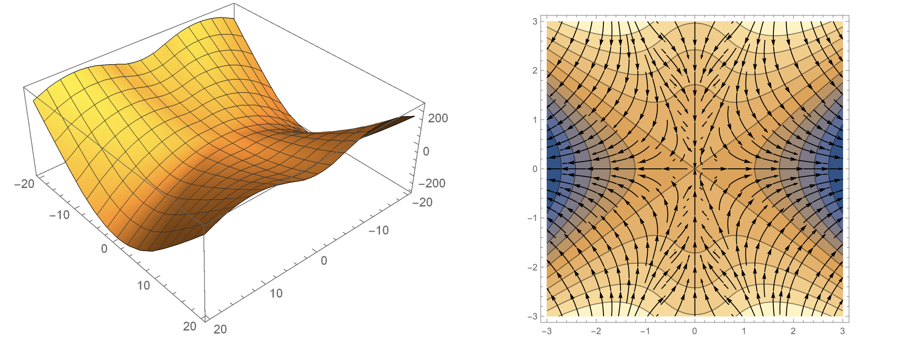
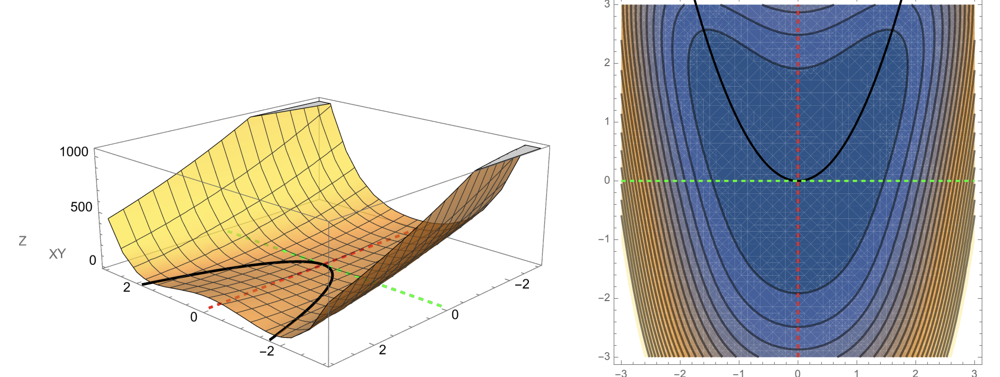

## Slide 1: Lecture 0 — Introduction

**Purpose:** Set the goal for today and the course.

- Course: numerical optimization for data science and machine learning.
- Today: how a machine learning task becomes an optimization problem, and how we implement the optimizer in PyTorch.
- Notebook: [Colab notebook](https://colab.research.google.com/github/damek/STAT-4830/blob/main/section/0/notebook.ipynb)

**Why Optimization?**

To quote [Joshua Achiam](https://x.com/jachiam0/status/1872849427653902744) (OpenAI):
> If you want to know something deep, fundamental, and maximally portable between virtually every field: study mathematical optimization.


**What did students think?**


---

## Slide 2: Course abstract and key points

**Purpose:** Orient you to what this course is about.

Optimization is the modeling language in which modern data science, machine learning, and sequential decision-making problems are formulated and solved numerically. This course will teach you how to formulate these problems mathematically, choose appropriate algorithms to solve them, and implement and tune the algorithms in PyTorch. Tentative topics include:
* Optimization-based formulations of statistical estimation and inverse problems in data science; predictive and generative models in machine learning; and control, bandit, and reinforcement learning problems in sequential decision-making.
* A high level tour of the foundations of mathematical optimization, viewed as an algorithmic discipline, and what to expect from theory; key considerations such as convexity, smoothness, saddle points, and stochasticity; classical formulations, such as linear, quadratic, and semidefinite programs; numerical solvers such as CVXPY.
* Popular optimization methods such as (online and stochastic) gradient methods, (quasi) Newton methods, algorithmic extensions to constrained, regularized, and distributed problems, as well as optimization methods that preserve privacy of sensitive data.
* Modern software libraries such as PyTorch and JAX and the principles underlying automatic differentiation techniques. Best practices in tuning optimization methods, e.g., in deep learning problems.
By the end of this course, you will become an intelligent consumer of numerical methods and software for solving modern optimization problems.


---

## Slide 3: Prerequisites, format, deliverables

**Purpose:** Make expectations concrete.

**Prerequisites**
- Calculus + linear algebra (Math 2400).
- Probability (Stat 4300).
- Python programming.

**Format**
- Lectures and group meetings with the professor.

**Deliverables (final project)**
- Start drafting by Week 3; refine throughout the semester.
- Several checkpoints (drafts, presentations) for feedback.
- Final submission: GitHub repo (code, report, slides) plus a polished demo (for example, a Colab notebook).
- [Project Instructions](https://github.com/damek/STAT-4830-project-base)


---

## Slide 4: A brief history of optimization

**Purpose:** Place “optimization for ML” in a larger arc.

```
EVOLUTION OF OPTIMIZATION
========================

1950s                1960s-1990s              2000s                  TODAY
├─────────────────┐  ├────────────────┐  ┌────────────────┐  ┌─────────────────┐
│ LINEAR PROGRAM. │  │ CONVEX OPTIM.  │  │ SOLVER ERA     │  │ DEEP LEARNING   │
│ Dantzig's       │──│ Interior-point │--│ CVX & friends  │──│ PyTorch         │
│ Simplex Method  │  │ Large-scale    │  │ "Write it,     │  │ Custom losses   │
└─────────────────┘  └────────────────┘  │  solve it"     │  │ LLM boom        │
       │                    │            └────────────────┘  └─────────────────┘
       │                    │                   │                    │
       ▼                    ▼                   ▼                    ▼
 APPLICATIONS:        APPLICATIONS:       APPLICATIONS:        APPLICATIONS:
 • Logistics         • Control           • Signal Process    • Language Models
 • Planning          • Networks          • Finance           • Image Gen
 • Military          • Engineering       • Robotics          • RL & Control
```

- Mid-20th Century: linear programming and operations research (simplex; logistics and planning).
- 1960s–1990s: convex optimization matured (gradient methods, interior-point methods, large-scale solvers).
- 2000s: solver-era tools made standard convex problems easy to specify and solve.
- Modern era: deep learning shifted emphasis to “build and iterate” with nonconvex models, direct gradient-based methods, and custom losses.

---

## Slide 5: Why PyTorch?

**Purpose:** Explain why this course is centered on PyTorch.

- Deep learning’s success was driven in part by modern auto-differentiation frameworks.
- **Fast iteration:** These frameworks let you change a model or loss quickly while keeping the same optimization loop. 
- Older solver-based workflows excel for classical, well-structured problems; PyTorch excels when we want to build nonconvex models and iterate fast.

---

## Slide 6: Preview — spam classification becomes optimization

**Purpose:** Show the conversion from an ML task to an optimization problem.

We start with a task: classify email as spam or not spam.

We turn that into an optimization problem by specifying:
1. **Features:** how an email becomes a vector $x$.
2. **Decision variables:** weights $w$ that map features to a prediction.
3. **Objective:** a loss function $L(w)$ (cross-entropy).
4. **Solve:** choose $w$ by minimizing $L(w)$ using gradient descent.

---

## Slide 7: Features — email $\mapsto$ vector $x$

**Purpose:** Convert emails to features.

Example feature set (here $x \in \mathbb{R}^5$):
- `exclamation_count`
- `urgent_words`
- `suspicious_links`
- `time_sent`
- `length`

We must choose some way of representing an email as a vector. Here we use a rudimentary feature set that counts the number of exclamation marks, the number of urgent words, the number of suspicious links, the hour the email was sent, and the length of the email. 

In modern approaches, features are typically *learned* rather than hard-coded.

---

## Slide 8: Prediction rule (decision variable = $w$)

**Purpose:** Show how $w$ produces a prediction.

We score an email by a weighted sum, then convert it to a probability:

$$
p_w(x) = \sigma(x^\top w).
$$


---

## Slide 9: Sigmoid = score $\mapsto$ probability

**Purpose:** Explain the probability map we use for binary classification.


- Output is in $(0,1)$, so we can interpret it as a probability.
- Large positive scores give probabilities near $1$; large negative scores give probabilities near $0$.
- Score $0$ maps to probability $0.5$ (the decision boundary).

---

## Slide 10: Objective (cross-entropy) and what we minimize

**Purpose:** State the loss and make the goal of minimization explicit.

Training data: $(x_i,y_i)$ with $y_i \in \{0,1\}$.

We choose $w$ by minimizing the average cross-entropy loss:

$$
L(w)=\frac{1}{n}\sum_{i=1}^n \left[-y_i\log(\sigma(x_i^\top w))-(1-y_i)\log(1-\sigma(x_i^\top w))\right].
$$


- The loss is small when predicted probabilities match the labels.
- Confident wrong predictions are heavily penalized, which is exactly what you want when training a classifier.

---

## Slide 11: Gradients and gradient descent

**Purpose:** Explain why the negative gradient direction is decreases the loss.

The gradient collects partial derivatives:

$$
\nabla L(w)=\left(\frac{\partial L}{\partial w_1},\ldots,\frac{\partial L}{\partial w_d}\right).
$$

The first-order approximation is

$$
L(w+\Delta)\approx L(w)+\langle \nabla L(w),\Delta\rangle.
$$

Taking $\Delta=-\eta \nabla L(w)$ gives the decrease-to-first-order calculation

$$
L(w-\eta \nabla L(w)) \approx L(w) - \eta \|\nabla L(w)\|^2.
$$

So gradient descent uses

$$
w \leftarrow w - \eta \nabla L(w),
\qquad
w_j \leftarrow w_j - \eta \frac{\partial L}{\partial w_j}.
$$

Here $\eta>0$ is the learning rate (stepsize).

---

## Slide 12: A picture (useful, but limited)

**Purpose:** Give a cartoon picture of optimization landscape.


This visualization is a simplification. In higher dimensions, the optimization landscape can have local minima, saddle points, and ravines.

**Saddle point example.**


**Ravine example.**


---

## Slide 13: Implementing the update in PyTorch

**Purpose:** Show that the code is implementing the math update.

In PyTorch, `loss.backward()` computes $\nabla L(w)$ and stores it in `weights.grad`. The update line is the same as $w \leftarrow w - \eta \nabla L(w)$.

```python
weights = torch.randn(5, requires_grad=True)
learning_rate = 0.01

for _ in range(1000):
    predictions = spam_score(features, weights)
    loss = cross_entropy_loss(predictions, true_labels)

    loss.backward()

    with torch.no_grad():
        weights -= learning_rate * weights.grad
        weights.grad.zero_()
```

Two details:

* `loss.backward()` fills `weights.grad` with partial derivatives.
* We call `weights.grad.zero_()` because PyTorch accumulates gradients by default.

---

## Slide 14: Numerical results (diagnostics vs generalization)

**Purpose:** Introduce several useful plots when training a model.


* Loss and training accuracy are **diagnostics**: they check that the optimization loop is reducing the objective on the training set.
* Test accuracy checks whether performance **generalizes** to data not used for training.
* A large train–test gap suggests overfitting. In this run, the curves are close and stabilize, so there is no obvious generalization gap for this dataset.

---

## Slide 15: What, how, and why of PyTorch (autodiff)

**Purpose:** Explain how PyTorch computes gradients: recorded composition + chain rule.

If you build a scalar loss using PyTorch operations, PyTorch records the operations used to compute it. When you call `backward()`, it applies the chain rule through that recorded computation and produces derivatives with respect to variables that have `requires_grad=True`.

One-dimensional example. Fix $y$ and define

$$
f(x)=(x^2-y)^2.
$$

Write $h(x)=x^2$ and $g(z)=(z-y)^2$, so $f=g\circ h$. The chain rule gives

$$
f'(x)=g'(h(x))h'(x)=2(x^2-y)\cdot 2x = 4x(x^2-y).
$$

```python
y = 3.0
x = torch.tensor(2.0, requires_grad=True)

f = (x**2 - y)**2
f.backward()
print(x.grad.item())  # 4*x*(x**2 - y)
```

The payoff: you can change the model or the loss and keep the same training loop.

---

## Slide 16: Tentative course structure + learning outcomes

**Purpose:** Give you the roadmap and what you should be able to do by the end.

**Course structure (high-level)**

* Basics in dimension one: decision variables, loss functions, gradients, constraints, GD and SGD, implementations (NumPy, then PyTorch), tuning.
* Move to higher dimensions: the linear algebra interface in PyTorch (tensors, norms, matrix products) and efficiency basics (broadcasting, memory layout).
* A menu of problems: classic ML, deep learning and large language models, inverse problems, and a brief RL introduction.
* A menu of algorithms: GD, SGD, Adam/AdamW, Muon, and others (e.g., policy gradient methods).
* Benchmarking: how to compare methods without fooling yourself.
* Tuning: how to tune parameters systematically.
* Systems: GPUs/distributed training basics. 
* Theory: Convexity vs nonconvexity, rates, geometry, tractable theoretical models: noisy quadratic models, random features, and scaling laws.


**By the end of the course, you should be able to**

1. Formulate optimization problems (variables, objectives, constraints) in math and code.
2. Implement and debug gradient-based training loops in PyTorch.
3. Choose reasonable algorithms and hyperparameters, and recognize bad tuning.
4. Benchmark methods in a way that is not misleading.
5. Have basic systems awareness (compute, memory, data loading bottlenecks).
6. Produce a portfolio-quality project (clean repo, working implementation, short write-up).

---

## Slide 17: Final project structure

Project instructions: [STAT-4830-project-base](https://github.com/damek/STAT-4830-project-base)

```
ITERATIVE DEVELOPMENT PROCESS    PROJECT COMPONENTS
=============================    ==================

┌─────────────────┐  ┌─────────────────┐  ┌────────────────────┐
│  INITIAL SETUP  │  │  DELIVERABLES   │  │  PROJECT OPTIONS   │
│  Teams: 3-4     ├──┤  • GitHub Repo  │  │ • Model Training   │
│  Week 2 Start   │  │  • Demo         │  │ • Reproducibility  │
└───────┬─────────┘  │  • Final Paper  │  │ • Benchmarking     │
        │            │  • Slide Deck   │  │ • Research Extend  │
        │            └───────┬─────────┘  │ • ...              │
        │                    │            └────────────────────┘
        │                    ▼
        │            ┌─────────────────┐  BIWEEKLY SCHEDULE
        ▼            │    FEEDBACK     │  ════════════════
┌─────────────────┐  │ PEER REVIEWS:   │  Week 3:  Report
│   IMPLEMENT     │◀─┤ • Run Code      │  Week 4:  Slides Draft
│ • Write Code    │  │ • Test Demo     │  Week 5:  Report
│ • Test & Debug  ├─▶│ • Give Feedback │  Week 6:  Slides Draft
│ • Document      │  │                 │  Week 7:  Report
└─────────────────┘  │ PROF MEETINGS:  │  Week 8:  LIGHTNING TALK
                     │ • Week 3 Scope  │  Week 9:  Report
                     │ • Week 7 Mid    │  Week 10: Slides Draft
                     │ • Week 11 Final │  Week 11: Report
                     └─────────────────┘  Week 12: Slides Draft
                                          Week 13: Final Report
DEVELOPMENT WITH LLMs                     Week 14: Final Presentation
• Write & review reports, documentation
• Develop & test code (verify outputs!)
• Regular commits with clear documentation
```

---

## Slide 18: Be systematic with **megaprompts** (coding agents)

**Purpose:** Treat prompting like engineering: a stable spec + iterative refinement.

**Why megaprompts now?**
* Long context makes it feasible to keep a *project-long* prompt + style guide.
* Coding agents are strong. The bottleneck is usually **spec clarity**.

**Getting started with a megaprompt: some ideas** 
* Make it a repo artifact: `PROMPT.md` (versioned, diffable, improved over time).
* Contains stable information, not today's task: 
  * Stable: project goal, data, definitions, constraints, style, conventions.
  * Today: the exact task you want done right now.
* Write like a spec:
  * inputs/outputs, shapes, edge cases, acceptance criteria.
  * “definition of done” (tests pass, plots produced, metrics logged).
* Bake in efficiency constraints (more important than syntax):
  * broadcasting rules, shapes, device/dtype, avoid slow Python loops, memory layout awareness.
* Force a reliable workflow from the agent:
  * plan => implement => add tests => run/check => summarize results + next steps.
* Maintain an error log:
  * paste the failure, write the fix, and promote it into `PROMPT.md`.
* Include case studies of successful interactions with the agent.
* Tell the megaprompt how to update itself!

This will be an element of your final deliverable.