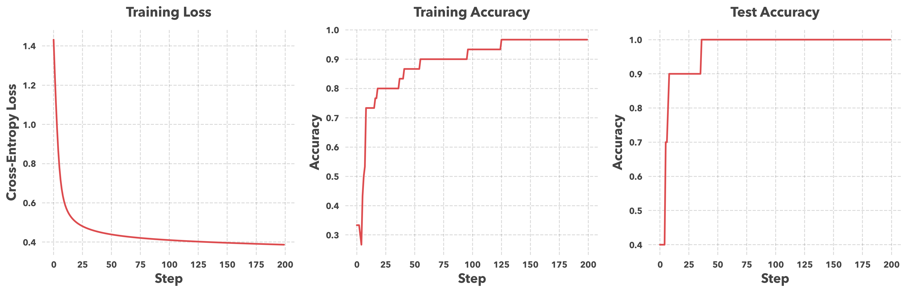

<br><br> <br><br> 

# STAT 4830: Numerical optimization for data science and ML
## Lecture 0: Introduction
### Professor Damek Davis

---

# Course overview

- **Focus**: Numerical optimization for data science and ML
- **Tools**: PyTorch, Python, occasional use of other libraries
- **LLM Policy**: Use them.
- **Deliverables**: HW, final project
    - **Homework**: 0-5 assignments.
    - **Final Project**: Incrementally developed throughout semester (more later)

---

# Why Optimization?

<div style="display: flex; flex-direction: column; align-items: center; justify-content: center; height: 100%;">

<div style="text-align: center; margin-bottom: 1em;">

> "If you want to know something deep, fundamental, and maximally portable between virtually every field: study mathematical optimization."
>
> — Joshua Achiam (OpenAI)

</div>


</div>

---

# Do you have access to and experience with LLMs?

<br>
<div style="width: 95%">


</div>

---

# Prerequisites

- Basic calculus and linear algebra (Math 2400)
- Basic probability (Stat 4300)
- Python programming experience
- No advanced optimization/ML background needed

---

# Dev Environment: Cursor

```
                                                        GETTING STARTED WITH CURSOR
                                                        ==========================

                                    ┌──────────────┐                                    DAY 1: START HERE
                                    │  WRITE CODE  │         ┌─────────────┐            ═══════════════
                                    │  As you type ├────────►│  STUCK?     │──────┐     Just press Cmd+K
                                    │  AI assists  │         └─────────────┘      │     for instant help
                                    └──────────────┘                              ▼
                                        ▲                                 ┌──────────────┐
                                        │                                 │ QUICK HELP   │
                                        │                                 │   Cmd+K      │
                                        │                                 └──────────────┘
                                        │                                        │
                                        │                                        ▼
                                        │                                 ┌──────────────┐
                                        └─────────────────────────────────┤ BACK TO CODE │
                                                                          └──────────────┘

                                                                                 ┌─────────────┐
                                            WHEN YOU'RE READY                    │  COMPOSER   │    ADVANCED FEATURES
                                            ══════════════════     ┌────────────►│   Cmd+L     │    ════════════════
                                            Need deeper help?      │             └─────────────┘    • Git integration
                                            Try the composer!      │                                • Multi-file edits
                                                                   │                                • Testing tools
                                                                   │
                                                            ┌──────────────┐
                                                            │ DEEP DIVING  │
                                                            │ Debug & Learn│
                                                            └──────────────┘

                                    QUICK HELP (Cmd+K):                      COMPOSER (Cmd+L):
                                    • "Fix this error"                       • Complex debugging
                                    • "Explain this code"                    • Step-by-step learning
                                    • "Add a test here"                      • Extended discussions
```

---

# Why PyTorch?

- Modern auto-differentiation frameworks drive deep learning success
- Enables rapid experimentation with:
  - New model architectures and 
  - Novel optimization algorithms
- More flexible than traditional solver-based tools

---

# Optimization Approaches Compared

```
                                +-----------------------------+          +-----------------------------+
                                |       CLASSICAL TOOLS       |          |        MODERN TOOLS         |
                                +-----------------------------+          +-----------------------------+
                                | WHEN TO USE:                |          | WHEN TO USE:                |
                                | • Small/Medium Scale        |          | • Large-Scale Data          |
                                | • Structured Problems       |          | • Unstructured Problems     |
                                | • Need Formal Guarantees    |          | • Need Speed & Scale        |
                                +-----------------------------+    VS    +-----------------------------+
                                | INPUT REQUIREMENTS:         |          | INPUT REQUIREMENTS:         |
                                | • DCP Rules                 |          | • Raw Python Code           |
                                | • Convex Functions          |          | • Any Function Type         |
                                | • Standard Form             |          | • Black Box OK              |
                                +-----------------------------+          +-----------------------------+
                                | GUARANTEES:                 |          | CAPABILITIES:               |
                                | • Global Optimality         |          | • Handle Any Problem        |
                                | • Convergence Rates         |          | • Fast Development          |
                                | • Optimality Certificates   |          | • Rapid Iteration           |
                                +-----------------------------+          +-----------------------------+
                                | WORKFLOW:                   |          | WORKFLOW:                   |
                                | 1. Format Problem           |          | 1. Write Code               |
                                | 2. Verify Convexity         |          | 2. Train Model              |
                                | 3. Solve Exactly            |          | 3. Debug & Iterate          |
                                +-----------------------------+          +-----------------------------+
                                | TOOLS: CVX, MOSEK           |          | TOOLS: PyTorch, JAX        |
                                +-----------------------------+          +-----------------------------+

                                                           HYBRID APPROACHES:
                                                     • Use Structure Where Possible
                                                     • Add Flexibility Where Needed
                                                     • Choose Based on Requirements
```

---

# Preview: spam classification

Let's start with a practical example:
- How do we automatically filter spam emails?
- Demonstrates core optimization concepts
- Shows PyTorch in action

---

# How computers read email

```python
email1 = """
Subject: URGENT! You've won $1,000,000!!!
Dear Friend! Act NOW to claim your PRIZE money!!!
"""

email2 = """
Subject: Team meeting tomorrow
Hi everyone, Just a reminder about our 2pm sync.
"""
```

---

# Feature extraction

Convert text to numbers:

```python
def extract_features(email):
    features = {
        'exclamation_count': email.count('!'),
        'urgent_words': len(['urgent', 'act now', 'prize'] 
                          & set(email.lower().split())),
        'suspicious_links': len([link for link in email.split() 
                               if 'www' in link]),
        'time_sent': email.timestamp.hour,
        'length': len(email)
    }
    return features
```

---

# Classification process

<div class="rows">
<div class="top">


</div>
<div class="bottom">

1. Extract numeric features
2. Multiply by weights
3. Sum weighted features
4. Convert to probability

</div>
</div>

---

# The sigmoid function

<div class="columns">
<div class="left">

Converts any number into a probability (0-1):

```python
def sigmoid(x):
    return 1 / (1 + torch.exp(-x))
```

</div>
<div class="right">


</div>
</div>

---

# Mathematical formulation

Our optimization problem:

$$
\min_{w} \frac{1}{n} \sum_{i=1}^n \left[ -y_i \log(\sigma(x_i^\top w)) - (1-y_i) \log(1-\sigma(x_i^\top w)) \right]
$$

Where:
- $w$ = weights vector
- $x_i$ = feature vector
- $y_i$ = true label (0/1)
- $\sigma$ = sigmoid function

---

# Cross-entropy loss

<div class="rows">
<div class="top">


</div>
<div class="bottom">

- Penalizes wrong predictions
- Rewards confident correct predictions
- Creates balanced learning

</div>
</div>

---

# How Gradient Descent Works

<div class="columns">
<div class="left">

The optimization process works like hiking:

1. Look around you (measure gradient)
2. Take a step downhill
3. Repeat until you reach the bottom

<!-- The learning rate controls how big each step is. -->

</div>
<div class="right">


</div>
</div>

---

# The optimization loop

Each iteration:
1. **Measure** how well current weights classify emails
2. **Calculate** gradient (direction of steepest error reduction)
3. **Update** weights by stepping in this direction
4. **Repeat** until convergence

The learning rate controls step size:
- Too small → slow progress
- Too large → overshooting

---

# PyTorch: What, how, and why

**What**: Modern framework for optimization and deep learning

**How**: 
- Tracks operations in a computational graph
- Automatically computes gradients
- Enables parallel computation (CPU/GPU)

**Why**:
- Automates the hardest part (gradients)
- Makes experimentation fast
- Scales from simple to complex models

---

# Inside PyTorch: Tensors and autograd

```python
# Tensors: The building blocks
x = torch.tensor([1.0, 2.0], requires_grad=True)
y = x * 2
z = y.sum()

# Automatic differentiation
z.backward()  # Computes gradients
print(x.grad)  # Shows ∂z/∂x
```

PyTorch builds a graph of operations, enabling automatic gradient computation.

---

# Implementation in PyTorch

```python
# Initialize
weights = torch.randn(5, requires_grad=True)
learning_rate = 0.01

for _ in range(1000):
    # Forward pass
    predictions = spam_score(features, weights)
    loss = cross_entropy_loss(predictions, true_labels)
    
    # Backward pass
    loss.backward() 
    
    # Update weights
    with torch.no_grad():
        weights -= learning_rate * weights.grad
        weights.grad.zero_()
```

---

# Try it yourself!

[](https://colab.research.google.com/github/damek/STAT-4830/blob/main/section/0/notebook.ipynb)

- Complete implementation in the notebook
- Experiment with different learning rates
- See how the loss changes during training
- Test the model on new emails

---

# Training results

<div class="rows">
<div class="top">



</div>
<div class="bottom">

Three key metrics:
- **Loss** and **Training accuracy**: Performance on known data.
- **Test accuracy**: Performance on new emails


</div>
</div>

---

# Course structure

1. Linear algebra & direct methods
2. Problem formulations & classical software
3. Calculus for optimization
4. Automatic differentiation & PyTorch
5. First-order methods
6. Second-order methods
7. Advanced topics
8. Modern deep learning practice

--- 
# Final Project Structure

```
                                        ITERATIVE DEVELOPMENT PROCESS                  PROJECT COMPONENTS
                                        =============================                  ==================

                                ┌─────────────────┐           ┌─────────────────┐    ┌────────────────────┐
                                │  INITIAL SETUP  │           │  DELIVERABLES   │    │  PROJECT OPTIONS   │
                                │  Teams: 3-4     ├───────────┤  • GitHub Repo  │    │ • Model Training   │
                                │  Week 2 Start   │           │  • Colab Demo   │    │ • Reproducibility  │
                                └───────┬─────────┘           │  • Final Paper  │    │ • Benchmarking     │
                                        │                     │  • Slide Deck   │    │ • Research Extend  │
                                        │                     └───────┬─────────┘    │ • ...              │
                                        │                             │              └────────────────────┘
                                        │                             ▼                         
                                        │                     ┌─────────────────┐    BIWEEKLY SCHEDULE
                                        ▼                     │    FEEDBACK     │    ════════════════
                                ┌─────────────────┐           │ PEER REVIEWS:   │    Week 3:  Report
                                │   IMPLEMENT     │◀─────────┤ • Run Code      │    Week 4:  Slides Draft
                                │ • Write Code    │           │ • Test Demo     │    Week 5:  Report
                                │ • Test & Debug  ├─────────▶│ • Give Feedback │    Week 6:  Slides Draft
                                │ • Document      │           │                 │    Week 7:  Report
                                └─────────────────┘           │ PROF MEETINGS:  │    Week 8:  ⚡LIGHTNING TALK⚡
                                                              │ • Week 3 Scope  │    Week 9:  Report
                                                              │ • Week 7 Mid    │    Week 10: Slides Draft
                                                              │ • Week 11 Final │    Week 11: Report
                                                              └─────────────────┘    Week 12: Slides Draft
                                                                                     Week 13: Final Report
                                DEVELOPMENT WITH LLMs                                Week 14: Final Present
                                • Write & review reports, documentation                         
                                • Develop & test code (verify outputs!)                         
                                • Regular commits with clear documentation
```

---

# Learning outcomes

By course end, you'll be able to:

1. Model real problems as optimization problems
2. Select appropriate algorithms
3. Implement solutions in PyTorch
4. Apply optimization to practical problems
5. Conduct optimization research

---

# Getting started

- Review the syllabus
- Set up Python environment
- Try the [Colab notebook](https://colab.research.google.com/github/damek/STAT-4830/blob/main/section/0/notebook.ipynb)
- Start thinking about project ideas

---

# Questions?

- Course website: [https://damek.github.io/STAT-4830/](https://damek.github.io/STAT-4830/)
- Office hours: Listed on the course website
- Email: [damek@wharton.upenn.edu](mailto:damek@wharton.upenn.edu) 
- Discord: Check email for invite.

---


