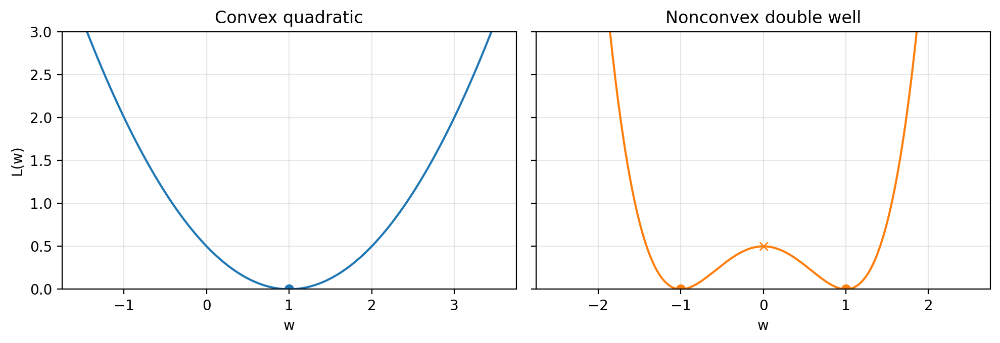
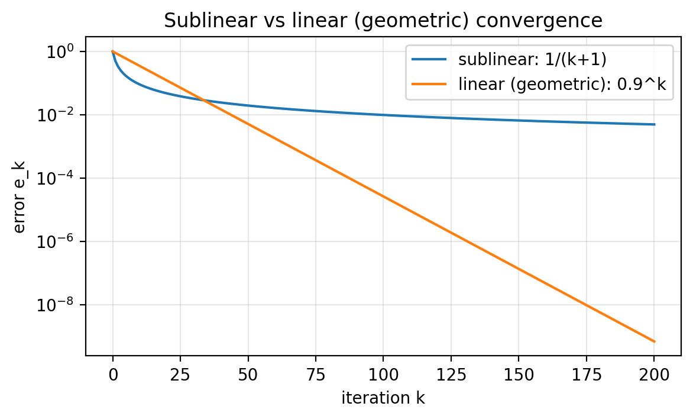
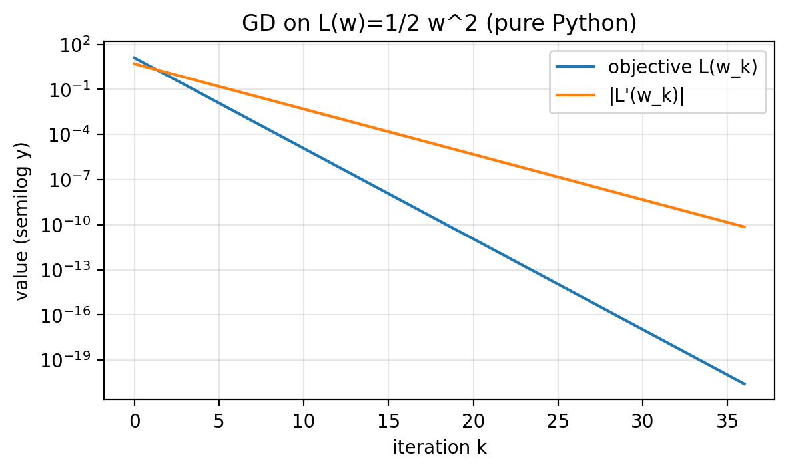
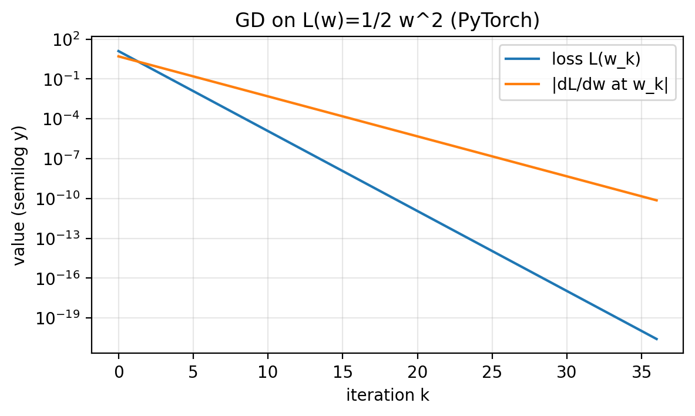
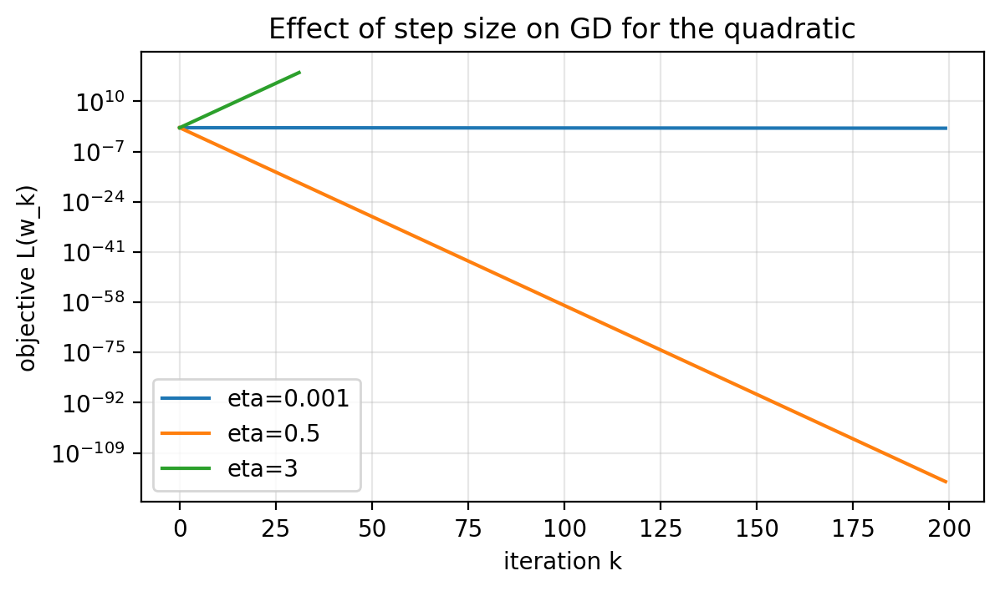
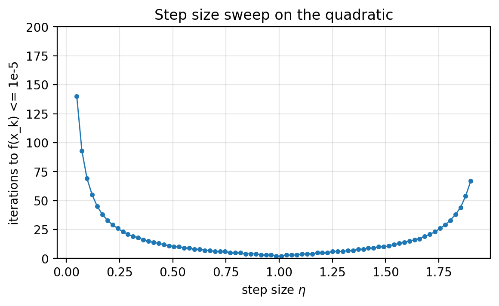
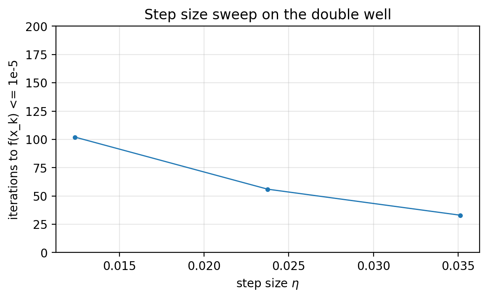

## Slide 1: Course Template (Reminder)
**Purpose:** Keep the recurring template visible.
- Decision variables: what we can choose.
- Objective (loss): what we want to make small.
- Algorithm: how we update the variables.
- Diagnostics: what we plot or log.

---

## Slide 2: Optimization Problem
**Purpose:** Define the object we solve.

**Formula:**

$$
\min_{x \in C} f(x)
$$

- Decision variable: $x \in \mathbb{R}$.
- Objective: $f:\mathbb{R}\to\mathbb{R}$.
- Feasible set: $C \subseteq \mathbb{R}$.
- Unconstrained case: $C=\mathbb{R}$.

---

## Slide 3: A Simple Constraint
**Purpose:** See a concrete constrained example.

**Formula:**

$$
\min_{x \ge 0} (x-1)^2
$$

- Feasible set is $[0,\infty)$.

---

## Slide 4: Convex vs Nonconvex Losses (1D)
**Purpose:** Fix the two toy losses used throughout.
- Convex quadratic: $f_{\text{quad}}(x)=\tfrac{1}{2}(x-1)^2$.
- Double well: $f_{\text{dw}}(x)=\tfrac{1}{2}(x^2-1)^2$.
- The scaling $\tfrac{1}{2}$ is cosmetic.
- Nonconvexity is the default in modern ML.


*Figure 1.1.*

---

## Slide 5: Global Minimizer
**Purpose:** Define what “minimizer” means.

**Formula:**

$$
f(x^\ast) \le f(x)
\quad \text{for all } x \in C
$$

- $x^\ast$ must lie in $C$.

---

## Slide 6: Optimal Value and Objective Gap
**Purpose:** Define the target value and a practical notion of “close.”

**Formula:**

$$
\begin{aligned}
f^\ast &= \inf_{x \in C} f(x) \\
f(x) - f^\ast &\le \varepsilon
\end{aligned}
$$

- $f(x)-f^\ast$ is the objective gap (suboptimality gap).
- In toy examples, often $f^\ast=0$.

---

## Slide 7: Stationary Points (Unconstrained)
**Purpose:** Define stationarity for differentiable, unconstrained problems.

**Formula:**

$$
\begin{aligned}
f'(x) &= 0 \\
\|f'(x)\| &\le \varepsilon
\end{aligned}
$$

- Nonconvex problems can have many stationary points.

---

## Slide 8: Constrained Stationarity (Preview)
**Purpose:** Flag what changes with constraints.
- Minimizers can sit on the boundary of $C$.
- Stationarity uses Lagrange multipliers.
- We return to this in a later lecture.

---

## Slide 9: Iterative Algorithms
**Purpose:** Define what an iterative method produces.

**Formula:**

$$
x_0, x_1, x_2, \dots
$$

- Each $x_k$ is an approximate solution candidate.
- Main hyperparameter here: step size (learning rate) $\eta$.

---

## Slide 10: Diagnostics
**Purpose:** Know what we monitor.
- Objective values: $f(x_k)$ (or $f(x_k)-f^\ast$ if $f^\ast$ is known).
- Gradient norm: $\|f'(x_k)\|$.
- Small gradients do not guarantee small objective.

---

## Slide 11: Termination Criteria
**Purpose:** See standard stopping rules.
- Stop after a fixed number of iterations $T$.
- Stop when $\|f'(x_k)\| \le \varepsilon_{\text{grad}}$.
- Stop when $f(x_k)-f^\ast \le \varepsilon_{\text{obj}}$ (if $f^\ast$ is known).
- Stop when progress stalls (plateauing diagnostics).

---

## Slide 12: What Makes an Algorithm “Good”
**Purpose:** Compare algorithms by resources.
- Memory: state stored per step (GD stores current iterate; others store history like momentum or quasi-Newton curvature).
- Computation: work per iteration.
- Computation: number of iterations to reach accuracy.
- Time-to-result: iterations to hit a target accuracy.

---

## Slide 13: Iteration Counts and Rates
**Purpose:** Relate accuracy to iteration count.

**Formula:**

$$
\begin{aligned}
e_k &\approx \frac{C}{(k+1)^p} \\
e_k &\approx C \rho^k
\end{aligned}
$$

- Sublinear vs linear (geometric) decay.
- One might think “linear means a line.” However, it means geometric decay.

---

## Slide 14: Semilog View of Convergence
**Purpose:** Visualize sublinear vs geometric decay.
- On a semilog-$y$ plot, geometric decay is a straight line.
- Sublinear decay bends.


*Figure 1.2.*

---

## Slide 15: Local Model (Taylor)
**Purpose:** Motivate the descent direction.

**Formula:**

$$
f(x+\Delta) \approx f(x) + f'(x)\Delta
$$

- The sign of $f'(x)$ tells which direction decreases the local model.

---

## Slide 16: Gradient Descent Update (1D)
**Purpose:** State the update rule.

**Formula:**

$$
x_{k+1} = x_k - \eta f'(x_k)
$$

- Move against the derivative to decrease the local model.

---

## Slide 17: Local Decrease Check
**Purpose:** Show the first-order decrease.

**Formula:**

$$
f(x_k - \eta f'(x_k)) \approx f(x_k) - \eta \|f'(x_k)\|^2
$$

- For small enough $\eta$, the objective decreases to first order.
- In higher dimensions, $f'(x)$ becomes $\nabla f(x)$.

---

## Slide 18: Quadratic Example for Code
**Purpose:** Fix the first objective for implementation.

**Formula:**

$$
\begin{aligned}
f(x) &= \tfrac{1}{2}x^2 \\
f'(x) &= x
\end{aligned}
$$

---

## Slide 19: Minimal Loop Ingredients
**Purpose:** See the core steps of GD.
1. Initialize $x_0$.
2. Compute $f(x)$ and $f'(x)$.
3. Update $x \leftarrow x - \eta f'(x)$.
4. Log diagnostics.
5. Stop when a rule triggers.

---

## Slide 20: Minimal Python Loop (Code)
**Purpose:** See the smallest runnable loop.

```python
# Save as: script/gd_1d_python_minimal.py

def f(x: float) -> float:
    return 0.5 * x * x

def df(x: float) -> float:
    return x

def main():
    x = 5.0
    eta = 0.5
    max_iters = 10

    for k in range(max_iters):
        fx = f(x)
        gx = df(x)
        print(f"k={k:2d}  x={x:+.6f}  f(x)={fx:.3e}  |f'(x)|={abs(gx):.3e}")
        x = x - eta * gx

    print(f"final x={x:+.6f}  final f(x)={f(x):.3e}")

if __name__ == "__main__":
    main()

# Output:
# k= 0  x=+5.000000  f(x)=1.250e+01  |f'(x)|=5.000e+00
# k= 1  x=+2.500000  f(x)=3.125e+00  |f'(x)|=2.500e+00
# k= 2  x=+1.250000  f(x)=7.812e-01  |f'(x)|=1.250e+00
# k= 3  x=+0.625000  f(x)=1.953e-01  |f'(x)|=6.250e-01
# k= 4  x=+0.312500  f(x)=4.883e-02  |f'(x)|=3.125e-01
# k= 5  x=+0.156250  f(x)=1.221e-02  |f'(x)|=1.562e-01
# k= 6  x=+0.078125  f(x)=3.052e-03  |f'(x)|=7.812e-02
# k= 7  x=+0.039062  f(x)=7.629e-04  |f'(x)|=3.906e-02
# k= 8  x=+0.019531  f(x)=1.907e-04  |f'(x)|=1.953e-02
# k= 9  x=+0.009766  f(x)=4.768e-05  |f'(x)|=9.766e-03
# final x=+0.004883  final f(x)=1.192e-05
```

---

## Slide 21: Full Python GD (Functions)
**Purpose:** Logging + stopping + diagnostics plot.

Logs $f(x_k)$ and $|f'(x_k)|$ each step; stops by `eps_grad`, `eps_obj`, or `max_iters`.

```python
# Save as: script/gd_1d_python.py

import os
import matplotlib.pyplot as plt


def gradient_descent_1d(f, df, x0, eta, max_iters=200, eps_grad=1e-8, eps_obj=None):
    """
    1D gradient descent with simple logging.

    Stops when:
      - k reaches max_iters, or
      - |f'(x)| <= eps_grad, or
      - f(x) <= eps_obj (if eps_obj is not None)

    Returns:
      x_final (float), hist (dict of lists)
    """
    x = float(x0)

    hist = {"k": [], "x": [], "f": [], "abs_df": []}

    for k in range(max_iters):
        fx = float(f(x))
        gx = float(df(x))

        hist["k"].append(k)
        hist["x"].append(x)
        hist["f"].append(fx)
        hist["abs_df"].append(abs(gx))

        if eps_grad is not None and abs(gx) <= eps_grad:
            break
        if eps_obj is not None and fx <= eps_obj:
            break

        x = x - eta * gx

    return x, hist


def save_diagnostics_plot(hist, outpath, title):
    k = hist["k"]
    fvals = hist["f"]
    gabs = hist["abs_df"]

    plt.figure(figsize=(6.5, 3.5))
    plt.semilogy(k, fvals, label="objective f(x_k)")
    plt.semilogy(k, gabs, label="|f'(x_k)|")
    plt.xlabel("iteration k")
    plt.ylabel("value (semilog y)")
    plt.title(title)
    plt.grid(True, which="both", alpha=0.3)
    plt.legend()

    os.makedirs(os.path.dirname(outpath), exist_ok=True)
    plt.savefig(outpath, dpi=200, bbox_inches="tight")
    plt.close()
```

---

## Slide 22: Full Python GD (Main + Output)
**Purpose:** End-to-end run and outputs.

```python
def main():
    # Example: f(x) = 1/2 x^2, f'(x) = x
    def f(x): return 0.5 * x * x
    def df(x): return x

    x0 = 5.0
    eta = 0.5

    x_final, hist = gradient_descent_1d(f, df, x0=x0, eta=eta, max_iters=80, eps_grad=1e-10)
    print(f"Final x: {x_final:.6e}")
    print(f"Final f(x): {hist['f'][-1]:.6e}")
    print(f"Iterations: {len(hist['k'])}")

    save_diagnostics_plot(
        hist,
        outpath="figures/gd_python_quadratic_diagnostics.png",
        title="GD on f(x)=1/2 x^2 (pure Python)",
    )


if __name__ == "__main__":
    main()

# Output:
# Final x: 7.275958e-11
# Final f(x): 2.646978e-21
# Iterations: 37
```

---

## Slide 23: Stopping Rule in the Example
**Purpose:** Make the output interpretable.
- Stop when $\|f'(x)\| \le 10^{-10}$ (`eps_grad=1e-10`).
- Max-iteration cap: 80.

---

## Slide 24: Quadratic Diagnostics
**Purpose:** See objective and gradient decay together.

**Formula:**

$$
f(x)=\tfrac{1}{2}x^2=\tfrac{1}{2}\,|f'(x)|^2
$$


*Figure 1.3.*

---

## Slide 25: Changing the Loss Changes the Derivative
**Purpose:** See why hand derivatives do not scale.
- Shifted quadratic: $f(x)=\tfrac{1}{2}(x-1)^2$, $f'(x)=x-1$.
- Double well: $f(x)=\tfrac{1}{2}(x^2-1)^2$, $f'(x)=2x(x^2-1)$.
- Long compositions make mistakes more likely.

---

## Slide 26: PyTorch Basics + Terminology
**Purpose:** Set the autodiff vocabulary.
- A tensor stores numbers; here $x$ is a scalar tensor.
- `requires_grad=True` tells PyTorch to compute $\frac{d}{dx} f(x)$ in `x.grad`.
- Forward pass: evaluate the loss.
- Backward pass: compute derivatives.

---

## Slide 27: Single Derivative via `backward()`
**Purpose:** See autodiff on one scalar.

```python
import torch

x = torch.tensor(2.0, requires_grad=True)  # track derivatives w.r.t. x
loss = 0.5 * x**2                          # f(x) = 1/2 x^2

loss.backward()                             # compute d(loss)/dx

print("x =", x.item())
print("loss =", loss.item())
print("d(loss)/dx =", x.grad.item())        # should be 2.0

# Output:
# x = 2.0
# loss = 2.0
# d(loss)/dx = 2.0
```

---

## Slide 28: Sanity Check vs Analytic Derivative
**Purpose:** Verify autodiff on a known derivative.

```python
import torch

def loss_fn(x):
    return 0.5 * (x**2 - 1.0) ** 2

x = torch.tensor(2.0, requires_grad=True)
loss = loss_fn(x)
loss.backward()

autograd_val = x.grad.item()
analytic_val = 2.0 * 2.0 * (2.0**2 - 1.0)   # 2x(x^2-1) at x=2

print("autograd:", autograd_val)
print("analytic:", analytic_val)

# Output:
# autograd: 12.0
# analytic: 12.0
```

---

## Slide 29: Recorded Operations + Chain Rule
**Purpose:** Connect autodiff to calculus.

**Formula:**

$$
f'(x)=w'(v(u(x)))\,v'(u(x))\,u'(x)
$$

- Example composition: $u(x)=x^2$, $v(u)=u-1$, $w(v)=\tfrac{1}{2}v^2$.
- Autodiff multiplies local derivatives automatically.

---

## Slide 30: Forward Computation Sketch
**Purpose:** See the forward path for the example.

```
x  ->  u = x^2  ->  v = u - 1  ->  loss = 0.5 * v^2
```

---

## Slide 31: Backward Computation Sketch
**Purpose:** See local derivatives along the path.

```
loss = 0.5 * v^2
  |  d(loss)/d(v) = v
  v
v = u - 1
  |  d(v)/d(u) = 1
  v
u = x^2
  |  d(u)/d(x) = 2x
  v
  x
```

- Multiply local derivatives along the path to get $df/dx$.

---

## Slide 32: Pitfall A — Gradients Accumulate
**Purpose:** See why we must clear `x.grad`.

```python
import torch

x = torch.tensor(2.0, requires_grad=True)

(0.5 * x**2).backward()
print("after first backward, x.grad =", x.grad.item())   # 2.0

(0.5 * (x - 1.0)**2).backward()
print("after second backward, x.grad =", x.grad.item())  # accumulated

x.grad = None
(0.5 * (x - 1.0)**2).backward()
print("after clearing, x.grad =", x.grad.item())         # correct for the last loss

# Output:
# after first backward, x.grad = 2.0
# after second backward, x.grad = 3.0
# after clearing, x.grad = 1.0
```

---

## Slide 33: Pitfall B — Replacing the Tracked Variable
**Purpose:** See why the gradient disappears.
- Tempting update: `x = x - eta * x.grad`.

```python
import torch

eta = 0.1
x = torch.tensor(2.0, requires_grad=True)

# Step 1
x.grad = None
loss = 0.5 * x**2
loss.backward()
print("step 1 grad:", x.grad.item())

# Wrong update: replaces the tracked variable
x = x - eta * x.grad

# Step 2
x.grad = None
loss = 0.5 * x**2
loss.backward()

print("step 2 grad:", x.grad)  # None because x is no longer the original tracked variable

# Output:
# step 1 grad: 2.0
# step 2 grad: None
```

---

## Slide 34: Pitfall B — Correct Fix
**Purpose:** Update without tracking.

```python
with torch.no_grad():
    x -= eta * x.grad
```

---

## Slide 35: Pitfall C — Backward Twice
**Purpose:** Understand why reuse fails.
- The saved computation is cleared after the first backward pass.
- `retain_graph=True` keeps it, but we do not need it here.
- Standard loop: recompute loss each iteration, call `backward()` once, update.

---

## Slide 36: PyTorch GD Loop (Function)
**Purpose:** The full autodiff loop structure.

```python
# Save as: script/gd_1d_torch.py

import os
import torch
import matplotlib.pyplot as plt


def gd_1d_torch(loss_fn, x0, eta, max_iters=200, eps_grad=1e-8, eps_obj=None):
    x = torch.tensor(float(x0), requires_grad=True)

    hist = {"k": [], "x": [], "loss": [], "abs_grad": []}

    for k in range(max_iters):
        x.grad = None                 # clear accumulation

        loss = loss_fn(x)             # forward pass
        loss.backward()               # backward pass

        g = x.grad.item()
        l = loss.item()

        hist["k"].append(k)
        hist["x"].append(x.item())
        hist["loss"].append(l)
        hist["abs_grad"].append(abs(g))

        if eps_grad is not None and abs(g) <= eps_grad:
            break
        if eps_obj is not None and l <= eps_obj:
            break

        with torch.no_grad():
            x -= eta * x.grad

    return x.item(), hist
```

---

## Slide 37: PyTorch GD Loop (Plot Helper)
**Purpose:** Diagnostics plot helper.

```python
def save_diagnostics_plot(hist, outpath, title):
    k = hist["k"]
    loss_vals = hist["loss"]
    gabs = hist["abs_grad"]

    plt.figure(figsize=(6.5, 3.5))
    plt.semilogy(k, loss_vals, label="loss f(x_k)")
    plt.semilogy(k, gabs, label="|df/dx at x_k|")
    plt.xlabel("iteration k")
    plt.ylabel("value (semilog y)")
    plt.title(title)
    plt.grid(True, which="both", alpha=0.3)
    plt.legend()

    os.makedirs(os.path.dirname(outpath), exist_ok=True)
    plt.savefig(outpath, dpi=200, bbox_inches="tight")
    plt.close()
```

---

## Slide 38: PyTorch GD Loop (Main + Output)
**Purpose:** Run three losses with the same loop.

```python
def main():
    x0 = 5.0
    eta = 0.5
    eta_dw = 0.02

    # Loss 1: quadratic
    def loss1(x): return 0.5 * x**2
    x_final, hist = gd_1d_torch(loss1, x0=x0, eta=eta, max_iters=80, eps_grad=1e-10)
    print(f"[quadratic]  final x={x_final:.6e}, final loss={hist['loss'][-1]:.6e}, iters={len(hist['k'])}")
    save_diagnostics_plot(hist, "figures/gd_torch_quadratic_diagnostics.png", "GD on f(x)=1/2 x^2 (PyTorch)")

    # Loss 2: shifted quadratic (no derivative code changes)
    def loss2(x): return 0.5 * (x - 1.0) ** 2
    x_final, hist = gd_1d_torch(loss2, x0=x0, eta=eta, max_iters=80, eps_grad=1e-10)
    print(f"[shifted]    final x={x_final:.6e}, final loss={hist['loss'][-1]:.6e}, iters={len(hist['k'])}")

    # Loss 3: double well (no derivative code changes)
    def loss3(x): return 0.5 * (x**2 - 1.0) ** 2
    x_final, hist = gd_1d_torch(loss3, x0=x0, eta=eta_dw, max_iters=200, eps_grad=1e-10)
    print(f"[doublewell] final x={x_final:.6e}, final loss={hist['loss'][-1]:.6e}, iters={len(hist['k'])}")


if __name__ == "__main__":
    main()

# Output:
# [quadratic]  final x=7.275958e-11, final loss=2.646978e-21, iters=37
# [shifted]    final x=1.000000e+00, final loss=0.000000e+00, iters=27
# [doublewell] final x=9.999991e-01, final loss=1.818989e-12, iters=200
```

---

## Slide 39: Autodiff Diagnostics
**Purpose:** See the same diagnostics with autodiff.
- Only the definition of `loss_fn` changes.
- For the double well, we reduce the step size for stability.


*Figure 1.4.*

---

## Slide 40: Step Size Tradeoff
**Purpose:** Understand the tuning tradeoff.
- Move aggressively (fewer iterations when stable).
- Avoid overshooting (divergence).

---

## Slide 41: Quadratic Recursion and Stability
**Purpose:** Get exact behavior on the quadratic.

**Formula:**

$$
\begin{aligned}
x_{k+1} &= (1-\eta)x_k \\
0 &< \eta < 2
\end{aligned}
$$

- If $\eta=1$, then $x_1=0$ for any $x_0$.
- If $\eta=3$, then $x_{k+1}=-2x_k$ and $\|x_k\|$ doubles each step.

---

## Slide 42: Step Size Comparison (Quadratic)
**Purpose:** See stable vs divergent behavior.
- $\eta=0.001$ (slow).
- $\eta=0.5$ (fast).
- $\eta=3$ (diverges).


*Figure 1.5.*

---

## Slide 43: Time-to-Result Definition
**Purpose:** Define the tuning metric.

**Formula:**

$$
f(x_k) \le 10^{-5}
$$

- Time-to-result: iterations to hit the target (with a max-iteration cap).

---

## Slide 44: Step Size Sweep (Quadratic)
**Purpose:** Choose a step size empirically.
- For this quadratic, the winner is near $\eta=1$.


*Figure 1.6.*

---

## Slide 45: Nonconvex Sweep (Double Well)
**Purpose:** See how tuning depends on initialization.

**Formula:**

$$
f(x)=\tfrac{1}{2}(x^2-1)^2
$$

- Two global minimizers ($x=-1$ and $x=1$).
- Curvature depends on where you are.
- We use $x_0=2$ with a 2000-iteration cap (log $y$).
- Runs that miss the target hit the cap.


*Figure 1.7.*

---

## Slide 46: Conclusion
**Purpose:** Capture the main takeaways.
- An optimization problem = decision variable + objective + constraints.
- Minimizers and stationarity are different targets.
- Judge algorithms by diagnostics and time-to-result.
- Gradient descent comes from the local (Taylor) model.
- Autodiff avoids hand-derivative mistakes on long compositions.
- PyTorch loop rules: mark variables, clear `x.grad`, update under `torch.no_grad()`.
