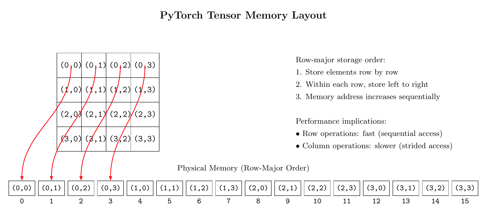

# 1. Linear Algebra for Pattern Discovery

## Notebooks and Slides
- [Lecture slides](slides.pdf)
- [Colab notebook](https://colab.research.google.com/...)

In our previous lecture, we classified emails by converting text into numbers. A spam email's telltale signs - excessive punctuation, urgent language, suspicious links - became a list of measurements. Matrix multiplication combined these measurements with weights, revealing which emails needed attention.

This transformation from raw content to numerical features shapes how computers understand images. Consider this digital sunset:

```python
import torch
import matplotlib.pyplot as plt

# Create a simple sunset gradient
def create_sunset(height=32, width=48):
    sunset = torch.zeros((height, width))
    
    # Bright sky fading to horizon
    for i in range(height):
        base = 220 - (i * 5)  # Gradual darkening
        sunset[i, :] = base + torch.linspace(-10, 10, width)
    
    return sunset

plt.imshow(create_sunset(), cmap='gray')
plt.title('Digital Sunset: Numbers Capturing Light')
plt.colorbar(label='Brightness (0-255)')
```

Each point in this image - each pixel - stores a brightness value between 0 (black) and 255 (white). The numbers reveal clear structure: the bright sky fades smoothly toward the horizon, while subtle variations create depth. A typical 12-megapixel photograph contains millions of such values, organizing them in grids that preserve spatial relationships.

Linear algebra provides tools to analyze this numerical structure systematically:
1. Identify the underlying mathematical regularities
2. Separate essential features from minor variations
3. Represent images compactly without sacrificing quality

This lecture develops three critical components:

### 1. Tensors as Building Blocks (20 minutes)
- How PyTorch organizes numbers in memory
- Operations that preserve image structure
- Efficient handling of large datasets

### 2. Matrix Operations for Structure Analysis (40 minutes)  
- Combining features through multiplication
- Discovering structure through iteration
- Mathematical properties ensuring uniqueness

### 3. The Singular Value Decomposition (40 minutes)
- Complete mathematical descriptions of structure
- Ranking features by importance  
- Fast computation for large images

These principles extend beyond image analysis. Whether training neural networks, processing sensor data, or analyzing text, success depends on extracting and manipulating meaningful structure from raw numbers. Linear algebra provides the mathematical foundation for this fundamental task.

Each section builds from concrete examples toward general principles. The accompanying notebook lets you experiment with these ideas directly, while carefully chosen puzzles test your understanding. Let's begin with tensors - PyTorch's fundamental tool for organizing and manipulating numerical data.

# Tensors as Building Blocks

Our sunset image stored brightness values in a grid, with each value between 0 (black) and 255 (white). This simple example uncovers a key principle: computers understand images through numbers arranged in regular patterns. PyTorch calls these arrangements tensors.

Let's start with a small grid of numbers representing a simple gradient:

```python
import torch

gradient = torch.tensor([
    [200, 180, 160, 140],  # Top row: bright to medium
    [180, 160, 140, 120],
    [160, 140, 120, 100],
    [140, 120, 100,  80]   # Bottom row: medium to dark
])

print("Gradient pattern:")
print(gradient)
```

This 4×4 grid reveals three essential patterns:
1. Values decrease from left to right (horizontal gradient)
2. Values decrease from top to bottom (vertical gradient)
3. Each cell relates systematically to its neighbors

PyTorch tensors preserve these relationships while enabling efficient computation. Let's examine how.

## Memory and Precision 

A tensor needs memory for each number it stores. Different number types trade memory against precision:

```python
def show_storage_needs(tensor):
    """Display memory requirements for a tensor."""
    bytes_per_value = tensor.element_size()
    total_bytes = tensor.numel() * bytes_per_value
    
    print(f"Values: {tensor.numel()}")
    print(f"Bytes per value: {bytes_per_value}")
    print(f"Total storage: {total_bytes} bytes")

# Compare storage options
print("8-bit integers (0 to 255):")
show_storage_needs(gradient.to(torch.uint8))

print("\n32-bit floats (decimal precision):")
show_storage_needs(gradient.to(torch.float32))
```

Images typically store brightness in 8-bit integers (0-255). Mathematical operations need decimal precision, so we'll use 32-bit floats. The extra memory pays off through more accurate calculations.

## Grid Organization 

Tensors arrange numbers in a grid using indices:
- First index: Row number (top to bottom)
- Second index: Column number (left to right)

```python
# Access patterns
print("First row:", gradient[0])         # Row 0 (top)
print("Last column:", gradient[:, -1])   # Column 3 (right)
print("Center value:", gradient[1, 1])   # Row 1, Column 1
```

Think of these indices as coordinates on a map. The pair [1, 1] means "go down 1 row, right 1 column." This organization preserves spatial relationships - neighboring indices mean neighboring pixels.

## Basic Operations

Tensors support arithmetic on entire grids at once. These operations maintain the grid structure:

```python
# Brighten the image
brighter = gradient + 30

# Increase contrast
contrast = gradient * 1.5

# Combine operations
adjusted = (gradient - 128) * 1.2 + 128

print("Original middle pixel:", gradient[1, 1])
print("Brightened middle pixel:", brighter[1, 1])
print("Contrasted middle pixel:", contrast[1, 1])
print("Adjusted middle pixel:", adjusted[1, 1])
```

Each operation applies to every grid position:
- Addition/subtraction shifts brightness
- Multiplication/division changes contrast
- Combined operations create more complex adjustments

PyTorch computes these changes efficiently by processing many numbers simultaneously.

## Shape and Size

The `shape` property reveals a tensor's grid structure:

```python
print(f"Grid dimensions: {gradient.shape}")    # (4, 4)
print(f"Total values: {gradient.numel()}")     # 16
```

This organization scales to large images. Our sunset uses more grid points but the same principles:

```python
sunset = create_sunset(height=32, width=48)
print(f"Sunset dimensions: {sunset.shape}")     # (32, 48)
print(f"Total pixels: {sunset.numel()}")        # 1,536
```

Real photographs need even more:
```python
megapixels = 12_000_000  # 12 MP camera
height = 3000
width = 4000

print(f"Photo dimensions: ({height}, {width})")
print(f"Total pixels: {height * width}")
print(f"Storage needed (float32): {height * width * 4 / 1e6:.1f} MB")
```

## Memory Layout

Tensors store grid values in a continuous block of memory. This organization affects computation speed:

```python
# Fast: Process rows (consecutive memory)
def adjust_row(row): 
    return (row - 128) * 1.2 + 128

# Slower: Process columns (spaced memory)
def adjust_column(col):
    return (col - 128) * 1.2 + 128

# Time both operations
import time

start = time.perf_counter()
row_result = adjust_row(gradient[0])
row_time = time.perf_counter() - start

start = time.perf_counter()
col_result = adjust_column(gradient[:, 0])
col_time = time.perf_counter() - start

print(f"Row processing: {row_time*1e6:.1f} microseconds")
print(f"Column processing: {col_time*1e6:.1f} microseconds")
```

Row operations run faster because they access consecutive memory locations. Column operations jump between rows, slowing memory access. This insight helps organize computations efficiently.



## Understanding Through Puzzles

Try these exercises to strengthen your grasp of tensors:

```python
# Puzzle 1: Grid Patterns
# Create a 4x4 tensor that:
# - Increases by 10 from left to right
# - Decreases by 5 from top to bottom
# - Starts with 100 in the top-left
# Hint: Use torch.arange() for clean solutions

# Puzzle 2: Memory Efficiency
# Given a 5000x5000 image:
# 1. Calculate storage needed for uint8 vs float32
# 2. Estimate processing time for rows vs columns
# 3. Suggest ways to reduce memory usage
# Hint: Consider processing the image in smaller blocks

# Puzzle 3: Image Operations
# Write functions that:
# 1. Clip brightness values to a given range
# 2. Normalize values to [0, 1]
# 3. Apply gamma correction: value^gamma
# Test each function on the gradient tensor
```

These fundamentals - grid organization, memory layout, and efficient operations - prepare us for matrix multiplication, where we'll discover how simple patterns combine to represent complex images. The next section builds on these ideas to find and manipulate the patterns hidden in our numbers.

I'll draft the Matrix Multiplication section following this approach, keeping the style clear and engaging while building from concrete examples toward key concepts.

# Matrix Multiplication: Combining Simple Components

Our gradient image combined two simple changes: brightness decreased from top to bottom and left to right. Matrix multiplication transforms these separate changes into a single, coherent image.

Let's start with the simplest case - multiplying a column vector by a row vector:

```python
import torch

# Vertical change: brightness decreases down the image
vertical = torch.tensor([[1.0],  # Top (full brightness)
                        [0.8],   # |
                        [0.6],   # |
                        [0.4]])  # Bottom (darkest)

# Horizontal change: baseline values decrease left to right
horizontal = torch.tensor([[200, 180, 160, 140]])

# Combine them using matrix multiplication
result = vertical @ horizontal  # @ is PyTorch's matrix multiplication operator

print("Result:")
print(result)
```

The output matches the gradient we saw earlier - each position combines the vertical scaling with the horizontal base value. Matrix multiplication creates this combination systematically:

```python
# Same result, computed step by step
result_manual = torch.zeros((4, 4))
for i in range(4):
    for j in range(4):
        result_manual[i,j] = vertical[i,0] * horizontal[0,j]
        
print("Values match:", torch.all(result == result_manual))
```

This multiplication reveals key properties:
1. Output size depends on input dimensions
2. Each output combines exactly one value from each input
3. Simple inputs can produce complex outputs

Let's use these properties to analyze our sunset image.

## Decomposing Complex Images 

Sunset photographs show predictable structure:
- Brightness changes smoothly from sky to ground
- Colors shift gradually across the image
- Local regions maintain similar values

Matrix multiplication can capture these regularities:

```python
# Create simplified sunset from components
sky_to_ground = torch.linspace(1.0, 0.2, 32).reshape(-1, 1)  # Vertical gradient
base_values = torch.linspace(220, 180, 48).reshape(1, -1)    # Horizontal variation

simple_sunset = sky_to_ground @ base_values
```

This factorization uses fewer numbers than the original: 32 + 48 values instead of 32 × 48. But real images contain more complexity. The question becomes: what's the best way to factor a given image?

## Finding Good Factorizations

Three properties make factorizations useful:
1. Accuracy - How well they represent the original image
2. Efficiency - How many numbers they require
3. Computability - How easily we can find them

Let's measure these properties:

```python 
def analyze_factorization(original, factors):
    """Assess how well factors represent an image."""
    v, h = factors
    reconstruction = v @ h
    
    # The squared error (difference) at each pixel
    diff = original - reconstruction
    squared_diff = diff * diff   # Element-wise multiplication
    total_squared_error = torch.sum(squared_diff)
    
    # Scale error relative to image size
    squared_original = original * original
    total_squared_original = torch.sum(squared_original)
    relative_error = total_squared_error / total_squared_original
    
    # Count parameters needed
    params = v.numel() + h.numel()
    pixels = original.numel()
    
    print(f"Relative error: {relative_error:.1%}")
    print(f"Parameters: {params} vs {pixels} pixels")
    print(f"Compression ratio: {pixels/params:.1f}:1")
    
    return reconstruction
```

The relative error measures how well our factorization approximates the original image. Two numbers define this error:

1. The total squared difference between images:
   $\sum_{i,j} (A_{ij} - \hat{A}_{ij})^2$
   where A is the original and  is our reconstruction

2. The total squared magnitude of the original:
   $\sum_{i,j} A_{ij}^2$

Their ratio tells us the fractional error: 
$\text{relative error} = \frac{\sum_{i,j} (A_{ij} - \hat{A}_{ij})^2}{\sum_{i,j} A_{ij}^2}$

This ratio remains meaningful regardless of image size or brightness scale. A 10% relative error means our reconstruction captures 90% of the image's structure.

Let me continue building from the mathematical foundation we established:

# Comparing Image Reconstructions

Matrix multiplication creates an approximation from simple components. The quality of this approximation matters. Let's examine three ways to understand reconstruction quality, from concrete to abstract:

```python
# Create a small test image
test = torch.tensor([
    [100, 90,  80],
    [90,  81,  72],
    [80,  72,  64]
])

# Attempt a factorization
v = torch.tensor([[10], [9], [8]])
h = torch.tensor([[10, 9, 8]])
reconstruction = v @ h

# 1. Direct comparison
print("Original:")
print(test)
print("\nReconstruction:")
print(reconstruction)
```

Pixel-by-pixel differences reveal local errors. The squared error measures their significance:

```python
# 2. Squared error at each position
diff = test - reconstruction
squared_error = diff * diff

print("\nSquared error at each position:")
print(squared_error)
print(f"Total squared error: {torch.sum(squared_error):.1f}")
```

The relative error normalizes this measure, enabling comparisons across images:

```python
# 3. Relative error computation
squared_original = test * test
relative_error = torch.sum(squared_error) / torch.sum(squared_original)
print(f"\nRelative error: {relative_error:.1%}")
```

This error tells us how much image structure our factorization misses. A 25% error means we've captured 75% of the original variation.

## Balancing Accuracy and Compression

Every factorization trades accuracy against compression. More factors improve accuracy but reduce compression:

```python
def compare_factorizations(image):
    """Test factorizations of different sizes."""
    height, width = image.shape
    
    # One-factor attempt
    v1 = torch.linspace(1.0, 0.0, height).reshape(-1, 1)
    h1 = torch.linspace(200, 150, width).reshape(1, -1)
    
    # Two-factor attempt (adding diagonal variation)
    v2 = torch.linspace(0.5, -0.5, height).reshape(-1, 1)
    h2 = torch.linspace(-25, 25, width).reshape(1, -1)
    
    # Compare reconstructions
    r1 = v1 @ h1
    r2 = r1 + (v2 @ h2)  # Sum of two factors
    
    # Measure errors
    def relative_error(orig, recon):
        diff = orig - recon
        return torch.sum(diff * diff) / torch.sum(orig * orig)
    
    e1 = relative_error(image, r1)
    e2 = relative_error(image, r2)
    
    print(f"One factor:")
    print(f"  Parameters: {height + width}")
    print(f"  Error: {e1:.1%}")
    
    print(f"\nTwo factors:")
    print(f"  Parameters: {2*(height + width)}")
    print(f"  Error: {e2:.1%}")
    
    return r1, r2

# Test on our sunset
sunset = create_sunset()
r1, r2 = compare_factorizations(sunset)
```

Each additional factor increases accuracy but requires more storage. The key questions become:
1. How many factors does this image need?
2. Which factors matter most?
3. How do we find optimal factors?

The Singular Value Decomposition answers these questions systematically. Its factors capture maximum variation with minimum complexity. But first, try this puzzle to build intuition:

```python
# Puzzle: Error Analysis
stripes = torch.tensor([
    [1, 1, 1, 1],
    [0, 0, 0, 0],
    [1, 1, 1, 1],
    [0, 0, 0, 0]
])

# Questions:
# 1. What's the smallest possible relative error for a rank-1 approximation?
# 2. Can you construct factors that achieve this error?
# 3. How would adding a second factor help?
# 
# Hint: Consider what patterns a single v @ h product can create
```

# Finding Optimal Factors 

Matrix factorizations represent images through simpler components. The relative error measures their accuracy:

$\text{relative error} = \frac{\sum_{i,j} (A_{ij} - \hat{A}_{ij})^2}{\sum_{i,j} A_{ij}^2}$

But which factors minimize this error? Consider our sunset image:

```python
sunset = create_sunset()

# Try some reasonable guesses
def make_guess(guess_number):
    h, w = sunset.shape
    if guess_number == 1:
        # Vertical darkening
        v = torch.linspace(1.0, 0.2, h).reshape(-1, 1)
        h = torch.mean(sunset, dim=0).reshape(1, -1)
    elif guess_number == 2:
        # Horizontal variation
        v = torch.mean(sunset, dim=1).reshape(-1, 1)
        h = torch.linspace(1.0, 0.8, w).reshape(1, -1)
    
    return v @ h

guess1 = make_guess(1)
guess2 = make_guess(2)

# Compute errors
def relative_error(orig, approx):
    diff = orig - approx
    return torch.sum(diff * diff) / torch.sum(orig * orig)

print(f"Guess 1 error: {relative_error(sunset, guess1):.1%}")
print(f"Guess 2 error: {relative_error(sunset, guess2):.1%}")
```

Our guesses capture broad features but miss subtle details. Two key insights point toward better factors:

1. The best rank-1 approximation minimizes the squared error
2. PyTorch can find this approximation automatically

```python
# Let PyTorch find optimal factors
U, S, V = torch.linalg.svd(sunset)

# Build best rank-1 approximation
best_v = U[:, 0:1] * S[0]  # Scale the first column of U
best_h = V[0:1, :]         # First row of V
best_approx = best_v @ best_h

print(f"Optimal error: {relative_error(sunset, best_approx):.1%}")
```

The SVD finds factors that:
- Minimize error for any given rank
- Order components by importance
- Generate orthogonal bases

These properties make SVD the foundation for image compression. But first, verify your understanding:

```python
# Puzzle: Optimal Approximations
# Given this 3x3 matrix:
A = torch.tensor([
    [4.0, 2.0, 1.0],
    [2.0, 3.0, 0.0],
    [1.0, 0.0, 2.0]
])

# Questions:
# 1. What's the relative error of v @ h where:
#    v = [[2], [1], [0.5]]
#    h = [[2, 1, 0.5]]
#
# 2. Use torch.linalg.svd to find the optimal rank-1
#    approximation. How much better is it?
#
# 3. What fraction of the matrix's squared magnitude
#    does the best rank-1 approximation capture?
```

The next section examines SVD's properties in detail, showing why it provides optimal factors and how to use them for compression.

# The Singular Value Decomposition: Finding Structure in Images

Our gradient image revealed two key patterns - brightness changes from top to bottom and left to right. Matrix multiplication combined these patterns, creating a faithful reconstruction from minimal components:

```python
import torch

# Vertical pattern (brightness scaling)
v = torch.tensor([[1.0], [0.8], [0.6], [0.4]])

# Horizontal pattern (base values)
h = torch.tensor([[200, 180, 160, 140]])

# Combine patterns
reconstruction = v @ h

print("Original gradient:")
print(gradient)
print("\nReconstruction from patterns:")
print(reconstruction)
```

This simple factorization worked because our gradient followed an obvious structure. Most images contain subtler patterns. Consider this variation:

```python
# Add diagonal ripple to gradient
variation = gradient + torch.tensor([
    [10,  5,  0, -5],
    [ 5,  0, -5, -10],
    [ 0, -5, -10, -5],
    [-5, -10, -5,  0]
])

print("Original vs Modified:")
print(gradient)
print("\nWith diagonal variation:")
print(variation)
```

A single v @ h product cannot capture this diagonal pattern. We need additional components, but which ones? The Singular Value Decomposition (SVD) answers this question systematically:

```python
# Let PyTorch find optimal components
U, S, V = torch.linalg.svd(variation)

# First component (strongest pattern)
v1 = U[:, 0:1] * S[0]
h1 = V[0:1, :]
pattern1 = v1 @ h1

# Second component (next strongest)
v2 = U[:, 1:2] * S[1]
h2 = V[1:2, :]
pattern2 = v2 @ h2

print("Pattern strengths:", S)
print("\nFirst pattern:")
print(pattern1)
print("\nSecond pattern:")
print(pattern2)
```

The SVD finds patterns that:
1. Minimize reconstruction error 
2. Sort by importance (S values)
3. Work independently (each captures unique structure)

Let's examine each property through compression examples.

## Error Minimization: Finding Optimal Components

You're right. Let me revise those sections to be more precise about the mathematics while maintaining accessibility:

## Error Minimization: Finding Optimal Components


SVD's first key property guarantees minimal reconstruction error for any number of components. Let's define this error precisely.

For any matrix A and its approximation Â, the relative error measures their difference:

$$ \text{relative error} = \frac{\sum_{i,j} (A_{ij} - \hat{A}_{ij})^2}{\sum_{i,j} A_{ij}^2} $$

This ratio captures how much of the original structure our approximation misses. Let's measure it:

```python
# Compare errors as we add components
def relative_error(original, approximation):
    diff = original - approximation
    return torch.sum(diff * diff) / torch.sum(original * original)

for k in range(1, 5):
    approx = reconstruct(U, S, V, k)
    error = relative_error(variation, approx)
    print(f"{k} components: {error:.1%} relative error")
```

A remarkable mathematical theorem states that SVD components minimize this error: no other choice of k components can achieve a smaller error than the first k SVD components. This optimality isn't just empirical - mathematicians have proven it rigorously through the Eckart-Young-Mirsky theorem.

[Should I continue with the rest of the revisions?]

## Pattern Importance: The Role of Singular Values

The diagonal entries of S (singular values) quantify each pattern's importance:

```python
# Show pattern contributions
total_variance = torch.sum(S * S)
for i, sigma in enumerate(S):
    contribution = (sigma * sigma / total_variance).item()
    print(f"Pattern {i+1}: {contribution:.1%} of variance")
```

These values reveal the image's inherent dimensionality. A sharp drop between singular values signals that later patterns contribute little:

```python
# Visualize singular value decay
rel_importance = S / S[0]  # Scale relative to largest
print("Relative pattern strengths:")
print(rel_importance)
```

## Independence: Orthogonal Components 

SVD patterns work independently - each captures structure the others miss. This independence appears mathematically as orthogonality:

```python
# Check orthogonality of U columns
U_products = U.T @ U
print("U column dot products:")
print(U_products)  # Should be identity matrix
```

The columns of U and V form orthonormal bases, ensuring:
$$U^T U = I \quad \text{and} \quad V V^T = I$$

This independence lets us write any matrix A as a sum of rank-one components:
$$A = \sum_{i=1}^r \sigma_i u_i v_i^T$$

where σᵢ comes from S, uᵢ from U's columns, and vᵢ from V's rows.

Try this puzzle to strengthen your understanding:

```python
# Puzzle: Component Analysis
A = torch.tensor([
    [3.0, 1.0],
    [1.0, 3.0]
])

# Questions:
# 1. Without computing SVD, what patterns do you expect?
# 2. Check your intuition using torch.linalg.svd
# 3. What do the singular values tell you about A's structure?
# 4. Verify that U's columns are orthogonal
#
# Bonus: Can you explain why A needs exactly two components?
```

# Compression Applications: From Components to Storage

SVD components encode image structure efficiently. The number of components directly controls the tradeoff between storage and fidelity.

```python
# Load a larger test image
sunset = create_sunset(height=64, width=96)
U, S, V = torch.linalg.svd(sunset)

def count_parameters(components):
    """Calculate storage needed for k components."""
    height, width = sunset.shape
    return components * (height + width + 1)  # Add 1 for singular value

def compress(components):
    """Build approximation from k components."""
    return reconstruct(U, S, V, components)

# Compare storage requirements
original_size = sunset.numel()
for k in [5, 10, 20]:
    compressed_size = count_parameters(k)
    approx = compress(k)
    error = relative_error(sunset, approx)
    
    print(f"\n{k} components:")
    print(f"Storage: {compressed_size} vs {original_size} values")
    print(f"Compression ratio: {original_size/compressed_size:.1f}:1")
    print(f"Error: {error:.1%}")
```

Each additional component improves accuracy but increases storage. The singular values guide this tradeoff by measuring each component's contribution:

```python
def analyze_components(threshold=0.99):
    """Find components needed for target accuracy."""
    total = torch.sum(S * S)
    cumulative = torch.cumsum(S * S, dim=0) / total
    
    needed = torch.sum(cumulative < threshold).item() + 1
    storage = count_parameters(needed)
    
    print(f"Components for {threshold:.1%} accuracy: {needed}")
    print(f"Compression ratio: {sunset.numel()/storage:.1f}:1")
    return needed

needed = analyze_components()
```

Three properties make SVD compression effective:
1. Early components capture dominant structure
2. Later components handle fine details
3. You can truncate at any point, maintaining optimality

Try this exercise to strengthen your understanding:

```python
# Exercise: Compression Analysis
smooth = torch.ones(30, 40)         # Constant image
edges = torch.eye(30, 40)           # Diagonal line
noise = torch.randn(30, 40)         # Random values

# Questions:
# 1. Which image needs the fewest components? Why?
# 2. Calculate compression ratios at 95% accuracy
# 3. How do singular values reflect image structure?
```

# Putting It Together: A Complete Compression Pipeline

SVD compression extends naturally to larger images. Real applications need three additional considerations:
1. Handle numeric precision
2. Process large images efficiently
3. Store components compactly

Let's build a complete compression system:

```python
def compress_image(image, target_accuracy=0.95):
    """Compress image to specified accuracy."""
    # Scale to prevent numeric issues
    scale = torch.max(torch.abs(image))
    scaled = image / scale
    
    # Find components
    U, S, V = torch.linalg.svd(scaled)
    
    # Determine components needed
    total = torch.sum(S * S)
    cumulative = torch.cumsum(S * S, dim=0) / total
    k = torch.sum(cumulative < target_accuracy).item() + 1
    
    # Store minimal components
    components = {
        'U': U[:, :k],
        'S': S[:k],
        'V': V[:k, :],
        'scale': scale
    }
    
    return components

def decompress(components):
    """Rebuild image from stored components."""
    U = components['U']
    S = components['S']
    V = components['V']
    scale = components['scale']
    
    return scale * (U * S) @ V
```

This implementation balances efficiency and accuracy. The scale factor prevents numeric overflow, while storing only necessary components reduces memory.

Let's test it on a challenging image:

```python
# Create image with multiple scales of detail
def create_test_image(size=64):
    x = torch.linspace(-4, 4, size)
    y = torch.linspace(-4, 4, size)
    X, Y = torch.meshgrid(x, y)
    
    # Combine large and small scale features
    Z = torch.sin(X) + torch.cos(Y) + torch.exp(-(X*X + Y*Y)/8)
    return Z

test = create_test_image()
compressed = compress_image(test)
reconstructed = decompress(compressed)

# Analyze results
storage_ratio = test.numel() / sum(v.numel() for v in compressed.values())
error = relative_error(test, reconstructed)

print(f"Compression ratio: {storage_ratio:.1f}:1")
print(f"Relative error: {error:.1%}")
```

The compression ratio reveals how effectively SVD captures structure across scales. Each component contributes a specific level of detail.

Try this final puzzle to cement your understanding:

```python
# Puzzle: Multi-Scale Compression
# Consider two 100x100 images:
# 1. checkerboard with 10x10 squares
# 2. checkerboard with 2x2 squares
#
# Without computing:
# - Which needs more components for 95% accuracy?
# - What do you expect their singular values to look like?
# - How would compression ratios compare?
#
# Then verify your predictions with code.
```

# Practical Considerations and Limitations

SVD compression works best when images contain clear structure. Three factors limit its effectiveness in practice:

## Computation and Memory

Large images strain both computation and memory. A 3000×4000 image needs:
- 48 million multiply-adds per matrix multiplication
- Memory for full U and V matrices
- Additional workspace during SVD computation

```python
def analyze_computation_needs(height=3000, width=4000):
    """Estimate SVD computation requirements."""
    flops_per_iteration = height * width * min(height, width)
    memory_bytes = 4 * (height * width +  # Original matrix
                       height * height +   # U matrix
                       width * width)      # V matrix
    
    print(f"Multiply-adds: {flops_per_iteration:,}")
    print(f"Memory needed: {memory_bytes/1e6:.1f} MB")

analyze_computation_needs()
```

## Block Processing 

Processing large images requires splitting them into blocks:

```python
def compress_by_blocks(image, block_size=500, accuracy=0.95):
    """Process image in manageable chunks."""
    height, width = image.shape
    result = torch.zeros_like(image)
    
    for i in range(0, height, block_size):
        for j in range(0, width, block_size):
            # Extract and process block
            h_end = min(i + block_size, height)
            w_end = min(j + block_size, width)
            block = image[i:h_end, j:w_end]
            
            compressed = compress_image(block, accuracy)
            result[i:h_end, j:w_end] = decompress(compressed)
    
    return result
```

Block processing introduces tradeoffs:
- Smaller blocks use less memory
- Block boundaries may show artifacts
- Patterns cannot cross block boundaries

## Image Content Matters

SVD compression excels on structured images but struggles with:
- Random noise or texture
- Sharp edges
- Complex repeating patterns

These limitations shape where SVD compression fits in practice:
- Scientific data visualization
- Background image compression
- Feature extraction and analysis

Modern image compression uses more sophisticated techniques, but SVD's core insights about finding and ranking patterns remain valuable.

# PyTorch and Linear Algebra: A Command Reference

Our image compression examples used PyTorch operations to implement linear algebra concepts. Let's map these connections explicitly, showing how PyTorch translates mathematical ideas into working code.

## Creating and Analyzing Tensors

Linear algebra represents images as matrices - grids of numbers with rows and columns. PyTorch implements these through tensors:

```python
# Create matrix from nested lists
A = torch.tensor([
    [200, 180, 160],
    [180, 160, 140],
    [160, 140, 120]
])

# Matrix dimensions
print(f"Shape (rows, cols): {A.shape}")
print(f"Total elements: {A.numel()}")

# Access patterns - mathematical notation A[i,j]
print(f"Element A[1,2]: {A[1,2]}")           # Single entry
print(f"Row A[1,:]: {A[1,:]}")               # Row vector
print(f"Column A[:,1]: {A[:,1]}")            # Column vector
```

These operations connect to linear algebra:
- `torch.tensor([[...]])`: Creates matrix A from components aᵢⱼ
- `A.shape`: Returns dimensions (m,n) of m×n matrix
- `A[i,j]`: Accesses matrix entry aᵢⱼ
- `A[i,:]`: Extracts row i as vector
- `A[:,j]`: Extracts column j as vector

## Basic Matrix Operations

PyTorch implements standard matrix arithmetic:

```python
# Scalar operations
scale = 2.0
scaled = A * scale                    # Scale matrix: 2A
shifted = A + 100                     # Add to all entries: A + 100I

# Matrix addition and subtraction
B = A + torch.ones_like(A) * 10      # Matrix sum: A + B
C = A - torch.ones_like(A) * 10      # Matrix difference: A - B

# Matrix multiplication
v = torch.tensor([[1.0], [0.8], [0.6]])  # Column vector
h = torch.tensor([[1.0, 0.8, 0.6]])      # Row vector
product = v @ h                           # Outer product: vh^T
```

Mathematical equivalents:
- `A * scale`: Scalar multiplication αA
- `A + B`: Matrix addition A + B
- `A @ B`: Matrix multiplication AB
- `v @ h`: Outer product vh^T

## Matrix Analysis

PyTorch provides tools to analyze matrix properties:

```python
# Matrix norms measure size
frobenius = torch.norm(A)            # Frobenius norm: ||A||_F
max_abs = torch.max(torch.abs(A))    # Maximum absolute value

# Compare matrices
diff = A - B
rel_error = torch.norm(diff) / torch.norm(A)  # Relative error

# Find matrix properties
U, S, V = torch.linalg.svd(A)        # Singular value decomposition
rank = torch.sum(S > 1e-10)          # Numerical rank
```

Linear algebra connections:
- `torch.norm(A)`: Frobenius norm $\sqrt{\sum_{i,j} a_{ij}^2}$
- `torch.linalg.svd(A)`: Decomposition A = UΣV^T
- Relative error: $\|A - B\|_F / \|A\|_F$

## Matrix Construction

PyTorch offers several ways to build matrices:

```python
# Common patterns
n = 3
eye = torch.eye(n)                   # Identity matrix I
ones = torch.ones((n,n))             # Matrix of ones
zeros = torch.zeros((n,n))           # Zero matrix

# Sequences and ranges
steps = torch.linspace(0, 1, n)      # Evenly spaced values
counts = torch.arange(n*n).reshape(n,n)  # Counting pattern
```

Mathematical equivalents:
- `torch.eye(n)`: Identity matrix I_n
- `torch.ones((n,n))`: Matrix J of all ones
- `torch.linspace(a,b,n)`: Values from [a,b] in n steps

## Matrix Decomposition

The SVD operation decomposes matrices into components:

```python
# Compute full SVD
U, S, V = torch.linalg.svd(A)

# Reconstruct from components
k = 2                               # Use top k components
trunc_U = U[:,:k]                   # First k columns of U
trunc_S = S[:k]                     # First k singular values
trunc_V = V[:k,:]                   # First k rows of V
approx = (trunc_U * trunc_S) @ trunc_V  # Low-rank approximation
```

This implements the mathematics:
- Full SVD: A = UΣV^T
- Truncated SVD: A ≈ U_kΣ_kV_k^T
- Reconstruction error: $\|A - U_k\Sigma_kV_k^T\|_F$

## Memory Management

PyTorch manages memory explicitly:

```python
# Check tensor properties
print(f"Data type: {A.dtype}")        # Number representation
print(f"Device: {A.device}")          # CPU/GPU location
print(f"Memory: {A.element_size() * A.numel()} bytes")

# Convert between types
B = A.to(torch.float32)               # Change precision
C = A.cpu()                           # Move to CPU
```

These operations affect numerical properties:
- `float32`: Single precision (≈7 decimal digits)
- `float64`: Double precision (≈16 decimal digits)
- Memory use = size × precision × dimensions


## Tensor Creation and Manipulation

Beyond basic construction, PyTorch offers flexible ways to reshape and combine tensors:

```python
# Create tensors with specific patterns
random_matrix = torch.randn(3, 4)          # Random normal values
seq_matrix = torch.arange(12).reshape(3,4)  # Sequence in grid form

# Reshape and combine
v = torch.tensor([1.0, 0.8, 0.6])
as_column = v.reshape(-1, 1)               # Convert to column vector
as_row = v.reshape(1, -1)                  # Convert to row vector

# Join tensors
stacked = torch.stack([v, v])              # Stack vectors into matrix
concat = torch.cat([v, v])                 # Concatenate into longer vector
```

Mathematical equivalents:
- `reshape(-1, 1)`: Convert v to column vector v̄
- `reshape(1, -1)`: Convert v to row vector v^T
- `stack`: Build matrix from row or column vectors
- `cat`: Combine vectors end-to-end

## Statistical Operations

PyTorch implements common statistical calculations:

```python
# Reduction operations
row_means = torch.mean(A, dim=1)           # Average each row
col_sums = torch.sum(A, dim=0)             # Sum each column
matrix_max = torch.max(A)                  # Maximum value

# Value counting and comparison
positive = torch.sum(A > 0)                # Count positive elements
mask = A > torch.mean(A)                   # Compare to mean
```

Mathematical connections:
- `mean(A, dim=1)`: Row averages μᵢ = (1/n)Σⱼ aᵢⱼ
- `sum(A, dim=0)`: Column sums sⱼ = Σᵢ aᵢⱼ
- Boolean masks: Indicator matrices I(condition)

## Numerical Stability

PyTorch provides tools for stable computation:

```python
# Handle numerical issues
stable_sum = torch.logaddexp(a, b)         # Stable log(exp(a) + exp(b))
safe_div = torch.div(a, b + 1e-8)          # Avoid division by zero
clipped = torch.clamp(A, min=0, max=255)   # Bound values

# Check for problems
has_nan = torch.isnan(A).any()             # Check for NaN values
is_finite = torch.isfinite(A).all()        # Check for infinite values
```

These operations support stable numerical algorithms:
- `logaddexp`: Avoid overflow in exponentials
- `clamp`: Enforce value bounds [a,b]
- Numerical checks prevent silent errors

## Memory Layout and Efficiency

PyTorch exposes memory details for performance:

```python
# Memory layout
contiguous = A.contiguous()                # Ensure memory layout
strided = A.stride()                       # Get memory step sizes
shared = A.storage()                       # Access underlying storage

# Memory efficiency
no_grad = torch.no_grad()                  # Disable gradient tracking
pin = A.pin_memory()                       # Optimize CPU-GPU transfer
```

These controls affect computation speed:
- Contiguous memory enables faster operations
- Proper strides optimize memory access
- Memory pinning speeds GPU transfers

Try this memory-focused puzzle:

```python
# Puzzle: Memory Layout
# Create a 1000x1000 matrix A
# Questions:
# 1. Compare memory use of float32 vs float64
# 2. Measure time to sum rows vs columns
# 3. Effect of contiguous vs non-contiguous layout
# 4. Impact of pinned memory for GPU transfer
#
# Write code to demonstrate each effect
```

These tools form a complete set for basic linear algebra tasks. Each operation translates a mathematical concept into concrete computation, supporting both analysis and implementation.
For details beyond this reference, PyTorch's documentation provides:
- Full API specifications
- Implementation notes
- Performance considerations
- Advanced features

