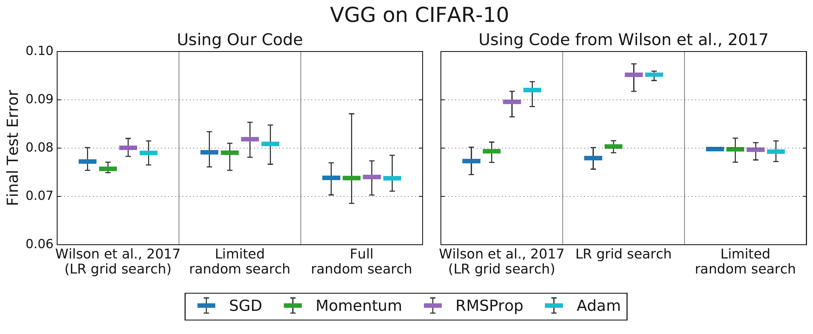

**Lecture 10 Cheat Sheet: Benchmarking Optimizers**

**I. The Core Problem: Comparing Optimizers is HARD**

*   **Challenge:** Determining if Optimizer A is truly "better/faster" than Optimizer B for deep learning is unreliable with naive methods. Simple loss curve plots or final performance values are often misleading.
*   **Why?** Performance depends heavily on subtle interactions between the optimizer, the specific problem (workload), and *how* hyperparameters were chosen.
*   **Connection:** Builds on L6-L9 optimizer knowledge, moving from theory on simple models to practical comparison challenges.

---

**II. Challenge 1: Defining "Speed" - Crossing Curves**

*   **Problem:** Optimizer performance curves (e.g., validation loss vs. time/steps) frequently **intersect**. One optimizer isn't consistently faster across the whole training run.
*   **Evidence (Dahl et al., 2023, Fig 1):**
    *    *(Representational Thumbnail)*
    *   *Shows:* Validation curves crossing (left); even "best-so-far" curves cross (right).
    *   *Quote:* "Figure 1: A direct comparison of training curves is ill-posed if they intersect. Left: The validation error for two different runs... Right: The best validation error obtained so far by each curve... the curves intersect multiple times..." (Dahl et al., 2023, p. 10)
*   **Solution:** **Time-to-Result (TTR)** metric.
    *   *Definition:* Measure the time (wall-clock or steps on standard hardware) required to first reach a **pre-defined target performance value** (e.g., target validation error).
    *   *Benefit:* Provides a single, unambiguous endpoint for comparison. (Dahl et al., 2023, Sec 4.1).

---

**III. Challenge 2: The Hyperparameter Tuning Trap**

*   **Core Issue:** The **Hyperparameter Tuning Protocol** is the biggest confounder. Performance is meaningless without knowing *how* hyperparameters (LR, $\beta_1, \beta_2, \lambda, \epsilon$, schedule...) were chosen.
*   **Key Factors:**
    *   **Search Space:** Which HPs were tuned and over what ranges?
    *   **Budget:** How many trials were run?
    *   **Method:** How were trials sampled (random, grid, Bayesian Opt.)?
*   **Concept: Optimizer Inclusion Hierarchy (Choi et al., 2019b, Def 1):**
    *   *Definition:* $M \subseteq N$ if N can simulate M (e.g., SGD $\subseteq$ Momentum by setting $\gamma=0$).
    *   *Theory:* *Perfectly* tuned N should be $\ge$ perfectly tuned M.
    *   *Practice:* Only holds if tuning is sufficient and **fair**.
*   **Evidence 1: Tuning Reverses Conclusions (Choi et al., 2019b, Fig 3):**
    *    *(Representational Thumbnail)*
    *   *Shows:* Limited tuning (LR only, like Wilson '17) makes Adam look worse than Momentum (left). *Fair, more comprehensive* tuning makes them comparable (right), resolving the contradiction.
    *   *Quote:* "Figure 3: Tuning more hyperparameters removes the differences in test error between optimizers observed by Wilson et al. (2017)... Tuning a subset... is sufficient to equalize performance... More extensive hyperparameter tuning... improves results for all optimizers and still does not produce any differences..." (Choi et al., 2019b, p. 7)
*   **Evidence 2: Tuning Sensitivity (Choi et al., 2019b, Fig 4):**
    *    *(Representational Thumbnail)*
    *   *Shows:* Optimizer rankings (vs Schneider '19) *change drastically* depending on which HPs are included in the tuning protocol (compare left vs right bars per task).
    *   *Quote:* "Figure 4: Tuning more hyperparameters changes optimizer rankings from Schneider et al. (2019) to rankings that are consistent with the inclusion relationships..." (Choi et al., 2019b, p. 8)
*   **CRITICAL TAKEAWAY:** For empirical comparison, the **Optimizer + its FULL Tuning Protocol (Search Space, Budget, Method) = The unit being compared.** Comparisons without specifying the full protocol are unreliable. (Choi et al., 2019b, Sec 5).

---

**IV. Detailed Tuning Strategies from Sources**

*   **Goal:** Understand *exactly how* tuning was performed in the benchmark/studies.

*   **1. AlgoPerf Benchmark Tuning Rulesets (Dahl et al., 2023; Kasimbeg et al., 2024)**
    *   **A. External Tuning Ruleset:**
        *   *Goal:* Simulate limited parallel tuning.
        *   *Submitter Provides:* Search space ranges (or fixed list - OptList).
        *   *Benchmark Does:*
            *   Runs N trials (e.g., 5) via **quasi-random search** from space (per "study").
            *   Selects best trial based on fastest time to *validation* target.
            *   Repeats M times (e.g., 5 "studies") with different seeds.
        *   *Scoring:* **Median** time-to-*test*-target across studies for the best-per-study trials.
    *   **B. Self-Tuning Ruleset:**
        *   *Goal:* Evaluate fully automated / HP-free methods.
        *   *Submitter Provides:* Algorithm (no external HPs/search space).
        *   *Benchmark Does:*
            *   Runs algorithm once (per "study"). All tuning must happen *during* this run.
            *   Larger time budget (e.g., 3x external).
            *   Repeats M times (e.g., 5 "studies") with different seeds.
        *   *Scoring:* **Median** time-to-*test*-target across studies.

*   **2. Choi et al. (2019b) Experimental Tuning**
    *   *Goal:* Show protocol changes rankings.
    *   *Compared Protocols:*
        *   *"Limited Tuning":* Mimicked prior work. Tuned **LR only**. Others HPs **fixed** (Adam defaults, Momentum=0.9). Simple search (grid/manual).
        *   *"Comprehensive Tuning":* Tuned **multiple HPs simultaneously**: LR (initial), Schedule params, Momentum ($\gamma$ or $1-\beta_1$), Adaptive params ($\beta_2, \epsilon$). Used **quasi-random search** with fixed trial budget (10-100). Used explicit **log-uniform search spaces** (see paper App D). Decoupled Adam LR/$\epsilon$ tuning ($\alpha_0/\sqrt{\epsilon}$ and $\epsilon$). Selected based on final validation performance.
    *   *Finding:* Moving from "Limited" to "Comprehensive" changed rankings, often aligning with theory ($M \subseteq N$).

---

**V. Solution: Rigorous Benchmarking Principles (AlgoPerf Example)**

*   **Goal:** Create a standard framework for fair, reliable comparisons using insights from challenges.
*   **Key Principles:**
    1.  **Metric:** Time-to-Result (TTR) using pre-defined targets (Sec 4.1 Dahl).
    2.  **Hardware:** Standardized, fixed hardware for wall-clock timing (Sec 4.1.2 Dahl).
    3.  **Workloads:** Diverse suite + Held-out variants (test robustness) (Sec 4.3 Dahl).
    4.  **Isolation:** Strict API - submissions modify *only* algorithm components (Sec 4.2 Dahl).
    5.  **Tuning Rules:** Explicitly define & account for tuning (External vs Self-Tuning) (Sec 4.4 Dahl).
    6.  **Scoring:** Aggregate via **Performance Profiles** (Sec 4.5 Dahl).
*   **Understanding Performance Profiles:**
    *    *(Representational Thumbnail - e.g., External Tuning)*
    *   *X-axis ($\tau$):* Slowdown factor relative to *best* on that workload ($\tau=1$ = fastest).
    *   *Y-axis (% Workloads):* Fraction solved *within* factor $\tau$ of best time.
    *   *Interpretation:* **Higher / Further Left = Better.** Solves more problems, faster.
    *   *Quote:* "In the performance profiles (b, d), each line represents a submission. A step at $\tau$ indicates that, for one workload, this submission reaches the target within $\tau$ times the runtime of the fastest submission..." (Kasimbeg et al., 2024, p. 4)

---

**VI. Key Results from AlgoPerf Competition (Kasimbeg et al., 2024)**

*   **Overall Outcome (Kasimbeg et al., 2024, Fig 1):**
    *    *(Representational Thumbnail)*
    *   *Shows:* Leaderboards (a, c) & Profiles (b, d). Clear differentiation.
    *   *Winners:* Distributed Shampoo (External), ScheduleFreeAdamW (Self-Tuning).
*   **Finding 1: Advanced Preconditioning Works (External):**
    *   *Who:* Distributed Shampoo.
    *   *What:* ~28% faster avg. wall-clock vs NadamW baseline.
    *   *Why:* Shows benefit of advanced methods *when fairly tuned*. (Kasimbeg Sec 3).
*   **Finding 2: Hyperparameter-Free Progress (Self-Tuning):**
    *   *Who:* ScheduleFreeAdamW.
    *   *What:* ~10% faster than *external tuning baseline* on common tasks, *with zero external tuning budget*.
    *   *Why:* Big step towards automated training. (Kasimbeg Sec 3.2).
*   **Finding 3: Robustness is Crucial:**
    *   *Evidence:* Kasimbeg Table 1 shows many failures (`inf`, `NaN`, `†`, `‡`).
    *    *(Representational Thumbnail)*
    *   *Shows:* Winners reliable across workloads, not always fastest. Failures kill scores.
    *   *Quote:* "Table 1: Normalized submission runtimes... Workload runtimes considered infinite... marked in gray... `inf` denotes... did not reach... target... `NaN` indicates an error... † indicates... held-out score is ignored... ‡ indicates... base workload score is ignored..." (Kasimbeg et al., 2024, p. 5)
*   **Other Lessons:** Fair framework comparison (JAX/PyTorch) needs engineering (Kasimbeg Sec 4). Benchmark design has trade-offs (cost/benefit of held-out) (Kasimbeg Sec 5.1).

---

**VII. Main Conclusion**

*   **Bottom Line:** Reliable optimizer comparison **REQUIRES** standardized benchmarks.
*   **Reason:** Must control for workload, hardware, speed definition (TTR), and **explicitly account for the tuning protocol** (search space, budget, method).
*   **Actionable Insight:** Treat **Optimizer + Tuning Protocol** as the unit of comparison. Evaluate new optimizers using benchmarks or provide meticulous detail on the protocol used.

---