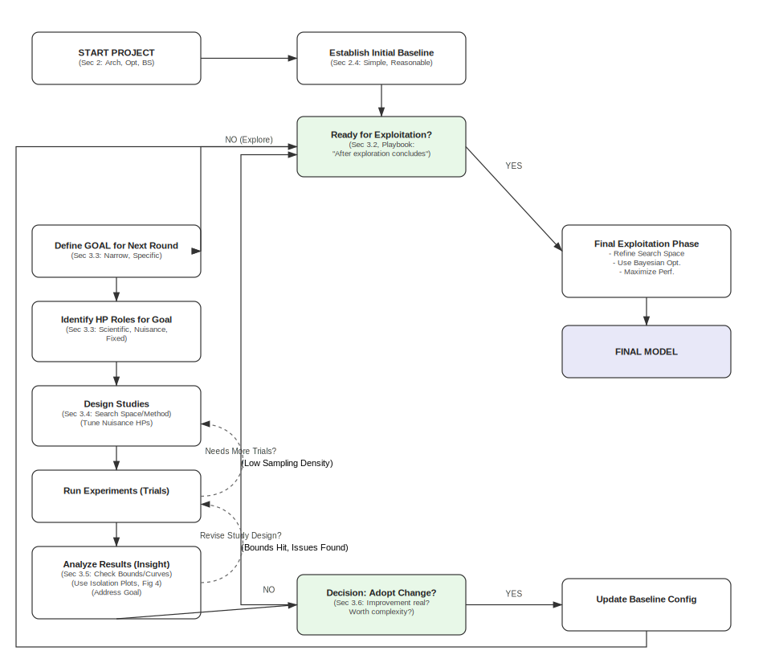
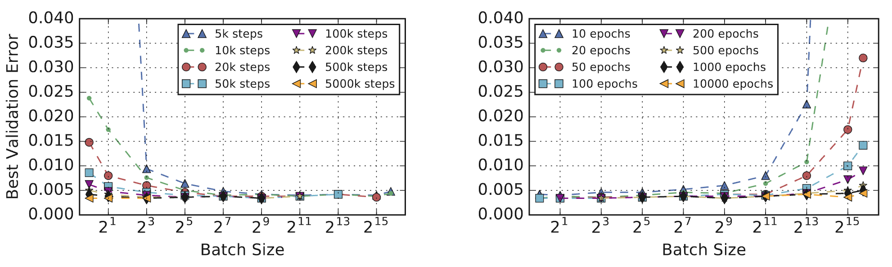

# A Playbook for Tuning Deep Learning Models

## Table of contents
1.  [Introduction: Beyond Algorithms to Process](#introduction-beyond-algorithms-to-process)
2.  [Initial Setup: Foundational Choices](#initial-setup-foundational-choices)
    *   [Model Architecture: Start with the Known](#model-architecture-start-with-the-known)
    *   [Optimizer Selection: Balancing Power and Tuning Effort](#optimizer-selection-balancing-power-and-tuning-effort)
    *   [Batch Size: A Matter of Speed and Resources](#batch-size-a-matter-of-speed-and-resources)
    *   [Establishing a Baseline: The Initial Configuration](#establishing-a-baseline-the-initial-configuration)
3.  [The Scientific Tuning Process: An Iterative Approach](#the-scientific-tuning-process-an-iterative-approach)
    *   [The Incremental Strategy](#the-incremental-strategy)
    *   [Exploration First, Exploitation Later](#exploration-first-exploitation-later)
    *   [Structuring Experiments: Goals and Hyperparameter Roles](#structuring-experiments-goals-and-hyperparameter-roles)
    *   [Designing Studies: Search and Comparison](#designing-studies-search-and-comparison)
    *   [Analyzing Experimental Results: Extracting Insights](#analyzing-experimental-results-extracting-insights)
    *   [Making Decisions: Adopting Changes Carefully](#making-decisions-adopting-changes-carefully)
4.  [Determining Training Duration](#determining-training-duration)
5.  [Conclusion: Tuning as a Systematic Process](#conclusion-tuning-as-a-systematic-process)
6.  [References](#references)

## 1. Introduction: Beyond Algorithms to Process

Optimizing the performance of deep learning models presents significant challenges that extend beyond the selection of a specific training algorithm. Practical success often depends on a meticulous process for tuning model hyperparameters and training procedures. However, as noted in the introduction to the Deep Learning Tuning Playbook [1], these effective tuning strategies are rarely documented, often involve guesswork, and can vary substantially between practitioners. This lecture outlines a systematic, evidence-based *process* for tuning deep learning models, drawing guidance from the playbook available at [https://github.com/google-research/tuning_playbook](https://github.com/google-research/tuning_playbook) and empirical results from its supporting references.

Previous lectures in this course examined the properties of specific optimization algorithms like Stochastic Gradient Descent (SGD), Momentum, and Adam (Lectures [6](../6/notes.md), [7](../7/notes.md), [9](../9/notes.md)). Lecture [10](../10/notes.md) highlighted the difficulties involved in empirically comparing these optimizers, particularly the sensitivity of outcomes to the hyperparameter tuning protocol. This lecture addresses these issues by focusing on a structured *workflow* for model development and tuning. The aim is to provide a more scientific and reproducible approach to finding high-performing model configurations.

*Figure 1: Overview of the iterative tuning process based on the Deep Learning Tuning Playbook [1]. The process begins with initial setup (Section 2) and then enters an iterative loop focused primarily on exploration (Section 3.2). Each loop involves defining a goal (Section 3.3), identifying hyperparameter roles (Section 3.3), designing and running experiments while tuning nuisance parameters (Section 3.4), and analyzing results for insights (Section 3.5). Decisions to adopt changes are made based on evidence, considering variance and complexity (Section 3.6). The loop continues until exploration goals are met, potentially followed by a final exploitation phase.*

## 2. Initial Setup: Foundational Choices

Before beginning the iterative tuning process described in Section 3, several foundational decisions are typically made at the start of a deep learning project. These initial choices concern the model architecture, the optimization algorithm, the batch size, and the overall starting configuration. This section covers guidance from the playbook on making these early choices, which establish the baseline upon which later tuning experiments will build.

### 2.1 Model Architecture: Start with the Known

The Deep Learning Tuning Playbook recommends beginning a new project by selecting a well-established model architecture that is known to perform well on similar tasks [1]. Developing custom architectures can be deferred until after a reliable baseline has been established using a standard model. Choosing an architecture typically means selecting a *family* of models, as architectures often have their own hyperparameters (such as the number of layers or the width of layers) that determine the specific model configuration. The process for selecting these architectural hyperparameters is part of the broader tuning strategy discussed in Section 3.

### 2.2 Optimizer Selection: Balancing Power and Tuning Effort

Selecting an appropriate optimization algorithm is another initial step. The playbook suggests starting with optimizers that are widely used and well-understood for the type of problem being addressed [1]. Examples include SGD with momentum or adaptive methods like Adam and AdamW, whose mechanics were detailed in Lectures [7](../7/notes.md) and [9](../9/notes.md). It is important to recognize the trade-off between an optimizer's potential capabilities and the effort required to tune it. Optimizers like Adam possess more tunable hyperparameters (learning rate $η$, momentum parameters $\beta_1$ and $\beta_2$, and the epsilon term $\epsilon$) compared to SGD with momentum (learning rate $η$, momentum parameter $\beta$). As implicitly shown by the findings in Choi et al. (2019b) [2] (discussed further in Section 3.3), achieving the potential benefits of more complex optimizers often requires careful tuning of these additional hyperparameters. Therefore, if tuning resources are limited at the project's outset, it might be pragmatic to start with a simpler optimizer configuration, such as SGD with momentum, or Adam with its $\beta_1$, $\beta_2$, and $\epsilon$ parameters fixed to standard default values, deferring the tuning of these additional parameters until later stages.

### 2.3 Batch Size: A Matter of Speed and Resources

The batch size primarily determines the training speed and the utilization of hardware resources. According to the playbook and empirical studies like Shallue et al. (2018) [3], the batch size should not be treated as a hyperparameter to be tuned directly for improving validation performance [1]. Comparable validation accuracy is typically achievable across a wide range of batch sizes, provided that other critical hyperparameters, particularly the learning rate and any regularization parameters, are carefully re-tuned for each batch size setting [3]. Neglecting to re-tune these interacting parameters can create misleading impressions about the effect of batch size on final model performance.

The relationship between batch size and training speed (measured in the number of steps required to reach a target error) follows a characteristic pattern, demonstrated across various workloads in Shallue et al. (2018) [3]. As batch size increases, there is typically an initial phase of *perfect scaling*, where doubling the batch size roughly halves the number of training steps needed. This is followed by a phase of *diminishing returns*, where increases in batch size yield progressively smaller reductions in steps. Eventually, a regime of *maximal data parallelism* is reached, where further increases in batch size provide no additional reduction in the required training steps. **Figure 1** illustrates this common pattern for a ResNet-8 model trained on CIFAR-10.

*Figure 1: The relationship between steps to result and batch size has the same characteristic form for all problems. In all cases, as the batch size grows, there is an initial period of perfect scaling (indicated with a dashed line) where the steps needed to achieve the error goal halves for each doubling of the batch size. Then there is a region of diminishing returns that eventually leads to a region of maximal data parallelism where additional parallelism provides no benefit whatsoever. (Source: Shallue et al., 2018, Fig 1c)*

Re-tuning is essential because key hyperparameters interact strongly with the batch size. Shallue et al. (2018) found that the optimal learning rate often does not follow simple heuristics like linear or square-root scaling with batch size [3]. **Figure 2** shows an example for ResNet-8 on CIFAR-10, where the optimal effective learning rate deviates substantially from these common scaling rules. Similarly, regularization often needs adjustment, as larger batch sizes can sometimes increase the risk of overfitting due to the reduced noise in the gradient estimates [1]. Comparing batch sizes using a fixed *epoch* budget can also be misleading regarding training time, as it favors smaller batches which perform more updates per epoch, potentially obscuring the speed benefits achievable with larger batches under a fixed *step* budget, as shown in **Figure 3**.

*Figure 2: Optimal effective learning rates do not always follow linear or square root scaling heuristics. Effective learning rates correspond to the trial that reached the goal validation error in the fewest training steps. (Source: Shallue et al., 2018, Fig 8c)*

*Figure 3: Validation error depends on compute budget more than batch size. Plots show the best validation error subject to budgets of training steps (left) or training epochs (right). Step budgets favor large batch sizes, while epoch budgets favor small batch sizes. (Source: Shallue et al., 2018, Fig 11a)*

### 2.4 Establishing a Baseline: The Initial Configuration

Before starting the iterative tuning process detailed in Section 3, it is necessary to establish an initial configuration. This includes specifying the initial model hyperparameters (e.g., number of layers), the optimizer settings (e.g., initial learning rate, fixed momentum value), and the number of training steps for initial experiments. The playbook advises aiming for a baseline configuration that is intentionally simple, uses minimal computational resources, and achieves "reasonable" performance – meaning the model performs distinctly better than random chance on the validation set [1]. Starting with simplicity avoids premature complexity. For example, one might begin with a constant learning rate schedule before exploring more complex decay schemes. The initial choice for the number of training steps involves a trade-off: longer training can simplify tuning certain parameters like decay schedules, but shorter runs allow for faster iteration during the exploration phase. This trade-off, and methods for determining training duration, are discussed further in Section 4.

## 3. The Scientific Tuning Process: An Iterative Approach

Once an initial baseline configuration is established, the core work of improving model performance begins. This section details the iterative tuning process outlined in the Deep Learning Tuning Playbook [1]. This process treats hyperparameter optimization not as arbitrary tweaking, but as a structured, scientific endeavor focused on building understanding and making evidence-based improvements.

### 3.1 The Incremental Strategy

The recommended approach is incremental [1]. Starting from the simple baseline configuration (Section 2.4), changes are introduced one at a time. These changes might involve trying different hyperparameter values, adding new architectural features, incorporating regularizers, or altering data preprocessing. The key principle is to only adopt a change into the baseline configuration if there is strong evidence that it provides a genuine improvement over the current baseline. Each time a beneficial change is adopted, that configuration becomes the new baseline for future experiments. The playbook refers to adopting a new baseline as a "launch" [1]. This incremental method helps manage complexity and ensures that the final configuration is built upon a series of well-justified decisions.

### 3.2 Exploration First, Exploitation Later

A theme of the playbook's tuning strategy is the distinction between exploration and exploitation [1]. While the goal is to find the configuration with the best performance (exploitation), the majority of the tuning process should focus on exploration – that is, designing experiments primarily to gain insight into the tuning problem itself. This focus on understanding helps in the long run by identifying which hyperparameters are most impactful, how different hyperparameters interact, whether the model suffers from issues like overfitting or instability, and when further tuning is unlikely to yield significant gains. Prioritizing insight over short-term validation score improvements helps avoid adopting changes that perform well by chance and leads to more robust and well-understood final models [1]. Focused exploitation, where the sole aim is minimizing validation error, is reserved for the later stages of tuning once the problem structure is better understood.

### 3.3 Structuring Experiments: Goals and Hyperparameter Roles

The iterative tuning process is organized into rounds of experiments. Each round should have a single, clearly defined, and narrow goal [1]. Attempting to investigate multiple changes or answer several questions simultaneously makes it difficult to isolate the effect of each factor. Example goals include evaluating a potential pipeline change (like adding a specific regularizer), understanding the impact of a single model hyperparameter (like the choice of activation function), or performing a final round of greedy optimization to minimize validation error.

Within each experimental round, hyperparameters adopt one of three roles relative to the specific goal: scientific, nuisance, or fixed [1]. Scientific hyperparameters are those whose impact on performance is the direct subject of investigation in that round. Nuisance hyperparameters are those that are not the primary focus but need to be optimized over to ensure a fair comparison between different settings of the scientific hyperparameters. Fixed hyperparameters are held constant throughout the round; this simplifies the experiment but introduces the caveat that the conclusions drawn may only apply to the specific chosen values of these fixed parameters. For instance, if the goal is to determine if adding weight decay improves performance, the presence or absence of weight decay is the scientific variable. The weight decay strength ($\lambda$) would be a nuisance parameter, as its optimal value might differ depending on whether decay is used or not, and needs to be tuned to fairly assess the benefit of adding the technique. The learning rate ($\eta$) might also be treated as a nuisance parameter, as it often interacts with regularization. An architectural detail, like the activation function, might be treated as a fixed parameter if prior evidence suggests its optimal choice is independent of weight decay, or if the experimenter is willing to limit the conclusion to models using that specific activation. The role of any given hyperparameter is therefore not intrinsic but depends entirely on the goal of the current experimental round.

Identifying and appropriately handling nuisance hyperparameters is critical for drawing reliable conclusions from tuning experiments. Comparing different optimizers or model configurations without adequately tuning relevant nuisance parameters for each can lead to misleading results, as demonstrated by Choi et al. (2019b) [2]. They showed that naive comparisons, often fixing optimizer hyperparameters other than the learning rate to default values, could produce rankings inconsistent with theoretical expectations (e.g., finding SGD superior to Adam). However, when nuisance parameters (like Adam's $\beta_1$, $\beta_2$, or $\epsilon$) were properly included in the tuning process for all compared optimizers, these discrepancies often disappeared, and performance differences became much smaller or aligned with theoretical inclusion relationships. **Figure 4** illustrates this finding, showing how differences between optimizers diminish or vanish when more hyperparameters are tuned. This underscores the necessity of optimizing over nuisance parameters to enable fair comparisons.

*Figure 4: Tuning more hyperparameters removes the differences in test error between optimizers observed by Wilson et al. (2017). Tuning a subset of optimizer hyperparameters and the initial learning rate is sufficient to equalize performance between all optimizers (left). More extensive hyperparameter tuning in our setup... improves results for all optimizers and still does not produce any differences between optimizer performances (right). (Source: Choi et al., 2019b, Fig 3)*

The specific choice of which hyperparameters to include in the tuning protocol (the search space) and the budget allocated for tuning can fundamentally alter the relative ranking of different approaches [2]. **Figure 5** demonstrates how the perceived ranking of SGD, Momentum, and Adam on different tasks changes significantly based on the comprehensiveness of the tuning protocol. Rankings stabilize and align with theoretical expectations only when the tuning protocol is sufficiently inclusive. This leads to a crucial conclusion emphasized by both the playbook and Choi et al. (2019b): for the purpose of empirical comparison, the **tuning protocol is an integral part of the algorithm's definition**. Comparing optimizers or other techniques without specifying and controlling for the search space, tuning budget, and search method yields unreliable results.

*Figure 5: Tuning more hyperparameters changes optimizer rankings from Schneider et al. (2019) to rankings that are consistent with the inclusion relationships. The leftmost columns for each workload reproduce the rankings from Schneider et al. (2019), while the remaining columns tune over increasingly general search spaces. All columns use our random search tuning protocol. (Source: Choi et al., 2019b, Fig 4)*

In practice, resource limitations often necessitate treating some potentially interacting parameters as fixed rather than nuisance. The decision involves balancing the risk of drawing conclusions limited by the fixed settings against the cost and complexity of tuning more nuisance variables [1]. Generally, parameters known to strongly interact with the scientific parameters (e.g., learning rate often interacts with model architecture or regularization strength) should be treated as nuisance parameters whenever possible. Architectural choices often affect computational costs and are frequently treated as scientific or fixed parameters. Some hyperparameters may also be *conditional*, existing only for specific settings of a scientific hyperparameter (e.g., Adam's $\beta_1$ and $\beta_2$ exist only when the optimizer choice, a scientific parameter, is Adam) [1].

### 3.4 Designing Studies: Search and Comparison

An experimental round is typically implemented as one or more "studies," where each study consists of multiple "trials" [1]. A trial represents a single training run with a specific configuration of hyperparameters. The purpose of a study is to evaluate different settings of the scientific hyperparameters while optimizing over the nuisance hyperparameters specified for that study. For example, to compare Adam versus SGD (the scientific hyperparameter), one might run two studies. The first study would fix the optimizer to Adam and search over its relevant nuisance hyperparameters (e.g., $\eta$, $\beta_1$, $\beta_2$, $\epsilon$). The second study would fix the optimizer to SGD and search over its nuisance hyperparameters (e.g., $\eta$, momentum). The best trial from each study would then be compared to determine which optimizer performed better under these tuning conditions.

Automated search algorithms are typically used to explore the space defined by the nuisance (and sometimes scientific) hyperparameters within a study. During the exploration phase, where the goal is to gain insight, the playbook recommends using non-adaptive methods like quasi-random search (based on low-discrepancy sequences, see Bousquet et al. 2017 [4]) [1]. Advantages cited in the playbook include allowing flexible post-hoc analysis (since sampling doesn't adapt to a specific objective), consistency, easier interpretation due to uniform space coverage, and simplicity, especially in high-parallelism settings. For the final exploitation phase, where the goal is simply to find the single best configuration within a well-defined search space, adaptive methods like Bayesian Optimization are preferred [1]. Tools should ideally handle potential trial failures or divergences gracefully (e.g., see Gelbart et al. 2014 [5]).

Designing effective studies involves allocating a finite computational budget across three competing needs: evaluating a sufficient range of scientific hyperparameter values, defining sufficiently broad search spaces for nuisance hyperparameters, and sampling those spaces densely enough with trials [1]. Expanding any of these dimensions typically requires more computational resources. Adequately tuning nuisance parameters is essential for the validity of the comparison between scientific parameter settings.

### 3.5 Analyzing Experimental Results: Extracting Insights

After running the trials within a study (or set of studies), the analysis should extend beyond addressing the original scientific goal [1]. It is crucial to check for potential issues with the experiment itself and to extract broader insights about the tuning problem.

A key check is evaluating the adequacy of the chosen search spaces for the nuisance hyperparameters. This can be done visually using basic hyperparameter axis plots, which show the validation objective achieved by each trial plotted against the value of a specific hyperparameter. If the best-performing trials consistently cluster near the boundary of the search range for a particular hyperparameter, it suggests the space may be too small in that dimension, and the optimal value might lie outside the tested range. **Figure 1** illustrates this concept, contrasting a scenario where the best learning rates are near the edge (suggesting the need to expand the search) with one where the optimum appears well within the range. The playbook states: "A search space is suspicious if the best point sampled from it is close to its boundary. We might find an even better point if we expanded the search range in that direction" [1]. If issues are found, the search space should be adjusted and the study potentially rerun.

*Figure 1: Example hyperparameter axis plots illustrating search space boundary checks. Left: The best trials (lowest error) cluster near the upper boundary for the learning rate, indicating the search space might need expansion. Right: The best trials are well within the search space boundaries, suggesting the chosen range is adequate.*

Assessing whether the search space was sampled densely enough is inherently difficult [1]. Looking at hyperparameter axis plots can provide some intuition; if the region containing good trials appears sparsely populated, more trials might be needed for confidence. Ultimately, this often involves a judgment based on the available budget and the observed results [1].

Examining the training and validation curves (objective vs. training step) for the best-performing trials is essential [1]. These curves can reveal:
*   **Problematic Overfitting:** If validation error consistently increases after some point while training error continues to decrease, it signals overfitting. This may require adding or strengthening regularization before reliably comparing the scientific hyperparameters, as the selection of the "best" trial might otherwise unfairly favor implicitly regularized (potentially suboptimal) configurations.
*   **High Variance:** Significant fluctuations in validation error late in training, potentially due to small batch sizes or validation sets, can make comparisons unreliable. Reducing the learning rate via decay, using Polyak averaging, or increasing batch/validation size might be necessary.
*   **Convergence Status:** If trials are still improving significantly at the final step, the allocated training time might be insufficient (see Section 4). Conversely, if performance saturates very early, the training run might be unnecessarily long.

Finally, to directly address the scientific goal, **isolation plots** are useful [1]. These plots show the best performance achieved for each value of the scientific hyperparameter, after having optimized over the nuisance hyperparameters for that specific setting (either through separate studies or by selecting the best trial per scientific value from a larger combined study). **Figure 4** shows a conceptual example plotting the best achievable validation error against different strengths of weight decay (the scientific hyperparameter), where each point implicitly represents a learning rate tuned specifically for that decay strength. The playbook notes: "An isolation plot... plots the model performance after 'optimizing away' the nuisance hyperparameters. An isolation plot makes it easier to perform an apples-to-apples comparison between different values of the scientific hyperparameter" [1].

*Figure 4: Conceptual isolation plot showing the best validation error achieved for different values of a scientific hyperparameter (e.g., weight decay strength), after optimizing over nuisance hyperparameters (e.g., learning rate) for each value.*

### 3.6 Making Decisions: Adopting Changes Carefully

The final step in a tuning round is deciding whether to adopt a change – be it a new technique, a different model variant, or simply a new set of hyperparameter values – as the baseline for future work [1]. This decision should consider the observed performance improvement in light of potential sources of variation, primarily trial variance (run-to-run variation with the same hyperparameters but different random seeds) and study variance (variation due to the hyperparameter search process itself). If resources permit, characterizing trial variance by rerunning the best configurations multiple times can provide confidence intervals. The playbook suggests a pragmatic approach: adopt a change if it demonstrates a performance improvement that seems unlikely to be due to variance alone, and if this improvement justifies any potential increase in complexity introduced by the change [1].

## 4. Determining Training Duration

The amount of time or number of steps allocated for each training run is another important consideration in the tuning process. The Deep Learning Tuning Playbook distinguishes between two primary scenarios regarding training duration [1]. In some cases, training is **compute-bound**, meaning performance continues to improve as long as training progresses, and the practical limit is determined by available time or computational resources. In other cases, training is **not compute-bound**; performance saturates, and training significantly longer yields little or no improvement in validation metrics, potentially even leading to overfitting if not managed correctly.

Regardless of which regime applies, the playbook strongly advises against treating the maximum number of training steps (`max_train_steps`) as a hyperparameter to be tuned within a single study [1]. Instead, a fixed training duration (in steps) should be chosen and used consistently for all trials within that experimental round. Performance should then be evaluated using **retrospective checkpoint selection**. This involves saving model checkpoints periodically during training and, after the run is complete, selecting the checkpoint that achieved the best validation performance at any point during the run. This approach avoids relying on the potentially suboptimal performance at the very last training step and eliminates the need for complex prospective early stopping heuristics [1]. The optimal number of training steps required can change as the model or training pipeline evolves (e.g., adding data augmentation might increase the steps needed), and it often interacts strongly with the tuning of learning rate decay schedules [1]. Observing where the best checkpoint consistently falls within the fixed training duration can provide information for adjusting `max_train_steps` in later rounds of experiments.

## 5. Conclusion: Tuning as a Systematic Process

This lecture outlined a systematic process for tuning deep learning models, drawing primarily from the Deep Learning Tuning Playbook [1]. The core idea is to move beyond ad-hoc adjustments and adopt an iterative, scientific approach. This involves setting clear experimental goals, carefully distinguishing between scientific, nuisance, and fixed hyperparameters, and focusing on gaining insights during the exploration phase before optimizing greedily for performance.

A takeaway, supported by empirical evidence [2], is that the hyperparameter tuning protocol – including the search space, budget, and search method – is inseparable from the algorithm itself when making comparisons. Fair comparisons require careful tuning of relevant nuisance hyperparameters for all methods under consideration. While powerful optimization algorithms exist (Lectures [7](../7/notes.md), [9](../9/notes.md)), their practical effectiveness hinges on applying a sound, evidence-based tuning methodology like the one described here.

## 6. References

[1] Godbole, V., Dahl, G. E., Gilmer, J., Shallue, C. J., & Nado, Z. (2023). *Deep Learning Tuning Playbook*. GitHub repository. [https://github.com/google-research/tuning_playbook](https://github.com/google-research/tuning_playbook)

[2] Choi, D., Shallue, C. J., Nado, Z., Lee, J., Maddison, C. J., & Dahl, G. E. (2019). *On Empirical Comparisons of Optimizers for Deep Learning*. arXiv preprint. [arXiv:1910.05446](https://arxiv.org/abs/1910.05446)

[3] Shallue, C. J., Lee, J., Antognini, J., Sohl-Dickstein, J., Frostig, R., & Dahl, G. E. (2018). *Measuring the Effects of Data Parallelism on Neural Network Training*. Journal of Machine Learning Research, 20(112), 1-49. [link](https://arxiv.org/abs/1811.03600)

[4] Bousquet, O., Gelly, S., Kurach, K., Teytaud, O., & Vincent, D. (2017). *Critical hyper-parameters: no random, no cry*. arXiv preprint [arXiv:1706.03200](https://arxiv.org/abs/1706.03200)

[5] Gelbart, M. A., Snoek, J., & Adams, R. P. (2014). *Bayesian Optimization with Unknown Constraints*. arXiv preprint [arXiv:1403.5607](https://arxiv.org/abs/1403.5607)