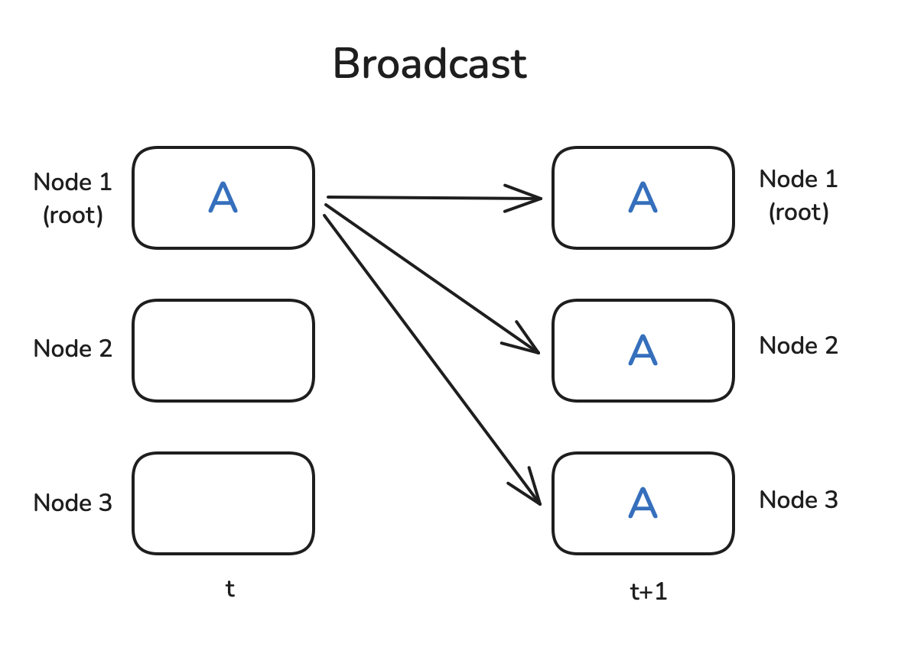
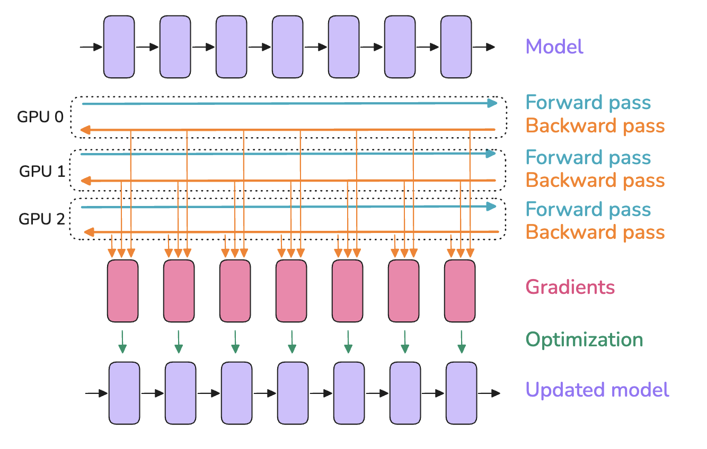
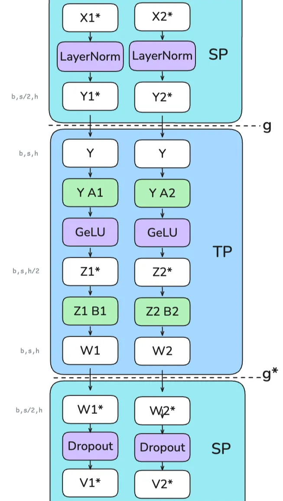
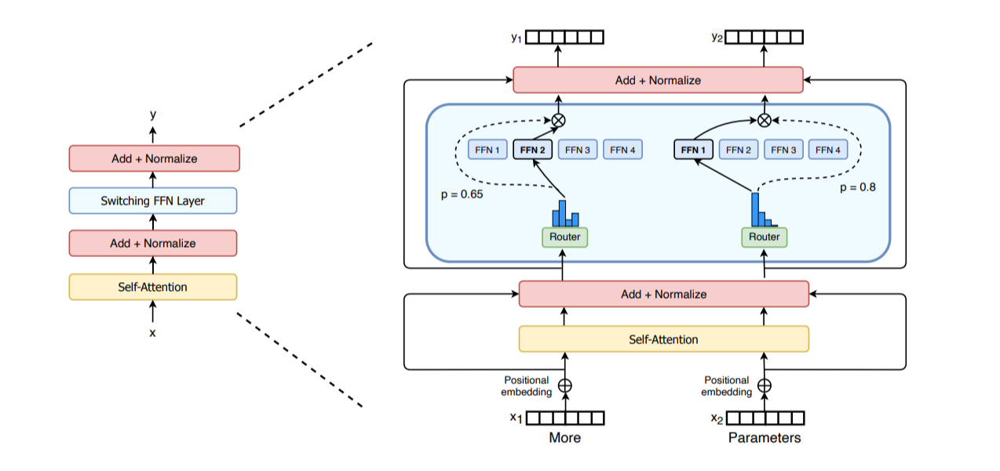

## Slide 1: Scaling Transformers: Parallelism Strategies from the Ultrascale Playbook

**(Based on Hugging Face Ultrascale Playbook)**

**Goal:** Understand *why* and *how* we train massive AI models across many computers.

---

## Slide 2: The Scaling Challenge

**Why are we here?**
*   Modern AI models (like Transformers) are HUGE (Billions/Trillions of parameters!).
*   Too big for one computer (specifically, one GPU's memory).
*   Need to split the work across *many* GPUs/computers.

**Today's Focus:**
*   System-level challenges & strategies for *distributed training*.
*   How to manage computation & memory across devices.
*   (Not focusing on the optimization math itself).

**Core Resource:** Hugging Face Ultrascale Playbook
([link](https://huggingface.co/spaces/nanotron/ultrascale-playbook){:target="_blank"})

---

## Slide 3: What IS a Transformer? (The Big Picture)

**Purpose:** Process sequences (like text) and understand relationships between elements (words).

**Core Idea:** Input sequence -> Embeddings -> **Many Transformer Blocks** -> Output Layer


*(A simple block diagram showing Input -> Embedding -> L x Blocks -> Output)*


**Key:** The "Transformer Block" is where most complexity and computation happens. We stack many ($L$) of these blocks.

---

## Slide 4: Transformer Anatomy 1: Input & Embedding

**Input:** Sequence of tokens (integer IDs): $x = (x_1, \dots, x_s)$ (length $s$)

**1. Embedding Layer:**
*   Map each token ID $x_i$ to a vector.
*   Uses a learnable matrix $W_E \in \mathbb{R}^{V_{size} \times h}$.
    *   $V_{size}$: Vocabulary size (how many unique words/tokens)
    *   $h$: Hidden dimension (size of the vector for each token)
*   Result: $H^{(0)}_{\text{embed}} \in \mathbb{R}^{s \times h}$ (a sequence of vectors)

**2. Positional Encoding:**
*   Transformers don't inherently know word order. Add position info!
*   Uses fixed or learned vectors $P \in \mathbb{R}^{s \times h}$.
*   Resulting initial representation: $H^{(0)} = \text{Embed}(x) + P \in \mathbb{R}^{s \times h}$

**Parameters here:** Mostly $W_E$ (can be large if $V_{size}$ is big).

---

## Slide 5: Transformer Anatomy 2: Layer Normalization (LN)

**Purpose:** Stabilizes training, helps gradients flow. Applied *before* main sub-layers (Pre-LN).

**What it does:** Normalizes features *across the hidden dimension* ($h$) for *each token independently*.

**Input:** Tensor $Z \in \mathbb{R}^{s \times h}$ (e.g., $H^{(l-1)}$)
**Output:** Normalized Tensor $\text{LN}(Z) \in \mathbb{R}^{s \times h}$

**Formula (for token $i$):**
$$
\text{LN}(Z)_i = \gamma \odot \frac{Z_i - \mu_i}{\sqrt{\sigma_i^2 + \epsilon}} + \beta
$$
*   $\mu_i, \sigma_i^2$: Mean/Variance across hidden dim $h$ for token $i$.
*   $\gamma, \beta \in \mathbb{R}^h$: Learnable scale & shift parameters (element-wise $\odot$).
*   $\epsilon$: Small constant for stability.

**Parameters per LN layer:** $2h$ (from $\gamma, \beta$). Used multiple times in each block!

---

## Slide 6: Transformer Anatomy 3: The Transformer Block

**Core Unit:** Repeated $L$ times. Input $H^{(l-1)}$, Output $H^{(l)}$.
**Two Main Sub-Layers:**
1.  Multi-Head Self-Attention (MHA)
2.  Position-wise Feedforward Network (FFN)

**Structure (Pre-LN Variant):**
```
Input H^(l-1) --> LN1 --> MHA --> Add (*) --> LN2 --> FFN --> Add (**) --> Output H^(l)
                  |         |                 |         |
                  +---------+ (Residual 1)    +---------+ (Residual 2)
```
*   **LN1, LN2:** Layer Normalization.
*   **Add (*, **):** Residual Connections (add input to output of sub-layer). Crucial for depth!

---

## Slide 7: Transformer Anatomy 4: Multi-Head Attention (MHA) - Part 1

**Purpose:** Allows each token to look at other tokens in the sequence and decide which are important ("attend to").

**Input:** Normalized $X' = \text{LN}_1(H^{(l-1)})$

**1. Create Query, Key, Value vectors:**
*   Linearly project $X'$ using learnable weights $W_Q, W_K, W_V \in \mathbb{R}^{h \times h}$.
    $$ Q = X' W_Q, \quad K = X' W_K, \quad Val = X' W_V $$
    *   $Q$: What I'm looking for.
    *   $K$: What I contain.
    *   $Val$: What I'll give you if you attend to me.

**2. Split into Multiple Heads:**
*   Divide $Q, K, Val$ (dim $h$) into $a$ smaller chunks ("heads") along the hidden dim.
*   $Q_i, K_i, Val_i \in \mathbb{R}^{s \times d_k}$ where $d_k = h/a$.
*   **Why heads?** Allows model to focus on different types of relationships simultaneously.

**Parameters:** $W_Q, W_K, W_V$ (total $3h^2$).

---

## Slide 8: Transformer Anatomy 5: Multi-Head Attention (MHA) - Part 2

**3. Scaled Dot-Product Attention (per head $i$):**
*   Calculate attention scores: How much should query $q$ attend to key $k$?
    $$ \text{RawScores}_i = Q_i K_i^T \in \mathbb{R}^{s \times s} $$
*   Scale scores (stabilizes gradients): Divide by $\sqrt{d_k}$.
*   Normalize scores (sum to 1 per query): Apply Softmax row-wise.
    $$ \text{Scores}_i = \text{softmax}_{\text{keys}}\left(\frac{Q_i K_i^T}{\sqrt{d_k}}\right) \in \mathbb{R}^{s \times s} $$

**4. Get Weighted Values:**
*   Multiply scores by Value vectors:
    $$ O_i = \text{Scores}_i \cdot Val_i \in \mathbb{R}^{s \times d_k} $$
    *   Output is weighted sum of values, based on attention scores.

**Computation:** Matrix Multiplies ($QK^T$, $\text{Scores} \cdot Val$) are dominant. $QK^T$ scales with $s^2$!

---

## Slide 9: Transformer Anatomy 6: Multi-Head Attention (MHA) - Part 3

**5. Concatenate Heads:**
*   Combine outputs from all heads back together:
    $$ O_{concat} = \text{Concat}(O_1, \dots, O_a) \in \mathbb{R}^{s \times h} $$

**6. Final Output Projection:**
*   Apply one more linear layer $W_O \in \mathbb{R}^{h \times h}$:
    $$ O_{MHA} = O_{concat} W_O $$

**7. Add Residual:**
*   $H_{intermediate} = H^{(l-1)} + O_{MHA}$ (Connect back to block input)

**Parameters:** $W_O$ ($h^2$). Total MHA params: $4h^2$ (ignoring biases).
**Key Computations:** Projections (Q, K, V, O), Attention ($QK^T$, Score*V).

---

## Slide 10: Transformer Anatomy 7: Feedforward Network (FFN)

**Purpose:** Process information for each token *independently* after attention. Adds representational capacity.

**Input:** Normalized $X'' = \text{LN}_2(H_{intermediate})$

**Structure:** Two linear layers with a non-linearity (e.g., GELU) in between.
$$ O_{FFN} = \text{GELU}(X'' W_1 + b_1) W_2 + b_2 $$
*   $W_1 \in \mathbb{R}^{h \times d_{ff}}$, $b_1 \in \mathbb{R}^{d_{ff}}$ (Expand dimension)
*   $W_2 \in \mathbb{R}^{d_{ff} \times h}$, $b_2 \in \mathbb{R}^{h}$ (Contract back to $h$)
*   $d_{ff}$ is the intermediate "feedforward dimension", often $d_{ff}=4h$.

**Add Residual:**
*   $H^{(l)} = H_{intermediate} + O_{FFN}$ (Output of the block)

**Parameters:** $W_1, b_1, W_2, b_2$ (Roughly $2 \times h \times d_{ff} \approx 8h^2$ params).
**Computation:** Dominated by two large matrix multiplies.

---

**Slide 11: Transformer Anatomy 8: Final Layers, Loss, & Summary**

**After Last Block ($L$):**
*   Optional Final LayerNorm: $H'\_{final} = \text{LN}\_{final}(H^{(L)})$
*   **Output Layer:** Project to final task output (e.g., vocabulary logits for language modeling).
    *   Uses $W_{LM} \in \mathbb{R}^{h \times V_{size}}$ (often tied/shared with $W_E$).
    *   $ \text{Logits} = H'\_{final} W\_{LM} \in \mathbb{R}^{s \times V\_{size}}$
    *   Each row $\text{Logits}\_i \in \mathbb{R}^{V\_{size}}$ contains scores for each possible next token at position $i$.

**Calculating the Loss (How the model learns):**
*   **Purpose:** Quantify how *wrong* the model's predictions are compared to the actual target sequence.
*   **Input:**
    *   Model $\text{Logits} \in \mathbb{R}^{s \times V_{size}}$.
    *   Target sequence (true next tokens): $y = (y_1, \dots, y_s)$, where $y_i$ is the integer index of the correct token at position $i$.
*   **Common Loss Function (Language Modeling): Cross-Entropy Loss**
    *   Compares the predicted probability distribution (derived from logits via Softmax) with the target (which is 1 for the correct token, 0 otherwise).
    *   Formula (average over sequence):
        $$ \ell(W) = -\frac{1}{s} \sum_{i=1}^s \log \left( \frac{\exp(\text{Logits}_{i, y_i})}{\sum_{j=1}^{V_{size}} \exp(\text{Logits}_{i, j})} \right) $$
        *   Essentially: Maximize the log-probability of the correct next token $y_i$ at each position $i$.
*   **Goal of Training:** Find model parameters $W = \{W_E, W_Q, ..., W_{LM}\}$ that minimize this loss $\ell(W)$. Backpropagation calculates $\nabla_W \ell$.

**Parameter Summary (Same as before):**
*   Embeddings: $W_E$ ($V_{size}h$)
*   MHA Layers (per block): $W_Q, W_K, W_V, W_O$ ($4h^2$)
*   FFN Layers (per block): $W_1, W_2$ (~$8h^2$)
*   LayerNorms (per LN): $\gamma, \beta$ ($2h$)
*   Output Projection: $W_{LM}$ ($h V_{size}$)
*   **Total:** Scales roughly as $O(V_{size}h + Lh^2)$.

**Computation Summary (Same as before):**
*   Matrix Multiplies in MHA ($QK^T$, Score*V)
*   Matrix Multiplies in FFN ($XW_1$, $HW_2$)
*   Repeated $L$ times! + Final Projection + Loss Calc.

---

## Slide 12: Transformer Anatomy 9: Common Modifications

**1. Attention Masking:**
*   **Purpose:** Control which tokens can attend to which others.
*   **How:** Add large negative values ($-\infty$) to attention scores *before* softmax.
    $$ \text{Scores}_i = \text{softmax}_{\text{keys}}\left(\frac{Q_i K_i^T}{\sqrt{d_k}} + M\right) $$
*   **Example: Causal Mask (for Autoregressive LM):** Prevent attending to future tokens ($M_{jk} = -\infty$ if $k > j$).
*   Doesn't add parameters, changes computation slightly.

**2. Dropout:**
*   **Purpose:** Regularization during *training* (prevent overfitting).
*   **How:** Randomly set some activation values to 0, scale the rest.
*   Applied after MHA output, within FFN, etc.
*   Deactivated during inference (testing).
*   Adds one hyperparameter (dropout rate $p$).

---

## Slide 13: The Memory Bottleneck: Activations!

**Problem:** Training needs gradients ($\nabla_w \ell$). Backpropagation computes them using the chain rule.

**Key Requirement:** Backprop needs intermediate values ("activations") computed during the *forward pass*.

**Example:** To compute $\nabla_W$ for $Y=XW$, we need $X$. To compute $\nabla_X$, we might need $Y$ or internal values.

**Consequence:** We must *store* many intermediate tensors ($Q, K, V$, attention scores, FFN hidden states, layer outputs $H^{(l)}$, etc.) until they're used in the backward pass.

**This takes a LOT of memory!**

---

## Slide 14: Activation Memory vs. Parameter Memory

**Activation Memory:**
*   Stores intermediate results from forward pass.
*   Depends on:
    *   Batch Size (`b`)
    *   Sequence Length (`s`)
    *   Hidden Dimension (`h`)
    *   Number of Layers (`L`)
*   Scales Roughly: $O(L \times b \times s \times h)$ (plus terms like $b \times a \times s \times s$ for attention scores!)
*   **Grows with batch size `b` and sequence length `s`!**

**Parameter Memory:**
*   Stores model weights ($W_E, W_Q, ...$).
*   Depends on: $V_{size}, h, L, d_{ff}$.
*   Scales Roughly: $O(V_{size}h + Lh^2)$.
*   **Independent of batch size `b` and sequence length `s`!**

**The Bottleneck:** For large models/batches/sequences, **Activation Memory >> Parameter Memory**. This limits what fits on a single GPU.

---

## Slide 15: Solution 1: Activation Recomputation (Gradient Checkpointing)

**Idea:** Trade compute time for memory savings.

**How:**
1.  **Forward Pass:** Compute as usual, but *don't store* all intermediate activations. Store only a few strategic ones (e.g., inputs to major blocks $H^{(l-1)}$).
2.  **Backward Pass:** When a needed activation wasn't stored, *recompute it on the fly* by running a small part of the forward pass again, starting from the nearest stored activation.


*(Top: Standard backprop stores everything. Bottom: Recomputation stores less, recomputes needed values during backward pass.)*

**Trade-off:**
*   **Pro:** Significantly reduces activation memory footprint.
*   **Con:** Increases computation time (roughly adds one extra forward pass for recomputed segments).
*   Often *essential* for training very large models.

**Reference:** [Playbook Section](https://huggingface.co/spaces/nanotron/ultrascale-playbook?section=activation_recomputation){:target="_blank"}

---

## Slide 16: Toolbox: Distributed Communication Primitives (Why?)

**Problem:** We need multiple GPUs (workers) to cooperate. They need to exchange data.

**Solution:** Use standard communication patterns ("collectives").

**Context:**
*   Group of $N$ workers, each with a rank (0 to $N-1$).
*   Usually implemented by libraries like NCCL for high-speed GPU communication.

**Understanding these is key to understanding parallelism strategies!**

**Reference:** [Playbook Appendix A0](https://huggingface.co/spaces/nanotron/ultrascale-playbook?section=a0:_parallel_programming_crash_course){:target="_blank"}

---

## Slide 17: Primitives 1: Broadcast & Reduce/AllReduce

**Broadcast:** One worker sends the *same* data to *all* others (including itself).
*   Use case: Send initial weights from rank 0 to all.


**Reduce:** Collect data from *all* workers, apply an operation (SUM, AVG), store result on *one* destination worker.
*   Use case: Aggregate partial results onto one worker.

**AllReduce:** Like Reduce, but the final result is distributed back to *all* workers.
*   Use case: Average gradients across all workers in Data Parallelism.


---

## Slide 18: Primitives 2: Gather/AllGather & Scatter/ReduceScatter

**Gather:** Collect *different* data chunks from each worker onto *one* destination worker.
*   Use case: Collect results from different workers.

**AllGather:** Like Gather, but the collected result (all chunks) is distributed back to *all* workers.
*   Use case: Reconstruct a full tensor from shards held by different workers (ZeRO).


**Scatter:** *One* source worker sends *different* chunks of data to *each* worker. (Inverse of Gather).
*   Use case: Distribute parts of a dataset.

**ReduceScatter:** Combine Reduce and Scatter. Reduce corresponding chunks from all workers, then Scatter the reduced chunk $j$ only to worker $j$.
*   Use case: Compute and distribute sharded average gradients (ZeRO).


---

## Slide 19: Primitives 3: Barrier & AlltoAll (Mentioned Later)

**Barrier:** Synchronization point. All workers wait here until everyone arrives.
*   Use case: Ensure a stage is complete everywhere before proceeding. (Use sparingly - can cause waiting).


**(Preview) AlltoAll:** Each worker sends *different* data to *every* other worker. Worker $i$ sends chunk $j$ to worker $j$. Complex permutation.
*   Use case: Routing tokens to specific "expert" networks in MoE models (Expert Parallelism).

---

## Slide 20: Parallelism Strategy 1: Data Parallelism (DP)

**What:** Replicate the *entire model* on each of $N_d$ workers. Split the *data batch* across workers.
**Why:** Increase training throughput by processing more data in parallel. Simplest parallel strategy.

**How:**
1.  Each worker $k$ gets a micro-batch $\mathcal{B}_k$.
2.  Forward pass on $\mathcal{B}_k$ using local model $w \rightarrow$ Compute loss.
3.  Backward pass $\rightarrow$ Compute local gradient $g_k$.
4.  **Synchronize Gradients:** Average gradients across all workers: $\hat{g} = \frac{1}{N_d} \sum_k g_k$. Use **`AllReduce`**.
5.  Each worker updates its local model copy using the *same* average gradient $\hat{g}$. $w_{t+1} = \text{OptimizerStep}(w_t, \hat{g})$.



**Reference:** [Playbook Section](https://huggingface.co/spaces/nanotron/ultrascale-playbook?section=data_parallelism){:target="_blank"}

---

## Slide 21: DP Optimizations: Overlap & Bucketing

**Problem:** Waiting for AllReduce is slow. Communication cost scales with model size $\|w\|$.

**Solution 1: Overlap Communication & Computation:**
*   Start AllReduce for gradients of later layers while backward pass computes gradients for earlier layers.


**Solution 2: Gradient Bucketing:**
*   Group gradients into larger "buckets".
*   Perform one AllReduce per *bucket* instead of per tensor.
*   Reduces communication call overhead, improves bandwidth use, enables better overlap.


---

## Slide 22: DP Concept: Gradient Accumulation

**Purpose:** Simulate a larger effective batch size without increasing memory per worker.

**How:**
1.  Divide worker's data $\mathcal{B}_k$ into $A$ smaller "accumulation micro-batches" $\mathcal{B}_{k,a}$.
2.  For $a = 1$ to $A$:
    *   Forward/Backward on $\mathcal{B}_{k,a}$ to get gradient $g_{k,a}$.
    *   **Accumulate** gradients locally: $g_k^{(A)} = \sum_{a=1}^A g_{k,a}$.
    *   **Crucially: NO gradient synchronization (AllReduce) for steps $a=1..A-1$.** (Use framework tools like `no_sync()`).
3.  **After step A:** Perform **one** AllReduce on the accumulated gradients $g_k^{(A)}$.
4.  Perform **one** optimizer step using the final averaged gradient.

**Trade-off:** Saves memory, but takes $A$ times longer computationally for the same amount of data compared to a single large batch.

---

## Slide 23: DP Limitations

**The Big Problem: Memory Redundancy!**
*   Every worker stores:
    *   Full Model Parameters ($w$)
    *   Full Optimizer States ($\text{OptState}$ - e.g., Adam moments, often 2x parameter size!)
    *   Full Gradients ($g_k$) (at least temporarily)
    *   Activations ($A_k$) for its micro-batch.
*   Memory usage per worker *does not decrease* as you add more workers ($N_d$).
*   **DP alone cannot train a model that doesn't fit on a single GPU.**

**Communication Bottleneck:** AllReduce cost scales with model size $\|w\|$ and can limit scaling as $N_d$ increases.

---

## Slide 24: Parallelism Strategy 2: ZeRO (Zero Redundancy Optimizer)

**What:** Enhance Data Parallelism by *partitioning* (sharding) model state (Optimizer States, Gradients, Parameters) across DP workers ($N_d$). Eliminates memory redundancy.
**Why:** Train much larger models under DP by reducing memory per worker.

**Core Idea:** Worker $k$ only *owns* and updates shard $(k)$ of the state.

**Reference:** [Playbook Section](https://huggingface.co/spaces/nanotron/ultrascale-playbook?section=zero_(zero_redundancy_optimizer)){:target="_blank"}

---

## Slide 25: ZeRO Stage 1 (ZeRO-1): Partition Optimizer States

*   **Partitions:** Optimizer States ($\text{OptState}^{(k)}$).
*   **Replicates:** Parameters ($w$), Gradients ($g_k$).

**How:**
1.  Fwd/Bwd: Compute full local gradient $g_k$.
2.  Sync/Shard Gradients: **`ReduceScatter`** sums gradients and gives worker $k$ only its needed shard $\hat{g}^{(k)}$.
3.  Optimizer Step: Worker $k$ updates *only* its parameter shard $w^{(k)}$ using $\hat{g}^{(k)}$ and local $\text{OptState}^{(k)}$.
4.  Sync Parameters: **`AllGather`** collects updated $w^{(k)}$ from all workers to reconstruct the full $w$ on every worker for the next step.


**Memory Saved:** Optimizer states (often the largest part!). Communication: Replaces 1 AllReduce with ReduceScatter + AllGather.
**Reference:** [Playbook Section](https://huggingface.co/spaces/nanotron/ultrascale-playbook?section=zero-1:_partitioning_optimizer_states){:target="_blank"}

---

## Slide 26: ZeRO Stage 2 (ZeRO-2): Partition Gradients Too

*   **Partitions:** Optimizer States ($\text{OptState}^{(k)}$), Gradients ($\hat{g}^{(k)}$).
*   **Replicates:** Parameters ($w$) (temporarily during compute).

**How:**
1.  Fwd: Compute activations $A_k$.
2.  Bwd & Shard Gradients: As gradients are computed, **`ReduceScatter`** them immediately. Worker $k$ only stores the final, averaged shard $\hat{g}^{(k)}$. (Avoids storing full $g_k$).
3.  Optimizer Step: Update $w^{(k)}$ using $\hat{g}^{(k)}$ and $\text{OptState}^{(k)}$.
4.  Sync Parameters: **`AllGather`** reconstructs full $w$.


**Memory Saved:** Optimizer states + Gradients. Communication: Still ReduceScatter + AllGather.
**Reference:** [Playbook Section](https://huggingface.co/spaces/nanotron/ultrascale-playbook?section=zero-2:_adding_gradient_partitioning){:target="_blank"}

---

## Slide 27: ZeRO Stage 3 (ZeRO-3 / FSDP): Partition Parameters Too

*   **Partitions:** Optimizer States ($\text{OptState}^{(k)}$), Gradients ($\hat{g}^{(k)}$), Parameters ($w^{(k)}$).
*   **Replicates:** Nothing persistently!

**How:**
1.  **Forward Pass (Per Layer/Block):**
    *   **`AllGather`** parameters needed for the current layer ($W_j$) just before use.
    *   Compute forward pass $A_j = f_j(A_{j-1}; W_j)$.
    *   **Discard** non-owned parameter shards immediately after use.
2.  **Backward Pass (Per Layer/Block):**
    *   **`AllGather`** parameters $W_j$ again.
    *   Compute gradients.
    *   **`ReduceScatter`** gradients immediately, worker $k$ keeps only $\hat{g}_j^{(k)}$.
    *   Discard non-owned parameter shards.
3.  **Optimizer Step:** Update local parameter shard $w^{(k)}$ using $\hat{g}^{(k)}$ and $\text{OptState}^{(k)}$. (No final parameter AllGather needed).

 

**Memory Saved:** Maximum savings - scales memory per worker by $1/N_d$. Communication: Many AllGathers (params) + ReduceScatters (grads) throughout fwd/bwd. Needs good overlap!
**Reference:** [Playbook Section](https://huggingface.co/spaces/nanotron/ultrascale-playbook?section=zero-3:_adding_parameter_partitioning){:target="_blank"}

---

## Slide 28: ZeRO Summary & Trade-offs


*(Shows theoretical memory reduction per stage vs DP size N_d)*

**Pros:**
*   Massive memory savings for model state ($w, g, \text{OptState}$), enabling huge models via DP.
*   ZeRO-3 offers maximum savings.

**Cons:**
*   **Increased communication volume** compared to standard DP. Replaces one AllReduce with potentially many collectives (ReduceScatter, AllGather).
*   Efficiency relies heavily on overlapping communication with computation.
*   **Does NOT partition activation memory $A_k$!** Still need Activation Recomputation if activations are the bottleneck.

---

## Slide 29: Parallelism Strategy 3: Tensor Parallelism (TP)

**What:** Parallelize *within* a single layer (e.g., matrix multiply). Partition tensors and computation across $N_{tp}$ workers.
**Why:**
*   Layer parameters/activations too large for one GPU.
*   Accelerate computation within a layer.

**Common Approach: Split weight matrices**
*   **Column Parallelism:** Split weight $A$ column-wise $ [A\_1 \| ... \| A\_{N\_{tp}}]$. Each worker computes $Y\_k = f(X A\_k)$. Output $Y$ is $[Y\_1 \| ... \| Y\_{N\_{tp}}]$ distributed across workers. Needs AllReduce in backward pass for $\nabla\_X$.

*   **Row Parallelism:** Split weight $A$ row-wise $ \[A\_1^T \| ... \| A\_{N\_{tp}}^T\]^T$. Input $X$ must also be sharded $[X\_1 \| ... \| X\_{N\_{tp}}]$. Each worker computes $Y\_k = f(X\_k A\_k)$. Final output $Y = \sum Y\_k$ requires **`AllReduce`** in forward pass.

 

**Reference:** [Playbook Section](https://huggingface.co/spaces/nanotron/ultrascale-playbook?section=tensor_parallelism){:target="_blank"}

---

## Slide 30: TP Applied to Transformers (FFN & MHA)

**Goal:** Minimize communication between operations.

**FFN ($Y = f(XW_1)W_2$):**
1.  $W_1$ (expand): **Column Parallelism**. Input $X$ (replicated), Output $f(Z)$ sharded along intermediate dim $d_{ff}$.
2.  $W_2$ (contract): **Row Parallelism**. Input $f(Z)$ (sharded), Output $Y_k$ partial.
3.  Final $Y = \sum Y_k$ via **`AllReduce`**.
    *   **Key:** No communication needed between $W_1$ and $W_2$!

**MHA:**
1.  $W_Q, W_K, W_V$: **Column Parallelism**. Input $X$ (replicated), Outputs $Q_k, K_k, V_k$ sharded (effectively sharding heads).
2.  Attention Calc: If $N_{tp}$ divides num heads $a$, each worker computes attention for its local heads using $Q_k, K_k, V_k$. **No communication needed here!** (Efficient "Head-wise Parallelism"). Output $Attn_k$ sharded.
3.  $W_O$: **Row Parallelism**. Input $Attn_k$ (sharded), Output $Z_k$ partial.
4.  Final MHA Output $Y = \sum Z_k$ via **`AllReduce`**.


*(Shows Column for QKV, local attn, Row for Output proj -> AllReduce. Shows Col for FFN1, Row for FFN2 -> AllReduce)*

---

## Slide 31: TP Trade-offs

**Pros:**
*   Reduces memory per worker for $w, g, \text{OptState}$ *and* **Activations** $A$ (for the parallelized layers).
*   Can speed up computation if communication overhead is low.

**Cons:**
*   **High Communication Frequency:** Requires AllReduce *within* layer computations.
 *(Shows communication cannot be fully overlapped)*
*   Needs very **high-bandwidth, low-latency interconnect** (e.g., NVLink within a node). Usually limited to small $N_{tp}$ (e.g., <= 8).
*   Increases implementation complexity.
*   Doesn't parallelize *all* operations easily (e.g., LayerNorm requires full hidden dim).

---

## Slide 32: Parallelism Strategy 4: Sequence Parallelism (SP)

**What:** Optimization used *with* Tensor Parallelism (TP) to reduce activation memory further.
**Why:** TP shards along hidden dim $h$. Operations like LayerNorm, Dropout work on full $h$, preventing activation sharding there. SP shards along *sequence dim* $s$ for these ops.

**How:** Requires communication to switch sharding:
1.  **SP Region (e.g., LayerNorm):** Input $X$ sharded along $s$. Compute LN locally.
2.  **Transition SP -> TP (`g`):** Use **`AllGather`** along $s$ to get full tensor $Y$ (replicated) needed for TP's column-parallel input.
3.  **TP Region (e.g., FFN):** Compute TP ops (Col-Linear -> Row-Linear). Output is partial $W_k$, sharded along $h$.
4.  **Transition TP -> SP (`g*`):** Use **`ReduceScatter`** along $s$. This sums partial $W_k$ (completing TP's Row-Linear) AND scatters result along $s$. Output $W^*$ is sharded along $s$.
5.  **SP Region (e.g., Dropout):** Apply Dropout locally to sequence-sharded $W^*$.



**Benefit:** Reduces peak activation memory by avoiding full $b \times s \times h$ tensor for LN/Dropout. Adds complexity. Communication volume similar to TP, uses AllGather/ReduceScatter instead of AllReduce. Still needs fast interconnect.
**Reference:** [Playbook Section](https://huggingface.co/spaces/nanotron/ultrascale-playbook?section=sequence_parallelism){:target="_blank"}

---

## Slide 33: Parallelism Strategy 5: Context Parallelism (CP) & Ring Attention

**What:** Partition the *sequence* dimension $s$ globally across $N_{cp}$ workers for *most* computations.
**Why:** Handle extremely long sequences ($s$) where activations ($b \times s \times h$) become prohibitive, especially in attention ($s^2$).

**How:**
*   Worker $k$ holds sequence chunk $X_k \in \mathbb{R}^{b \times (s/N_{cp}) \times h}$.
*   FFN, LN are local.
*   **Challenge:** Attention needs all Keys ($K$) and Values ($V$).
*   **Solution: Ring Attention:**
    1. Workers arranged in a ring.
    2. Repeat $N_{cp}-1$ times:
        *   Send current K/V chunk to next worker (async).
        *   Compute partial attention with local Q and current K/V chunk (overlap).
        *   Receive K/V chunk from previous worker (blocking). Update current K/V.


**Communication:** Point-to-point K/V passing + final gradient `AllReduce` across $N_{cp}$.
**Reference:** [Playbook Section](https://huggingface.co/spaces/nanotron/ultrascale-playbook?section=context_parallelism){:target="_blank"}

---

## Slide 34: CP Challenge: Load Balancing with Causal Masks

**Problem:** With causal masks (attend only to past) + naive sequential partitioning, workers with early chunks do much less work than workers with late chunks. Bad load imbalance!


*(Shows GPU1 has few calcs, GPU4 has many)*

**Solution: ZigZag Partitioning:**
*   Assign sequence chunks non-contiguously, mixing early/late tokens on each worker.
*   Balances the computation load across all $N_{cp}$ workers.


*(Shows computation more evenly distributed)*

**Benefit:** Enables training on very long sequences. Adds complexity to attention.

---

## Slide 35: Parallelism Strategy 6: Pipeline Parallelism (PP)

**What:** Partition the model *layers* sequentially into $P$ stages. Stage $p$ runs on worker(s) $p$. Data flows $1 \rightarrow 2 \rightarrow ... \rightarrow P$.
**Why:**
*   Model parameters $\|w\|$ too large for single device / TP group.
*   Scale across many nodes (TP needs fast intra-node links, PP tolerates slower inter-node links).

**How:** Stage $p$ computes $A_p = f_p(A_{p-1}; w_p)$. Output $A_p$ is sent to stage $p+1$.

**Problem: Pipeline Bubble:** Naive sequential execution leaves most stages idle.

*(Shows large grey idle areas)*

**Reference:** [Playbook Section](https://huggingface.co/spaces/nanotron/ultrascale-playbook?section=pipeline_parallelism){:target="_blank"}

---

## Slide 36: PP Scheduling: Reducing the Bubble

**Idea:** Split batch $\mathcal{B}$ into $m$ micro-batches ($\mathcal{B}^{(j)}$). Process them concurrently in the pipeline.

**Schedule 1: All-Forward-All-Backward (AFAB / GPipe):**
*   All micro-batches do full forward pass ($F_1..F_P$).
*   Then all micro-batches do full backward pass ($B_P..B_1$).
*   Simple, but needs to store activations for *all* $m$ micro-batches. High activation memory ($\propto m$). Bubble size $\approx (P-1)/m$.


**Schedule 2: One-Forward-One-Backward (1F1B / Interleaved):**
*   Interleave Fwd/Bwd passes more tightly. Start backward pass for micro-batch $j$ as soon as its forward pass finishes.
*   Reduces peak activation memory ($\propto P$). Bubble size $\approx (P-1)/m$. More complex.


**(Advanced):** Interleaved Stages, ZeroBubble schedules exist - more complex, aim for zero bubble.

---

## Slide 37: PP Trade-offs

**Pros:**
*   Partitions very deep models across many devices/nodes.
*   Communication (activations/gradients between stages) is less bandwidth-intensive than TP/FSDP collectives, suitable for inter-node networks.

**Cons:**
*   **Pipeline Bubble:** Inherent inefficiency, limits perfect scaling. Requires large $m$ (many micro-batches, often via gradient accumulation) to amortize.
*   Requires careful **load balancing** (each stage should take similar time).
*   Choice of schedule impacts memory and complexity.

---

## Slide 38: Parallelism Strategy 7: Expert Parallelism (EP)

**What:** Specialized strategy for **Mixture-of-Experts (MoE)** models ONLY.
**Why:** Scale models to huge parameter counts by having many specialized "expert" networks (e.g., FFNs), but only activating a few per token.

**MoE Layer:**
*   Replace FFN with $E$ expert FFNs $\{f_{e}\}$.
*   Gating network $R(x_t)$ picks 1 or 2 experts for each token $x_t$.


**How EP Works:**
1.  Distribute $E$ experts across $N_{ep}$ workers. Worker $k$ holds experts $E_k$.
2.  Gating selects expert $e(x_t)$ for token $x_t$.
3.  **`AlltoAll`:** Route token $x_t$ to the worker holding expert $e(x_t)$.
4.  Worker computes expert output $y_t = f_{e(x_t)}(x_t)$.
5.  **`AlltoAll`:** Route output $y_t$ back to original worker.

**Reference:** [Playbook Section](https://huggingface.co/spaces/nanotron/ultrascale-playbook?section=expert_parallelism){:target="_blank"}

---

## Slide 39: EP Trade-offs & Combination with DP

**Pros:**
*   Massive parameter scaling with relatively low compute cost per token (sparse activation).

**Cons:**
*   **Only for MoE models.**
*   **High Communication Cost:** `AlltoAll` is communication-intensive, can be a bottleneck. Requires high bisection bandwidth.
*   Load balancing challenges (if some experts are chosen more often).

**Combination with DP:**
*   EP alone only parallelizes MoE layers. Non-expert layers are replicated.
*   Almost always used with DP ($N_d$ workers) in a 2D grid ($N_d \times N_{ep}$).
    *   EP happens across workers in a DP group (row).
    *   DP happens across workers holding the same expert shards (column).


---

## Slide 40: Combining Strategies: The Need for Hybrid Parallelism

**No Silver Bullet!** Each strategy has strengths and weaknesses.
*   DP/ZeRO: Scales data throughput, limited by activation memory (DP) or communication (ZeRO).
*   TP/SP/CP: Reduces activation/param memory per device, needs fast interconnect, limited scalability.
*   PP: Scales deep models across nodes, suffers from bubble.
*   EP: Scales MoE parameters, needs AlltoAll.

**Solution:** Combine them! Leverage hardware topology.

**Common Combo: 3D Parallelism ($N = N_d \times P \times N_{tp}$)**
*   **TP ($N_{tp}$):** Within a node (uses NVLink). Partitions layers/activations.
*   **PP ($P$):** Across nodes (uses inter-node network). Partitions layers sequentially.
*   **DP ($N_d$):** Across nodes/racks. Replicates the PP+TP setup, processes different data.

**Reference:** [Playbook Section](https://huggingface.co/spaces/nanotron/ultrascale-playbook?section=5d_parallelism_in_a_nutshell){:target="_blank"}

---

## Slide 41: Role of FSDP (ZeRO-3) in Combined Strategies

*   In 3D (or higher) parallelism, the "DP" dimension ($N_d$) is often implemented using **FSDP (ZeRO-3)** instead of standard DP.
*   **Why?** FSDP shards parameters/gradients/optimizer states across the $N_d$ replicas.
*   **Benefit:** Drastically reduces memory per worker compared to replicating the model state in standard DP. Allows fitting much larger models within the combined (FSDP + PP + TP) setup.

**PP vs. FSDP Parameter Partitioning:**
*   **PP:** Partitions *layer-wise* into sequential stages. Worker $p$ holds full parameters $w_p$ for its layers. Communicates activations. Sensitive to bubble (needs high grad_acc $m$).
*   **FSDP:** Partitions *parameter-wise* across DP workers. Worker $k$ holds shards $w^{(k)}$ from *all* layers. Communicates parameter shards (`AllGather`). Sensitive to overlap (needs large micro-batch `mbs` or sequence length `s`).

*(Combining PP and FSDP is possible but complex, needs large global batch size).*

---

## Slide 42: Adding CP & EP to the Mix (Conceptual 5D)

*   **CP (Context Parallelism):** Added when sequences ($s$) are very long. Typically partitions along DP or PP dimension workers, adds Ring Attention communication.
*   **EP (Expert Parallelism):** Added only for MoE models. Distributes experts, often along DP dimension workers, adds `AlltoAll` communication.


*(Conceptual diagram showing how DP, PP, TP, EP, CP dimensions relate)*

---

## Slide 43: Summary Table of Parallelism Strategies


*(The table summarizing What, Granularity, Communication, Pros, Cons for DP, ZeRO, PP, TP, EP)*

**Key Takeaway:** Choosing the right mix depends on model size, architecture (MoE?), sequence length, hardware (GPU memory, interconnects), and desired batch size.

---

## Slide 44: Finding the Best Configuration (Iterative Process)

**General Approach:** (From Playbook)
1.  **Fit in Memory:**
    *   Start with minimal setup (1 node).
    *   Add necessary partitioning: TP (intra-node), PP (inter-node), FSDP (across DP dim) until model *parameters* fit. Use ZeRO stage appropriate for memory needs.
    *   Use Activation Recomputation aggressively if *activations* are the bottleneck.
2.  **Scale Batch Size:**
    *   Increase DP/FSDP degree ($N_d$).
    *   Use Gradient Accumulation ($A$) to reach target *global* batch size ($GBS = N_d \times \text{per_replica_batch} \times A$).
    *   Add CP if sequence length ($s$) is limiting factor.
3.  **Optimize Throughput (MFU/TFLOPS):**
    *   Tune micro-batch sizes (for PP schedule, FSDP overlap).
    *   Maximize TP degree within node constraints.
    *   Balance PP stages for minimal bubble.
    *   Profile and identify communication vs. computation bottlenecks.

**Reference:** [Playbook Section](https://huggingface.co/spaces/nanotron/ultrascale-playbook?section=finding_the_best_training_configuration){:target="_blank"}

---

## Slide 45: Conclusion

*   Training large Transformers requires overcoming single-device memory/compute limits.
*   **Activation Memory** is often the primary bottleneck, addressed by **Activation Recomputation**.
*   **Parallelism Strategies** distribute the workload:
    *   **DP/FSDP:** Distributes data/model state.
    *   **TP/SP/CP:** Distributes layer computation / activations.
    *   **PP:** Distributes layers sequentially.
    *   **EP:** Distributes MoE experts.
*   State-of-the-art training uses **combinations** (e.g., FSDP + PP + TP) tailored to the model and hardware.
*   Understanding communication primitives (`AllReduce`, `AllGather`, etc.) and trade-offs (memory vs. compute vs. communication) is crucial.
*   Resources like the **Ultrascale Playbook** are invaluable guides.

---