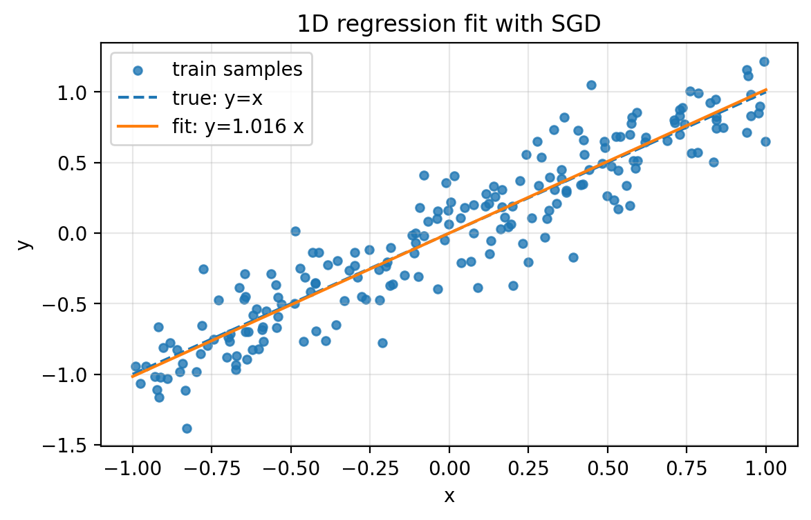
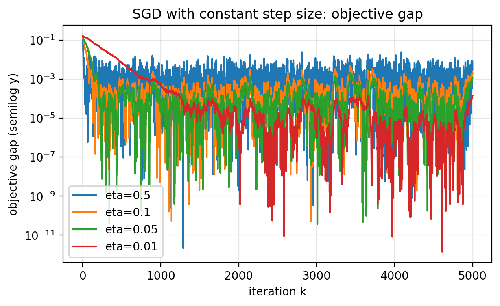
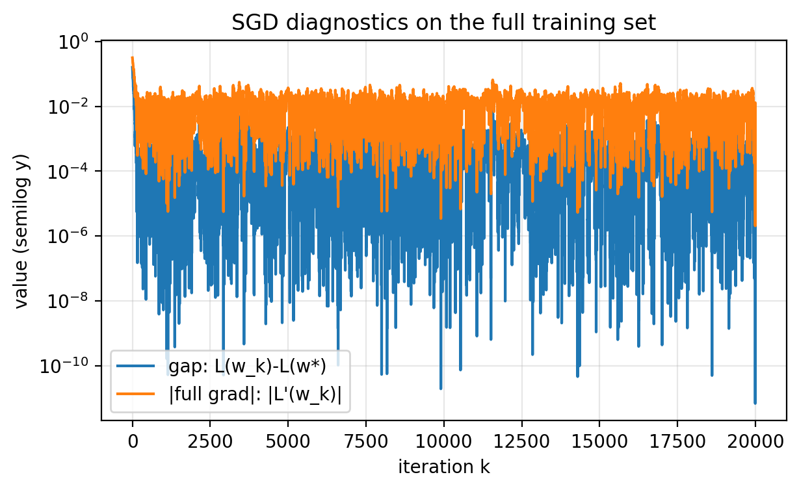
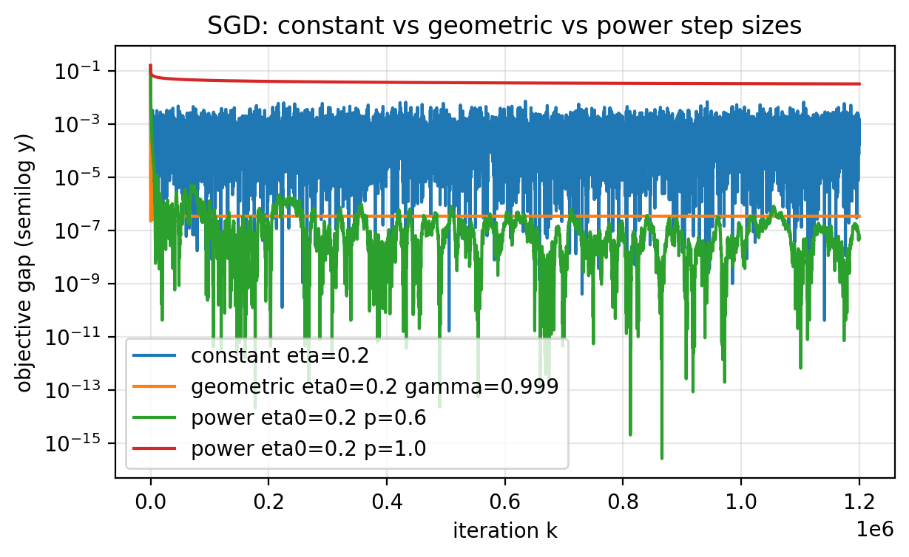
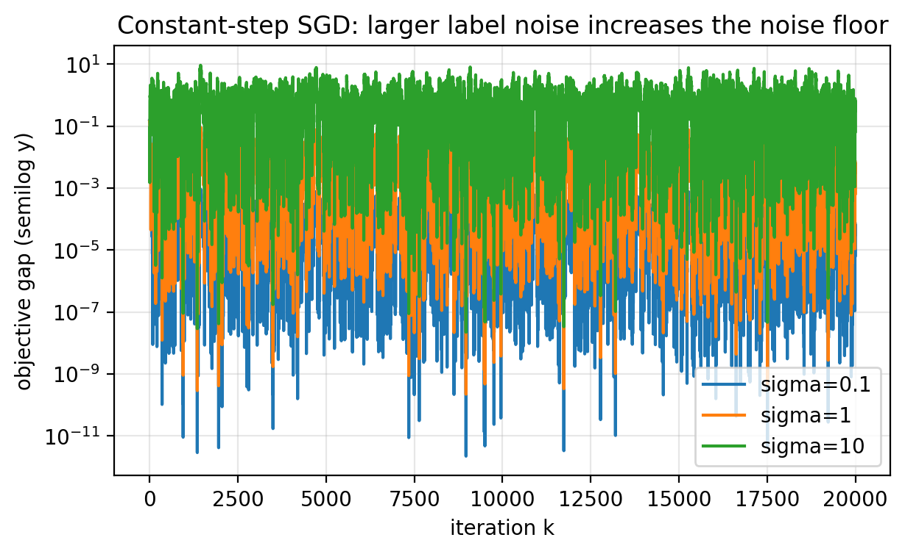
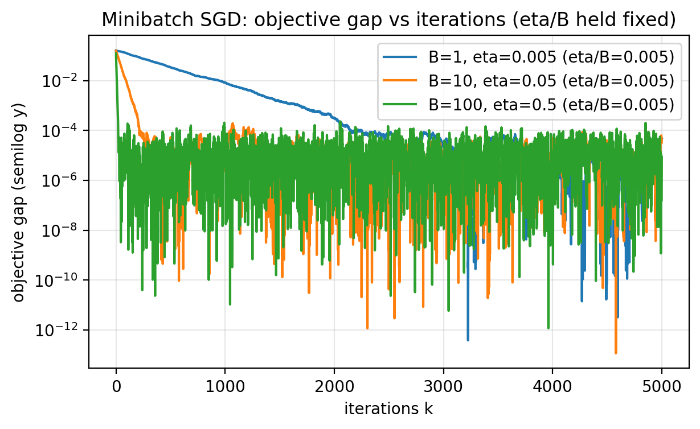
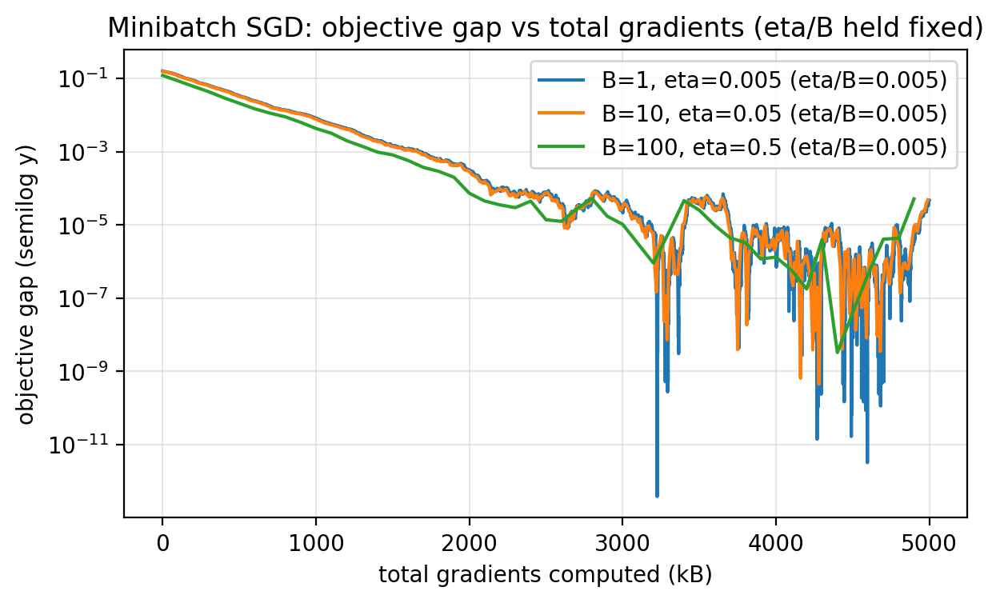

## Slide 1: Training as Optimization
**Purpose:** Frame the lecture as training by minimizing a loss.
- We have labeled data and want a rule that predicts future labels.
- We treat the model class as fixed and focus on training it.
- We work in 1D to keep the mechanism visible.

---

## Slide 2: Labeled Data
**Purpose:** Fix the training data notation.

**Formula:**

$$
(x_1,y_1),\ldots,(x_n,y_n)
$$

- Example: $x_i$ is an email and $y_i \in \{0,1\}$ is a spam label.

---

## Slide 3: What Is a Model?
**Purpose:** Define the object we are training.

**Formula:**

$$
m(x;w)
$$

- $w$ is the parameter (weights); here $w \in \mathbb{R}$.
- The same pipeline applies in higher dimensions.

---

## Slide 4: Model Class Choices
**Purpose:** Separate a single model from a class of models.
- We pick a class $\mathcal{M}$ and then search inside it.
- Extreme 1: a constant model that predicts the majority label.
- Extreme 2: a large parametric family (e.g., neural nets) with architecture choices.

---

## Slide 5: Three Questions
**Purpose:** Separate optimization, model selection, and generalization.
- Optimization: for a fixed model, how do we choose $w$?
- Learning: among $\mathcal{M}$, which trained model do we pick?
- Generalization: how well will the chosen model do on new data?

---

## Slide 6: Train-Validation-Test Split
**Purpose:** State the standard workflow.
- Training set: fit parameters $w$ for each candidate model.
- Validation set: choose hyperparameters (step size, batch size, architecture).
- Test set: estimate out-of-sample performance of the final choice.

---

## Slide 7: Test-Set Leakage
**Purpose:** Warn against treating the test set as untouchable.
- Repeatedly adapting to test performance turns it into validation.
- Kaggle-style third-party scoring still leaks signal if you iterate.
- In practice I often merge validation and test into a small holdout to maximize training data.

---

## Slide 8: Training Loss (Empirical Risk)
**Purpose:** Define the objective we minimize.

**Formula:**

$$
L(w) = \frac{1}{n}\sum_{i=1}^n \ell_i(w)
$$

- $\ell_i(w)$ is the per-sample loss.

---

## Slide 9: Training Objective
**Purpose:** State the optimization problem.

**Formula:**

$$
\min_{w \in \mathbb{R}} L(w)
$$

- Same objective as in Lecture 1; the new issue is scale.

---

## Slide 10: Full Gradient
**Purpose:** Show the cost of a full-batch step.

**Formula:**

$$
L'(w) = \frac{1}{n}\sum_{i=1}^n \ell_i'(w)
$$

- Computing $L'(w)$ touches all $n$ samples.

---

## Slide 11: Why Stochastic Methods
**Purpose:** Motivate SGD by scale.
- The cost of a full gradient scales linearly with $n$.
- For modern language models, $n$ can be on the order of trillions.
- Even a single full gradient can be too expensive.

---

## Slide 12: SGD Update
**Purpose:** State the stochastic update rule.

**Formula:**

$$
w_{k+1} = w_k - \eta\,\ell_{i_k}'(w_k)
$$

- $\eta>0$ is the step size.
- $i_k$ is sampled uniformly from $\{1,\ldots,n\}$.

---

## Slide 13: Sampling a Random Index (PyTorch)
**Purpose:** Show how to draw one sample index in code.
- Random index in $\{0,1,\ldots,n-1\}$.

```python
i_k = torch.randint(low=0, high=n, size=(1,)).item()
```

---

## Slide 14: Sampling a Minibatch (PyTorch)
**Purpose:** Show how to sample a batch with replacement.

```python
idx = torch.randint(low=0, high=n, size=(B,))
```

---

## Slide 15: Per-Step Cost
**Purpose:** Compare full-batch GD to SGD.
- Full-batch GD: one step costs $n$ sample gradients.
- SGD (batch size 1): one step costs 1 sample gradient.
- The key question is whether this cheaper update still makes progress.

---

## Slide 16: Synthetic Data for the Experiment
**Purpose:** Define the regression dataset.
- $x_i \sim \mathrm{Unif}[-1,1]$.
- $y_i = x_i + \sigma g_i$.
- $g_i \sim \mathcal{N}(0,1)$ independent.
- $\sigma$ controls label noise.

---

## Slide 17: Linear Model
**Purpose:** Fix the prediction rule.

**Formula:**

$$
\hat y = m(x;w) = wx
$$

---

## Slide 18: Per-Sample Loss
**Purpose:** Define the squared error.

**Formula:**

$$
\ell_i(w) = \tfrac{1}{2}(y_i - wx_i)^2
$$

---

## Slide 19: Per-Sample Derivative
**Purpose:** Compute the stochastic gradient.

**Formula:**

$$
\ell_i'(w) = (wx_i - y_i)x_i
$$

---

## Slide 20: SGD Update for This Problem
**Purpose:** Write the concrete 1D update.

**Formula:**

$$
w_{k+1} = w_k - \eta (w_k x_{i_k} - y_{i_k}) x_{i_k}
$$

---

## Slide 21: Closed-Form Minimizer (Diagnostics Only)
**Purpose:** Provide the reference solution for the toy problem.

**Formula:**

$$
w^\star = \frac{\sum_{i=1}^n x_i y_i}{\sum_{i=1}^n x_i^2}
$$

- In real ML this closed form usually does not exist.

---

## Slide 22: Objective Gap
**Purpose:** Define the diagnostic we will plot.
- Use $L(w_k)-L(w^\star)$ as the objective gap.
- This is only feasible because $w^\star$ is known here.

---

## Slide 23: What Success Looks Like
**Purpose:** See the fitted line on noisy data.


*Figure 2.1.*

---

## Slide 24: Constant Step Size Behavior
**Purpose:** Describe the noise-floor phenomenon.
- On noisy data, the objective drops quickly then stabilizes.
- Larger $\eta$ often reduces the loss faster at first.
- Smaller $\eta$ reaches a lower noise floor.

---

## Slide 25: Constant Step Size Tradeoff
**Purpose:** Visualize the noise floor across step sizes.


*Figure 2.2.*

---

## Slide 26: What "Noise Floor" Means
**Purpose:** Clarify the diagnostic.
- The floor is the rough level where the curve bottoms out on average.
- You still see sharp downward jumps.
- There is no sustained downward trend beyond that level.

---

## Slide 27: Full-Dataset Diagnostics
**Purpose:** Explain what we can log in the toy problem.
- Full training loss $L(w_k)$.
- Full gradient magnitude $\|L'(w_k)\|$.
- Use `torch.no_grad()` when computing these.
- At scale this is too expensive to do every step.
- You cannot detect and keep only the rare low-loss iterates.

---

## Slide 28: Diagnostics Plot
**Purpose:** Show objective gap and gradient norm together.


*Figure 2.3.*

---

## Slide 29: Convergent Step Size Schedules
**Purpose:** State the classical sufficient condition.

**Formula:**

$$
\sum_{k=0}^\infty \eta_k = \infty
\quad\text{and}\quad
\sum_{k=0}^\infty \eta_k^2 < \infty
$$

---

## Slide 30: Power Schedule
**Purpose:** Give a standard schedule that satisfies the condition.

**Formula:**

$$
\eta_k = \frac{\eta_0}{(k+1)^p}
\quad\text{with}\quad
p \in (\tfrac{1}{2},1]
$$

---

## Slide 31: Geometric Schedule
**Purpose:** Give a fast-decaying alternative.

**Formula:**

$$
\eta_k = \eta_0 \gamma^k
\quad\text{with}\quad
\gamma \in (0,1)
$$

- Often decays too quickly and progress freezes.

---

## Slide 32: Schedule Comparison
**Purpose:** Compare constant, geometric, and power schedules.


*Figure 2.4.*

---

## Slide 33: When Constant Steps Are Enough
**Purpose:** State a clean sufficient condition.

**Formula:**

$$
\ell_i'(w^\star)=0 \quad \text{for all } i
$$

- Each per-sample gradient vanishes at the optimum.

---

## Slide 34: Noiseless Regression Example
**Purpose:** Show a case where the condition holds.

**Formula:**

$$
y_i = x_i
$$

- Then $w^\star = 1$.

---

## Slide 35: Per-Sample Gradients Vanish
**Purpose:** See why SGD becomes deterministic.

**Formula:**

$$
\ell_i'(w) = (w-1)x_i^2
$$

- At $w=1$, each $\ell_i'(1)=0$.
- Even a constant step size like $\eta=0.5$ converges quickly here.

---

## Slide 36: Noiseless vs Noisy
**Purpose:** Contrast the two regimes.


*Figure 2.5.*

---

## Slide 37: Expressivity Context
**Purpose:** Explain when constant steps are common in practice.
- Classical ML models often cannot fit noisy data exactly.
- Deep nets can often interpolate noisy labels.
- Constant step sizes can be acceptable in highly expressive models.

---

## Slide 38: Unbiased Gradient Estimate
**Purpose:** Explain why SGD points in the right direction on average.

**Formula:**

$$
\mathbb{E}[X] = \frac{1}{n}\sum_{i=1}^n \ell_i'(w) = L'(w)
$$

- Here $X=\ell_i'(w)$ with $i$ uniform on $\{1,\ldots,n\}$.

---

## Slide 39: Expected Update
**Purpose:** Link SGD to gradient descent in expectation.

**Formula:**

$$
\mathbb{E}[w_{k+1}\mid w_k] = w_k - \eta L'(w_k)
$$

---

## Slide 40: Variance Controls the Noise Floor
**Purpose:** Explain what higher label noise does.
- Larger $\sigma$ increases the variance of sample gradients.
- Same step size leads to more jitter and a higher noise floor.
- Progress toward low error slows down.

---

## Slide 41: Effect of Label Noise
**Purpose:** Visualize variance effects.


*Figure 2.6.*

---

## Slide 42: Variance Reduction by Averaging
**Purpose:** State the basic probability fact.

**Formula:**

$$
\mathrm{Var}\Big(\frac{1}{B}\sum_{j=1}^B X_j\Big) = \frac{1}{B}\,\mathrm{Var}(X_1)
$$

---

## Slide 43: Minibatch Gradient Estimate
**Purpose:** Define the minibatch estimator.

**Formula:**

$$
G_k = \frac{1}{B}\sum_{i \in B_k} \ell_i'(w_k)
$$

- Sample a minibatch $B_k \subset \{1,\ldots,n\}$ of size $B$.
- Update: $w_{k+1} = w_k - \eta G_k$.

---

## Slide 44: Rule of Thumb for Noise
**Purpose:** Connect batch size and step size.
- The noise level scales like $\eta/B$.
- To match batch-1 noise, keep $\eta/B$ approximately constant.

---

## Slide 45: Two Ways to Measure Progress
**Purpose:** Separate iteration count from total gradient work.
- Iterations: $k$.
- Total gradients: $kB$.
- These two views can tell different stories.

---

## Slide 46: Minibatch vs Iterations
**Purpose:** Show iteration efficiency.


*Figure 2.7.*

---

## Slide 47: Minibatch vs Total Gradients
**Purpose:** Compare total gradient work.


*Figure 2.8.*

---

## Slide 48: Why Use Large Batches
**Purpose:** Motivate minibatches via parallelism.
- If $B$ gradients are computed in parallel, wall-clock time per step can stay near batch-1.
- Then fewer iterations can mean faster time-to-result.

---

## Slide 49: Validation Loss
**Purpose:** Monitor performance on new data.
- Training loss is not the goal; we care about new inputs.
- Define $L_{\mathrm{val}}(w)$ by averaging the same loss on a validation set.
- Evaluate periodically, not every iteration.
- Use `torch.no_grad()` during evaluation.

---

## Slide 50: Validation Loop (PyTorch)
**Purpose:** Show the evaluation pattern.

```python
# Assume we have training data (x_tr, y_tr) and validation data (x_va, y_va).
# Assume "step(w)" performs one SGD or minibatch-SGD update on training data.

eval_every = 200

for k in range(max_iters):
    w = step(w)

    if k % eval_every == 0:
        with torch.no_grad():
            train_loss = 0.5 * torch.mean((y_tr - w * x_tr)**2)
            val_loss = 0.5 * torch.mean((y_va - w * x_va)**2)

        print(f"k={k:6d}  train_loss={train_loss:.3e}  val_loss={val_loss:.3e}")
```

---

## Slide 51: Why Monitor Validation Loss
**Purpose:** State what validation diagnostics are for.
- Detect divergence early (step size too large).
- Choose among hyperparameters (step size, schedule, batch size).
- Stop when validation loss plateaus.
- Validation loss is optimistic because you tune against it.

---

## Slide 52: Conclusion: Core Points
**Purpose:** Capture the main takeaways.
- Training a model is empirical risk minimization.
- Full gradients cost $n$ sample gradients; SGD uses 1 per step.
- Constant-step SGD on noisy data stabilizes at a noise floor.
- Step size schedules that decrease can drive error lower but can be slow.
- Unbiasedness points in the right direction; variance makes progress noisy.

---

## Slide 53: Conclusion: Practical Points
**Purpose:** Capture the practical takeaways.
- Minibatches reduce variance by averaging gradients and improve iteration efficiency.
- Fair comparisons must account for total gradient computations and parallelism.
- Diagnostics should include validation loss, not just training loss.
- These insights carry over to higher-dimensional models.
