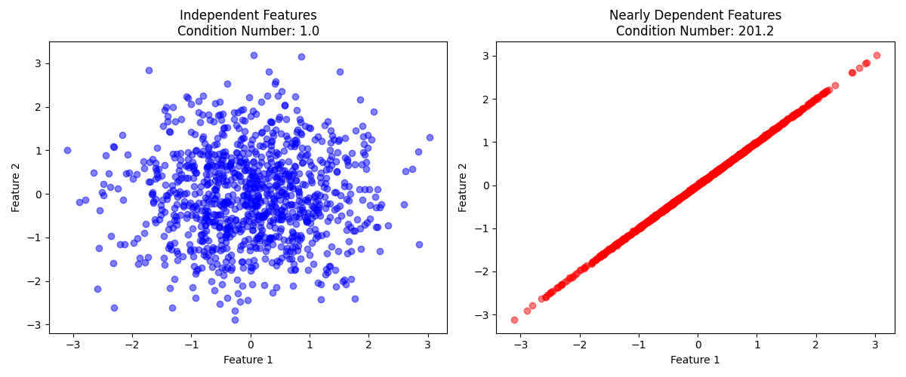

<br><br> <br><br> 

# STAT 4830: Numerical optimization for data science and ML
## Lecture 2: Linear Regression: Direct Methods
### Professor Damek Davis

---

# Overview

1. Introduction
2. Prediction with Multiple Features
3. Computing Predictions Efficiently
4. Finding Optimal Weights
5. Direct Solution Methods
6. Effect and Remedy for Numerical Instability
7. QR Factorization: A More Stable Approach
8. The Limits of Direct Methods: Scaling Up

---

# Introduction

Last lecture: PyTorch's efficient handling of vectors and matrices
Today: Applying these tools to prediction - a core data science challenge

Four key steps:
1. Converting predictions into matrix operations
2. Formulating the optimization problem
3. Converting optimization into linear equations
4. Solving equations efficiently via direct methods

---

# Prediction with Multiple Features

Basic house price equation:
$$ \text{price} = w_1 \cdot \text{size} + w_2 \cdot \text{age} + w_3 \cdot \text{bedrooms} + w_4 \cdot \text{location} + \text{noise} $$

Vector notation:
$$ y = w^T x + \epsilon $$

Each weight has clear meaning:
- $w_1$: dollars per square foot
- $w_2$: price change per year of age
- $w_3$: value per bedroom
- $w_4$: location premium

---

# Feature Mapping and Error Analysis


Why linear models often work:
- Linear relationships in real data
- Scatter represents noise/unexplained factors
- Simple but powerful approximation

---

# Code Example: House Price Prediction

```python
house = {
    'size': 1500,     # x₁: sq ft
    'age': 10,        # x₂: years
    'bedrooms': 3,    # x₃: count
    'location': 0.8   # x₄: some score
}
price = 500000  # y: dollars

def predict_price(house, weights):
    """Predict house price using linear combination of features"""
    return (
        weights[0] * house['size'] +      # dollars per sq ft
        weights[1] * house['age'] +       # price change per year
        weights[2] * house['bedrooms'] +  # value per bedroom
        weights[3] * house['location']    # location premium
    )
```

---

# Testing Our Model

```python
X = torch.tensor([
    [1500, 10, 3, 0.8],  # house 1
    [2100, 2,  4, 0.9],  # house 2
    [800,  50, 2, 0.3]   # house 3
], dtype=torch.float32)
y = torch.tensor([500000, 800000, 250000], dtype=torch.float32)
weights = torch.tensor([200, -1000, 50000, 100000], dtype=torch.float32)

predictions = X @ weights  # Matrix multiplication!

# Results:
# House 1: $520,000 (Error: +4.0%)
# House 2: $708,000 (Error: -11.5%)
# House 3: $240,000 (Error: -4.0%)
```

---

# Prediction Errors


Our model's performance:
- Errors range from 4% to 12%
- Systematic patterns?
- Can we do better?

---

# Computing Predictions Efficiently

Matrix multiplication for all predictions:
$$ \text{house}_1: [1500, 10, 3, 0.8] \cdot [w_1, w_2, w_3, w_4] = \text{prediction}_1 $$
$$ \text{house}_2: [2100, 2, 4, 0.9] \cdot [w_1, w_2, w_3, w_4] = \text{prediction}_2 $$
$$ \text{house}_3: [800, 50, 2, 0.3] \cdot [w_1, w_2, w_3, w_4] = \text{prediction}_3 $$

Feature matrix:
$$ X = \begin{bmatrix} 
\text{size}_1 & \text{age}_1 & \text{beds}_1 & \text{loc}_1 \\
\text{size}_2 & \text{age}_2 & \text{beds}_2 & \text{loc}_2 \\
\text{size}_3 & \text{age}_3 & \text{beds}_3 & \text{loc}_3
\end{bmatrix} = \begin{bmatrix}
1500 & 10 & 3 & 0.8 \\
2100 & 2 & 4 & 0.9 \\
800 & 50 & 2 & 0.3
\end{bmatrix} $$

---

# Performance Impact

```
Dataset Size | Loop Time  | Matrix Time | Speedup
------------------------------------------------
     1,000   |   0.21ms  |    0.01ms   |   21x
    10,000   |   1.79ms  |    0.05ms   |   34x
   100,000   |  19.39ms  |    0.58ms   |   33x
 1,000,000   | 196.33ms  |    5.43ms   |   36x
```

Why so fast?
- CPU's SIMD instructions
- Cache-friendly memory access
- Optimized BLAS libraries
- Critical for iterative methods later!

---

# Finding Optimal Weights

Error function:
$$ \text{error} = \sum_{i=1}^n (y_i - w^T x_i)^2 $$

Partial derivatives:
$$ \frac{\partial}{\partial w_j} \text{error} = -2\sum_{i=1}^n x_{ij}(y_i - w^T x_i) = 0 $$

Matrix form:
$$ -2X^T(y - Xw) = 0 $$
$$ X^TXw = X^Ty $$

---
# Finding Optimal Weights: The Math in 1D

Remember our 10% error on house prices? Let's discover why calculus and linear algebra together give us a direct path to the best weights.

Simple example with two houses:
- House 1: 1000 sq ft → 300k dollars
- House 2: 2000 sq ft → 600k dollars

Notice: When size doubles (1000 → 2000), price doubles too (300k → 600k)

--- 
# Finding Optimal Weights in 1D

Error for a given weight $w$ (price per sq ft, in $k$):

$$ \text{error}(w) = (300 - 1000w)^2 + (600 - 2000w)^2 $$

To minimize: Set derivative to zero and solve
$$ -2(1000)(300 - 1000w) - 2(2000)(600 - 2000w) = 0 $$

Collecting terms:
$$ (1000^2 + 2000^2)w = 1000(300) + 2000(600) $$

In terms of data matrix:
$$ X^TXw = X^Ty $$

---

# More Generally: Calculus → Lin Alg

For multiple features, we minimize:
$$ \text{error} = \sum_{i=1}^n (y_i - w^T x_i)^2 $$

Taking partial derivatives:
$$ \frac{\partial}{\partial w_j} \text{error} = -2\sum_{i=1}^n x_{ij}(y_i - w^T x_i) = 0 $$

In matrix form:
$$ -2X^T(y - Xw) = 0 $$
$$ X^TXw = X^Ty $$

---

# The Normal Equations

> Calculus turns "minimize prediction error" into "solve the **normal equations**"

$$  X^TXw = X^Ty $$

$$ X^TX = \begin{bmatrix} 
\mathbf{size} \cdot \mathbf{size} & \mathbf{size} \cdot \mathbf{age} & \mathbf{size} \cdot \mathbf{beds} \\
\mathbf{age} \cdot \mathbf{size} & \mathbf{age} \cdot \mathbf{age} & \mathbf{age} \cdot \mathbf{beds} \\
\mathbf{beds} \cdot \mathbf{size} & \mathbf{beds} \cdot \mathbf{age} & \mathbf{beds} \cdot \mathbf{beds}
\end{bmatrix} $$

These equations have beautiful properties:
1. One equation per weight
2. Linear in the weights
3. Error vector $(X w_\star - y)$ at solution $w_\star$ becomes orthogonal to $X$

---

# The Normal Equations

> Calculus turns minimizing prediction error into solving linear equations

$$ X^TXw = X^Ty $$

System size depends on features, not data:
- $n$ houses, $p$ features
- $X$ is $n \times p$
- $X^TX$ is $p \times p$
- Even with millions of houses, system stays small!


---

# Structure of Normal Equations

When we multiply $X^TX$, each entry combines feature vectors:

$$ A = X^TX = \begin{bmatrix} 
\mathbf{size} \cdot \mathbf{size} & \mathbf{size} \cdot \mathbf{age} & \mathbf{size} \cdot \mathbf{beds} \\
\mathbf{age} \cdot \mathbf{size} & \mathbf{age} \cdot \mathbf{age} & \mathbf{age} \cdot \mathbf{beds} \\
\mathbf{beds} \cdot \mathbf{size} & \mathbf{beds} \cdot \mathbf{age} & \mathbf{beds} \cdot \mathbf{beds}
\end{bmatrix} $$

Properties:
- Diagonal entries sum squares (always positive)
- Off-diagonal entries show feature correlations
---
# Direct Solution Methods

Remember our plan:
1. Convert predictions into matrix operations ✓
2. Formulate optimization problem ✓
3. Convert to linear equations ✓
4. **Solve equations efficiently** ← We are here!

Today: Three methods for solving normal equations:
> Gaussian elimination, LU factorization, and QR factorization

---

# Direct Solution Methods


Example with three features:
```python
X = torch.tensor([
    [1500, 10, 3],    # house 1: size, age, bedrooms
    [2100, 2,  4],    # house 2
    [800,  50, 2],    # house 3
    [1800, 15, 3]     # house 4
])
y = torch.tensor([500000, 800000, 250000, 550000])
```

The normal equations $(X^TX)w = X^Ty$ give us a system $Aw = b$ where:
- $A = X^TX$ is square matrix (3 × 3)
- $b = X^Ty$ combines features and prices


---

# Key considerations:
- Computational Efficiency
> (1) measured by number of arithmetic operations, (2) critical for large systems, (3) affects running time directly
- Numerical Stability
> (1) how measurement errors get amplified, (2) critical when features are correlated, (3) can make fast methods unreliable


---

# Cost Analysis of Direct Methods

Two main costs:
1. Formation: Computing $X^TX$ and $X^Ty$
2. Solution: Solving the resulting system

With $n$ houses and $p$ features:
- Computing $X^TX$: $np^2$ operations ($p^2$ dot products of size $n$ vectors)
- Computing $X^Ty$: $np$ operations ($p$ dot products of size $n$ vectors)
- Solving $p \times p$ system: $\frac{2p^3}{3}$ operations (gaussian elimination)

---

# Cost Analysis of Direct Methods

Which dominates depends on problem size:
```python
# Many houses, few features: Formation dominates
n, p = 1000, 10  # 1000 houses, 10 features
formation_cost = n * p**2  # 100,000 operations
solution_cost = (2 * p**3) // 3  # ~667 operations

# Many houses, many features: Both costs significant
n, p = 1000, 100  # Same houses, more features
formation_cost = n * p**2  # 10 million operations
solution_cost = (2 * p**3) // 3  # ~667,000 operations

# Few houses, many features: Solution dominates!
n, p = 50, 200  # 50 houses, 200 features
formation_cost = n * p**2  # 2 million operations
solution_cost = (2 * p**3) // 3  # ~5.3 million operations
```

---

# Cost Analysis of Direct Methods
Key insights:
- n >> p: Formation cost dominates
- n ≈ p: Both costs matter
- n << p: Solution cost dominates

> Now let's recall a method you all know from lin alg: Gaussian elimination


---
# Gaussian Elimination Steps

Gaussian elimination solves equations by systematically removing variables. The idea is simple: 
> use one equation to eliminate a variable from the others, then repeat. 

We'll create zeros below the diagonal one column at a time, turning our system into an equivalent triangular form that's easy to solve by back-substitution.

---

# Gaussian Elimination Steps

Step 1: First Elimination
*Goal*: Create zeros in first column below $a_{11}$

*Compute multipliers*:
$$ m_{21} = \displaystyle\frac{a_{21}}{a_{11}} \quad \text{and} \quad m_{31} = \displaystyle\frac{a_{31}}{a_{11}} $$

*After row operations*:
$$ \begin{array}{c|c}
\begin{matrix} 
a_{11} & a_{12} & a_{13} \\[0.7em]
0 & a_{22}' & a_{23}' \\[0.7em]
0 & a_{32}' & a_{33}'
\end{matrix} &
\begin{matrix}
b_1 \\[0.7em]
b_2' \\[0.7em]
b_3'
\end{matrix}
\end{array} \qquad \text{(24 operations: 12 multiplications, 12 subtractions)} $$

---

# Gaussian Elimination: Step 2

Step 2: Second Elimination
*Goal*: Create zero in second column below $a_{22}'$

*Compute multiplier*:
$$ m_{32} = \displaystyle\frac{a_{32}'}{a_{22}'} $$

*After row operations*:
$$ \begin{array}{c|c}
\begin{matrix} 
a_{11} & a_{12} & a_{13} \\[0.7em]
0 & a_{22}' & a_{23}' \\[0.7em]
0 & 0 & a_{33}''
\end{matrix} &
\begin{matrix}
b_1 \\[0.7em]
b_2' \\[0.7em]
b_3''
\end{matrix}
\end{array} \qquad \text{(8 operations: 4 multiplications, 4 subtractions)} $$

---

# Gaussian Elimination: Back-substitution

Step 3: Back-substitution
$$ \begin{aligned}
w_3 &= \displaystyle\frac{b_3''}{a_{33}''} && \text{(1 division)} \\[0.7em]
w_2 &= \displaystyle\frac{b_2' - a_{23}'w_3}{a_{22}'} && \text{(2 ops + 1 division)} \\[0.7em]
w_1 &= \displaystyle\frac{b_1 - a_{12}w_2 - a_{13}w_3}{a_{11}} && \text{(4 ops + 1 division)}
\end{aligned} $$

Total operations:
- 6 divisions
- 19 multiplications
- 19 additions/subtractions

--- 
# Cost in general 

For our 3×3 system, we needed 6 divisions, 19 multiplications, and 19 additions or subtractions. Looking at how these counts arise reveals the pattern: 
> each elimination step processes one column, requiring operations proportional to the size of the remaining matrix. For an $p\times p$ system, this pattern leads to approximately $\frac{2p^3}{3}$ operations for elimination and another $\frac{p^2}{2}$ for back-substitution.

---


# LU Factorization

Imagine this scenario:
- You've just computed optimal weights for 1000 houses
- Then 100 new houses sell, with different prices
- Market conditions shift existing home values
- Seasonal patterns affect current listings
 
Each change means new optimal weights. Can we avoid redoing all our work?

LU factorization is 
> a clever way to reorganize Gaussian elimination that becomes especially valuable when we need to update our predictions with new house prices. Instead of solving the entire system again, we'll see how to reuse much of our previous work.

---

# LU Factorization

LU factorization is a factorization of the A into upper and lower triangular matrices:
$$ A = LU = \begin{bmatrix} 
1 & 0 & 0 \\
m_{21} & 1 & 0 \\
m_{31} & m_{32} & 1
\end{bmatrix}
\begin{bmatrix}
u_{11} & u_{12} & u_{13} \\
0 & u_{22} & u_{23} \\
0 & 0 & u_{33}
\end{bmatrix} $$

It is highly useful for solving linear equations, as we will see.

---

# Solving with LUw = b

1. Forward substitution ($Lv = b$), where ($v = Uw$):
$$ \begin{aligned}
v_1 &= b_1 \\
v_2 &= b_2 - m_{21}v_1 \\
v_3 &= b_3 - m_{31}v_1 - m_{32}v_2
\end{aligned} $$

2. Back substitution ($Uw = y$):
$$ \begin{aligned}
w_3 &= y_3/u_{33} \\
w_2 &= (y_2 - u_{23}w_3)/u_{22} \\
w_1 &= (y_1 - u_{12}w_2 - u_{13}w_3)/u_{11}
\end{aligned} $$

---

# LU Factorization: The Process

Step 1: Create zeros in first column
$$ \begin{bmatrix}
a_{11} & a_{12} & a_{13} \\[0.7em]
\times & a_{22} & a_{23} \\[0.7em]
\times & a_{32} & a_{33}
\end{bmatrix} \rightarrow
\begin{bmatrix}
a_{11} & a_{12} & a_{13} \\[0.7em]
0 & a_{22}' & a_{23}' \\[0.7em]
0 & a_{32}' & a_{33}'
\end{bmatrix} $$

Multipliers:
$$ m_{21} = \frac{a_{21}}{a_{11}} \quad \text{and} \quad m_{31} = \frac{a_{31}}{a_{11}} $$

---

# LU Factorization: Recording Our Work

After first column elimination:
- $a_{22}' = a_{22} - m_{21}a_{12}$ 
- $a_{23}' = a_{23} - m_{21}a_{13}$
- $a_{32}' = a_{32} - m_{31}a_{12}$
- $a_{33}' = a_{33} - m_{31}a_{13}$

$$ A = \begin{bmatrix}
a_{11} & a_{12} & a_{13} \\[0.7em]
a_{21} & a_{22} & a_{23} \\[0.7em]
a_{31} & a_{32} & a_{33}
\end{bmatrix} = 
\begin{bmatrix}
1 & 0 & 0 \\[0.7em]
m_{21} & 1 & 0 \\[0.7em]
m_{31} & 0 & 1
\end{bmatrix} \times
\begin{bmatrix}
a_{11} & a_{12} & a_{13} \\[0.7em]
0 & a_{22}' & a_{23}' \\[0.7em]
0 & a_{32}' & a_{33}'
\end{bmatrix} $$

Next step: eliminate $a_{32}'$ using $m_{32} = a_{32}'/a_{22}'$

---

# LU Factorization: Recording Our Work 

After second column elimination:
- $m_{32} = a_{32}'/a_{22}'$
- $a_{33}'' = a_{33}' - m_{32}a_{23}'$

$$ A = \underbrace{\begin{bmatrix}
1 & 0 & 0 \\[0.7em]
m_{21} & 1 & 0 \\[0.7em]
m_{31} & m_{32} & 1
\end{bmatrix}}_{\text{$L$ (elimination history)}} \times
\underbrace{\begin{bmatrix}
a_{11} & a_{12} & a_{13} \\[0.7em]
0 & a_{22}' & a_{23}' \\[0.7em]
0 & 0 & a_{33}''
\end{bmatrix}}_{\text{$U$ (eliminated system)}} $$


---

# LU Factorization: Why It's Useful

When market conditions change:
- Features ($X$) stay the same
- Only prices ($y$) change
- $A = X^TX$ remains unchanged
- Can reuse $L$ and $U$!

Example with daily updates for a year:
```
Operation        Without LU    With LU
First solution   677K ops      677K ops
365 updates      247M ops     3.7M ops
Savings                       98.5%
```

---

# LU Factorization: Implementation

```python
def solve_with_lu(X, y):
    """Initial solution with LU factorization"""
    # Form normal equations
    XtX = X.T @ X
    Xty = X.T @ y
    
    # Factor once
    L, U = torch.lu(XtX)
    
    # Solve two triangular systems
    y = torch.triangular_solve(Xty, L, upper=False)[0]
    w = torch.triangular_solve(y, U)[0]
    return w, L, U

def update_solution(L, U, X, y_new):
    """Fast update when only prices change"""
    Xty = X.T @ y_new
    y = torch.triangular_solve(Xty, L, upper=False)[0]
    return torch.triangular_solve(y, U)[0]
```

---

# LU Factorization: A Hidden Weakness

LU factorization is fast for updates, but inherits a critical issue:
- Still based on normal equations $(X^TX)w = X^Ty$
- Correlated features create unstable systems
- Small measurement errors → large weight changes

What happens when features tell almost the same story?
```python
# Square footage and rooms are highly correlated
X = torch.tensor([
    [1500, 6],    # 1500 sq ft ≈ 6 rooms
    [2000, 8],    # 2000 sq ft ≈ 8 rooms
    [1800, 7]     # 1800 sq ft ≈ 7 rooms
])
```
---

# Matrix Stretching: The Simple Case

When we multiply by a matrix, it stretches some directions more than others.

Simple example (diagonal matrix):
$$ D = \begin{bmatrix} 
100 & 0 \\
0 & 0.1
\end{bmatrix} $$

What happens when we multiply by $D$?
- Horizontal vector $[1, 0]$ gets stretched by 100
- Vertical vector $[0, 1]$ gets shrunk to 0.1
- Ratio of stretching: 100/0.1 = 1000

This is our condition number!

---

# Matrix Stretching: The General Case

For non-diagonal matrices, stretching is harder to see:
$$ A = \begin{bmatrix}
1 & 1 \\
1 & 1.001
\end{bmatrix} $$

But SVD reveals the hidden stretching:
$$ A = U\Sigma V^T $$

where:
- $U, V$: change of basis (orthogonal matrices)
- $\Sigma$: diagonal matrix showing stretching
- $\kappa(A) = \sigma_{\max}/\sigma_{\min}$

---

# SVD Example

For our nearly dependent matrix:
$$ A = \begin{bmatrix}
1 & 1 \\
1 & 1.001
\end{bmatrix} = U\Sigma V^T $$

Computing SVD:
```python
A = torch.tensor([[1.0, 1.0], [1.0, 1.001]])
U, S, Vt = torch.linalg.svd(A)
print(f"Singular values: {S}")  
# [2.001, 0.001]  # Big stretch vs tiny stretch!
```

Condition number: 2.001/0.001 ≈ 2001

---

# Why X^TX Squares the Condition Number

Using SVD of $X = U\Sigma V^T$:

$$ X^TX = (U\Sigma V^T)^T(U\Sigma V^T) = V\Sigma^T\Sigma V^T $$

The diagonal entries of $\Sigma^T\Sigma$ are squares:
- If $X$ has singular values $[\sigma_1, \sigma_2]$
- Then $X^TX$ has singular values $[\sigma_1^2, \sigma_2^2]$
- Condition number gets squared!

Example:
- $X$: κ ≈ 2001
- $X^TX$: κ ≈ 4,004,001

---

# Understanding the Problem Geometrically

Now we can understand our feature plots:

<div style="text-align: center">

</div>

<div style="display: grid; grid-template-columns: 1fr 1fr; gap: 40px;">
<div>

**Left: Independent features**
- Nearly equal stretching
- κ(X) ≈ 1.0
- Well-conditioned

</div>
<div>

**Right: Nearly dependent features**
- Very uneven stretching
- κ(X) ≈ 201.2
- Ill-conditioned

</div>
</div>

---

# The Squaring Effect

Critical issue: Normal equations square the condition number!

$$ \text{κ}(X^TX) = \text{κ}(X)^2 $$

> it's easy to see this with the SVD: 

Example impact:
- Independent features: 
  * κ(X) ≈ 1.0 → κ(X^TX) ≈ 1.1
  * Stays well-conditioned

- Nearly dependent features:
  * κ(X) ≈ 201.2 → κ(X^TX) ≈ 40,580.2
  * Becomes extremely ill-conditioned!

---

# Seeing Instability in Action

```python
# Add a small perturbation (0.0001% noise)
X_perturbed = X * (1 + torch.randn(*X.shape) * 1e-6)

# Solve both systems using normal equations
def solve_normal_equations(X, y):
    XtX = X.T @ X
    Xty = X.T @ y
    return torch.linalg.solve(XtX, Xty)

# Create target that depends only on x1
y = x1 + torch.randn(n) * 0.1

w1 = solve_normal_equations(X, y)
w2 = solve_normal_equations(X_perturbed, y)
```

---

# The Results Are Striking

Original vs Perturbed Weights:
```python
print("Original weights:", w1)     # [1.1, -0.1]
print("Perturbed weights:", w2)    # [1.8, -0.8]
```

Key observations:
- Individual weights change by ~80%
- But predictions barely change at all (<0.1%)
- Small data changes → large weight changes
- Yet predictions remain stable

---

# Understanding Why This Happens

When features are nearly dependent:

1. Many different weight combinations give similar predictions
   - Like different ways to split a restaurant bill
   - Total is the same, individual contributions vary

2. Tiny data changes cause large swings
   - Small noise pushes solution between valid options
   - Like slightly changing bill total

3. Normal equations amplify this effect
   - Squaring condition number makes it worse
   - Small uncertainties become large uncertainties

---

# Key Takeaways

1. Watch for correlated features
   - Look for "skinny" clouds in feature plots
   - Check condition numbers if available

2. Be careful with normal equations
   - They square the condition number
   - Make ill-conditioning much worse

3. Consider alternatives
   - QR factorization (coming next)
   - Regularization (future lectures)
   - Feature selection/engineering

---

# QR Factorization: A Better Way

Instead of forming $X^TX$, decompose $X$ directly:
$$ X = QR $$

where:
- $Q$: orthogonal matrix (perpendicular columns)
- $R$: upper triangular matrix

Clean implementation:
```python
def solve_regression(X, y):
    """Solve linear regression using QR factorization"""
    Q, R = torch.qr(X)
    return torch.triangular_solve(Q.T @ y, R)[0]
```

---

# Properties of QR

$Q$ has special properties:
- Columns are perpendicular (orthogonal)
- Each column has length 1 (normalized)
- $Q^TQ = I$ (identity matrix)

Check orthogonality:
```python
print("Q^T @ Q =\n", Q.T @ Q)

# Output:
# tensor([[1.0000, 0.0000, 0.0000],
#         [0.0000, 1.0000, 0.0000],
#         [0.0000, 0.0000, 1.0000]])
```

---

# Solving with QR

Original problem: $Xw = y$

With QR: $(QR)w = y$

Multiply both sides by $Q^T$:
$$ \begin{aligned}
Q^T(QRw) &= Q^Ty \\
(Q^TQ)Rw &= Q^Ty \\
IRw &= Q^Ty \\
Rw &= Q^Ty
\end{aligned} $$

Beautiful! We get triangular system without forming $X^TX$

---

# QR vs Normal Equations

Comparison:
1. Stability
   - QR: Inherits X's condition number
   - Normal Equations: Squares condition number

2. Cost
   - QR: ~2np² operations
   - Normal Equations: ~np² operations

3. Updates
   - QR: Need full recomputation
   - Normal Equations: Can reuse factorization

Rule of thumb:
- Well-conditioned: Both work fine
- Ill-conditioned: Use QR
- Need fast updates: Consider normal equations

---

# The Limits of Direct Methods

Direct methods face hard constraint:
- Must complete entire computation before any solution
- Minutes of waiting for large problems
- Impractical for massive applications

This motivates iterative methods:
- Produce increasingly accurate predictions over time
- Trade perfect accuracy for faster results
- Essential for massive datasets

We'll explore these methods next lecture!