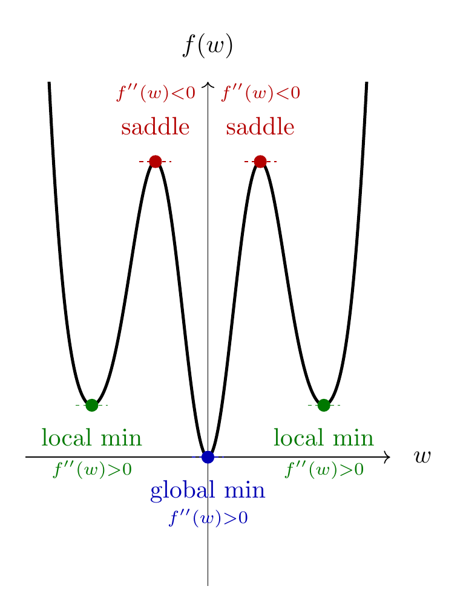

<br><br> <br><br> 

# STAT 4830: Numerical optimization for data science and ML
## Lecture 3: Linear Regression - Gradient Descent
### Professor Damek Davis

---

# The Memory Wall

Consider genomic prediction: 1000 patients, 100,000 genetic markers

```python
n_samples = 1000
n_markers = 100_000
memory_needed = (n_markers * n_markers * 8) / (1024**3)  # in GB
print(f"Memory needed for X^TX: {memory_needed:.1f} GB")  # 80.0 GB
```

Just forming $X^\top X$ would exceed most workstations' memory!

---

# Even Worse: Medical Imaging

MRI reconstruction with $256^3$ voxels:

- Matrix size: $256^3 \times 256^3$
- Memory for $X^\top X$: 2.2 petabytes
- That's 0.2% of world's total data center storage in 2023!

These aren't edge cases - they're routine analysis tasks.

---

# Why Direct Methods Fail

Direct methods solve normal equations $X^\top X w = X^\top y$:

```python
# Direct method (fails for large p)
XtX = X.T @ X           # Form p × p matrix
Xty = X.T @ y          # Form p × 1 vector
w = solve(XtX, Xty)    # Solve p × p system
```

Costs:
1. Forming $X^\top X$: $O(np^2)$ operations, $O(p^2)$ memory
2. Forming $X^\top y$: $O(np)$ operations, $O(p)$ memory
3. Solving system: $O(p^3)$ operations

---

# Experimental Results: Memory Wall

Results on MacBook M1 Pro (64GB RAM):

```
Size (p)    Memory for X^TX    Time      Status
1,000       8MB               0.005s    Fast, fits in fast memory
5,000       200MB            0.182s    Fits in RAM
20,000      3.2GB            5.209s    RAM stressed
50,000      20GB             FAILS     Out of memory
```

Memory becomes bottleneck before computation time!

---

# Experimental Results: Scaling Behavior


The pattern is clear: memory becomes the bottleneck long before computation time!

---

# A Memory-Efficient Alternative

One memory-efficient alternative is gradient descent:

```python
# This forms a huge p × p matrix (bad)
XtX = X.T @ X           # Need O(p²) memory
result = XtX @ w        # Matrix-vector product

# Gradient descent uses operations like these:
Xw = X @ w             # Need O(p) memory
result = X.T @ Xw      # Another O(p) operation
```

Both compute $(X^\top X)w$, but gradient descent:
- Never forms the $p \times p$ matrix
- Uses $O(np)$ operations (same as first approach)
- Only needs $O(p)$ extra memory for vectors

---

# The Algorithm

```python
# Gradient descent with matrix-vector products
w = torch.zeros(p)           # Initial guess
for k in range(max_iters):
    Xw = X @ w              # Forward pass: O(np)
    grad = X.T @ (Xw - y)   # Backward pass: O(np)
    w -= step_size * grad   # Update: O(p)
```

The memory efficiency comes from iteratively updating our solution:
1. Start with an initial guess (even all zeros)
2. Compute the gradient using matrix-vector products
3. Take a small step in that direction
4. Repeat until convergence

---

# Convergence Behavior: The Pattern

Our experiments with random matrices reveal a fascinating pattern:


---

# Convergence Behavior: Key Insights

Two fundamental properties emerge:

1. **Linear Convergence**: 
   - Error decreases exponentially
   - Appears as straight line on log scale
   - Predictable rate of improvement

2. **Precision vs Time**: 
   - Each doubling of iterations improves precision by ~$10^4$
   - Can estimate iterations needed for desired accuracy
   - Consistent behavior across problem sizes

---

# The Least Squares Landscape

Our objective measures squared prediction error:

$$ f(w) = \frac{1}{2}\|Xw - y\|_2^2 = \frac{1}{2}(Xw - y)^\top(Xw - y) $$

Expanding reveals the quadratic structure:
$$ f(w) = \frac{1}{2}(w^\top X^\top X w - 2y^\top X w + y^\top y) $$

Each term has meaning:
- $w^\top X^\top X w = \|Xw\|^2$: size of predictions
- $2y^\top X w$: alignment with truth
- $y^\top y$: scale of target values

---

# Finding the Best Direction

The gradient has a beautiful form:

$$ \begin{aligned}
\frac{\partial f}{\partial w_j} &= \sum_{i=1}^n (x_i^\top w - y_i)x_{ij} \\
\nabla f(w) &= X^\top(Xw - y) = X^\top X w - X^\top y
\end{aligned} $$

This tells us:
- $Xw-y$ is prediction error in output space
- $X^\top$ projects error back to parameter space
- Direction tells us how to adjust each parameter

---

# The Optimization Problem

At any point $w$, we want the direction $v$ that decreases $f$ most rapidly:

$$ \mathrm{minimize} \quad \nabla f(w)^\top v \quad \mathrm{subject \ to} \quad \|v\| = 1 $$

By Cauchy-Schwarz inequality:
$$ |\nabla f(w)^\top v| \leq \|\nabla f(w)\| \|v\| = \|\nabla f(w)\| $$

The solution is:
$$ v_\star = -\frac{\nabla f(w)}{\|\nabla f(w)\|} $$

---

# The Geometry of Steepest Descent


---

# Critical Points and Their Types



---

# Stepsize Selection: The Theory

Convergence is guaranteed when:

$$ 0 < \alpha_k < \frac{2}{\lambda_{\max}(X^\top X)} $$

Why this bound?
- Level sets become very narrow in some directions
- Width determined by eigenvalues of $X^\top X$
- Too large a step overshoots the minimum

---

# Stepsize Selection: The Geometry


---

# Implementation

```python
def gradient_descent(X, y, n_steps=100, step_size=0.01):
    # Initialize weights
    w = torch.zeros(X.shape[1])
    
    # Cache X^T y (constant throughout)
    Xty = X.T @ y
    
    # Track relative loss
    f_init = 0.5 * ((X @ w - y)**2).sum()
    losses = []
    
    for step in range(n_steps):
        # Compute gradient efficiently
        Xw = X @ w
        grad = X.T @ (Xw - y)
        
        # Update weights
        w = w - step_size * grad
        
        # Track progress
        f_curr = 0.5 * ((X @ w - y)**2).sum()
        rel_loss = f_curr/f_init
        losses.append(rel_loss.item())
    
    return w, losses
```

---

# Effect of Condition Number: Well-Conditioned


---

# Effect of Condition Number: Poorly-Conditioned

- Well-conditioned ($\kappa=2$): Direct path to minimum
- Poorly-conditioned ($\kappa=50$): Zigzag path
- Stepsize affects convergence speed and stability

---

# Limitations and Next Steps

Gradient descent also has limitations:
- For large $n$: Computing full gradient expensive
- For large $p$: Memory still scales with problem size
- Poor conditioning: Slow convergence

Solutions we'll cover:
1. Stochastic methods for large $n$
2. Coordinate descent for large $p$
3. Momentum and adaptive methods for conditioning

---

# Summary

1. **Memory Wall**: Direct methods fail for large problems
2. **Gradient Descent**: Memory-efficient iterative solution
3. **Convergence**: Linear rate with predictable behavior
4. **Geometry**: Follows steepest descent direction
5. **Implementation**: Simple, scalable algorithm
6. **Limitations**: Sets up need for advanced methods

Next lecture: Stochastic gradient descent for large datasets 