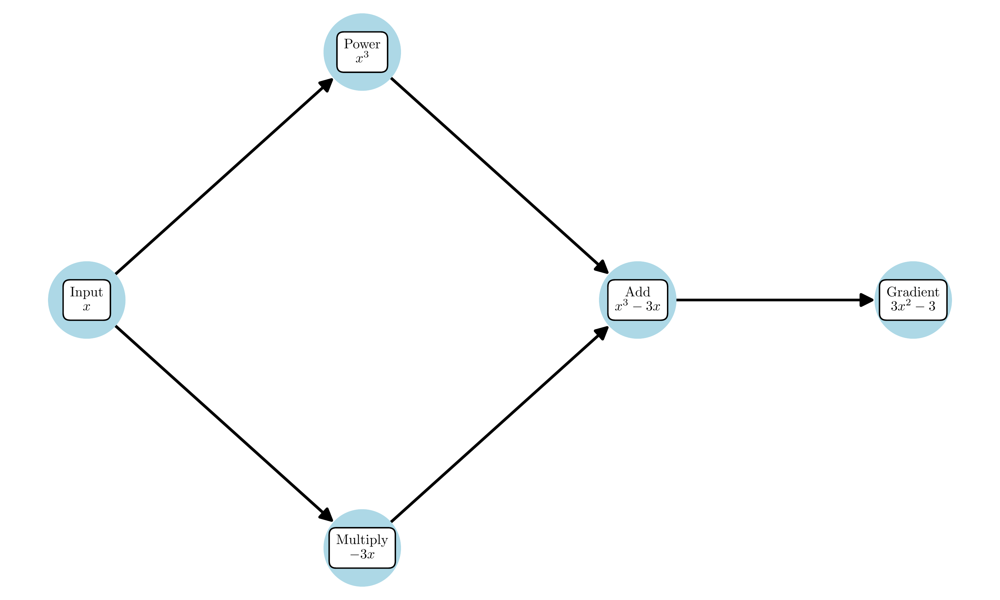
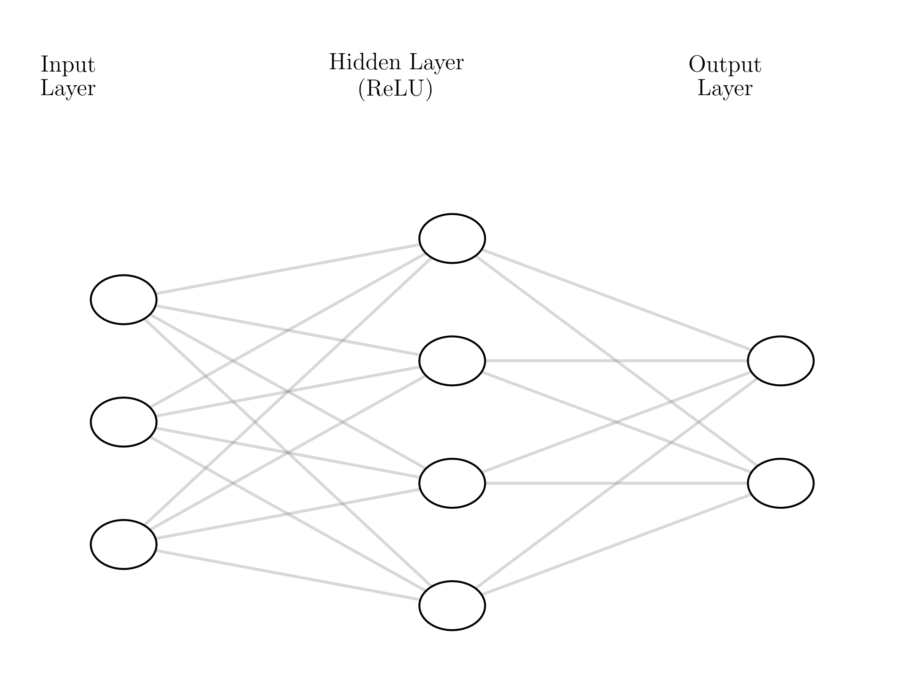

# Beyond Least Squares: Computing Gradients in PyTorch

## Notebooks and Slides
- [Lecture slides](slides.pdf)
- [Colab notebook](https://colab.research.google.com/github/damek/STAT-4830/blob/main/section/4/notebook.ipynb)

## Table of contents
1. [Introduction](#introduction)
2. [One-Dimensional Examples](#one-dimensional-examples)
3. [Common Pitfalls in Gradient Computation](#common-pitfalls-in-gradient-computation)
4. [Revisiting Least Squares](#revisiting-least-squares)
5. [Complex Loss Functions](#complex-loss-functions)
6. [Neural Network Architectures](#neural-network-architectures)
7. [Implementing Gradient Descent](#implementing-gradient-descent)
8. [Case Study: MNIST Classification](#case-study-mnist-classification)
9. [Summary](#summary)

## Introduction

In our previous lecture, we explored gradient descent for linear regression, deriving gradients by hand and implementing the algorithm step by step. Now we'll discover how PyTorch can compute gradients automatically for any differentiable function. This capability transforms how we approach optimization - instead of deriving gradients manually, we can focus on designing loss functions that capture what we want to optimize. 

## One-Dimensional Examples

Let's start with computing gradients for the simplest possible case: a one-dimensional function. Consider minimizing the objective:

$$ \min_x f(x) \quad \text{where} \quad f(x) = x^2 - 2x + 1 $$

We know its minimum occurs at $x=1$, but let's use gradient computation to find it:

```python
import torch

# Create a tensor with requires_grad=True to track computations
x = torch.tensor([0.0], requires_grad=True)

# Define our function
def f(x):
    return x**2 - 2*x + 1

# Compute function value
y = f(x)

# Compute gradient
y.backward()

print(f"At x = {x.item():.1f}")
print(f"f(x) = {y.item():.1f}")
print(f"f'(x) = {x.grad.item():.1f}")  # gradient is -2 at x=0
```

This simple example reveals the key components of automatic differentiation:
1. Mark input as requiring gradients (`requires_grad=True`)
2. Build computation graph by evaluating function
3. Call `backward()` to compute gradients
4. Access gradients through `.grad` attribute

Let's visualize how the function and its gradient change as we move x:


The plot shows:
- Function value (blue curve) with minimum at x=1
- Gradient (orange arrows) pointing downhill
- Gradient magnitude proportional to slope
- Gradient zero exactly at minimum

Now let's try something more exotic - a function with multiple minima:

```python
def g(x):
    return torch.sin(5*x) * torch.exp(-x**2/2)

x = torch.linspace(-3, 3, 100, requires_grad=True)
y = g(x)
y.sum().backward()  # sum() to get scalar for backward()

plt.figure(figsize=(10, 4))
plt.plot(x.detach(), y.detach(), label='g(x)')
plt.plot(x.detach(), x.grad, label="g'(x)")
plt.grid(True)
plt.legend()
plt.title('Function with Multiple Minima')
plt.show()
```


This more complex function reveals important insights:
1. Multiple minima where gradient vanishes
2. Gradient sign shows direction to nearest minimum
3. Gradient magnitude indicates "steepness" of descent
4. Initial position determines which minimum we find

These principles extend directly to higher dimensions, where we'll encounter them again in neural networks. The key difference? Instead of a single number, our gradient becomes a vector pointing in the direction of steepest descent through high-dimensional space.

## Common Pitfalls in Gradient Computation

When using PyTorch's automatic differentiation, several common issues can trip up even experienced users. Let's explore these pitfalls and their solutions:

### 1. Breaking the Computational Graph

The most common mistake is accidentally breaking the chain of computation that PyTorch uses to track gradients:

```python
# Wrong: breaks computational graph
x = torch.tensor([1.0], requires_grad=True)
y = x * 2
z = y.detach()  # Breaks the graph!
w = z * 3
w.backward()  # x.grad will be None

# Right: maintain computational graph
x = torch.tensor([1.0], requires_grad=True)
y = x * 2
w = y * 3
w.backward()  # x.grad will be 6
```

### 2. In-Place Operations

In-place operations (modifying a tensor directly) can lead to incorrect gradients or errors:

```python
# Wrong: in-place operation
x = torch.tensor([1.0], requires_grad=True)
y = x * 2
y += 1  # In-place operation breaks graph
y.backward()  # Error!

# Right: create new tensor
x = torch.tensor([1.0], requires_grad=True)
y = x * 2
y = y + 1  # Creates new tensor
y.backward()  # Works correctly
```

### 3. Gradient Accumulation

Gradients accumulate by default - if you don't clear them, multiple backward passes add up:

```python
x = torch.tensor([1.0], requires_grad=True)
for _ in range(3):
    y = x * 2
    y.backward()  # Gradients accumulate!
print(x.grad)  # Prints 6 (2 + 2 + 2)

# Solution: Clear gradients between iterations
x = torch.tensor([1.0], requires_grad=True)
for _ in range(3):
    x.grad = None  # Clear gradients
    y = x * 2
    y.backward()
print(x.grad)  # Prints 2
```

### 4. Scalar vs Vector Backward

PyTorch expects scalar outputs for `backward()` by default. For vector outputs, you need gradients of the same shape:

```python
# Wrong: vector output without gradient
x = torch.tensor([[1.0, 2.0]], requires_grad=True)
y = x * 2
y.backward()  # Error: grad can be implicitly created only for scalar outputs

# Right: provide gradient for vector output
x = torch.tensor([[1.0, 2.0]], requires_grad=True)
y = x * 2
y.backward(torch.ones_like(y))  # Works!
```

### 5. Leaf Node Errors

Only leaf nodes (tensors created by user) can require gradients:

```python
# Wrong: trying to set requires_grad on non-leaf tensor
x = torch.tensor([1.0])
y = x * 2
y.requires_grad_(True)  # Error: can't set requires_grad on non-leaf tensor

# Right: set requires_grad on leaf tensor
x = torch.tensor([1.0], requires_grad=True)
y = x * 2  # y inherits requires_grad
```

### 6. Memory Management

Keeping computational graphs in memory can consume significant RAM. Use `torch.no_grad()` when you don't need gradients:

```python
# Wasteful: tracks gradients during evaluation
def evaluate(model, data):
    return model(data)

# Efficient: disables gradient tracking
def evaluate(model, data):
    with torch.no_grad():
        return model(data)
```

These pitfalls share a common theme: they arise from PyTorch's need to build and maintain a computational graph for automatic differentiation. Understanding this graph structure helps avoid and debug these issues:



The visualization shows:
1. Leaf nodes (user-created tensors)
2. Intermediate nodes (results of operations)
3. Gradient flow (backward pass)
4. Points where graph can break

Remember these key principles:
1. Keep the computational graph connected
2. Avoid in-place operations during training
3. Clear gradients between iterations
4. Handle vector outputs correctly
5. Set `requires_grad` on leaf nodes
6. Use `no_grad()` for evaluation

## Revisiting Least Squares

Let's return to linear regression and see how PyTorch's automatic differentiation compares to our manual gradient calculations from the previous lecture. Recall our objective:

$$ \min_w \frac{1}{2}\|Xw - y\|_2^2 $$

Last time, we derived the gradient by hand:

$$ \nabla_w f(w) = X^T(Xw - y) $$

Now let's solve the same problem using PyTorch's autograd:

```python
# Generate synthetic data
torch.manual_seed(42)
n_samples, n_features = 1000, 3
X = torch.randn(n_samples, n_features)
w_true = torch.tensor([1.0, -0.5, 0.25])
y = X @ w_true + 0.1 * torch.randn(n_samples)

# Initialize weights and enable gradient tracking
w = torch.zeros(n_features, requires_grad=True)

def loss_fn(X, y, w):
    """Compute MSE loss"""
    return 0.5 * torch.mean((X @ w - y)**2)

# Compute loss and gradient
loss = loss_fn(X, y, w)
loss.backward()

print("PyTorch gradient:", w.grad)
# Compare with manual calculation
manual_grad = X.T @ (X @ w.detach() - y) / n_samples
print("Manual gradient:", manual_grad)
```

The gradients match exactly! This verifies that PyTorch's automatic differentiation correctly implements our mathematical derivation. But PyTorch offers several advantages:

1. **Automatic Chain Rule**
   Instead of deriving gradients by hand:
   ```python
   # PyTorch handles all of this automatically
   def complex_loss(X, y, w):
       predictions = torch.sigmoid(X @ w)  # Non-linear activation
       return torch.mean((predictions - y)**2)
   ```

2. **Dynamic Computation Graphs**
   The same code works for different architectures:
   ```python
   # Works for any differentiable model
   def general_loss(model, X, y):
       return torch.mean((model(X) - y)**2)
   ```

3. **Efficient Implementation**
   PyTorch optimizes the computation:
   ```python
   # Efficient matrix operations
   X = torch.randn(10000, 100, requires_grad=True)
   w = torch.randn(100, 1, requires_grad=True)
   y = X @ w  # Uses optimized BLAS
   ```

Let's visualize how PyTorch builds the computational graph for our least squares problem:


The graph shows:
1. Input nodes: X, w, and y
2. Operation nodes: matrix multiply, subtraction, square
3. Gradient flow: backward pass through the graph
4. Final scalar loss output

This automatic gradient computation becomes especially valuable as we move to more complex loss functions and model architectures. Instead of deriving gradients manually (which becomes intractable for deep networks), we can focus on designing the right loss function and let PyTorch handle the calculus.

## Complex Loss Functions

Moving beyond least squares, we'll explore more sophisticated objectives. For nonlinear regression and classification, we'll see how PyTorch computes gradients for nested computations while maintaining clear, readable code.

### Nonlinear Regression

For temperature prediction, we minimize:

$$ \min_{\theta} \mathcal{L}(\theta) = \frac{1}{n}\sum_{i=1}^n (y_i - f_\theta(t_i))^2 + \lambda\|\theta\|^2 $$

where:
- $y_i$ is the temperature at time $t_i$
- $f_\theta(t) = \theta_{\text{offset}} + \theta_{\text{amplitude}}\sin(2\pi t/24 + \theta_{\text{phase}})$
- $\lambda\|\theta\|^2$ regularizes the amplitude

### Classification with Cross-Entropy Loss

For spam classification, we minimize:

$$ \min_w \mathcal{L}(w) = -\frac{1}{n}\sum_{i=1}^n [y_i \log(\sigma(x_i^T w)) + (1-y_i)\log(1-\sigma(x_i^T w))] + \frac{\lambda}{2}\|w\|^2 $$

where $\sigma(z) = \frac{1}{1+e^{-z}}$ is the sigmoid function and $\lambda$ controls L2 regularization.

## Neural Network Architectures

Neural networks extend our previous models by composing multiple layers of nonlinear transformations. Let's explore different architectures and see how PyTorch handles their increasing complexity.

### Feedforward Networks

The simplest neural network adds a "hidden layer" between input and output:

```python
class SimpleNN(torch.nn.Module):
    def __init__(self, input_dim, hidden_dim, output_dim):
        super().__init__()
        self.layer1 = torch.nn.Linear(input_dim, hidden_dim)
        self.layer2 = torch.nn.Linear(hidden_dim, output_dim)
        self.activation = torch.nn.ReLU()
    
    def forward(self, x):
        h = self.activation(self.layer1(x))
        return self.layer2(h)
```

Let's visualize this architecture:



The diagram shows:
1. Input layer (features)
2. Hidden layer with ReLU activation
3. Output layer (predictions)
4. All connections between layers

Each layer performs:
```python
h = activation(W x + b)
```
where:
- W is a weight matrix
- b is a bias vector
- activation adds nonlinearity

### Deep Networks

Adding more layers creates a deep network:

```python
class DeepNN(torch.nn.Module):
    def __init__(self, layer_dims):
        super().__init__()
        self.layers = torch.nn.ModuleList()
        for i in range(len(layer_dims)-1):
            self.layers.append(torch.nn.Linear(layer_dims[i], layer_dims[i+1]))
        self.activation = torch.nn.ReLU()
    
    def forward(self, x):
        for layer in self.layers[:-1]:
            x = self.activation(layer(x))
        return self.layers[-1](x)  # No activation on final layer

# Example: 5 layers with different widths
model = DeepNN([784, 512, 256, 128, 10])
```


The visualization reveals:
1. Multiple hidden layers
2. Decreasing width (dimensionality reduction)
3. ReLU activation between layers
4. Final layer for classification

### Residual Networks (ResNets)

Deep networks can be hard to train. ResNets add "skip connections" that help gradients flow:

```python
class ResidualBlock(torch.nn.Module):
    def __init__(self, dim):
        super().__init__()
        self.layer1 = torch.nn.Linear(dim, dim)
        self.layer2 = torch.nn.Linear(dim, dim)
        self.activation = torch.nn.ReLU()
    
    def forward(self, x):
        # Skip connection: add input to output
        h = self.activation(self.layer1(x))
        return x + self.layer2(h)  # Skip connection

class ResNet(torch.nn.Module):
    def __init__(self, input_dim, n_blocks):
        super().__init__()
        self.blocks = torch.nn.ModuleList(
            [ResidualBlock(input_dim) for _ in range(n_blocks)]
        )
    
    def forward(self, x):
        for block in self.blocks:
            x = block(x)
        return x
```


The diagram highlights:
1. Residual blocks with skip connections
2. Information flow through both paths
3. Addition operation combining paths
4. Repeated block structure

### Hidden Unit Types

Different activation functions create different nonlinearities:

```python
# Common activation functions
x = torch.linspace(-2, 2, 100)
activations = {
    'ReLU': torch.nn.ReLU(),
    'Tanh': torch.nn.Tanh(),
    'Sigmoid': torch.nn.Sigmoid(),
    'GELU': torch.nn.GELU()
}

plt.figure(figsize=(12, 4))
for name, fn in activations.items():
    plt.plot(x.numpy(), fn(x).numpy(), label=name)
plt.grid(True)
plt.legend()
plt.title('Activation Functions')
plt.show()
```


Each activation has unique properties:
1. ReLU: Simple, sparse, no saturation for positive values
2. Tanh: Symmetric around zero, bounded output
3. Sigmoid: Probability interpretation, but prone to saturation
4. GELU: Smooth approximation to ReLU, used in transformers

### Choosing Architecture Components

Network design involves several key decisions:
1. **Depth**: Number of layers
   - Deeper networks learn more complex patterns
   - But harder to train and may overfit
   
2. **Width**: Neurons per layer
   - Wider layers capture more patterns
   - But increase computation and memory
   
3. **Skip Connections**: Additional paths
   - Help gradients flow in deep networks
   - But add implementation complexity
   
4. **Activation Functions**: Nonlinearity type
   - ReLU-like for deep networks
   - Sigmoid/Softmax for outputs

PyTorch makes experimenting with these choices easy:
```python
# Example: Trying different widths
models = {
    'narrow': DeepNN([784, 100, 100, 10]),
    'wide': DeepNN([784, 1000, 1000, 10]),
    'pyramid': DeepNN([784, 1000, 100, 10]),
    'diamond': DeepNN([784, 100, 1000, 10])
}

# Count parameters
for name, model in models.items():
    n_params = sum(p.numel() for p in model.parameters())
    print(f"{name}: {n_params:,} parameters")
```

Remember:
1. Start simple (feedforward)
2. Add complexity gradually
3. Monitor training dynamics
4. Use skip connections for very deep networks

## Implementing Gradient Descent

Now that we understand how PyTorch computes gradients, let's implement gradient descent manually. This exposes the core optimization loop and helps debug training issues. We'll start with basic gradient descent, then add features like momentum and learning rate scheduling.

### Basic Gradient Descent

The core gradient descent loop has three steps:
1. Zero gradients
2. Compute loss and backward pass
3. Update parameters

Here's a complete implementation:

```python
def gradient_descent(model, X, y, n_steps=1000, lr=0.01):
    """Basic gradient descent optimization"""
    losses = []
    
    for step in range(n_steps):
        # 1. Zero gradients
        model.zero_grad()
        
        # 2. Forward and backward pass
        y_pred = model(X)
        loss = torch.nn.functional.mse_loss(y_pred, y)
        loss.backward()
        
        # 3. Update parameters
        with torch.no_grad():  # Don't track updates
            for param in model.parameters():
                param -= lr * param.grad
        
        # Track progress
        losses.append(loss.item())
        
        if step % 100 == 0:
            print(f"Step {step}: Loss = {loss.item():.4f}")
    
    return losses

# Example usage
model = torch.nn.Linear(10, 1)  # Simple linear model
X = torch.randn(100, 10)        # Random features
y = torch.randn(100, 1)         # Random targets

losses = gradient_descent(model, X, y)
```

Let's visualize the training progress:


The plot shows:
1. Initial rapid improvement
2. Gradual convergence
3. Diminishing returns
4. Potential oscillations

### Adding Momentum

Pure gradient descent can oscillate in narrow valleys. Momentum helps by accumulating past gradients:

```python
def momentum_gradient_descent(model, X, y, n_steps=1000, lr=0.01, beta=0.9):
    """Gradient descent with momentum"""
    # Initialize velocity for each parameter
    velocity = [torch.zeros_like(p) for p in model.parameters()]
    losses = []
    
    for step in range(n_steps):
        model.zero_grad()
        
        # Forward and backward pass
        y_pred = model(X)
        loss = torch.nn.functional.mse_loss(y_pred, y)
        loss.backward()
        
        # Update with momentum
        with torch.no_grad():
            for i, (param, v) in enumerate(zip(model.parameters(), velocity)):
                # Update velocity
                v.mul_(beta).add_(param.grad, alpha=1-beta)
                # Update parameters
                param.add_(v, alpha=-lr)
        
        losses.append(loss.item())
    
    return losses

# Compare optimization methods
methods = {
    'basic': gradient_descent,
    'momentum': momentum_gradient_descent
}

results = {}
for name, optimizer in methods.items():
    model = torch.nn.Linear(10, 1)  # Reset model
    results[name] = optimizer(model, X, y)
```

### Learning Rate Scheduling

Fixed learning rates aren't always optimal. Scheduling can help:

```python
def cosine_scheduler(initial_lr, step, total_steps):
    """Cosine learning rate schedule"""
    return initial_lr * 0.5 * (1 + torch.cos(torch.tensor(step/total_steps * torch.pi)))

def scheduled_gradient_descent(model, X, y, n_steps=1000, initial_lr=0.01):
    """Gradient descent with cosine learning rate schedule"""
    losses = []
    
    for step in range(n_steps):
        # Get current learning rate
        lr = cosine_scheduler(initial_lr, step, n_steps)
        
        model.zero_grad()
        y_pred = model(X)
        loss = torch.nn.functional.mse_loss(y_pred, y)
        loss.backward()
        
        with torch.no_grad():
            for param in model.parameters():
                param -= lr * param.grad
        
        losses.append(loss.item())
    
    return losses
```

Let's compare all methods:


The comparison reveals:
1. Basic GD: Simple but slow convergence
2. Momentum: Faster, especially in narrow valleys
3. Scheduling: Adapts to optimization landscape

### Practical Tips

When implementing gradient descent:

1. **Monitor Gradients**
   ```python
   # Check gradient statistics
   for name, param in model.named_parameters():
       if param.grad is not None:
           grad_norm = param.grad.norm()
           print(f"{name} grad norm: {grad_norm}")
   ```

2. **Clip Large Gradients**
   ```python
   # Prevent exploding gradients
   torch.nn.utils.clip_grad_norm_(model.parameters(), max_norm=1.0)
   ```

3. **Check Learning Rate**
   ```python
   # Test different learning rates
   for lr in [1e-4, 1e-3, 1e-2, 1e-1]:
       losses = gradient_descent(model, X, y, lr=lr)
       plt.plot(losses, label=f'lr={lr}')
   plt.legend()
   ```

4. **Validate Frequently**
   ```python
   # Monitor training and validation loss
   train_loss = compute_loss(model, X_train, y_train)
   val_loss = compute_loss(model, X_val, y_val)
   print(f"Train: {train_loss:.4f}, Val: {val_loss:.4f}")
   ```

These implementations expose PyTorch's gradient computation while maintaining numerical stability and efficiency. In practice, you'll often use `torch.optim` optimizers, but understanding the underlying mechanics helps debug training issues and implement custom optimization strategies.

## Case Study: MNIST Classification

Let's put everything together by tackling a real problem: classifying handwritten digits from the MNIST dataset. We'll start with logistic regression and gradually add complexity, observing how each change affects performance.

### Loading and Preparing Data

First, let's load and preprocess the MNIST dataset:

```python
from torchvision import datasets, transforms

# Load MNIST dataset
transform = transforms.Compose([
    transforms.ToTensor(),
    transforms.Normalize((0.1307,), (0.3081,))
])

train_dataset = datasets.MNIST('./data', train=True, download=True,
                             transform=transform)
test_dataset = datasets.MNIST('./data', train=False,
                            transform=transform)

# Create data loaders
train_loader = torch.utils.data.DataLoader(train_dataset, batch_size=128,
                                         shuffle=True)
test_loader = torch.utils.data.DataLoader(test_dataset, batch_size=128)

# Display example images
plt.figure(figsize=(10, 2))
for i in range(5):
    plt.subplot(1, 5, i+1)
    plt.imshow(train_dataset[i][0].squeeze(), cmap='gray')
    plt.title(f"Label: {train_dataset[i][1]}")
plt.tight_layout()
plt.show()
```


### Model 1: Logistic Regression

Let's start with the simplest possible model - logistic regression:

```python
class LogisticRegression(torch.nn.Module):
    def __init__(self):
        super().__init__()
        self.linear = torch.nn.Linear(28*28, 10)  # 784 -> 10
    
    def forward(self, x):
        x = x.view(-1, 28*28)  # Flatten images
        return self.linear(x)

model = LogisticRegression()
criterion = torch.nn.CrossEntropyLoss()
optimizer = torch.optim.SGD(model.parameters(), lr=0.1)

# Training loop
def train_epoch(model, loader, criterion, optimizer):
    model.train()
    total_loss = 0
    correct = 0
    total = 0
    
    for data, target in loader:
        optimizer.zero_grad()
        output = model(data)
        loss = criterion(output, target)
        loss.backward()
        optimizer.step()
        
        total_loss += loss.item()
        pred = output.argmax(dim=1)
        correct += pred.eq(target).sum().item()
        total += target.size(0)
    
    return total_loss / len(loader), correct / total

# Training progress
train_losses = []
train_accs = []
for epoch in range(10):
    loss, acc = train_epoch(model, train_loader, criterion, optimizer)
    train_losses.append(loss)
    train_accs.append(acc)
    print(f"Epoch {epoch}: Loss = {loss:.4f}, Accuracy = {acc:.2%}")
```

Let's visualize the training progress:


The plot shows:
1. Quick initial improvement
2. Plateau around 92% accuracy
3. Limited capacity of linear model

### Model 2: Single Hidden Layer

Adding a hidden layer allows the model to learn nonlinear patterns:

```python
class SimpleNN(torch.nn.Module):
    def __init__(self, hidden_dim=128):
        super().__init__()
        self.flatten = torch.nn.Flatten()
        self.fc1 = torch.nn.Linear(28*28, hidden_dim)
        self.fc2 = torch.nn.Linear(hidden_dim, 10)
        self.activation = torch.nn.ReLU()
    
    def forward(self, x):
        x = self.flatten(x)
        x = self.activation(self.fc1(x))
        return self.fc2(x)

# Train with different hidden sizes
results = {}
for hidden_dim in [32, 128, 512]:
    model = SimpleNN(hidden_dim)
    optimizer = torch.optim.SGD(model.parameters(), lr=0.1)
    results[hidden_dim] = train_model(model, train_loader, test_loader,
                                    criterion, optimizer, epochs=10)
```

### Model 3: Deep Network

Finally, let's try a deeper architecture:

```python
class DeepNN(torch.nn.Module):
    def __init__(self):
        super().__init__()
        self.flatten = torch.nn.Flatten()
        self.layers = torch.nn.Sequential(
            torch.nn.Linear(28*28, 512),
            torch.nn.ReLU(),
            torch.nn.Dropout(0.2),
            torch.nn.Linear(512, 256),
            torch.nn.ReLU(),
            torch.nn.Dropout(0.2),
            torch.nn.Linear(256, 10)
        )
    
    def forward(self, x):
        x = self.flatten(x)
        return self.layers(x)
```

Let's compare all three models:


The comparison reveals:
1. Logistic regression: ~92% accuracy
   - Linear decision boundaries
   - Fast training, few parameters
   - Limited capacity

2. Single hidden layer: ~96% accuracy
   - Nonlinear decision boundaries
   - More parameters to tune
   - Better digit separation

3. Deep network: ~98% accuracy
   - Complex feature hierarchies
   - Requires regularization (dropout)
   - Best performance but slowest training

### Visualizing Learned Features

Let's examine what each model learns:

```python
def visualize_weights(model, title):
    if isinstance(model, LogisticRegression):
        weights = model.linear.weight.data
    else:
        weights = model.fc1.weight.data
    
    plt.figure(figsize=(12, 4))
    for i in range(10):
        plt.subplot(2, 5, i+1)
        plt.imshow(weights[i].view(28, 28), cmap='RdBu')
        plt.title(f"Class {i}")
    plt.suptitle(title)
    plt.tight_layout()
    plt.show()

visualize_weights(logistic_model, "Logistic Regression Features")
visualize_weights(simple_model, "Hidden Layer Features")
```


The visualizations show:
1. Logistic regression learns digit templates
2. Hidden layers learn parts of digits
3. Deeper layers combine these parts

This case study demonstrates key principles:
1. Start simple, add complexity gradually
2. Monitor training and validation metrics
3. Visualize what models learn
4. Use appropriate regularization

## Summary

This lecture explored how PyTorch computes gradients for any differentiable function. Key takeaways:

### Automatic Differentiation
1. **Building Blocks**
   - Tensors track computation history
   - Operations form computational graphs
   - Backward pass computes all gradients
   - Memory freed after backward pass

2. **Common Pitfalls**
   - Breaking computational graphs
   - In-place operations during training
   - Forgetting to zero gradients
   - Scalar vs vector backward passes

### Loss Functions
1. **Simple to Complex**
   - MSE for regression
   - Cross-entropy for classification
   - Custom losses for specific tasks
   - Composite losses with regularization

2. **Design Principles**
   - Differentiable everywhere possible
   - Numerically stable implementation
   - Clear relationship to task goal
   - Efficient computation at scale

### Neural Networks
1. **Architecture Components**
   - Linear layers for transformations
   - Activation functions for nonlinearity
   - Skip connections for deep networks
   - Dropout for regularization

2. **Design Decisions**
   - Depth vs width trade-offs
   - Activation function choice
   - Parameter count vs performance
   - Training stability considerations

### Gradient Descent
1. **Core Algorithm**
   ```python
   for step in range(n_steps):
       model.zero_grad()           # Clear previous gradients
       loss = criterion(model(x))  # Forward pass
       loss.backward()            # Compute gradients
       update_parameters()        # Take optimization step
   ```

2. **Practical Improvements**
   - Momentum for faster convergence
   - Learning rate scheduling
   - Gradient clipping
   - Validation-based early stopping

### Best Practices
1. **Implementation**
   - Start with simple models
   - Add complexity gradually
   - Monitor training dynamics
   - Validate frequently

2. **Debugging**
   - Check gradient magnitudes
   - Verify loss decreases
   - Compare to baselines
   - Visualize learned features

Next lecture, we'll explore more advanced optimization techniques, including adaptive methods like Adam and techniques for handling constraints. We'll see how these methods build on the gradient computation foundations established here while offering improved convergence and robustness. 