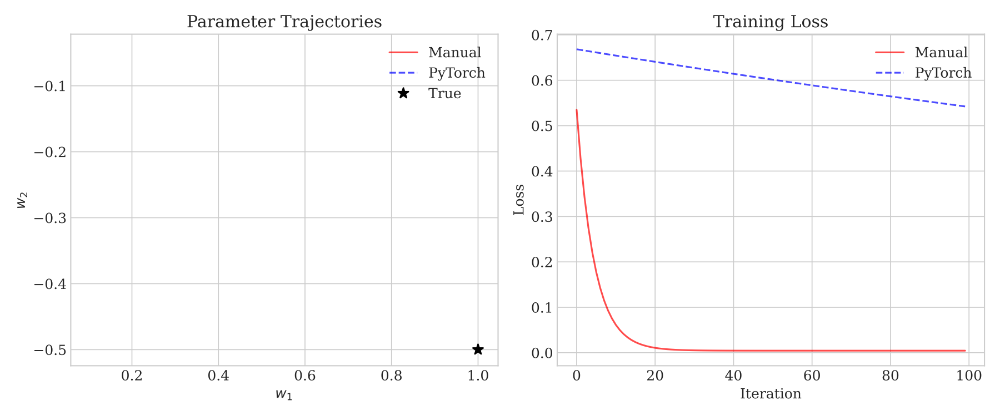
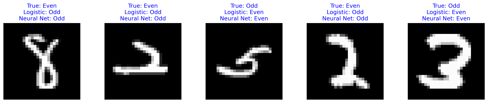

# Beyond Least Squares: Computing Gradients in PyTorch

## Notebooks and Slides
- [Lecture slides](slides.pdf)
- [Colab notebook](https://colab.research.google.com/github/damek/STAT-4830/blob/main/section/4/notebook.ipynb)

## Table of contents
1. [Introduction](#introduction)
2. [Computing Gradients of Loss Functions](#computing-gradients-of-loss-functions)
3. [Applying Gradient Descent](#applying-gradient-descent)
4. [Summary](#summary)

## Introduction

In our previous lecture, we explored gradient descent for minimizing the least squares objective. We saw how following the negative gradient leads us to the optimal solution, even for large-scale problems where direct methods fail. But least squares is just one example of a loss function. Modern machine learning employs a vast array of loss functions, each designed for specific tasks: cross-entropy for classification, Huber loss for robust regression, contrastive loss for similarity learning.

The power of PyTorch lies in its ability to compute gradients for any differentiable function constructed from its operations. This lecture explores how to harness this capability, starting with simple one-dimensional examples and building up to complex neural network losses. We'll see how PyTorch's automatic differentiation system tracks computations, computes gradients efficiently, and helps us avoid common pitfalls.

## Computing Gradients of Loss Functions

Let's start with the simplest possible case: computing the gradient of a one-dimensional function. Consider the polynomial:

$$ f(x) = x^3 - 3x $$

This function has an analytical gradient:

$$ \frac{d}{dx}f(x) = 3x^2 - 3 $$

While we can compute this derivative by hand, PyTorch offers a powerful alternative - automatic differentiation. Here's how you use it.

```python
import torch

# Create input tensor with gradient tracking
x = torch.tensor([1.0], requires_grad=True)

# Define the function
def f(x):
    return x**3 - 3*x

# Forward pass: evaluating the function
y = f(x)

# Backward pass: computing the gradient
y.backward()

print(f"At x = {x.item():.1f}")
print(f"f(x) = {y.item():.1f}")
print(f"f'(x) = {x.grad.item():.1f}")  # Should be 3(1)² - 3 = 0
```

This simple example reveals the key components of automatic differentiation:

1. **Gradient Tracking**: We mark tensors that need gradients with `requires_grad=True`
2. **Forward Pass**: PyTorch automatically records operations as we compute the function 
3. **Backward Pass**: The `backward()` call computes gradients through the recorded operations
4. **Gradient Access**: The computed gradient is stored in the `.grad` attribute


Let's visualize how the analytic gradient and the gradient computed by PyTorch match up:


The top plot shows our function $f(x) = x^3 - 3x$, while the bottom plot compares PyTorch's computed gradient (red solid line) with the analytical gradient $3x^2 - 3$ (green dashed line). They match perfectly, confirming that PyTorch computes exact gradients. To understand how PyTorch achieves this precision, we need to examine the machinery that powers its automatic differentiation system.

### The Computational Graph

To understand how PyTorch computes these gradients, we need to examine the computational graph it builds during the **forward pass:**


The computational graph is a directed acyclic graph (DAG) where nodes represent operations and edges represent data flow. Each node stores:

- Its output value computed during the forward pass
- A function to compute local gradients (derivatives with respect to its inputs)

Each node in this graph represents an operation:
1. Input node stores our value $x$
2. Power node computes $z_1 = x^3$
3. Multiply node computes $z_2 = -3x$
4. Add node combines terms to form $f(x) = z_1 + z_2$

During the forward pass, PyTorch, records each operation in sequence, stores intermediate values, and maintains references between operations.

During the **backward pass**, PyTorch uses an efficient implementation of the *chain rule* that processes these nodes in reverse dependency order - what's called a *reverse topological sort*. This means we start at the output and only process a node after we've handled all the nodes that depend on its result. 

More specifically, to compute $\frac{\partial f}{\partial x}$ for output $f$ with respect to input $x$, we go through the following process:

**Starting State:**
- Initialize gradient at output node to 1 ($\frac{\partial f}{\partial f} = 1$)
- All other gradient accumulators start at $0$

**Algorithm:** The system performs a reverse topological sort traversal of the graph. At each node:

- Compute local gradients using stored forward-pass values
- Multiply incoming gradient by local gradient (chain rule)
- Add result to gradient accumulators of input nodes

For the polynomial $f(x) = x^3 - 3x$, this process looks like this:

**Output Node ($f = z_1 + z_2$):**
- $\frac{\partial f}{\partial f} = 1$
- Local gradients: $\frac{\partial f}{\partial z_1} = 1$, $\frac{\partial f}{\partial z_2} = 1$
- Propagate to $z_1$, $z_2$ nodes: $\frac{\partial f}{\partial z_1} = 1$, $\frac{\partial f}{\partial z_2} = 1$

**Power Node ($z_1 = x^3$):**
- Incoming gradient: 1
- Local gradient: $\frac{\partial z_1}{\partial x} = 3x^2$
- Contribute to x's gradient accumulator: $\frac{\partial f}{\partial x} \mathrel{+}= (1)(3x^2)$

**Multiply Node ($z_2 = -3x$):**
- Incoming gradient: 1
- Local gradient: $\frac{\partial z_2}{\partial x} = -3$
- Contribute to x's gradient accumulator: $\frac{\partial f}{\partial x} \mathrel{+}= (1)(-3)$

**Input Node ($x$):** [accumulation needed because x has two outgoing edges]
- Accumulated gradients from both paths: $3x^2$ and $-3$
- Final gradient (sum of all paths): $\frac{\partial f}{\partial x} = 3x^2 - 3$

From this example, it should be clear that the algorithm is completely mechanical - each node only needs to know its local gradient function, and the graph structure determines where accumulation is needed (at nodes with multiple outgoing edges). The memory complexity is O(n) where n is the number of nodes, as we store one gradient accumulator per node. The time complexity is also O(n) as we visit each node exactly once and perform a fixed amount of work per node.

While we state this result for a one function of a single variable, it should be clear that it generalizes. For example, to handle multiple inputs, we track separate gradient accumulators for each input. For vector-valued functions, gradients become Jacobian matrices. Higher derivatives can be computed by applying the same process to the gradient computation graph.

**Important Requirement:** This graph structure explains a crucial requirement: we can only compute gradients through operations that PyTorch implements. The framework needs to know both (1) how to compute the operation (forward pass) and (2) how to compute its derivative (backward pass). Common operations like addition (`+`), multiplication (`*`), and power (`**`) are all implemented by PyTorch. Even when we use Python's standard operators, we're actually calling PyTorch's overloaded versions that know how to handle both computation and differentiation.

### Two Methods for Gradient Computation: `backward()` and `autograd.grad()`

PyTorch provides two ways to compute gradients, each designed for different use cases. Let's see how they work using our polynomial example:

```python
# Our familiar polynomial f(x) = x³ - 3x
x = torch.tensor([1.0], requires_grad=True)
z1 = x**3           # First intermediate value
z2 = -3*x          # Second intermediate value
f = z1 + z2        # Final output
```

During this forward pass, PyTorch builds a computational graph dynamically. Each operation adds nodes and edges to the graph, tracking how values flow through the computation. The graph in our visualization shows exactly this process - from input x through intermediate values z₁ and z₂ to the final output f.

The standard method uses `backward()`:
```python
f.backward()        # Compute gradient
print(x.grad)       # Access gradient through .grad attribute
```

When you call `backward()`, PyTorch (1) creates a new graph for the gradient computation, (2) computes gradients by flowing backward through this graph, (3) stores results in the `.grad` attributes of input tensors, and (4) discards both graphs to free memory.

You can inspect intermediate values during computation:
```python
print(z1.data)      # See value of x³
print(z2.data)      # See value of -3x
```

By default, PyTorch only stores gradients for leaf tensors (inputs where we set `requires_grad=True`). This saves memory while still giving us the gradients we need for optimization. If you need gradients for intermediate values, you can request them:

```python
z1.retain_grad()    # Tell PyTorch to store this gradient
f.backward()
print(z1.grad)      # Now we can see how f changes with z₁
```

The second method, `torch.autograd.grad()`, gives us more direct control:
```python
x = torch.tensor([1.0], requires_grad=True)
f = x**3 - 3*x
grad = torch.autograd.grad(f, x)[0]  # Get gradient directly
```

This method (1) returns the gradient immediately as a new tensor (2) lets you compute gradients with respect to any tensor in your computation (3) creates and discards the computational graph in one step

Both methods compute exactly the same gradients - they just offer different ways to access them. Use `backward()` when you want gradients stored in your tensors, and `autograd.grad()` when you want direct access to specific gradients.

The computational graph we drew earlier shows exactly how these gradients are computed, combining the derivatives at each step using the chain rule. The power of PyTorch's automatic differentiation is that it handles this process automatically, letting us focus on designing our computations rather than deriving gradients by hand.

### Common Pitfalls in Automatic Differentiation

Several common mistakes can break gradient computation or lead to unexpected behavior.


#### 1. Breaking the Computational Graph

The most common mistake occurs when accidentally breaking the chain of computation that PyTorch uses to track gradients:

```python
# Wrong: breaks computational graph
x = torch.tensor([1.0], requires_grad=True)
y = x * 2
z = y.detach()  # Breaks the graph!
w = z * 3
w.backward()  # x.grad will be None

# Right: maintain computational graph
x = torch.tensor([1.0], requires_grad=True)
y = x * 2
w = y * 3
w.backward()  # x.grad will be 6
```


The `detach()` method creates a new tensor that shares the same data but detaches it from the computation history. This breaks the chain of operations needed for gradient computation. The top diagram shows correct gradient flow, while the middle diagram shows how `detach()` breaks this flow.

#### 2. In-Place Operations

In-place operations (modifying a tensor directly) can break gradient computation, as shown in the bottom diagram:

```python
# Wrong: in-place operation
x = torch.tensor([1.0], requires_grad=True)
y = x * 2
y += 1  # In-place operation breaks graph
y.backward()  # Error!

# Right: create new tensor
x = torch.tensor([1.0], requires_grad=True)
y = x * 2
y = y + 1  # Creates new tensor
y.backward()  # Works correctly
```

In-place operations modify the tensor's memory directly, which can invalidate the computational graph. Instead, create a new tensor to store the result.

#### 3. Gradient Accumulation

Gradients accumulate by default - if you don't clear them, multiple backward passes add up:

```python
x = torch.tensor([1.0], requires_grad=True)
for _ in range(3):
    y = x * 2
    y.backward()  # Gradients accumulate!
print(x.grad)  # Prints 6 (2 + 2 + 2)

# Solution: Clear gradients between computations
x = torch.tensor([1.0], requires_grad=True)
for _ in range(3):
    x.grad = None  # Clear gradients
    y = x * 2
    y.backward()
print(x.grad)  # Prints 2
```

This behavior is actually useful for accumulating gradients over multiple batches, but you need to be aware of it to avoid unintended accumulation.

#### 4. Memory Management

Keeping computational graphs in memory can consume significant RAM. Use `torch.no_grad()` when you don't need gradients:

```python
# Wasteful: tracks gradients during evaluation
def evaluate(model, data):
    return model(data)

# Efficient: disables gradient tracking
def evaluate(model, data):
    with torch.no_grad():
        return model(data)
```

The `no_grad()` context manager temporarily disables gradient computation, reducing memory usage and speeding up computation when gradients aren't needed (like during model evaluation).

These pitfalls highlight important aspects of PyTorch's automatic differentiation:
1. The computational graph must remain connected
2. Operations must preserve gradient information
3. Memory management requires explicit consideration
4. Gradient computation needs well-defined scalar objectives

Understanding these issues helps write correct and efficient code for gradient-based optimization. With this foundation in automatic differentiation, we can now apply these concepts to practical machine learning problems, starting with the familiar least squares optimization we encountered in the previous lecture.

### Beyond Single Variables: Least Squares

Let's examine how PyTorch handles gradient computation for the least squares problem, where we minimize $f(\mathbf{w}) = \frac{1}{2}\|\mathbf{X}\mathbf{w} - \mathbf{y}\|^2$ for data matrix $\mathbf{X} \in \mathbb{R}^{n \times p}$ and observations $\mathbf{y} \in \mathbb{R}^n$. Like our polynomial example, PyTorch builds and traverses a computational graph to compute gradients automatically.

The computational graph for least squares reveals how PyTorch decomposes this multivariate optimization into elementary operations. Each node performs a specific computation in the chain that leads to our final loss:


During the forward pass, the graph computes:
1. Input node stores parameter vector $\mathbf{w}$
2. Residual node computes $\mathbf{z}_1 = \mathbf{X}\mathbf{w} - \mathbf{y}$
3. Square norm node computes $z_2 = \|\mathbf{z}_1\|^2$
4. Scale node produces final loss $f = \frac{1}{2}z_2$

In this multidimensional case, we follow the same algorithm for computing the gradient of $f$ as we did in the 1d case, but with a slight twist. As we traverse the graph in reverse order we compute and store the *total derivatives* or *Jacobians* of the intermediate nodes and multiply them out. In particular, we compute the Jacobians $\frac{\partial f}{\partial z_2}, \frac{\partial z_2}{\partial \mathbf{z}_1}, \frac{\partial \mathbf{z}_1}{\partial \mathbf{w}}$ and multiply them out to get the total derivative $\frac{\partial f}{\partial \mathbf{w}}$, which is a $1 \times p$ row matrix. The connection with the gradient of $f$ is that the total derivative is simply the tranpose of the gradient. More specifically, we have:

**Output Node ($f = \frac{1}{2}z_2$):**
- Incoming gradient: $\frac{\partial f}{\partial f} = 1$ (scalar)
- Total derivative: $\frac{\partial f}{\partial z_2} = \frac{1}{2}$ (scalar)
- Propagate to $z_2$ node: $\frac{\partial f}{\partial z_2} = \frac{1}{2}$ (1×1 matrix)

**Square Norm Node ($z_2 = \|\mathbf{z}_1\|^2$):**
- Incoming total derivative: $\frac{\partial f}{\partial z_2} = \frac{1}{2}$ (1×1 matrix)
- Local total derivative: $\frac{\partial z_2}{\partial \mathbf{z}_1} = 2\mathbf{z}_1^\top$ (1×n matrix)
- Propagate to $\mathbf{z}_1$ node: $\frac{\partial f}{\partial \mathbf{z}_1} = \frac{\partial f}{\partial z_2}\frac{\partial z_2}{\partial \mathbf{z}_1} = \mathbf{z}_1^\top$ (1×n matrix)

**Residual Node ($\mathbf{z}_1 = \mathbf{X}\mathbf{w} - \mathbf{y}$):**
- Incoming total derivative: $\frac{\partial f}{\partial \mathbf{z}_1} = \mathbf{z}_1^\top$ (1×n matrix)
- Local total derivative: $\frac{\partial \mathbf{z}_1}{\partial \mathbf{w}} = \mathbf{X}$ (n×p matrix)
- Total derivative to $\mathbf{w}$ node: $\frac{\partial f}{\partial \mathbf{w}} = \frac{\partial f}{\partial \mathbf{z}_1}\frac{\partial \mathbf{z}_1}{\partial \mathbf{w}} = \mathbf{z}_1^\top\mathbf{X}$ (1×p matrix)

**Input Node ($\mathbf{w}$):**
- Total derivative: $\frac{\partial f}{\partial \mathbf{w}} = \mathbf{z}_1^\top\mathbf{X}$ (1×p matrix)
- Convert to gradient: $\nabla f = (\frac{\partial f}{\partial \mathbf{w}})^\top = \mathbf{X}^\top\mathbf{z}_1$ (p×1 matrix)

This computation reveals why the transpose appears: the chain rule naturally produces the total derivative $\frac{\partial f}{\partial \mathbf{w}}$ as a row vector (1×p matrix), but we conventionally write the gradient $\nabla f$ as a column vector (p×1 matrix). The transpose converts between these representations.

The full chain rule expansion shows how the total derivative combines all computations:

$$ \frac{\partial f}{\partial \mathbf{w}} = \frac{\partial f}{\partial z_2} \frac{\partial z_2}{\partial \mathbf{z}_1} \frac{\partial \mathbf{z}_1}{\partial \mathbf{w}} = \frac{1}{2} \cdot 2\mathbf{z}_1^\top \cdot \mathbf{X} = \mathbf{z}_1^\top\mathbf{X} $$

And the gradient is its transpose:

$$ \nabla f = \frac{\partial f}{\partial \mathbf{w}}^\top = \mathbf{X}^\top\mathbf{z}_1 = \mathbf{X}^\top(\mathbf{X}\mathbf{w} - \mathbf{y})$$

This computation happens automatically in PyTorch through the computational graph structure, with each node computing its local total derivatives. The graph structure determines where accumulation is needed (at nodes with multiple outgoing edges), and the mechanical process of backpropagation handles the rest.

Our one-dimensional example demonstrated PyTorch's automatic differentiation on a simple function. Now let's return to the least squares problem we solved in the previous lecture, but this time using PyTorch's automatic differentiation. Given a data matrix $X \in \mathbb{R}^{n \times p}$ and observations $y \in \mathbb{R}^n$, we differentiate the least squares loss:

$$ f(w) = \frac{1}{2n}\|Xw - y\|_2^2 = \frac{1}{2n }\sum_{i=1}^n (x_i^\top w - y_i)^2 $$

In the previous lecture, we derived the gradient manually:

$$ \nabla f(w) = X^\top(Xw - y)/n $$

PyTorch can compute this gradient automatically:

```python
# Convert data to PyTorch tensors
X = torch.tensor(X_data, dtype=torch.float32)
y = torch.tensor(y_data, dtype=torch.float32)
w = torch.zeros(X.shape[1], requires_grad=True)  # Initialize weights

# Compute loss
predictions = X @ w
loss = 0.5 * torch.mean((predictions - y)**2)

# Compute gradient
loss.backward()
print(f"PyTorch gradient: {w.grad}")
```

Under the hood, PyTorch computes the gradient using the computational graph we discussed earlier:


This graph shows how PyTorch breaks down the least squares computation into elementary operations:
1. Matrix multiplication to form predictions $Xw$
2. Subtraction to compute residuals $Xw - y$
3. Squared norm to measure error $\|Xw - y\|^2$
4. Scaling by $\frac{1}{2n}$ to form the final loss
5. Backward pass to compute the gradient $X^T(Xw - y)/n$

To verify that PyTorch computes the correct gradient, we can compare it with our manual calculation:


The figure shows the contours of the least squares loss function for a simple 2D problem. At three different points (marked in red, blue, and green), we compute gradients using both manual calculation (left) and PyTorch's automatic differentiation (right). The arrows show the negative gradient direction at each point - the direction of steepest descent. The gradient computed by PyTorch matches the manual calculation, confirming that PyTorch computes the correct gradient.


### More Complex Loss Functions: Building Neural Networks

While least squares provides a clean introduction to gradient computation, modern machine learning requires more sophisticated models. PyTorch's `torch.nn.Module` provides a structured way to build these models. Let's examine how PyTorch implements neural networks, focusing on a simple two-layer network.


Key components of PyTorch's implementation:

1. **Parameter Management**: Each layer inherits from `nn.Module` and automatically registers its parameters:
   ```python
   class Linear(nn.Module):
       def __init__(self, in_features, out_features):
           self.weight = nn.Parameter(torch.randn(out_features, in_features))
           self.bias = nn.Parameter(torch.zeros(out_features))
   ```
   These parameters are automatically tracked for gradient computation.

2. **Forward Computation**: The forward pass flows from input to output:
   - Linear layers compute z = xW^T + b (note the transpose for efficiency)
   - Activation functions introduce nonlinearity
   - Each operation maintains references for the backward pass

3. **Gradient Computation**: During `backward()`:
   - PyTorch builds a dynamic computation graph
   - Gradients flow through all intermediate values
   - Each parameter's gradients accumulate in its `.grad` buffer
   - The graph is released after backward to save memory

4. **Training Loop Structure**:
   ```python
   for batch in dataloader:
       optimizer.zero_grad()           # Clear gradient buffers
       output = model(batch.x)         # Forward pass
       loss = criterion(output, batch.y)# Compute loss
       loss.backward()                 # Compute gradients
       optimizer.step()                # Update parameters
   ```

This structure enables efficient training by:
1. Automatically tracking parameters and gradients
2. Computing gradients through arbitrary operations
3. Managing memory by releasing intermediate values
4. Enabling easy model composition and reuse

This structure extends naturally to more complex architectures. For binary classification, we build a similar model but with different output transformation and loss:

$$ p(y=1|x) = \sigma(w_2^\top \tanh(W_1x + b_1) + b_2) $$

where $\sigma(z) = \frac{1}{1+e^{-z}}$ is the sigmoid function. The cross-entropy loss measures prediction quality:

$$ L(w) = -\frac{1}{n}\sum_{i=1}^n [y_i \log p(y_i|x_i) + (1-y_i)\log(1-p(y_i|x_i))] $$

The implementation mirrors our mathematical description:

```python
class NeuralClassifier(torch.nn.Module):
    def __init__(self, hidden_size=10):
        super().__init__()
        self.linear1 = torch.nn.Linear(2, hidden_size)    # Input → Hidden
        self.linear2 = torch.nn.Linear(hidden_size, 1)    # Hidden → Output
    
    def forward(self, x):
        h = torch.tanh(self.linear1(x))                   # Hidden features
        return torch.sigmoid(self.linear2(h))             # Probability output

# Training
model = NeuralClassifier()
y_pred = model(X)                                        # Forward pass
loss = torch.nn.functional.binary_cross_entropy(y_pred, y) # Loss computation
loss.backward()                                          # Gradient computation
```

This modular design lets us:
1. Define complex models by composing simple layers
2. Automatically compute gradients through any differentiable computation
3. Focus on model architecture without worrying about gradient calculations
4. Easily modify architectures by changing layers or activation functions

## Applying Gradient Descent

With PyTorch's automatic differentiation handling gradient computation, we can implement gradient descent directly. The algorithm follows three essential steps:

1. Forward Pass: Compute predictions and loss
   - Feed data through the model to compute predictions
   - Calculate the loss between predictions and true labels
   - For example, in linear regression: $L(w) = \frac{1}{2n}\|Xw - y\|_2^2$

2. Backward Pass: Compute gradients
   - Call `loss.backward()` to compute gradients via backpropagation
   - PyTorch automatically handles the chain rule through all operations
   - The gradient $\nabla L(w)$ tells us how to adjust each parameter

3. Parameter Update: Apply gradients
   - Update parameters using $w \leftarrow w - \alpha \nabla L(w)$ where $\alpha$ is the learning rate
   - Zero gradients with `param.grad.zero_()` to prevent accumulation from previous steps
   - Repeat until convergence or for a fixed number of steps

Let's implement this pattern for linear regression, comparing manual gradient computation with PyTorch's automatic differentiation:

```python
# Generate synthetic data
torch.manual_seed(42)
X = torch.randn(100, 2)
w_true = torch.tensor([1.0, -0.5])
y = X @ w_true

# Manual gradient descent
def manual_gradient(X, y, w):
    # Gradient of 0.5 * ||Xw - y||^2 / n is X^T(Xw - y) / n
    return X.T @ (X @ w - y) / X.shape[0]  # Normalize by batch size

w_manual = torch.zeros(2)
losses_manual = []
ws_manual = []
lambda_max = torch.linalg.svdvals(X)[0]**2
alpha = X.shape[0]*1.8/lambda_max # Stepsize rate
print(alpha)
max_iter = 100
for step in range(max_iter):
    pred = X @ w_manual
    loss = 0.5 * torch.mean((pred - y)**2)  # Mean over batch
    grad = manual_gradient(X, y, w_manual)
    w_manual = w_manual - alpha * grad
    losses_manual.append(loss.item())
    ws_manual.append(w_manual.clone())

# PyTorch gradient descent
w_torch = torch.zeros(2, requires_grad=True)
losses_torch = []
ws_torch = []
for step in range(max_iter):
    pred = X @ w_torch
    loss = 0.5 * torch.mean((pred - y)**2)  # Mean over batch
    loss.backward()
    
    with torch.no_grad():
        w_torch -= alpha * w_torch.grad
        w_torch.grad.zero_()
    
    losses_torch.append(loss.item())
    ws_torch.append(w_torch.clone())
```

The results reveal perfect agreement between manual and automatic gradient computation:



Both methods:
1. Converge to the same optimal weights
2. Follow identical trajectories
3. Achieve the same final loss value

This agreement confirms that PyTorch computes exact gradients, matching our manual calculations. The difference lies in convenience - PyTorch handles the gradient computation automatically, while we had to derive and implement the gradient formula manually.

For a more complex example, let's implement logistic regression on the MNIST dataset. We'll explore this in detail in the following section.

### MNIST Classification Example

The MNIST digit classification task compares logistic regression with neural networks. We focus on binary classification to determine whether a digit is odd or even. This demonstrates how PyTorch's automatic differentiation handles models of different complexity.

The implementation uses `torchvision.datasets.MNIST` for data loading and `transforms.Normalize` for preprocessing. Input images are normalized with MNIST's statistics (mean=0.1307, std=0.3081):

```python
transform = transforms.Compose([
    transforms.ToTensor(),
    transforms.Normalize((0.1307,), (0.3081,))
])
train_dataset = datasets.MNIST('./data', train=True, transform=transform)
```


*Examples of MNIST digits. The models aims to identify the parity (odd/even) of each digit.*

The objective uses binary cross-entropy loss to measure the discrepancy between predicted probabilities and true labels:

$$ L(w) = -\frac{1}{n}\sum_{i=1}^n [y_i \log p(y_i|x_i) + (1-y_i)\log(1-p(y_i|x_i))] $$

where $y_i$ indicates whether digit $i$ is odd (1) or even (0), and $$ p(y_i \mid x_i) $$ is the model's predicted probability. As before: 

$$
p(y_i = 1 \mid x_i) = \sigma(\text{model}(x_i)),
$$

where we use one of two models. First, logistic regression provides a baseline using a single linear layer:

```python
class Logistic(torch.nn.Module):
    def __init__(self, input_dim):
        super().__init__()
        self.linear = torch.nn.Linear(input_dim, 1, bias=False)
    
    def forward(self, x):
        return torch.sigmoid(self.linear(x))
```

The neural network extends this with a hidden layer and ReLU activation to learn nonlinear decision boundaries:

```python
class SimpleNN(torch.nn.Module):
    def __init__(self):
        super().__init__()
        self.fc1 = torch.nn.Linear(784, 32)
        self.fc2 = torch.nn.Linear(32, 1)
    
    def forward(self, x):
        h = torch.relu(self.fc1(x))
        return torch.sigmoid(self.fc2(h))
```

We then train the model using PyTorch's automatic differentiation to compute gradients of the binary cross-entropy loss. The training loop follows three essential steps:

1. Forward Pass: Compute predictions and loss
   - Feed data through the model to get predictions
   - Calculate loss between predictions and true labels

2. Backward Pass: Compute gradients
   - Call `loss.backward()` to compute gradients through the computational graph
   - PyTorch automatically handles the chain rule through all operations

3. Parameter Update: Apply gradients
   - Zero out existing gradients to prevent accumulation from previous steps
   - Update each parameter using the computed gradients
   - The update follows $w \leftarrow w - \alpha \nabla L(w)$ where $\alpha$ is the learning rate

Here's the implementation:

```python
criterion = torch.nn.BCELoss()

def train_model(model, X_train, y_train, X_val, y_val, alpha=0.01, n_steps=1000):
    for step in range(n_steps):
        y_pred = model(X_train)
        loss = criterion(y_pred.squeeze(), y_train)
        
        loss.backward()
        
        with torch.no_grad():
            for param in model.parameters():
                param -= alpha * param.grad
                param.grad.zero_()
```

The neural network achieves 92.40% test accuracy versus logistic regression's 87.30%. This gap results from the neural network's ability to learn nonlinear decision boundaries.


*Training curves for logistic regression (blue) and neural network (red). The neural network learns faster and reaches higher accuracy.*



*Examples misclassified by both models.*

Analysis of misclassified examples reveals patterns in model errors. The neural network performs better by learning features through its hidden layer to distinguish odd from even digits.

## Summary

This lecture explored how PyTorch's automatic differentiation system enables gradient computation for complex loss functions. Key takeaways include:

1. **Automatic Differentiation Basics**
   - PyTorch builds computational graphs during forward computation
   - Gradients flow backward through these graphs
   - The system computes exact gradients, matching manual calculations

2. **Common Pitfalls and Solutions**
   - Breaking computational graphs (solution: maintain tensor connections)
   - In-place operations (solution: create new tensors)
   - Gradient accumulation (solution: clear gradients between steps)
   - Memory management (solution: use `torch.no_grad()` when appropriate)

3. **From Simple to Complex Models**
   - Started with 1D polynomial example
   - Revisited least squares with automatic gradients
   - Extended to nonlinear regression and neural networks
   - Same principles apply across model complexity

4. **Practical Gradient Descent**
   - Four-step pattern: zero gradients → forward → backward → update
   - Modular design: swap models, losses, and optimizers
   - Important considerations: batching, learning rates, monitoring
   - Validation prevents overfitting

These tools form the foundation for modern deep learning. While we focused on relatively simple examples, the same principles scale to state-of-the-art models with millions of parameters. PyTorch's automatic differentiation makes this scaling possible by handling the complex task of gradient computation, letting practitioners focus on model design and optimization strategy.