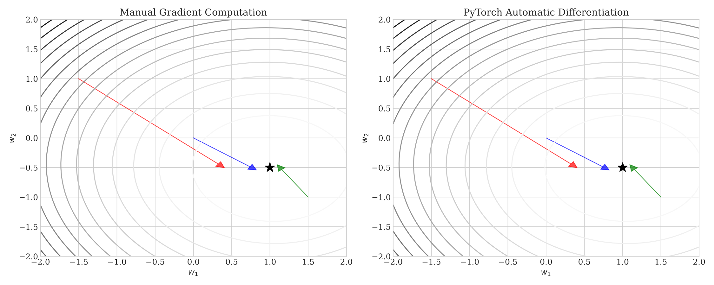
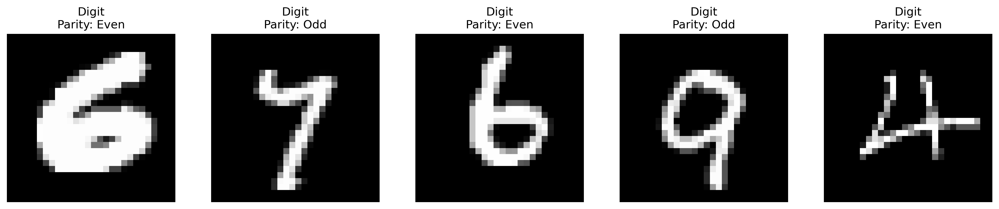

<br><br> <br><br> 

# STAT 4830: Numerical optimization for data science and ML
## Lecture 4: Beyond Least Squares
### From Manual to Automatic Differentiation
### Professor Damek Davis

---

# The Problem: Manual Gradient Computation

Consider computing this gradient by hand:
$$ f(w) = \frac{1}{2}\|\tanh(W_2\text{ReLU}(W_1x + b_1) + b_2) - y\|^2 $$

Challenges:
- Complex chain rule applications
- Error-prone derivations
- Time-consuming process
- Limited to simple functions

---

# The Solution: Automatic Differentiation

<div style="display: grid; grid-template-columns: 1fr 1fr; gap: 2em;">
<div>

PyTorch provides:
```python
# Define complex function
def f(x, W1, b1, W2, b2):
    h = torch.relu(W1 @ x + b1)
    return 0.5 * torch.sum(
        (torch.tanh(W2 @ h + b2) - y)**2
    )

# Get gradient automatically
f.backward()
```

</div>
<div>

Key benefits:
1. Automatic gradient computation
2. Handles any differentiable function
3. Memory efficient implementation
4. Scales to large problems

</div>
</div>

---

# Three Key Ideas

<div style="text-align: center; margin-top: 2em;">

1. **Computational Graph** 
2. **Reverse-Mode Differentiation** 
3. **Memory-Efficient Implementation** 

</div>

<!-- ---

# Motivation: From Least Squares to Neural Networks

In Lecture 3, we minimized least squares using gradient descent:
- Computed gradients manually
- Required careful derivation
- Limited to quadratic objectives

Today we'll see how PyTorch:
- Automates gradient computation
- Handles any differentiable function
- Scales to complex neural networks -->

---

# Outline

<div style="display: grid; grid-template-columns: 1fr 1fr 1fr; gap: 1em;">
<div>

1. Computing Gradients
```
Function → Graph → Gradient
```

</div>
<div>

2. Gradient Descent
```
Gradient → Update → Repeat
```

</div>
<div>

3. Neural Networks
```
Features → Layers → Loss
```

</div>
</div> 

---

# A Simple Example: Polynomial Function

Let's start with a one-dimensional function:

$$ f(x) = x^3 - 3x $$

Manual gradient computation:
$$ \frac{d}{dx}f(x) = 3x^2 - 3 $$

PyTorch automates this:
```python
x = torch.tensor([1.0], requires_grad=True) # Gradient Tracking
y = x**3 - 3*x # Forward Pass
y.backward() # Backward Pass
print(f"f'(1) = {x.grad}") # Gradient Access
```

---


---


# How does PyTorch do this?

- **Forward pass:** When you evaluate a function, PyTorch computes a *computational graph* that records all operations like addition, multiplication, powers, etc.
- **Backward pass:** PyTorch traverses the graph in reverse order to compute the gradient, using what is essentially an efficient implementation of the chain rule.


---
# The graph 


---

# Building the Computational Graph


Each node in the graph:
- Stores output value from forward pass
- Contains function for local gradients
- Maintains references to inputs

For $f(x) = x^3 - 3x$, we build:
1. Input node storing $x$
2. Power node computing $z_1 = x^3$
3. Multiply node computing $z_2 = -3x$
4. Add node forming $f = z_1 + z_2$


---

# Computing Gradients: The Process


**Starting State:**
- Initialize $\frac{\partial f}{\partial f} = 1$ at output
- All other gradients start at 0

**Algorithm:**
1. Process nodes in reverse order
2. Compute local gradients
3. Multiply by incoming gradient
4. Add to input gradients


---

# Gradient Flow: Step by Step

<div style="display: grid; grid-template-columns: 1fr 1fr; gap: 2em;">
<div>

**1. Output Node** ($f = z_1 + z_2$):
- $\frac{\partial f}{\partial f} = 1$
- $\frac{\partial f}{\partial z_1} = 1$, $\frac{\partial f}{\partial z_2} = 1$
- Propagate to both input nodes

**2. Power Node** ($z_1 = x^3$):
- Incoming gradient: 1
- Local gradient: $\frac{\partial z_1}{\partial x} = 3x^2$
- Contribute: $\frac{\partial f}{\partial x} \mathrel{+}= (1)3x^2$


</div>
<div style="text-align: center;">

**3. Multiply Node** ($z_2 = -3x$):
- Incoming gradient: 1
- Local gradient: $\frac{\partial z_2}{\partial x} = -3$
- Contribute: $\frac{\partial f}{\partial x} \mathrel{+}= (1)(-3)$

**4. Input Node** ($x$):
- Accumulates from both paths
- ($-3$) from multiply node
- ($3x^2$) from power node
- Final gradient: $\frac{\partial f}{\partial x} = 3x^2 - 3$


</div>
</div>

---


# Two Implementation Approaches

<div style="display: grid; grid-template-columns: 1fr 1fr; gap: 2em;">
<div>

1. Using `backward()`
```python
# Create graph
x.requires_grad = True
z = g(x)
y = h(z)

# Compute gradients
y.backward()
grad = x.grad  # Stored in tensor
```

Best for:
- Training loops
- Multiple gradients
- Memory efficiency

</div>
<div>

2. Using `autograd.grad()`
```python
# Create graph
x.requires_grad = True
z = g(x)
y = h(z)

# Direct computation
grad = torch.autograd.grad(y, x)[0]
```

Best for:
- One-off gradients
- Direct access
- Higher derivatives

</div>
</div>


---


# From Simple to Complex: Least Squares


Manual gradient:
$$ \nabla f = X^\top(Xw - y) $$


PyTorch gradient:
```python
pred = X @ w
loss = 0.5*((pred - y)**2).sum()
loss.backward()
grad = w.grad
```

---
# Agreement between manual and PyTorch


 

--- 

# The Least Squares Graph: Step by Step

<div style="display: grid; grid-template-columns: 1fr 1fr; gap: 2em;">
<div>

1. Matrix multiply:
   $\mathbf{z}_1 = \mathbf{X}\mathbf{w}$
   - Input: $w \in \mathbb{R}^p$
   - Output: $z_1 \in \mathbb{R}^n$

2. Subtract:
   $\mathbf{z}_2 = \mathbf{z}_1 - \mathbf{y}$
   - Input: $z_1, y \in \mathbb{R}^n$
   - Output: $z_2 \in \mathbb{R}^n$

3. Square norm:
   $z_3 = \|\mathbf{z}_2\|^2$
   - Input: $z_2 \in \mathbb{R}^n$
   - Output: $z_3 \in \mathbb{R}$

</div>
<div style="text-align: center;">


</div>
</div>

---

# Computational Graph


---

# Building the Least Squares Graph

For $f(w) = \frac{1}{2}\|Xw - y\|^2$, we build:
1. Input nodes storing $\mathbf{w}$
2. Residual node computing $\mathbf{z}_1 = \mathbf{X}\mathbf{w} - \mathbf{y}$
3. Square norm node computing $z_2 = \|\mathbf{z}_1\|^2$
4. Scale node forming $f = \frac{1}{2}z_2$

--- 

# Computing Gradients: The Process


**Starting State:**
- Initialize $\frac{\partial f}{\partial f} = 1$ at output
- All other gradients start at 0

**Algorithm:**
1. Process nodes in reverse order
2. Compute local gradients
3. Multiply by incoming gradient
4. Add to input gradients
---

# Least Squares: Gradient Flow Step 1


**Output Node** ($f = \frac{1}{2}z_2$):
- Incoming gradient: $\frac{\partial f}{\partial f} = 1$ (scalar)
- Total derivative: $\frac{\partial f}{\partial z_2} = \frac{1}{2}$ (scalar)
- Propagate to $z_2$ node: $\frac{\partial f}{\partial z_2} = \frac{1}{2}$ (1×1 matrix)


---

# Least Squares: Gradient Flow Step 2


**Square Norm Node** ($z_2 = \|\mathbf{z}_1\|^2$):
- Incoming total derivative: $\frac{\partial f}{\partial z_2} = \frac{1}{2}$ (1×1 matrix)
- Local total derivative: $\frac{\partial z_2}{\partial \mathbf{z}_1} = 2\mathbf{z}_1^\top$ (1×n matrix)
- Propagate to $\mathbf{z}_1$ node: $\frac{\partial f}{\partial \mathbf{z}_1} = \frac{\partial f}{\partial z_2}\frac{\partial z_2}{\partial \mathbf{z}_1} = \mathbf{z}_1^\top$ (1×n matrix)


---

# Least Squares: Gradient Flow Step 3


**Residual Node** ($\mathbf{z}_1 = \mathbf{X}\mathbf{w} - \mathbf{y}$):
- Incoming total derivative: $\frac{\partial f}{\partial \mathbf{z}_1} = \mathbf{z}_1^\top$ (1×n matrix)
- Local total derivative: $\frac{\partial \mathbf{z}_1}{\partial \mathbf{w}} = \mathbf{X}$ (n×p matrix)
- Total derivative to $\mathbf{w}$ node: $\frac{\partial f}{\partial \mathbf{w}} = \mathbf{z}_1^\top\mathbf{X}$ (1×p matrix)


---

# Least Squares: Final Step


**Input Node** ($\mathbf{w}$):
- Total derivative: $\frac{\partial f}{\partial \mathbf{w}} = \mathbf{z}_1^\top\mathbf{X}$ (1×p matrix)
- Convert to gradient: $\nabla f = (\frac{\partial f}{\partial \mathbf{w}})^\top = \mathbf{X}^\top\mathbf{z}_1$ (p×1 matrix)


Final computation:
$$ \nabla f = \mathbf{X}^\top(\mathbf{X}\mathbf{w} - \mathbf{y}) $$


---

# Building Neural Networks: The Architecture

<div style="display: grid; grid-template-columns: 1fr 1fr; gap: 2em;">
<div>

Layer composition:
```
Input → Linear₁ → Tanh → Linear₂ → Output
ℝᵈ      ℝʰˣᵈ      ℝʰ     ℝ¹ˣʰ     [0,1]
```

Each layer:
1. Linear transform
2. Nonlinear activation
3. Gradient tracking

</div>
<div style="text-align: center;">


PyTorch handles:
- Parameter management
- Forward computation
- Backward gradients

</div>
</div>

---

# Neural Network Implementation

<div style="display: grid; grid-template-columns: 1fr 1fr; gap: 2em;">
<div>

```python
class BinaryClassifier(nn.Module):
    def __init__(self, input_dim, 
                 hidden_dim):
        super().__init__()
        # First layer
        self.linear1 = nn.Linear(
            input_dim, hidden_dim
        )
        # Second layer
        self.linear2 = nn.Linear(
            hidden_dim, 1
        )
    
    def forward(self, x):
        # Hidden features
        h = torch.tanh(self.linear1(x))
        # Output probability
        return torch.sigmoid(
            self.linear2(h)
        )
```

</div>
<div>

Key components:
1. **Parameter Management**
   - Automatic registration
   - Gradient tracking
   - Memory optimization

2. **Layer Organization**
   - Modular design
   - Easy composition
   - Clear data flow

3. **Activation Functions**
   - Built-in nonlinearities
   - Automatic gradients
   - Efficient implementation

</div>
</div>

---

# MNIST Classification: The Task

<div style="display: grid; grid-template-columns: 1fr 1fr; gap: 2em;">
<div style="text-align: center;">



Dataset:
- 60,000 training images
- 10,000 test images
- 28×28 pixels each
- Binary labels (odd/even)

</div>
<div>

Preprocessing:
```python
transform = transforms.Compose([
    transforms.ToTensor(),
    transforms.Normalize(
        (0.1307,), (0.3081,)
    )
])

# Load data
train_dataset = datasets.MNIST(
    './data', 
    train=True,
    transform=transform
)
```

</div>
</div>

---

# Model Comparison: Architecture

<div style="display: grid; grid-template-columns: 1fr 1fr; gap: 2em;">
<div>

Logistic Regression:
```python
class Logistic(nn.Module):
    def __init__(self):
        super().__init__()
        self.linear = nn.Linear(784, 1)
    
    def forward(self, x):
        # Single linear layer
        return torch.sigmoid(
            self.linear(x.view(-1, 784))
        )
```

</div>
<div>

Neural Network:
```python
class SimpleNN(nn.Module):
    def __init__(self):
        super().__init__()
        self.fc1 = nn.Linear(784, 32)
        self.fc2 = nn.Linear(32, 1)
    
    def forward(self, x):
        # Hidden layer with ReLU
        h = torch.relu(
            self.fc1(x.view(-1, 784))
        )
        # Output layer
        return torch.sigmoid(self.fc2(h))
```

</div>
</div>

---

# Training Process: Step by Step

```python
def train_model(model, train_loader, optimizer, epochs=5):
    criterion = nn.BCELoss()
    for epoch in range(epochs):
        for batch_idx, (data, target) in enumerate(train_loader):
            # 1. Zero gradients
            optimizer.zero_grad()
            
            # 2. Forward pass
            output = model(data)
            loss = criterion(output, target.float())
            
            # 3. Backward pass
            loss.backward()
            
            # 4. Update weights
            optimizer.step()
            
            # 5. Log progress
            if batch_idx % 100 == 0:
                print(f'Loss: {loss.item():.4f}')
```

PyTorch handles all gradient computation automatically.

---

# Results Analysis

<div style="display: grid; grid-template-columns: 1fr 1fr; gap: 2em;">
<div style="text-align: center;">


Training progress:
- Faster neural net learning
- Higher final accuracy
- Better generalization

</div>
<div>

Final Results:
- Logistic: 87.30% accuracy
- Neural Net: 92.40% accuracy

Key differences:
1. Feature learning
2. Nonlinear boundary
3. Better capacity

</div>
</div>

---

# Key Takeaways

<div style="text-align: center; margin-top: 2em;">

1. **Automatic Differentiation**
   - Builds computational graphs
   - Implements chain rule efficiently
   - Handles any differentiable function
   - Scales to complex networks

2. **Memory Efficiency**
   - Never forms large matrices
   - Uses matrix-vector products
   - Enables large-scale optimization
   - Scales to deep networks

3. **PyTorch Implementation**
   - Simple interface
   - Automatic gradients
   - Memory management
   - Production ready

</div>

---

# Next Steps

<div style="text-align: center; margin-top: 2em;">

1. **Advanced Optimization**
   - Stochastic gradients
   - Adaptive methods
   - Second-order techniques

2. **Deep Learning**
   - Complex architectures
   - Custom loss functions
   - Training strategies

3. **Try it yourself!**
   [](https://colab.research.google.com/github/damek/STAT-4830/blob/main/section/4/notebook.ipynb)

</div>

---

# Questions?

<div style="text-align: center; margin-top: 4em;">

- Course website: [https://damek.github.io/STAT-4830/](https://damek.github.io/STAT-4830/)
- Office hours: Listed on course website
- Email: [damek@wharton.upenn.edu](mailto:damek@wharton.upenn.edu)
- Discord: Check email for invite

</div> 