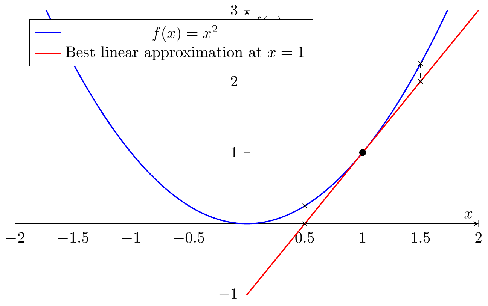
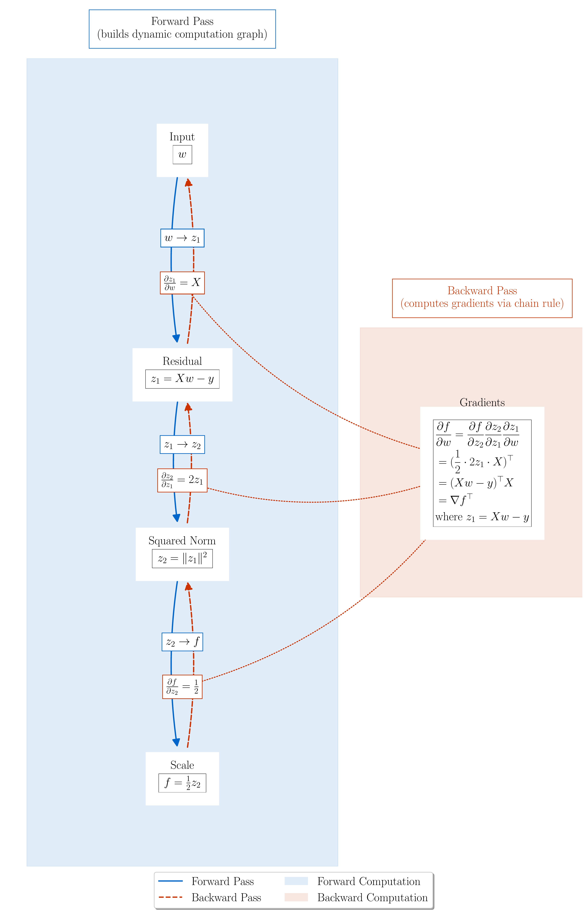

# How to think about derivatives through best linear approximation

## Notebooks and Slides
- [Lecture slides](slides.pdf)

## Table of contents
1. [Introduction](#introduction)
2. [Derivative in 1D](#derivative-in-1d)
3. [Extending to Higher Dimensions: the gradient](#extending-to-higher-dimensions-the-gradient)
4. [Extending to Higher Dimensions: the Jacobian](#extending-to-higher-dimensions-the-jacobian)
5. [Chain Rule: Composition of Best Linear Approximations](#chain-rule-composition-of-best-linear-approximations)

## Introduction

In this lecture, we explore a simple perspective on calculus: the derivative (or Jacobian in higher dimensions) is the best linear approximation of a function at a point. This viewpoint unifies single-variable and multivariable calculus, while revealing why the chain rule works - it's simply the composition of these best linear approximations. 

Why teach this? Because autodifferentiation is essentially an efficient way to implement the chain rule. We'll touch on this at the end, revisiting the gradient of the least squares loss.

## 1. Derivative in 1D

The **derivative** of a real-valued function in one dimension quantifies how the output changes *per unit change* in the input. We begin with a familiar example of a polynomial and then generalize to the formal definition using limits and *Landau notation* for error terms. This will prepare us for working with derivatives in higher dimensions.

### The derivative of a polynomial

If $f(x) = x^n$ (a monomial), then the derivative is $f'(x) = n x^{\,n-1}$. For a general polynomial $f(x) = a_0 + a_1 x + \cdots + a_n x^n$, differentiation follows linearity and the power rule term-by-term, giving 

  
$$
f'(x) = a_1 + 2a_2 x + 3a_3 x^2 + \cdots + n\,a_n x^{\,n-1}.
$$

For instance, if $f(x) = 5x^3 - 2x + 7$, then $f'(x) = 15x^2 - 2$.

### The limit definition of the derivative

In general, the derivative $f'(a)$ at a point $x=a$ is defined by the limit
  
$$
f'(a) \;=\; \lim_{h \to 0} \frac{f(a+h) - f(a)}{h},
$$
 
provided this limit exists. This is the *difference quotient* approach: it measures the average rate of change of $f$ over an interval of length $h$, then takes the limit as $h$ shrinks to $0$. When the limit exists, we say $f$ is *differentiable* at $x=a$. The derivative $f'(a)$ equals the slope of the line connecting $(a, f(a))$ and $(a+h, f(a+h))$ in the limit of small $h$.

### Landau’s little-$o$ notation

If $f$ is differentiable at $x=a$, we can write the change in $f$ for a small increment $h$ as: 
  
$$
f(a+h) = f(a) + f'(a)\,h + o(h) \qquad (h \to 0).
$$
 
This equation formalizes the idea that **the linear term $f'(a)\,h$ is the dominant term** in the increment of $f$ for small $h$. The notation $o(h)$ means *some function of $h$ that goes to 0 faster than $h$ itself* (precisely, $\lim_{h\to0} \frac{o(h)}{h} = 0$). In other words, as $h\to0$, the error term $o(h)$ becomes negligible compared to the linear term $f'(a)\,h$. Thus, 
  
$$
f(a+h) = f(a) + f'(a)\,h + \text{(smaller order terms)}.
$$

### The best linear approximation

The derivative provides the **best linear approximation** to the function near $x=a$. Geometrically, the line 
  
$$
L(x) = f(a) + f'(a)\,(x - a)
$$
 
is the *tangent line* to $y=f(x)$ at $x=a$. For values of $x$ close to $a$, $L(x)$ is very close to $f(x)$. No other line can approximate $f(x)$ near $a$ as well as this tangent line does. Indeed, one way to phrase the definition of differentiability is: $f$ is differentiable at $a$ if there exists a linear function $L(h) = c\,h$ such that 

$$
f(a+h) = f(a) + L(h) + o(h);
$$

in that case $c = f'(a)$ is unique. Intuitively, among all linear functions, $y = f(a) + c\,h$, the choice $c = f'(a)$ makes $f(a) + c\,h$ the closest to $f(a+h)$ for small $h$. (If you don't see why, check out [this stackoverflow post](https://math.stackexchange.com/questions/1784262/how-is-the-derivative-truly-literally-the-best-linear-approximation-near-a-po#:~:text=,function%20for%20values%20near%20x)). In summary, $f'(a)$ captures the *instantaneous rate of change* of $f$ at $a$, and $f'(a)\,h$ is the best linear prediction of the change in $f$ when the input changes by $h$.

### Visualization (tangent line):

Imagine a smooth curve representing $y=f(x)$. At the point $(a, f(a))$, draw the tangent line with slope $f'(a)$. This line touches the curve at $x=a$ and for points $x$ very close to $a$, the tangent line’s $y$-values are almost the same as the curve’s $y$-values. This geometric picture underlies the notion of best linear approximation. If one zooms in sufficiently close to a differentiable curve, it becomes nearly indistinguishable from its tangent line. 

### Relationship to Taylor series:

The linear approximation is actually the first-order truncation of the Taylor series. If $f$ is twice differentiable, one can write 
  
$$
f(a+h) = f(a) + f'(a)\,h + \frac{f''(a)}{2}h^2 + \cdots.
$$
 
Truncating after the linear term gives the same formula as above, $f(a+h) \approx f(a) + f'(a)h$, with a quadratic (or higher order) error term. In the differentiable case (even without a second derivative), $f(a+h) = f(a) + f'(a)h + o(h)$ is essentially saying *“$f(a+h)$ equals its first-order Taylor expansion plus a smaller error”*. 

### The chain rule in 1D

The chain rule describes how to differentiate *compositions* of functions. If $y = f(u)$ and $u = g(x)$ are differentiable (with $y$ depending on $x$ through $u$), then the derivative of the composite $y = f(g(x))$ is 
  
$$
(f \circ g)'(x) \;=\; f'\!\big(g(x)\big)\,\cdot\,g'(x).
$$
 
In Leibniz notation, if $y=f(u)$ and $u=x$, this is $\frac{dy}{dx} = \frac{dy}{du}\frac{du}{dx}$. The chain rule follows from the a simple argument using the best linear approximation, which we state below since we will prove a multivariable version later: 

The main ideas is that since $f$ and $g$ are differentiable, we can write
$$
\begin{aligned}
f(u+h) &= f(u) + f'(u)\,h + o(h), \\
g(x+k) &= g(x) + g'(x)\,k + o(k).
\end{aligned}
$$

Now, if we let $u = g(x)$ and $h = k$, we get
$$
\begin{aligned}
f(g(x+k)) &= f(g(x)) + f'(g(x))\,(g(x+k) - g(x)) + o(g(x+k) - g(x))\\
&= f(g(x)) + f'(g(x))\,(g'(x)\,k + o(k)) + o(g'(x)\,k + o(k))\\
&= f(g(x)) + f'(g(x))\,g'(x)\,k + o(k).
\end{aligned}
$$

Notice that this formula is equivalent to saying that 
$$
\lim_{k\to 0} \frac{f(g(x+k)) - f(g(x)) - f'(g(x))\,g'(x)\,k}{k} = 0, 
$$
so the derivative of $f \circ g$ at $x$ is $f'(g(x))\,g'(x)$.

*Special cases of the chain rule in 1D include common differentiation rules:* 

**Constant multiple and sum rules:** $(c\cdot f(x))' = c\,f'(x)$ and $(f(x)+g(x))' = f'(x) + g'(x)$. These hold because differentiation is a linear operation.  

**Product rule:** 
$$(f(x)\cdot g(x))' = f'(x)\,g(x) + f(x)\,g'(x).$$ 
This can be derived from the chain rule by viewing the product as a two-variable function composed with each function’s output. For example, define $H(u,v) = u \cdot v$ (so $\partial H/\partial u = v$, $\partial H/\partial v = u$). If $u = f(x)$ and $v = g(x)$, then by the multivariable chain rule (explained later), $dH/dx = \frac{\partial H}{\partial u}u'(x) + \frac{\partial H}{\partial v}v'(x) = v \cdot f'(x) + u \cdot g'(x)$, which is exactly the product rule.  

**Quotient rule:**   $$(f(x)/g(x))' = \frac{f'(x)g(x) - f(x)g'(x)}{[g(x)]^2},$$ provided $g(x)\neq 0$. This can be derived similarly or by writing $f/g = f \cdot g^{-1}$ and using the product rule and chain rule ($d(g^{-1})/dx = -g^{-2} g'$). These 1D concepts set the stage: the derivative $f'(a)$ gives a linear function $h \mapsto f'(a)\,h$ that best approximates $f(a+h)$ for small $h$. Next, we extend this idea to higher dimensions, where **Jacobians** and **gradients** play the role of the derivative.

## Extending to Higher Dimensions: The gradient

When dealing with functions of several variables, the derivative generalizes to the **Jacobian matrix** (for vector-valued functions) and the **gradient vector** (for scalar-valued functions). The Jacobian encapsulates all first-order partial derivatives and provides the best linear approximation in multiple dimensions, just as $f'(a)$ did in 1D.

### From slope to gradient

Consider a function $f:\mathbb{R}^n \to \mathbb{R}$ (one output, $n$ inputs). The *partial derivative* of $f$ with respect to the $j$-th input $x_j$ at point $x$ is defined as 
  
$$
\frac{\partial f}{\partial x_j}(x) = \lim_{h\to0} \frac{f(x_1,\dots,x_j+h,\dots,x_n) - f(x_1,\dots,x_n)}{h}.
$$
 
  This measures the sensitivity of $f$ to small changes in $x_j$, holding the other coordinates fixed. The **gradient** of $f$ at $x$, denoted $\nabla f(x)$, is the vector of all partials: 
  
$$
\nabla f(x) = \Big(\frac{\partial f}{\partial x_1}(x), \; \frac{\partial f}{\partial x_2}(x), \; \dots, \; \frac{\partial f}{\partial x_n}(x)\Big).
$$
 
  We can think of $\nabla f(x)$ as an $n\times 1$ column vector or a $1\times n$ row vector; by convention in optimization, $\nabla f(x)$ is often treated as a column vector. The gradient is the higher-dimensional analog of the derivative (slope): it points in the direction of steepest increase of $f$ and its components are the slopes along each coordinate axis.

### An alternative definition of the gradient via best linear approximation in $\mathbb{R}^n$

In multivariable calculus, you probably learned to define the gradient of a function in terms of its partial derivatives as we did above. This is not the most useful definition in higher dimensions. Instead, it's more convenient to **define the gradient** via the concept of the *best linear approximation*. More specifically, we say that $f \colon \mathbb{R}^n \to \mathbb{R}$ is differentiable at $x$ if there exists a vector $c \in \mathbb{R}^n$ such that for all $h \in \mathbb{R}^n$ we have 

$$
f(x+h) = f(x) + c^\top h + o(\|h\|).
$$

where $o(\|h\|)$ is a function that goes to zero faster than $\|h\|$ as $h\to 0$, i.e., $\lim_{h\to 0} \frac{o(\|h\|)}{\|h\|} = 0$. Note that the above is just a restatement of the following limit formula: 

$$
\lim_{h\to 0} \frac{f(x+h) - f(x) - c^\top h}{\|h\|} = 0.
$$

In turns out any such $c$ is unique and we call it the *gradient of $f$ at $x$*, i.e., $\nabla f(x) = c$. 

When such a ``gradient" exists it satisfies the familiar formula in terms of partial derivatives (check!), but it turns out the converse is not true! For example, the function 

$$
f(x,y) = \begin{cases}
    \frac{xy}{x^2 + y^2} & \text{if } (x,y) \neq (0,0) \\
    0 & \text{if } (x,y) = (0,0)
\end{cases}
$$

has partial derivatives that exist at the origin, but the best linear approximation formula does not hold at the origin (check!). In other words, there are directions $h$ in which which we have:

$$
\lim_{h\to 0} \frac{f(x+h) - f(x) - \nabla f(x)^\top h}{\|h\|} \neq 0.
$$

This is because the existence of the partial derivative only buys us approximation in the directions of the coordinate vectors $e_i$, meaning: 

$$
f(x + \lambda e_i) = f(x) + \lambda \frac{\partial f}{\partial x_i}(x) + o(\lambda), \quad \forall i \in [n].
$$

This is not enough to guarantee that the best linear approximation formula holds in ALL directions $h$. 

 
From both geometric and analytic perspectives it's actually much more convenient to work with the best linear approximation definition. On the one hand, we'll later see how it let's us derive the chain rule in multivariable calculus in an analytic way. On the other hand, it conforms to our geometric intuition that the set of points $\{ (x,f(x) + \nabla f(x)^\top h) \colon  h \in \mathbb{R}^n \}$ is a hyperplane tangent to the graph of $f$ at $x$. The gradient $\nabla f(x)$ is then perpendicular (normal) to that tangent hyperplane.

## Extending to higher dimensions: the Jacobian

When extending from the scalar-valued setting $f: \mathbb{R}^n \to \mathbb{R}$ to the more general vector-valued setting $F: \mathbb{R}^n \to \mathbb{R}^m$, it is also useful to focus on the **best linear approximation** viewpoint. Relying purely on coordinate-wise partial derivatives can obscure what is happening in all directions simultaneously and can lead to situations where the partial derivatives exist but *no* single linear map approximates the function well in every direction.

### Jacobians as partial derivative matrices

The conventional multivariable-calculus way to define the **Jacobian** of

$$
F(x) \;=\; \bigl(f_1(x),\; f_2(x),\; \ldots,\; f_m(x)\bigr)
$$

relies on partial derivatives:

$$
J_F(x) \;=\;
\begin{pmatrix}
\frac{\partial f_1}{\partial x_1}(x) & \cdots & \frac{\partial f_1}{\partial x_n}(x)\\
\vdots & \ddots & \vdots \\
\frac{\partial f_m}{\partial x_1}(x) & \cdots & \frac{\partial f_m}{\partial x_n}(x)
\end{pmatrix}.
$$

Equivalently, each row of $J_F(x)$ is $\nabla f_i(x)^\top$. But as with the gradient in the scalar case, **the existence of all these partial derivatives does *not* guarantee** that $F$ has a well-defined *global* linear approximation in every direction near $x$. Partial derivatives only ensure linear approximation along the coordinate axes. In higher dimensions, that is insufficient to ensure overall differentiability if different directions misbehave.

### Best Linear Approximation approach

A more fundamental, and more powerful, definition of differentiability of a function $F: \mathbb{R}^n \to \mathbb{R}^m$ insists that there exist a linear map $A: \mathbb{R}^n \to \mathbb{R}^m$ such that

$$
F(x + h)
\;=\;
F(x) \;+\; A\,h \;+\; o\!\bigl(\|h\|\bigr),
$$

for *all* directions $h \in \mathbb{R}^n$. Equivalently:

$$
\lim_{h\to0} \;\frac{\|F(x+h) - F(x) - A\,h\|}{\|h\|}
\;=\;
0.
$$

When such a linear map $A$ exists, it is *unique* and we call it the **Jacobian** of $F$ at $x$. We often write $A = J_F(x)$. This definition naturally extends the notion of “best linear approximation” we used in the scalar case:

- $\\|F(x+h) - F(x) - A\,h\\|$ is the error of approximating $F(x+h)$ by $F(x) + A\,h$.
- Saying it’s $o(\\|h\\|)$ means the linear approximation outperforms any constant or sublinear approximation as $\|h\|\to0$, i.e., $\lim_{h\to0} \frac{o(\\|h\\|)}{\\|h\\|} = 0$.

This approach clarifies what it means to be *differentiable* in multiple dimensions: **there is exactly one linear transformation** $A$ that can approximate the change in $F$ for small $\|h\|$. Having partial derivatives in the sense of each coordinate direction is not enough unless these partials piece together into a consistent linear map across *all* directions.

### Parallel to the Gradient

When $m=1$, the map $J_F(x)$ is just $\nabla f(x)^\top$. This is precisely the best linear approximation in the scalar-to-scalar case, generalized to the vector input scenario:

$$
f(x + h)
\;=\;
f(x) \;+\; \bigl(\nabla f(x)\bigr)^\top h \;+\; o(\|h\|).
$$

Here, $\nabla f(x)$ is an $n$ dimensional vector whose dot product with $h$ gives the linear approximation in each direction. 

### Jacobian matrix vs. Jacobian-vector products: Equivalent but more efficient

In high dimensions, forming the entire Jacobian matrix explicitly is usually impractical due to memory and computational cost. Instead, one often computes **Jacobian-vector products (JVPs)** or **vector-Jacobian products (VJPs)** on the fly. For example, if we want to apply the chain rule (discussed next) to propagate a gradient through a network, we don’t explicitly construct the Jacobian of each layer. Instead, we multiply the current gradient (as a row vector) by the Jacobian of the next layer (a process often called a *backpropagation step*). This yields the new gradient for the preceding layer. By doing this recursively, we obtain the gradient of the overall function with respect to all inputs without ever storing large Jacobian matrices. The idea is: use linearity $J_F(x) h$ or $u^T J_F(x)$ as needed, rather than storing $J_F(x)$ itself. Modern autodiff frameworks are built around this principle – they *compose linear maps* rather than materializing them. We’ll expand on this idea in the context of the chain rule below.

#### Aside: if you can multiply by a matrix, you know every entry

Suppose that $A \in \mathbf{R}^{m \times n}$ and that we know how to multiply by $A$. Then we can compute every entry of $A$ by "testing" it's value on the standard basis vectors $e_1, \ldots, e_n$. Indeed, since $A e_j$ is just the $jth$ column of $A$, we can can access 

$$A_{ij} = (Ae_j)_i$$

This fact tells us that there is usually no point of ever writing down all the entries of a matrix if one can easily multiply by $A$. We won't dwell on them here, but this has tremendous consequences for numerical algorithms. For now, we just show in the next section that it enables to determine the Jacobian of a function of matrices without ever writing down all the entries of the Jacobian.

### Computing complex jacobians using best linear approximation definition

In machine learning and optimization, we often encounter mappings that take **matrices as inputs**. For example, the parameters of a model might be organized in matrices (weight matrices in neural networks). Mathematically, a matrix can be thought of as a point in $\mathbb{R}^N$ (with $N$ equal to the number of entries this can cause more confusion than clarity. Here we will work directly with the coordinate-free approach to derive the Jacobian of a function of matrices.

Let's consider the function of a variable $W \in \mathbb{R}^{n \times m}$:

$$
F(W) = W^T W
$$

The Jacobian of this function is a linear map $J_F(W) \colon \mathbb{R}^{n \times m} \to \mathbb{R}^{n \times m}$. Now we could go through the whole process of flattening W and computing each entry of the Jacobian, but this would be overkill (there are $(nm)^2$ entries). What we will do instead is figure out how $J_F(W)$ acts on an arbitrary direction $V \in \mathbb{R}^{n \times m}$. As we just saw, this will be enough to fully specify the jacobian.

To see how the Jacobian acts on an arbitrary direction $V \in \mathbb{R}^{n \times m}$, we simply expand the RHS 

$$
\begin{aligned}
F(W + V) &= (W + V)^T (W + V) \\
&= W^T W + W^T V + V^T W + V^T V \\
&= F(W) + \underbrace{W^T V + V^T W}_{J_F(W) V} + o(\|V\|).
\end{aligned}
$$

Thus, given a matrix $V$, the Jacobian $J_F(W) \in \mathbb{R}^{n \times m} \to \mathbb{R}^{n \times m}$ satisfies

$$
J_F(W) V = W^T V + V^T W.
$$

This is all we need to know about the Jacobian of $F$! 

#### Exercise

To test your intuition, try to compute the Jacobian of the mapping $F\colon \mathbf{R}^{n \times m} \to \mathbf{R}^{n \times m} \rightarrow \mathbf{R}^{n \times n}$ given by $F(U,V) = UV^T$ using the best linear approximation defintion. Again, you only need to figure out how $J_F(U,V)$ acts on an arbitrary direction $(H,K) \in \mathbf{R}^{n \times m} \times \mathbf{R}^{n \times m}$, rather than each entry of the Jacobian.

### Existence of Partials vs. True Differentiability

The example $F(x,y) = \tfrac{xy}{x^2 + y^2}$ at $(0,0)$ illustrates that existence of partial derivatives does not imply differentiability. Thus, for vector-valued functions: partial derivatives might exist, yet no *single* linear map approximates the function in *every* direction near $x$. 

Hence the coordinate-free definition is *strictly stronger*. It tells us whether, in *all* directions in $\mathbb{R}^n$, the difference $F(x+h) - F(x) - A h$ is negligible in norm compared to $\|h\|$. If that criterion holds, we have a well-defined Jacobian matrix $J_F(x)$ that acts on a direction $h$ to predict how $F$ changes in that direction.

## Chain Rule: Composition of Best Linear Approximations

The **chain rule** is a fundamental result that describes how the derivative (Jacobian) of a composite function is the product of the derivatives (Jacobians) of the constituent functions. In the language of linear approximations: *the best linear approximation to a composition is the composition of the best linear approximations.* This is intuitive! 

We present the formal statement, verify it with a calculation, and then discuss various applications and interpretations, including its role in automatic differentiation.

### Formal statement (multi-dimensional chain rule)

Consider two differentiable functions $F$ and $G$ mapping as follows:
$$
\mathbb{R}^{p} \stackrel{\mathbf{G}}{\longrightarrow} \mathbb{R}^{m} \stackrel{\mathbf{F}}{\longrightarrow} \mathbb{R}^{n}
$$
Then the Jacobian of their composition $H = F \circ G$ is given by the product of the Jacobians of $F$ and $G$:

$$
J_H(x) = J_F(G(x)) \cdot J_G(x)
$$

The proof of this is actually identical to the proof of the single-variable chain rule. Indeed, we know that 
- $F(x+h) = F(x) + J_F(x) h + o(\|h\|)$
- $G(y+k) = G(y) + J_G(y) k + o(\|k\|)$

Therefore, the composition satisfies 

$$
\begin{aligned}
H(x+k) &= F(G(x+k)) \\
&= F(G(x) + \underbrace{(G(x+k) - G(x))}_{:=h})\\
&= F(G(x)) + J_F(G(x))h + o(\|h\|).
\end{aligned}
$$

Noting that 

$$
h = G(x+k) - G(x) = J_G(x)k + o(\|k\|)
$$ 

We have 
$$
J_F(G(x))h = J_F(G(x))(J_G(x)k + o(\|k\|)) = J_F(G(x))J_G(x)k + o(\|k\|)
$$

Putting it all together, we have 

$$
H(x+k) = H(x) + J_F(G(x))J_G(x)k + o(\|k\|)
$$

which is exactly the chain rule.

### Immediate applications of the chain rule

The chain rule is very general, and many familiar differentiation rules in single-variable calculus can be viewed as special cases or direct consequences:

**Derivative along a curve:** If $x(t)$ is a parametric curve in $\mathbb{R}^n$ (i.e. $x: \mathbb{R} \to \mathbb{R}^n$) and $f:\mathbb{R}^n \to \mathbb{R}$ is a scalar field, then the composite $h(t) = f(x(t))$ is a single-variable function. The chain rule says 
    
$$
h'(t) = \nabla f(x(t)) \cdot x'(t).
$$
 
Here $\nabla f(x(t))$ is a $1 \times n$ row vector and $x'(t)$ is an $n \times 1$ column vector (the time-derivative of each coordinate of $x$). Their product is scalar, equal to $\sum_{j=1}^n \frac{\partial f}{\partial x_j}(x(t))\,\frac{dx_j}{dt}$. This is intuitively the *rate of change of $f$ along the trajectory $x(t)$*, and is often called the **directional derivative** of $f$ in the direction $x'(t)$. For example, if $x(t)$ describes a path a particle takes through space, and $f(x)$ is a temperature field, then $h'(t)$ gives the rate at which temperature changes for the moving particle.

**Sum rule:** For $h(x) = f(x) + g(x)$, we can consider $h$ as the composition of a simple addition function $A(u,v)=u+v$ with the tuple $(f(x), g(x))$. The Jacobian of $A(u,v)$ with respect to $(u,v)$ is $[1\;\;1]$ (since $\partial (u+v)/\partial u = 1$ and $\partial (u+v)/\partial v = 1$). By chain rule, 
    
$$
h'(x) = [1\;\;1] \begin{pmatrix}f'(x) \\ g'(x)\end{pmatrix} = f'(x) + g'(x).
$$
 
This works similarly in higher dimensions: $\nabla (f+g)(x) = \nabla f(x) + \nabla g(x)$. The sum rule is essentially a reflection of the linearity of differentiation.

**Product rule:** As mentioned earlier, one can derive the single-variable product rule via a two-variable chain rule. Let $u(x)=f(x)$ and $v(x)=g(x)$, and $P(u,v) = u \cdot v$. The Jacobian of $P(u,v)$ with respect to $(u,v)$ is $[\;v \;\;,\; u\;]$ (a $1\times 2$ matrix, since $\frac{\partial}{\partial u}(uv)=v$ and $\frac{\partial}{\partial v}(uv)=u$). The chain rule gives 
    
$$
\frac{d}{dx}[f(x)g(x)] = [\,v\;\;u\,] \begin{pmatrix} f'(x) \\ g'(x) \end{pmatrix} = v(x)\,f'(x) + u(x)\,g'(x),
$$
 
which is exactly the product rule. In multivariable settings, there is a product rule for gradients as well, but it requires distinguishing which variable is being differentiated (for instance, product rule for scalar fields vs. for dot products of vector fields). Nonetheless, all are consequences of linear approximation applied to product operations.

**Quotient rule:** Similarly, $f(x)/g(x)$ can be treated as $Q(u,v) = u/v$ composed with $u=f(x)$, $v=g(x)$. The partial derivatives of $Q(u,v)$ are $\partial Q/\partial u = 1/v$ and $\partial Q/\partial v = -u/v^2$. Applying the chain rule yields the standard quotient rule formula given earlier.
  
## Autodiff and the chain rule

The chain rule is the backbone of **automatic differentiation (AD)**, especially the *backpropagation* algorithm used to train neural networks. In a computational graph (a series of composed operations), the gradient of the final output with respect to any intermediate quantity is obtained by iteratively applying the chain rule. For example, if a network’s output (loss) $L$ ultimately depends on a weight $w$ through many layers of composed functions, the gradient $\frac{\partial L}{\partial w}$ is computed by traversing the graph from $L$ back to $w$, multiplying gradients along the way as dictated by the chain rule. Each node applies the chain rule formula to propagate the influence of $w$ on $L$. In code, this means each operation knows how to compute its output given inputs (forward pass) and also how to compute the *gradient of its output with respect to its inputs* given the gradient of its output (backward pass). These backward-pass rules are precisely the partial derivatives required by the chain rule. By the end of backpropagation, one obtains the gradient of $L$ with respect to all parameters. The entire process is a direct application of the chain rule, just organized efficiently. As an example, PyTorch’s autograd engine builds a graph of $F$ and $G$ compositions and then calls backward, effectively performing the matrix multiplications $J_G \cdot J_F$ for all such compositions to get the final result.

### A quick example: the least squares loss

In [section 4](../4/notes.md), we saw how PyTorch computed the gradient of the least     squares loss by forming a computational graph and traversing it in reverse. In essenece this is simply a way to compute the Jacobian (or it's transpose, the gradient) for the composition $H = h \circ g \circ f$ of the three operations: 

$$
\mathbb{R}^n \stackrel{f(w) = Xw - y}{\longrightarrow} \mathbb{R}^n \stackrel{g(z) = \|z\|^2}{\longrightarrow} \mathbb{R} \stackrel{h(a) = 1/2}{\longrightarrow} \mathbb{R}
$$

Now let's think through each of these operations: 

- The mapping $f(w) = Xw - y$ is linear, so its Jacobian is simply $X$. 
- The mapping $g(z) = \|z\|^2$ has gradient $2z$, so it's Jacobian is $2z^\top$.
- The mapping $h(a) = (1/2) a$ has jacobian $1/2$. 

Composing these, we get 

$$
J_H(w) = J_h(g(f(w))) J_g(f(w)) J_f(w) = \frac{1}{2} 2 (Xw - y)^\top X = (X^\top (Xw - y))^\top.
$$

which is exactly the process of traversing the graph in reverse order and multiplying out it's Jacobians. This is the backpropagation algorithm.

Someone kinda won a nobel prize for popularizing it.

