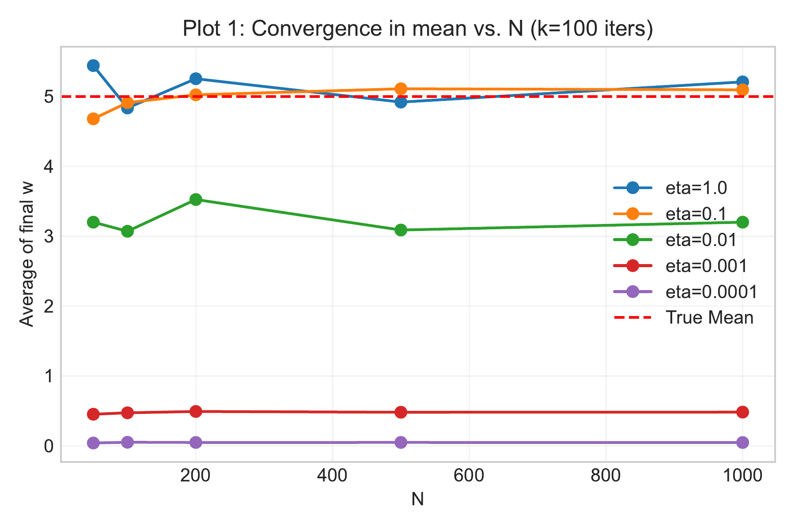
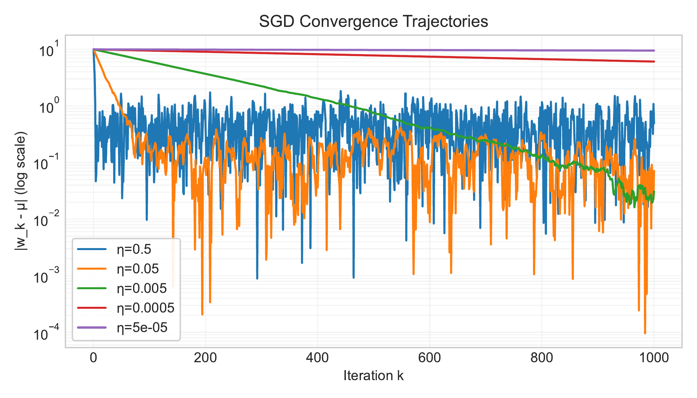
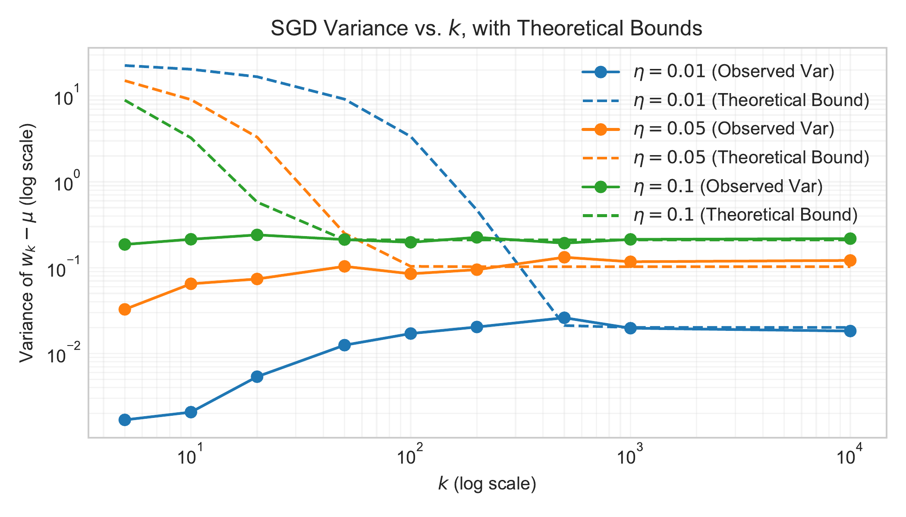

# Stochastic gradient descent: A first look

## Table of contents
1. [Introduction](#introduction)
2. [Stochastic gradient descent for large $n$ problems](#stochastic-gradient-descent-for-large-n-problems)
3. [Convergence in mean](#convergence-in-mean)
4. [Variance of the estimator](#variance-of-the-estimator)

## Introduction

In this lecture, we address the computational challenges of solving a least squares problem when the number of samples $n$ is extremely large (often called the "big $n$" scenario). In previous lectures, we successfully applied full-batch gradient descent and even derived a closed-form solution for least squares. However, as $n$ grows into the millions or billions, naïve approaches break down due to memory and runtime constraints. To illustrate:

**Memory limitations:** Storing all $n$ samples in memory can be infeasible. For example, attempting to load a dataset of size $n = 10^{10}$ (10 billion samples) on a MacBook Pro with 64GB RAM results in an out-of-memory error. Even if each sample is simply an 8-byte float, the total memory required is $80$GB, which exceeds available RAM.

**Computation time:** Even a simple algorithm like gradient descent becomes *very slow* for large $n$ even with small $p = 10$. The cost per iteration scales linearly with $n$ because we must sum over all samples to compute the gradient. In a previous lecture, we noted that one full gradient descent step takes $O(pn)$ time. If $n$ is huge, just 100 iterations could be prohibitively time-consuming. The figure below illustrates the time for 100 gradient descent iterations as a function of $n$ on a log-log scale — the runtime grows roughly linearly with $n$.

*Figure: Computation time for 100 gradient descent iterations vs. number of samples $n$ (log scale for time).*

To solve the least squares for very large datasets, we need an approach that avoids holding all data in memory at once and reduces the cost per iteration. This motivates *stochastic gradient descent (SGD)* as an alternative. Instead of processing all $n$ samples in each iteration, SGD iteratively updates the model using one (or a few) randomly chosen sample(s) at a time. This stochastic approach dramatically lowers memory usage (we process one sample at a time) and often converges with far fewer full data passes than batch gradient descent. In practice, SGD can reach a good solution faster in wall-clock time for large $n$, despite the randomness. In the rest of this lecture, we formalize SGD for least squares and analyze its convergence properties.

## Stochastic gradient descent for large $n$ problems

Let's consider the least squares problem in a simple setting with $p = 1$ (a single parameter $w$). We have data samples $\{x_1, x_2, \dots, x_n\}$ (these are just real numbers). Our goal is to find $w$ that minimizes the average squared error to these samples:

$$
L(w) \;=\; \frac{1}{2n}\sum_{i=1}^n (x_i - w)^2\,.

$$

This objective $L(w)$ is exactly the mean squared error between the constant prediction $w$ and the data points $x_i$. Setting the derivative of $L(w)$ to zero confirms this that the minimizer of $L$ is simply the sample mean 

$$
w^* = \frac{1}{n}\sum_{i=1}^n x_i =: \mu\,
$$

Indeed, $L'(w) = -\frac{1}{n}\sum_{i}(x_i - w) = w - \mu,$ 
so $L'(w)=0 \implies w=\mu$. 

We can interpret $L(w)$ as an expectation. Define the *per-sample loss* for sample $i$ as 

$$
 \ell_i(w) = \tfrac{1}{2}(x_i - w)^2. 
$$
 
Then $L(w) = \frac{1}{n}\sum_{i}\ell_i(w) = \mathbb{E}_{i\sim \mathrm{Unif}\\{1,\dots,n\\}}[\ell_i(w)]$, the average of $\ell_i$ over all samples. In other words, if we pick an index $i$ uniformly at random from $\{1,\dots,n\}$, the expected loss is $L(w)$. This viewpoint lets us apply the techniques of *stochastic optimization:* rather than minimizing $L(w)$ directly, we can minimize it *indirectly* by sampling random data points and moving $w$ to reduce the loss on those samples.

**SGD update rule:** At iteration $k$, suppose our current estimate is $w_k$. We randomly sample one data point $x_{i_k}$ from our dataset (each index has probability $1/n$). We then take a gradient step *using only that sample's loss*. The gradient of the loss on sample $i_k$ is 

$$
 \nabla \ell_{i_k}(w_k) = \,\big(w_k - x_{i_k}\big)\,. 
$$
 
The SGD update is:

$$
 
w_{k+1} \;=\; w_k \;-\; \eta\, \nabla \ell_{i_k}(w_k) \;= \;=\; w_k - \eta\,(w_k - x_{i_k})\,. 

$$
 
We can rewrite this as:

$$
 
\boxed{w_{k+1} = (1-\eta)\,w_k \;+\; \eta\, x_{i_k}\,,} 

$$
 
where $0 < \eta \le 1$ is the step size (learning rate). This simple formula says: to update $w$, take a weighted average of the old value $w_k$ and the sampled data point $x_{i_k}$. 

Each SGD step pulls $w$ toward one randomly chosen data point. Over many iterations, $w$ will wander as it chases different samples. Intuitively, if we average these random steps, we hope to converge to the true mean $\mu$. Importantly, note that we never needed to load or process the entire dataset at once — each update uses just one $x_{i_k}$. This is why SGD is memory-efficient. Also, each iteration costs $O(1)$ time (constant, independent of $n$), versus $O(n)$ for a full gradient descent step. We are effectively trading off using many cheap, noisy updates instead of fewer expensive, exact updates. Next, we'll formalize the convergence behavior of this stochastic process.

## Convergence in mean

To analyze SGD, we will study the expected behavior of the iterate $w_k$. Because of the randomness in picking $i_k$, $w_k$ is a random variable. Let $\mathbb{E}[w_k]$ denote the expectation of $w_k$ over all random choices up to iteration $k$. We will also use conditional expectation: $\mathbb{E}[w_{k+1} \mid w_k]$ means the expected value of $w_{k+1}$ given the current state $w_k$ (conditioning on the history up to $k$). All randomness at step $k+1$ comes from the new random index $i_k$.

**Unbiased gradient estimator:** First, note that the stochastic gradient we use at step $k$ is $\nabla \ell_{i_k}(w_k) = (w_k-x_{i_k})$. Its expectation (conditioning on $w_k$) equals the true gradient of $L(w)$ at $w_k$:

$$
 
\mathbb{E}_{i_k}[\,\nabla \ell_{i_k}(w_k)\mid w_k] \;=\; \mathbb{E}_{i_k}[(w_k - x_{i_k}) \mid w_k] \;=\; (w_k - \mathbb{E}[x_{i_k} \mid w_k])  \;=\; w_k - \mu\,.

$$
 
Here we used $\mathbb{E}[x_{i_k}] = \mu$, since each data point is equally likely. But $w_k - \mu$ is exactly $\nabla L(w_k)$, the gradient of the full loss $L$ (as we derived earlier). Thus, $\mathbb{E}[\nabla \ell_{i_k}(w_k)] = \nabla L(w_k)$, meaning our randomly sampled gradient is an *unbiased estimator* of the true gradient.

**Expected update = gradient descent:** Because the gradient estimate is unbiased, the *expected change* in $w$ follows the deterministic gradient descent on $L(w)$. Formally, taking expectation of the update $w_{k+1} = w_k - \eta (w_k - \mu)$ (we plugged in $w_k - \mu$ for the expected gradient):

$$

\mathbb{E}[w_{k+1} \mid w_k] \;=\; w_k - \eta\,(w_k - \mu)\,. 

$$
 

This holds for the actual random update in expectation. Now take full expectation on both sides (over the randomness up to step $k$, which is completely determined by $i_0, \ldots, i_k$):

$$

\mathbb{E}[w_{k+1}] \;=\; \mathbb{E}[\,w_k - \eta (w_k - \mu)\,] \;=\; \mathbb{E}[w_k] - \eta\big(\mathbb{E}[w_k] - \mu\big)\,. 

$$
 

Let $m_k := \mathbb{E}[w_k]$. The above is a linear difference equation for $m_k$:

$$
 
m_{k+1} - \mu = (1-\eta)\,(m_k - \mu)\,. 

$$
 

This implies that the *expected error* from the optimum $\mu$ shrinks by a factor $(1-\eta)$ each iteration. Unrolling the recurrence (or by induction), we get:

$$
 
m_k - \mu = (1-\eta)^k (m_0 - \mu)\,. 

$$
 

Assuming initial weight $w_0$ (which is deterministic or independent of the sample choice), $m_0 = w_0$. Thus:

$$
 
\mathbb{E}[w_k] = \mu + (1-\eta)^k (w_0 - \mu)\,. 

$$

This is the convergence in mean result. As $k \to \infty$, $(1-\eta)^k \to 0$, so $\mathbb{E}[w_k] \to \mu$. In other words, *the expected value of the SGD iterate converges to the optimal solution*. Moreover, the rate of convergence is geometric: after $k$ steps, the expected error has been multiplied by $(1-\eta)^k$. For example, if $\eta = 0.1$, then $\mathbb{E}[w_k] - \mu = 0.9^k (w_0-\mu)$, which decays quite fast.

**Empirical illustration:** The figures below show the behavior of $w_k$ in simulations for different step sizes $\eta$. We generated a synthetic dataset with a known mean $\mu$ and ran SGD many times to estimate $\mathbb{E}[w_k]$. 

*Figure: Convergence in mean vs. N for different step sizes $\eta$. Each point shows the average final $w$ after $k=100$ iterations, averaged over N independent runs.*

As predicted by the theory, all runs converge toward $\mu$ on average. Larger $\eta$ values show a steeper initial drop (faster convergence in expectation), while smaller $\eta$ values converge more slowly. The solid lines represent the average $w_k$ over many trials, and the dashed lines show the theoretical formula $\mu + (1-\eta)^k(w_0-\mu)$ — they match closely.

*Figure: Convergence of a single iterate run of $w_k$ vs. number of iterations $k$ for different step sizes $\eta$.*

Despite the fast convergence in mean, individual SGD runs can exhibit high variability. With a large step size, a single run of $w_k$ might oscillate around $\mu$ or jump back and forth, even though on average it's centered at $\mu$. In fact, our analysis above shows $\mathbb{E}[w_k]$ converges, but does not tell us how concentrated $w_k$ is around that mean. In practice we observe a trade-off: larger $\eta$ gives faster convergence in expectation, but typically *higher variance* in the sequence $\{w_k\}$. We explore this next by analyzing the variance of $w_k$.

## Variance of the estimator

We now quantify the variability in the SGD iterate $w_k$. Even though $\mathbb{E}[w_k] \to \mu$, the individual sequence does not converge to $\mu$ almost surely for a fixed $\eta>0$ — it will keep fluctuating due to the random sampling. To measure this, we look at the mean squared error $\mathbb{E}[(w_k - \mu)^2]$, which captures both the variance and bias of $w_k$ relative to the optimum. Indeed, note that since $\mathbb{E}[w_k- \mu] = (1-\eta)^k(w_0 - \mu)$, the random variable $X = w_k - \mu$ satisfies: 

$$
\text{Var}(X) = \mathbb{E}[X^2] - \mathbb{E}[X]^2 \leq  \mathbb{E}[X^2] = \mathbb{E}[(w_k - \mu)^2]
$$

Thus, to bound the variance of $w_k - \mu$ it's sufficient to bound $\mathbb{E}[(w_k - \mu)^2]$. 

Starting from the update $w_{k+1} = (1-\eta)w_k + \eta\,x_{i_k}$, let's derive a recurrence for the second moment of the error $e_k := w_k - \mu$. First rewrite the update in terms of $e_k$:

$$

\begin{aligned}
w_{k+1} - \mu &= (1-\eta)w_k + \eta x_{i_k} - \mu \\
&= (1-\eta)(w_k - \mu) + \eta(x_{i_k} - \mu) \\
&= (1-\eta)\,e_k + \eta\,\underbrace{(x_{i_k} - \mu)}_{\text{random sample deviation}}\,.
\end{aligned}

$$

Now square both sides and take expectation. It's helpful to use the law of total expectation, conditioning on $w_k$ (thus on $e_k$):

$$

\begin{aligned}
&\mathbb{E}\big[(w_{k+1}-\mu)^2 \mid w_k\big] \\
&\;=\; (1-\eta)^2 e_k^2 \;+\; 2(1-\eta)\eta\, e_k\,\mathbb{E}[\,x_{i_k}-\mu \mid w_k] \;+\; \eta^2 \mathbb{E}[\,(x_{i_k}-\mu)^2 \mid w_k]\,.
\end{aligned}

$$

Given $w_k$, the only randomness is in $x_{i_k}$. We know $\mathbb{E}[x_{i_k}-\mu]=0$, by definition of $\mu$, so the middle term drops out. Also, $\mathbb{E}[(x_{i_k}-\mu)^2]$ is just the variance of a random sample from our dataset. Let 

$$
 
\sigma^2 := \frac{1}{n}\sum_{i=1}^n (x_i - \mu)^2 

$$
 
denote the sample variance of the data (the average squared deviation from $\mu$). This is $\mathrm{Var}(x_{i_k})$. Substituting these facts:

$$

\mathbb{E}\!\big[(w_{k+1}-\mu)^2 \mid w_k\big] \;=\; (1-\eta)^2 e_k^2 \;+\; \eta^2\,\sigma^2\,.

$$

Now take full expectation on both sides (over the randomness of $w_k$ up to step $k$):

$$

\mathbb{E}[(w_{k+1}-\mu)^2] \;=\; (1-\eta)^2\,\mathbb{E}[(w_k-\mu)^2] \;+\; \eta^2\,\sigma^2\,.

$$

This is a recurrence for the second moment (mean squared error). It shows that two things influence $E[(w_{k+1}-\mu)^2]$: 
- The previous error is scaled by $(1-\eta)^2$ (which is $<1$, causing decay), 
- but we add an extra $\eta^2\sigma^2$ due to the *variance of the new random sample*.

We can solve this recurrence by unrolling it for $k$ steps. Let $A_k := \mathbb{E}[(w_k-\mu)^2]$. Let's try to unroll it by one step: 

$$

\begin{aligned}
A_{k+1} &= (1-\eta)^2 A_k + \eta^2 \sigma^2 \\
&= (1-\eta)^2 \left( (1-\eta)^2 A_{k-1} + \eta^2 \sigma^2 \right) + \eta^2 \sigma^2 \\
&= (1-\eta)^4 A_{k-1} + \eta^2 \sigma^2 \left( (1-\eta)^2 + 1 \right).
\end{aligned}

$$

If we continue this process, we get:

$$

A_{k} \;=\; (1-\eta)^{2k} A_0 \;+\;  \eta^2\sigma^2 \sum_{j=0}^{k-1} (1-\eta)^{2j}\,. 

$$
 

Here $A_0 = (w_0-\mu)^2$ is the initial error. The summation accounts for all the $\eta^2\sigma^2$ noise added at each iteration (discounted by factors of $(1-\eta)^2$ as we move further in the past). This is a finite geometric series. Using the sum formula $\sum_{j=0}^{k-1} r^j = \frac{1-r^k}{1-r}$ for $r=(1-\eta)^2$, we get:

$$

A_k = (1-\eta)^{2k}(w_0-\mu)^2 \;+\; \eta^2 \sigma^2 \frac{1 - (1-\eta)^{2k}}{1 - (1-\eta)^2}\,. 

$$
 

Since $1 - (1-\eta)^2 = 2\eta - \eta^2$, we can simplify the second term:

$$

\begin{aligned}
A_k &\;=\; (1-\eta)^{2k}(w_0-\mu)^2 \;+\; \frac{\eta^2}{\eta(2-\eta)}\sigma^2\Big[1 - (1-\eta)^{2k}\Big] \\
&\;=\; (1-\eta)^{2k}(w_0-\mu)^2 \;+\; \frac{\eta}{2-\eta}\,\sigma^2\Big[1 - (1-\eta)^{2k}\Big]\,.
\end{aligned}

$$

This formula describes how the mean squared error evolves. As $k\to\infty$, $(1-\eta)^{2k}\to 0$ and we approach an asymptotic error of $\frac{\eta}{2-\eta}\sigma^2$. For example, if $\eta=0.1$, the long-run MSE approaches $\frac{0.1}{1.9}\sigma^2 \approx 0.0526\,\sigma^2$. If $\eta=1$ (very large step), the asymptotic error is $\sigma^2/2$, which makes sense: with $\eta=1$, each $w_{k+1}=x_{i_k}$ is just a random sample, so $w_k$ never averages out the noise at all (its variance equals the data variance). On the other hand, as $\eta \to 0$, the asymptotic error $\frac{\eta}{2-\eta}\sigma^2 \approx \frac{\eta}{2}\sigma^2$ becomes very small — but of course $\eta$ very small means $w_k$ moves extremely slowly.

We next upper bound $(1-\eta)^{2k} \le 1$ and $1 - (1-\eta)^{2k} \le 1$ to get:

$$
 
\mathbb{E}[(w_k - \mu)^2] \;\le\; (1-\eta)^{2k}(w_0-\mu)^2 \;+\; \eta\,\sigma^2\,.

$$
 
The main takeaway is that the first term decays exponentially fast, while the second term is roughly on the order of $\eta$ (for small $\eta$) – a *constant floor* that does not vanish with $k$.

**Trade-off:** This variance analysis highlights the  trade-off in choosing the step size $\eta$:
- A larger $\eta$ makes $(1-\eta)^k$ shrink faster, so the bias term $(1-\eta)^{2k}(w_0-\mu)^2$ disappears quickly – meaning $w_k$ in expectation reaches near $\mu$ in just a few iterations. However, a large $\eta$ inflates the noise term $\eta\,\sigma^2$, leading to higher variance in $w_k$. The iterates will fluctuate significantly around $\mu$ and never settle.
- A smaller $\eta$ reduces the variance injected each step – in the limit $\eta\to0$, the noise term is negligible and $w_k$ would concentrate tightly (eventually $w_k$ would converge to $\mu$). But too small $\eta$ means $(1-\eta)^k$ decays very slowly, so the convergence to the optimum in expectation is extremely slow.

In practice, one must choose $\eta$ to balance this trade-off: we want $\eta$ large enough for quick progress, but not so large that the solution is overly noisy. For fixed $\eta$, SGD will *not* fully converge to the exact optimum $\mu$; it will hover around it with some variance. To actually get arbitrarily close to $\mu$, a common strategy is to *decrease $\eta$ over time*. For example, using a step size that decays as $\eta_k \sim \frac{\log k}{k}$ (approximately on the order of $1/k$) is known to achieve convergence: the diminishing $\eta_k$ ensures that $\mathbb{E}[(w_k-\mu)^2] \to 0$ as $k\to\infty$ (the noise floor vanishes). However, decreasing step sizes complicate the analysis, so for now we focused on constant $\eta$ to illustrate the basic phenomena.

The figure below shows the empirical variance of the SGD iterates compared to our theoretical bounds:

*Figure: The of SGD iterates vs. number of iterations k (log-log scale). Solid lines show observed variance, dashed lines show theoretical bounds. Different colors represent different step sizes $\eta$.*

## Final Reflections: Independence from $n$

An especially striking aspect of our analysis is that **none of our convergence guarantees explicitly depend on the number of samples** $n$. In other words, the key theoretical results hold regardless of whether we have $n = 10$ or $n = 10^{10}$. All that matters is:

1. Our *initial distance* $(w_0 - \mu)$ to the true mean, and  
2. The *variance* $\sigma^2$ of the distribution generating the samples.

We initially framed the setting as having $n$ fixed data points $\{x_i\}$, each drawn from a uniform distribution over the indices $\{1,\dots,n\}$. However, if we interpret $\{x_i\}$ as i.i.d. samples from an underlying distribution $\mathcal{D}$, we can simply view $x_{i_k}$ as an independent draw from $\mathcal{D}$ at each SGD step. The mean of that distribution is $\mu$, and the variance is $\sigma^2$. The identical update analyses still apply as long as each step’s sample $x_{i_k}$ has expectation $\mu$ and variance $\sigma^2$. 

Hence, even if the sample space is continuous (e.g., $x_i\sim\mathcal{N}(\mu, \sigma^2)$), and we draw a fresh $x_{i_k}$ at every iteration from that continuous distribution, **the same proofs** hold. We never used anything special about the discrete nature or the finite size $n$. Our SGD update formulas and convergence in mean argument relied only on the unbiasedness of $\nabla \ell_{i_k}(w_k)$ and the boundedness of its variance. As a result, the entire analysis generalizes seamlessly to large-scale or infinite-sample scenarios—a fact that underscores the power of stochastic gradient approaches in real-world machine learning, where data can indeed be extremely large or even effectively unlimited.