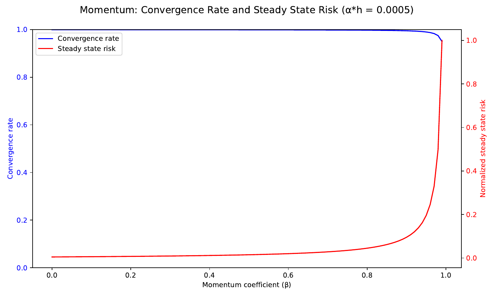
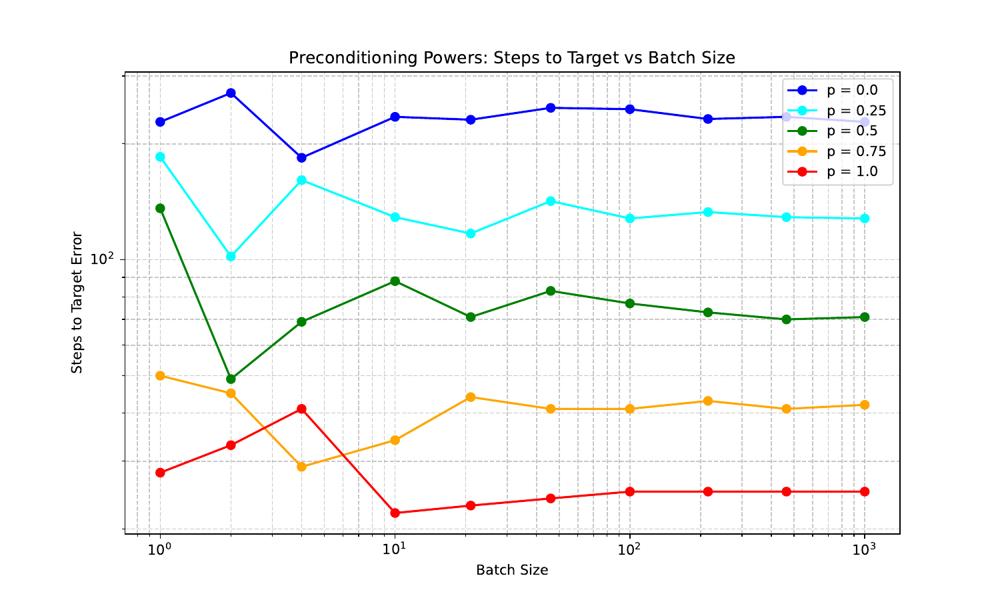

# Stochastic Gradient Descent: Insights from a Noisy Quadratic Model

## Table of contents
1. [Introduction](#introduction)
2. [Problem setup: Noisy quadratic model](#problem-setup-noisy-quadratic-model)
3. [SGD through the lens of the noisy quadratic model](#sgd-through-the-lens-of-the-noisy-quadratic-model)
4. [Higher-dimensional challenges](#higher-dimensional-challenges)
5. [Momentum](#momentum)
6. [Exponential moving averages](#exponential-moving-averages)
7. [Preconditioning](#preconditioning)
8. [Experimental comparisons](#experimental-comparisons)
9. [Complete code](#complete-code)

## Introduction

In our previous lecture, we examined stochastic gradient descent (SGD) in the context of large-scale optimization problems. We saw that SGD offers a memory-efficient approach for problems with massive datasets by sampling random data points rather than processing the entire dataset at once. We analyzed its convergence properties, both in expectation and variance, and observed the trade-offs involved in choosing the step size.

Today, we'll extend this understanding by studying SGD through the lens of a noisy quadratic model (NQM). While simple, this model captures many of the essential behaviors we see in real neural network optimization, making it a valuable tool for generating testable predictions. The insights we gain will help us understand several practical SGD modifications used in deep learning:

1. **Momentum**: How carrying velocity from previous updates can improve convergence
2. **Exponential moving averages**: How averaging parameter values can reduce variance
3. **Higher-dimensional challenges**: What happens when we optimize multiple parameters simultaneously
4. **Preconditioning**: How reshaping the optimization landscape can accelerate convergence

These modifications are crucial for training deep neural networks efficiently. While the basic SGD algorithm works well for simpler problems, these extensions help navigate the complex, high-dimensional loss landscapes of modern deep learning models.

Our goal today is to give you intuition for why these modifications work, based on a theoretical but accessible model. We'll follow the excellent exposition in a 2019 paper by researchers at Google, DeepMind, University of Toronto, and Anthropic.

## Problem setup: Noisy quadratic model

Let's begin by setting up our model. We'll focus on a simple multivariate quadratic problem in two dimensions. This might seem overly simplistic, but the insights we gain generalize to higher dimensions and more complex loss functions.

Fix constants $h_1 > h_2 > 0$ (eigenvalues of our quadratic loss surface) and $\sigma_1, \sigma_2 > 0$ (noise standard deviations, with no ordering imposed yet). Let's consider a multivariate random variable $x \in \mathbb{R}^2$, satisfying:

- Mean zero: $\mathbb{E}[x_1] = \mathbb{E}[x_2] = 0$
- Independent components: $\mathbb{E}[x_1x_2] = \mathbb{E}[x_1]\mathbb{E}[x_2] = 0$
- Known variances: Each component has variance $\sigma_i^2$, meaning $\mathbb{E}[x_i^2] = \sigma_i^2$ for $i = 1, 2$

Our loss function is a simple quadratic:

$$
L(w) = \frac{1}{2}\mathbb{E}_{(x_1, x_2) \sim P}\left[h_1(x_1 - w_1)^2 + h_2(x_2 - w_2)^2\right]
$$

This resembles the model we worked with in lecture 6, but now we have two parameters $w_1$ and $w_2$ instead of just one. We can define the sample-wise loss for a specific datapoint $(x_1, x_2)$:

$$
\ell(w; (x_1, x_2)) = \frac{1}{2}\left(h_1(x_1 - w_1)^2 + h_2(x_2 - w_2)^2\right)
$$

By definition:
$$
L(w) = \mathbb{E}_{(x_1, x_2) \sim P}[\ell(w; (x_1, x_2))]
$$

### Expanding the population loss

Let's expand $L(w)$ to get a more explicit form:

$$
\begin{aligned}
L(w) &= \frac{1}{2}\mathbb{E}\left[h_1(x_1 - w_1)^2 + h_2(x_2 - w_2)^2\right] \\
&= \frac{1}{2}\mathbb{E}\left[h_1(x_1^2 - 2x_1w_1 + w_1^2) + h_2(x_2^2 - 2x_2w_2 + w_2^2)\right] \\
&= \frac{1}{2}\left(h_1\mathbb{E}[x_1^2] - 2h_1\mathbb{E}[x_1]w_1 + h_1w_1^2 + h_2\mathbb{E}[x_2^2] - 2h_2\mathbb{E}[x_2]w_2 + h_2w_2^2\right)
\end{aligned}
$$

Since $\mathbb{E}[x_1] = \mathbb{E}[x_2] = 0$ and $\mathbb{E}[x_1^2] = \sigma_1^2$, $\mathbb{E}[x_2^2] = \sigma_2^2$, we get:

$$
\begin{aligned}
L(w) &= \frac{1}{2}\left(h_1\sigma_1^2 + h_1w_1^2 + h_2\sigma_2^2 + h_2w_2^2\right) \\
&= \frac{1}{2}\left(h_1w_1^2 + h_2w_2^2\right) + \frac{1}{2}\left(h_1\sigma_1^2 + h_2\sigma_2^2\right)
\end{aligned}
$$

So our population loss is:

$$\boxed{L(w) = \frac{1}{2}\left(h_1w_1^2 + h_2w_2^2\right) + \frac{1}{2}\left(h_1\sigma_1^2 + h_2\sigma_2^2\right)}$$

The second term is constant with respect to $w$, so the minimizer is clearly $w^* = (0, 0)$.

### Gradient and noise calculation

Now, let's look at the gradient of $L(w)$ and how it relates to the gradient of the sample loss $\ell(w; (x_1, x_2))$.

The gradient of the population loss is:
$$\nabla L(w) = \begin{pmatrix} h_1w_1 \\ h_2w_2 \end{pmatrix}$$

For the sample loss, we have:
$$\nabla \ell(w; (x_1, x_2)) = \begin{pmatrix} h_1(w_1 - x_1) \\ h_2(w_2 - x_2) \end{pmatrix}$$

Let's compute the expectation of the gradient of the sample loss:

$$
\begin{aligned}
\mathbb{E}[\nabla \ell(w; (x_1, x_2))] &= \mathbb{E}\begin{pmatrix} h_1(w_1 - x_1) \\ h_2(w_2 - x_2) \end{pmatrix} \\
&= \begin{pmatrix} h_1w_1 - h_1\mathbb{E}[x_1] \\ h_2w_2 - h_2\mathbb{E}[x_2] \end{pmatrix} \\
&= \begin{pmatrix} h_1w_1 \\ h_2w_2 \end{pmatrix} \\
&= \nabla L(w)
\end{aligned}
$$

This confirms an important result: the expected gradient of the sample loss equals the gradient of the population loss. Mathematically:

$$\boxed{\nabla L(w) = \mathbb{E}[\nabla \ell(w; (x_1, x_2))]}$$

This property, known as differentiating under the integral sign, is what makes stochastic gradient descent work. It means that the stochastic gradient is an unbiased estimator of the true gradient.

Let's express the stochastic gradient as the true gradient plus noise:

$$\nabla \ell(w; (x_1, x_2)) = \nabla L(w) + \varepsilon$$

where:
$$\varepsilon = \begin{pmatrix} -h_1x_1 \\ -h_2x_2 \end{pmatrix}$$

The covariance matrix of this noise is:

$$
\begin{aligned}
\text{Cov}(\varepsilon) &= \mathbb{E}[\varepsilon\varepsilon^T] - \mathbb{E}[\varepsilon]\mathbb{E}[\varepsilon]^T \\
&= \mathbb{E}\begin{pmatrix} h_1^2x_1^2 & h_1h_2x_1x_2 \\ h_1h_2x_1x_2 & h_2^2x_2^2 \end{pmatrix} - \begin{pmatrix} 0 \\ 0 \end{pmatrix}\begin{pmatrix} 0 & 0 \end{pmatrix} \\
&= \begin{pmatrix} h_1^2\mathbb{E}[x_1^2] & h_1h_2\mathbb{E}[x_1x_2] \\ h_1h_2\mathbb{E}[x_1x_2] & h_2^2\mathbb{E}[x_2^2] \end{pmatrix} \\
&= \begin{pmatrix} h_1^2\sigma_1^2 & 0 \\ 0 & h_2^2\sigma_2^2 \end{pmatrix}
\end{aligned}
$$

So each component of the noise has variance proportional to $\sigma_i^2$, and the noise components are independent.

## SGD through the lens of the noisy quadratic model

Now that we understand the noisy gradient, let's analyze how minibatch SGD works in this setting.

The minibatch SGD update rule is:

$$
w_{k+1} = w_k - \eta \nabla \ell_{B_k}(w_k; x_{B_k})
$$

where $\nabla \ell_{B_k}$ is the average gradient computed over a minibatch $B_k$ of samples.

We can rewrite this as:

$$
\begin{aligned}
w_{k+1} &= w_k - \eta \nabla \ell_{B_k}(w_k; x_{B_k}) \\
&= w_k - \eta (\nabla L(w_k) + \varepsilon_{B_k}) \\
&= (w_k - \eta \nabla L(w_k)) - \eta \varepsilon_{B_k}
\end{aligned}
$$

where $\varepsilon_{B_k}$ is the average noise in the minibatch. Due to the central limit theorem, as the batch size $B$ increases, the variance of this noise decreases proportionally to $1/B$.

Looking at the component-wise update:

$$
\begin{aligned}
w_{k+1, i} &= w_{k, i} - \eta \nabla \ell_{B_k}(w_{k, i}; x_{B_k})_i \\
&= w_{k, i} - \eta (h_i w_{k, i} - h_i \bar{x}_{B_k, i}) \\
&= (1 - \eta h_i)w_{k, i} + \eta h_i \bar{x}_{B_k, i}
\end{aligned}
$$

where $\bar{x}_{B_k, i}$ is the average of the $i$-th component in the minibatch.

Since $\mathbb{E}[\bar{x}_{B_k, i}] = 0$ and $\text{Var}(\bar{x}_{B_k, i}) = \sigma_i^2/B$, we can analyze the evolution of the second moment $\mathbb{E}[w_{k, i}^2]$.

The expected risk after $t$ steps in a given dimension $i$ is:

$$\boxed{\mathbb{E}[\ell(\theta_i(t))] = \underbrace{(1 - \eta h_i)^{2t}}_{\text{convergence rate}} \mathbb{E}[\ell(\theta_i(0))] + \underbrace{\frac{\eta c_i}{2B(2-\eta h_i)}}_{\text{steady state risk}} (1-(1-\eta h_i)^{2t})}$$

where we've assumed $\eta h_i \leq 2$ for stability.

This formula has two key terms:
1. **Convergence term**: $(1-\eta h_i)^{2t}\mathbb{E}[\ell(\theta_i(0))]$ - This represents how quickly we "forget" the initial value. It decreases exponentially with $t$.
2. **Steady-state risk term**: $\frac{\eta c_i}{2B(2-\eta h_i)}(1-(1-\eta h_i)^{2t})$ - This represents the asymptotic variance due to noise. It approaches $\frac{\eta c_i}{2B(2-\eta h_i)}$ as $t \to \infty$.

We can see that minibatching (increasing $B$) reduces the steady-state variance by a factor of $B$, just as we observed in the one-dimensional case from the previous lecture.

## Higher-dimensional challenges

In the one-dimensional case we studied in the previous lecture, we only had to consider a single convergence rate and a single noise level. In higher dimensions, each component may converge at a different rate and experience different levels of noise. This introduces several challenges:

### Different convergence rates

Looking at our formula for the expected squared error, we see that the first term, $(1-\eta h_i)^{2k}w_{0, i}^2$, determines how quickly component $i$ converges. Since $h_1 > h_2$ in our setup, we have $(1-\eta h_1) < (1-\eta h_2)$ for a fixed step size $\eta < 1/h_1$. This means that the first component (corresponding to the larger eigenvalue) "forgets" its initialization faster than the second component.

The condition number of the problem, defined as the ratio $\kappa = h_1/h_2$, determines how disparate these convergence rates are. The larger the condition number, the more the convergence rates differ across dimensions.

### Different noise levels

The steady-state variance for component $i$ is $\frac{\eta h_i^2}{B(2-\eta h_i)}\sigma_i^2$. This depends on both $h_i$ and $\sigma_i^2$. If the noise level $\sigma_i^2$ varies across dimensions, some components will have higher steady-state variance than others.

### Step size constraints

To ensure convergence, we need $\eta < 2/h_i$ for all $i$. This means the largest eigenvalue (in our case, $h_1$) constrains the maximum stable step size. If $h_1 \gg h_2$, we might be forced to use a very small step size, which will make the second component converge extremely slowly.

### The balancing act

Ideally, we would choose a step size $\eta$ that balances the convergence rates and steady-state variances across all dimensions. However, this is generally impossible when the eigenvalues $h_i$ differ significantly.

The figure below illustrates how different components converge at different rates:


*Figure: Convergence of two components with different eigenvalues. Component 1 (with larger $h_1$) converges faster but has higher steady-state variance.*

In the next sections, we'll explore three strategies to mitigate these issues:
1. Momentum: helps with the convergence rate disparity
2. Exponential moving averages: reduces the steady-state variance
3. Preconditioning: addresses both issues by transforming the problem

## Momentum

Momentum is a modification to SGD that incorporates information from past updates. The intuition is that we want to continue moving in directions of persistent gradients, much like a physical object in motion tends to stay in motion.

### Momentum algorithm

The momentum SGD update is:

$$
\begin{aligned}
v_{k+1} &= \beta v_k + \nabla \ell_{B_k}(w_k; x_{B_k}) \\
w_{k+1} &= w_k - \eta v_{k+1}
\end{aligned}
$$

where $\beta \in [0, 1)$ is the momentum parameter and $v_k$ is the velocity. In our noisy quadratic model, the component-wise update becomes:

$$
\begin{aligned}
v_{k+1, i} &= \beta v_{k, i} + h_i(w_{k, i} - \bar{x}_{B_k, i}) \\
w_{k+1, i} &= w_{k, i} - \eta v_{k+1, i}
\end{aligned}
$$

### Momentum dynamics theorem

Let's state the precise result about momentum SGD from the paper:

**Theorem 1:** Given a dimension index $i$, and $0 \leq \beta < 1$ with $\beta \neq (1 - \sqrt{\alpha h_i})^2$, the expected risk at time $t$ associated with that dimension satisfies the upper bound:

$$
\mathbb{E}[\ell(\theta_i(t))] \leq \left(\frac{(r_1^{t+1} - r_2^{t+1}) - \beta(r_1^t - r_2^t)}{r_1 - r_2}\right)^2 \mathbb{E}[\ell(\theta_i(0))] + \frac{(1+\beta)\eta c_i}{2B(2\beta + 2 - \eta h_i)(1-\beta)}
$$

where $r_1$ and $r_2$ (with $r_1 \geq r_2$) are the two roots of the quadratic equation $x^2 - (1-\eta h_i + \beta)x + \beta = 0$.

As with plain SGD, the loss for each dimension can be expressed as the sum of two terms:
1. A term that decays exponentially, corresponding to the behavior of the deterministic version of the algorithm.
2. A constant term representing the steady-state risk due to noise.

### How momentum helps

Momentum provides two key benefits:

1. **Accelerated convergence**: For small learning rates, the convergence rate with momentum is approximately $(1-\frac{\eta h_i}{1-\beta})$, compared to $(1-\eta h_i)$ without momentum. This means momentum effectively increases the learning rate by a factor of $\frac{1}{1-\beta}$. For components with small eigenvalues (slow convergence), this acceleration is particularly beneficial.

2. **Damped oscillations**: In high-curvature directions, momentum dampens oscillations, allowing for a larger overall step size.

The figure below shows how the convergence rate and steady-state risk vary with momentum:


*Figure: Convergence rate and steady state risk as a function of momentum for a single dimension with $\alpha h = 0.0005$. Higher momentum values accelerate convergence but increase steady-state variance.*

However, the second term in Theorem 1 shows that momentum also increases the steady-state variance by a factor of approximately $\frac{1+\beta}{1-\beta}$. With $\beta = 0.9$ (a common value), this means the variance is about 19 times higher! This is the price we pay for faster convergence.

The tradeoff becomes evident when we visualize the component-wise convergence with and without momentum:


*Figure: Effect of momentum on convergence. Momentum accelerates convergence, especially for the slower component (component 2), but increases steady-state variance.*

### When momentum helps most

Momentum is most beneficial when:
1. The batch size $B$ is large (to counteract the variance increase)
2. The condition number is large (so the acceleration benefit outweighs the variance cost)

This explains why momentum often shows little benefit for small batch sizes but significant gains for large batch sizes, as observed in practice.

## Exponential moving averages

Exponential moving average (EMA) is a technique that doesn't modify the optimization algorithm itself but rather the final output. The idea is to maintain a moving average of the parameters during training and use this average for inference.

### EMA algorithm

The EMA update is:

$$
\begin{aligned}
w_{k+1} &= w_k - \eta \nabla \ell_{B_k}(w_k; x_{B_k}) \\
\tilde{w}_{k+1} &= \gamma \tilde{w}_k + (1-\gamma) w_{k+1}
\end{aligned}
$$

where $\gamma \in [0, 1)$ is the averaging coefficient, and $\tilde{w}_k$ is the exponentially averaged parameter vector.

### EMA dynamics theorem

**Theorem 2:** Given a dimension index $i$, and $0 \leq \gamma < 1$, the expected risk at time $t$ associated with that dimension satisfies the upper bound:

$$
\begin{aligned}
\mathbb{E}[\ell(\tilde{\theta}_i(t))] \leq &\left(\frac{(r_1^{t+1} - r_2^{t+1}) - \gamma(1-\alpha h_i)(r_1^t - r_2^t)}{r_1 - r_2}\right)^2 \mathbb{E}[\ell(\theta_i(0))] \\
&+ \frac{\alpha c_i}{2B(2-\alpha h_i)} \frac{(1-\gamma)(1+(1-\alpha h_i)\gamma)}{(1+\gamma)(1-(1-\alpha h_i)\gamma)}
\end{aligned}
$$

where $r_1 = 1-\eta h_i$ and $r_2 = \gamma$.

### How EMA helps

EMA reduces the steady-state variance without affecting the convergence rate of the mean. By properly choosing an averaging coefficient $\gamma < 1 - \alpha h_d$ (so that $r_1 > r_2$), the red term in Theorem 2 becomes strictly less than 1. This means EMA reduces the steady-state risk compared to plain SGD, without sacrificing convergence speed.

The effect on convergence is clearly visible when we plot the component-wise behavior:


*Figure: Effect of exponential moving average. EMA significantly reduces the steady-state variance without slowing down the initial convergence.*

EMA also improves the overall optimization efficiency, particularly for small batch sizes:


*Figure: Steps to target vs. batch size. EMA reduces the number of steps needed to reach a target error, especially for small batch sizes.*

### When EMA helps most

EMA is most beneficial when:
1. The batch size is small (high variance in updates)
2. The step size is relatively large (high steady-state variance)

This is exactly the opposite of momentum, which works best for large batch sizes. This complementary nature makes EMA and momentum a powerful combination in practice.

## Preconditioning

Preconditioning addresses the root cause of the convergence rate disparity: the different eigenvalues $h_i$. The idea is to transform the problem so that all dimensions have similar convergence properties.

### Preconditioning algorithm

The preconditioned SGD update is:

$$w_{k+1} = w_k - \eta P^{-1} \nabla \ell_{B_k}(w_k; x_{B_k})$$

where $P$ is a positive definite matrix called the preconditioner.

In our noisy quadratic model, an ideal preconditioner would be $P = \text{diag}(h_1, h_2)$, which would make all eigenvalues equal to 1. However, in practice, we don't know the exact eigenvalues, so we need to approximate $P$.

We can analyze a family of preconditioners of the form $P = \text{diag}(h_1^p, h_2^p)$ for $0 \leq p \leq 1$. When $p = 0$, we recover standard SGD, and when $p = 1$, we have the ideal preconditioner.

### Preconditioning dynamics

The component-wise update with preconditioning is:

$$w_{k+1, i} = w_{k, i} - \eta h_i^{-p} h_i (w_{k, i} - \bar{x}_{B_k, i}) = w_{k, i} - \eta h_i^{1-p} (w_{k, i} - \bar{x}_{B_k, i})$$

For the NQM, the dynamics of preconditioned SGD are equivalent to the SGD dynamics in a transformed problem with Hessian $\tilde{H} = P^{-1/2}HP^{-1/2}$ and gradient covariance $\tilde{C} = P^{-1/2}CP^{-1/2}$. 

The expected risk with preconditioning becomes:

$$\mathbb{E}[L(w(t))] \leq \sum_{i=1}^d (1-\eta h_i^{1-p})^{2t} \mathbb{E}[\ell(\theta_i(0))] + \sum_{i=1}^d \frac{\eta c_i h_i^{-p}}{2B(2-\eta h_i^{1-p})}$$

### How preconditioning helps

Preconditioning has two key effects:

1. **Equalized convergence rates**: As $p$ approaches 1, the terms $(1-\eta h_i^{1-p})$ become more similar across dimensions, regardless of the original eigenvalues $h_i$. This means all components converge at roughly the same rate.

2. **Transformation of the steady-state risk**: Preconditioning changes the steady-state risk term. For ill-conditioned problems (where $h_1 \gg h_2$), the steady-state risk becomes approximately $\frac{c_i}{2Bh_1}\frac{(h_i/h_1)^{-p}}{1-(h_i/h_1)^{1-p}}$, which increases with $p$.

The effect of different preconditioning powers on the steps to target is shown below:


*Figure: Steps to target vs. batch size for different preconditioning powers. Higher preconditioning powers extend perfect scaling to larger batch sizes.*

The component-wise effect is also evident:


*Figure: Effect of preconditioning. Preconditioning equalizes the convergence rates across components, allowing for faster overall convergence.*

### When preconditioning helps most

Preconditioning is most beneficial when:
1. The condition number is large (disparity in convergence rates)
2. The batch size is large (so the potential increase in variance is mitigated)

This aligns with empirical findings that preconditioned methods like Adam and K-FAC often outperform vanilla SGD, especially for large batch sizes.

## Experimental comparisons

Now let's compare the different optimization strategies on our noisy quadratic model. The figure below shows the convergence behavior for different combinations of techniques across various batch sizes:


*Figure: Comparison of different optimization strategies on the noisy quadratic model. Each line represents a different strategy, and different panels show different batch sizes.*

### Key findings:

1. **SGD**: Basic SGD converges slowly and has high steady-state variance.
2. **SGD+Momentum**: Momentum accelerates convergence but increases variance. It's most beneficial for large batch sizes.
3. **SGD+EMA**: EMA reduces the steady-state variance without affecting the convergence rate. It's particularly helpful for small batch sizes.
4. **SGD+Preconditioning**: Preconditioning equalizes convergence rates, leading to faster overall convergence, especially for large batch sizes.
5. **SGD+Momentum+EMA**: Combining momentum and EMA gives fast convergence with moderate variance, making it effective across all batch sizes.
6. **SGD+Preconditioning+Momentum**: This powerful combination achieves the fastest convergence but requires large batch sizes to control variance.

These results illustrate the fundamental trade-offs:
- Smaller batch sizes lead to higher variance
- Faster convergence often comes at the cost of higher variance
- Different techniques are complementary and can be combined for better performance

The insights from our noisy quadratic model align remarkably well with results observed in real neural network training, demonstrating its value as a simple yet powerful analytical tool.

## Conclusion

In this lecture, we've explored stochastic gradient descent through the lens of a noisy quadratic model. We've seen how the basic SGD algorithm can be enhanced with momentum, exponential moving averages, and preconditioning to address the challenges of optimizing multiple parameters.

Key takeaways:

1. **Higher dimensions introduce new challenges**: Different parameters may converge at different rates and experience different levels of noise.

2. **Momentum accelerates convergence**: By accumulating gradients over time, momentum helps overcome the slow convergence of parameters with small eigenvalues, but increases variance.

3. **EMA reduces variance**: Exponential moving averages provide a simple way to reduce the noise in the final parameters without slowing down convergence.

4. **Preconditioning equalizes convergence rates**: By transforming the problem, preconditioning makes all parameters converge at similar rates, allowing for faster overall convergence.

5. **Batch size matters**: The effectiveness of these techniques varies with batch size. Momentum and preconditioning work best with large batches, while EMA is particularly helpful for small batches.

These insights help explain why methods like Adam (which combines momentum and adaptive preconditioning) are so effective in deep learning, especially with large batch sizes. They also explain why techniques like EMA are commonly used to stabilize training.

In our next lecture, we'll see how these concepts extend to more complex optimization problems and explore practical implementations in PyTorch.

## Complete code

Here's a complete script that implements all the optimization methods we've discussed and reproduces the figures from this lecture:

```python
import numpy as np
import matplotlib.pyplot as plt
import torch

# Set random seed for reproducibility
np.random.seed(0)
torch.manual_seed(0)

# Define parameters
h1, h2 = 1.0, 0.1  # Eigenvalues
sigma1, sigma2 = 1.0, 1.0  # Noise standard deviations
w0 = np.array([1.0, 1.0])  # Initial parameters
eta = 0.1  # Learning rate
beta = 0.9  # Momentum coefficient
gamma = 0.99  # EMA coefficient
p = 0.5  # Preconditioning power
num_iterations = 1000
batch_sizes = [1, 10, 100]

# Define methods
methods = [
    "SGD",
    "SGD+Momentum",
    "SGD+EMA",
    "SGD+Preconditioning",
    "SGD+Momentum+EMA",
    "SGD+Preconditioning+Momentum"
]

# Colors for plotting
colors = ["blue", "red", "green", "purple", "orange", "brown"]

# Function to generate a batch of samples
def generate_batch(batch_size):
    x1 = np.random.normal(0, sigma1, batch_size)
    x2 = np.random.normal(0, sigma2, batch_size)
    return np.column_stack((x1, x2))

# Function to compute gradient
def compute_gradient(w, batch):
    grad = np.zeros_like(w)
    for i in range(batch.shape[0]):
        grad[0] += h1 * (w[0] - batch[i, 0])
        grad[1] += h2 * (w[1] - batch[i, 1])
    return grad / batch.shape[0]

# Run optimization methods
results = {}

for batch_size in batch_sizes:
    results[batch_size] = {}
    
    for method_idx, method in enumerate(methods):
        # Initialize parameters
        w = w0.copy()
        w_ema = w0.copy()
        v = np.zeros_like(w)
        
        # Track MSE
        mse_history = np.zeros(num_iterations)
        
        for k in range(num_iterations):
            # Generate batch
            batch = generate_batch(batch_size)
            
            # Compute gradient
            grad = compute_gradient(w, batch)
            
            # Apply preconditioning if needed
            if "Preconditioning" in method:
                precond_grad = np.zeros_like(grad)
                precond_grad[0] = grad[0] / (h1 ** p)
                precond_grad[1] = grad[1] / (h2 ** p)
                grad = precond_grad
            
            # Update velocity if using momentum
            if "Momentum" in method:
                v = beta * v + grad
                update = eta * v
            else:
                update = eta * grad
            
            # Update parameters
            w = w - update
            
            # Update EMA if using
            if "EMA" in method:
                w_ema = gamma * w_ema + (1 - gamma) * w
                mse_history[k] = np.sum(w_ema ** 2)
            else:
                mse_history[k] = np.sum(w ** 2)
        
        results[batch_size][method] = mse_history

# Plot results
fig, axes = plt.subplots(1, 3, figsize=(18, 6))
fig.suptitle("Comparison of Optimization Methods on Noisy Quadratic Model", fontsize=16)

for i, batch_size in enumerate(batch_sizes):
    ax = axes[i]
    ax.set_title(f"Batch Size = {batch_size}")
    ax.set_xlabel("Iterations")
    ax.set_ylabel("Mean Squared Error")
    ax.set_yscale("log")
    
    for method_idx, method in enumerate(methods):
        ax.plot(results[batch_size][method], color=colors[method_idx], label=method)
    
    ax.legend()
    ax.grid(True, which="both", linestyle="--", linewidth=0.5)

plt.tight_layout()
plt.savefig("optimization_comparison.png", dpi=300)
plt.show()

# Generate individual method plots
for method_idx, method in enumerate(methods):
    fig, ax = plt.subplots(figsize=(10, 6))
    ax.set_title(f"Effect of Batch Size for {method}")
    ax.set_xlabel("Iterations")
    ax.set_ylabel("Mean Squared Error")
    ax.set_yscale("log")
    
    for i, batch_size in enumerate(batch_sizes):
        ax.plot(results[batch_size][method], label=f"Batch Size = {batch_size}")
    
    ax.legend()
    ax.grid(True)
    plt.tight_layout()
    plt.savefig(f"{method.replace('+', '_')}.png", dpi=300)
    plt.close()

print("Optimization complete. Figures saved.")
```

This code implements all the optimization methods discussed in the lecture and produces visualizations to compare their performance. You can modify the parameters (h1, h2, sigma1, sigma2, etc.) to explore different problem settings and see how they affect the relative performance of different methods. 