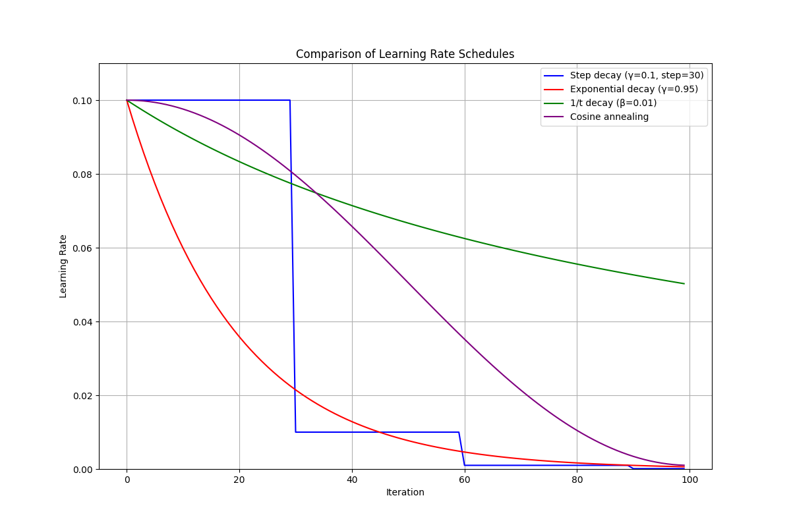

# STOCHASTIC GRADIENT DESCENT (SGD) CHEAT SHEET

## 1️⃣ GENERAL STOCHASTIC OPTIMIZATION PROBLEMS

### Core Framework
- **Empirical Risk:** $L(w) = \frac{1}{n}\sum_{i=1}^n \ell(w, x_i, y_i)$
- **Full Gradient:** $\nabla L(w) = \frac{1}{n}\sum_{i=1}^n \nabla_w \ell(w, x_i, y_i)$
- **Unbiased Mini-batch Gradient:** 

$$g(w, B) = \frac{1}{|B|}\sum_{i \in B} \nabla_w \ell(w, x_i, y_i)$$

### Key Problem Examples

#### Linear Regression
- **Model:** $f_w(x) = w^T x + b$
- **Loss:** $\ell(w, x_i, y_i) = \frac{1}{2}(w^T x_i - y_i)^2$
- **Gradient:** $\nabla_w \ell = (w^T x_i - y_i)x_i$

#### Logistic Regression
- **Model:** $P(y=1\|x) = \sigma(w^T x)$
- **Loss:** $-y_i \log(\sigma(w^T x_i)) - (1-y_i) \log(1-\sigma(w^T x_i))$
- **Gradient:** $(\sigma(w^T x_i) - y_i)x_i$

#### Neural Networks
- **Model:** $f_w(x) = f_L(f_{L-1}(...f_1(x; w_1)...; w_{L-1}); w_L)$
- **Loss:** Task-dependent
- **Gradient:** Via backpropagation

### Empirical vs. Population Risk
- **Empirical Risk:** $L_{\text{emp}}(w) = \frac{1}{n}\sum_{i=1}^n \ell(w, x_i, y_i)$ (training data)
- **Population Risk:** $L_{\text{pop}}(w) = \mathbb{E}_{(x,y) \sim \mathcal{D}}[\ell(w, x, y)]$ (all possible data)
- **Generalization Bound:** $L_{\text{pop}}(w) \leq L_{\text{emp}}(w) + \mathcal{O}\left(\sqrt{\frac{\text{complexity}(w) + \log(1/\delta)}{n}}\right)$
- **SGD Insight:** Can provide implicit regularization beyond empirical risk minimization

## 2️⃣ SGD METHODS AND VARIANTS

### Gradient Methods Spectrum

#### Full Gradient Descent (GD)
- **Batch Size:** $n$ (entire dataset)
- **Per-step Cost:** $O(n m)$
- **Gradient Variance:** Zero
- **Steady-State Error:** Zero (with $\alpha$ small enough)

#### Mini-batch SGD
- **Batch Size:** $b$ (subset)
- **Per-step Cost:** $O(bm)$
- **Gradient Variance:** $O(1/b)$
- **Steady-State Error:** $O(\sqrt{\alpha/b})$

#### Pure SGD
- **Batch Size:** 1 (single example)
- **Per-step Cost:** $O(m)$
- **Gradient Variance:** $O(1)$
- **Steady-State Error:** $O(\sqrt{\alpha})$

### Sampling Strategies
- **With Replacement:** Each example equally likely to appear in each batch (theoretical)
- **Without Replacement (Epoch-based):** Shuffle entire dataset once per epoch, then process in batches (practical)

  ```
  # Each epoch:
  1. Generate random permutation π of indices {1,2,...,n}
  2. Create batches: B₁={π(1),...,π(b)}, B₂={π(b+1),...,π(2b)},...
  3. Process all batches sequentially
  ```

### SGD Variants

#### Momentum
- **Update Rule:** 
  - $m_{k+1} = \beta m_k + g(w_k)$
  - $w_{k+1} = w_k - \alpha m_{k+1}$
- **Effect on Init Error:** Reduces by accelerating convergence
- **Effect on Steady-State:** Increases by factor $\frac{1+\beta}{1-\beta}$
- **Best Batch Size:** Large

#### Exponential Moving Average (EMA)
- **Update Rule:**
  - $w_{k+1} = w_k - \alpha g(w_k)$
  - $\tilde{w}\_{k+1} = \gamma \tilde{w}\_k + (1-\gamma) w_{k+1}$
- **Effect on Init Error:** Minimal effect
- **Effect on Steady-State:** Reduces significantly
- **Best Batch Size:** Small

#### Preconditioning
- **Update Rule:** $w_{k+1} = w_k - \alpha P^{-1} g(w_k)$
- **Effect on Init Error:** Reduces by balancing convergence rates
- **Effect on Steady-State:** Increases, especially in low-curvature dimensions
- **Best Batch Size:** Large

### Weight Decay
- **Modified Objective:** $L_{\text{wd}}(w) = L(w) + \frac{\lambda}{2}\|w\|_2^2$
- **Gradient Modification:** $\nabla L_{\text{wd}}(w) = \nabla L(w) + \lambda w$
- **Update Rule:** $w_{k+1} = (1 - \alpha\lambda)w_k - \alpha \nabla L(w_k)$
- **Effect on NQM:** Improves condition number from $\frac{h_1}{h_2}$ to $\frac{h_1 + \lambda}{h_2 + \lambda}$
- **Typical Values:** $\lambda \in [10^{-5}, 10^{-3}]$

### Learning Rate Schedules


#### Step Decay
- **Formula:** $\alpha_k = \alpha_0 \cdot \gamma^{\lfloor k/s \rfloor}$
- **Properties:** Discrete drops at regular intervals

#### Exponential Decay
- **Formula:** $\alpha_k = \alpha_0 \cdot \gamma^k$
- **Properties:** Smooth continuous decrease

#### 1/t Decay
- **Formula:** $\alpha_k = \frac{\alpha_0}{1 + \beta k}$
- **Properties:** Theoretical convergence guarantees

#### Cosine Annealing
- **Formula:** $\alpha_k = \alpha_{\min} + \frac{1}{2}(\alpha_0 - \alpha_{\min})(1 + \cos(\frac{k\pi}{K}))$
- **Properties:** Smooth, non-monotonic decay

## 3️⃣ PYTORCH IMPLEMENTATION

### Complete Training Loop
```ASCII
                         SGD TRAINING LOOP IN PYTORCH
                         ============================

EPOCH LOOP +-------------------------------------------------------------+
           |                                                             |
           v                                                             |
    +-------------+                                                      |
    | DATASET     |        +------------------------+                    |
    |             |        | DATALOADER             |                    |
    | [x₁,y₁]     +------->| for batch_x, batch_y   |                    |
    | [x₂,y₂]     |        | in dataloader:         |                    |
    | [x₃,y₃]     |        +------------------------+                    |
    | ...         |                   |                                  |
    +-------------+                   | SAMPLING                         |
                                      | (w/ or w/o replacement)          |
                                      v                                  |
+-------------------+        +------------------+                        |
| 5. PARAM UPDATE   |        | MINI-BATCH       |                        |
|                   |        | [x₂,y₂]          |                        |
| optimizer.step()  |        | [x₇,y₇]  SHUFFLE |                        |
|                   |        | [x₄,y₄]  ↺↺↺↺↺↺  |                        |
| w ← w - α∇L       |        +------------------+                        |
|                   |                |                                   |
| LEARNING RATE     |                |                                   |
| SCHEDULER         |                v                                   |
| scheduler.step()  |        +------------------+                        |
|                   |        | ZERO GRADIENTS   |                        |
+-------------------+        | optimizer.       |                        |
        ^                    | zero_grad()      |                        |
        |                    +------------------+                        |
        |                            |                                   |
        |                            v                                   |
        |                    +------------------+        +---------------+
        |                    | 1. FORWARD PASS  |        |               |
        |                    |                  |        |               |
        |                    | outputs = model( |        |               |
        |                    |    batch_x)      |        |               |
        |                    |                  |        |               |
        |                    | nn.Module        |        |               |
        |                    +------------------+        |               |
        |                            |                   |               |
        |                            | ŷ (predictions)   |               |
        |                            v                   |               |
+-------------------+        +------------------+        |               |
| 4. BACKWARD PASS  |        | 2. LOSS CALC     |        |               |
|                   |        |                  |        |               |
| loss.backward()   |        | loss = F.mse_    |        |               |
|                   |        |   loss(ŷ, batch_y)|       |               |
| Creates:          |        |                  |        |               |
| param.grad        |        | + λ||w||² (decay)|        |               |
|                   |        +------------------+        |               |
|                   |                |                   |               |
|                   |                | scalar loss       |               |
|                   |                v                   |               |
+-------------------+        +------------------+        |               |
        ^                    | 3. COMPUTATIONAL |        |               |
        |                    | GRAPH            |        |               |
        |                    |                  |        |               |
        |                    | (autograd builds |        |               |
        +--------------------+ differentiation  +--------+               |
                             | pathway)         |                        |
                             +------------------+                        |
```

### Data Loading
```python
# Dataset definition
class SimpleDataset(Dataset):
    def __init__(self, features, labels):
        self.features = features
        self.labels = labels
    def __len__(self): return len(self.features)
    def __getitem__(self, idx): return self.features[idx], self.labels[idx]

# DataLoader without replacement (default)
dataloader = DataLoader(dataset, batch_size=32, shuffle=True, num_workers=4)

# DataLoader with replacement
sampler = RandomSampler(dataset, replacement=True, num_samples=len(dataset))
dataloader_with_replacement = DataLoader(dataset, batch_size=32, sampler=sampler)
```

### Model Definition
```python
# Model definition
class LinearRegression(nn.Module):
    def __init__(self, input_dim):
        super().__init__()
        self.linear = nn.Linear(input_dim, 1)  # creates weight and bias
    
    def forward(self, x):
        return self.linear(x)  # computes x @ weights.T + bias

# Loss computation
predictions = model(features)
loss = F.mse_loss(predictions, targets)  # Mean squared error
loss_binary = F.binary_cross_entropy_with_logits(predictions, targets)
```

### Optimizer Configuration
```python
# Basic SGD
optimizer = optim.SGD(model.parameters(), lr=0.01)

# SGD with momentum
optimizer = optim.SGD(model.parameters(), lr=0.01, momentum=0.9)

# SGD with weight decay
optimizer = optim.SGD(model.parameters(), lr=0.01, weight_decay=1e-4)

# SGD with momentum and weight decay
optimizer = optim.SGD(model.parameters(), lr=0.01, momentum=0.9, weight_decay=1e-4)
```

### Learning Rate Schedulers
```python
# Step LR: drops by factor gamma every step_size epochs
scheduler = StepLR(optimizer, step_size=30, gamma=0.1)

# Exponential decay: multiplies by gamma each epoch
scheduler = ExponentialLR(optimizer, gamma=0.95)

# Cosine annealing: follows cosine curve over T_max epochs
scheduler = CosineAnnealingLR(optimizer, T_max=100)

# 1/t decay: learning rate decays proportionally to 1/t
scheduler = LambdaLR(optimizer, lr_lambda=lambda epoch: 1.0 / (1.0 + beta * epoch))

# Reduce on plateau: reduces when metric stops improving
scheduler = ReduceLROnPlateau(optimizer, mode='min', factor=0.1, patience=10)
```

### Complete Training Loop
```python
for epoch in range(num_epochs):
    # Training loop
    for batch_features, batch_labels in dataloader:
        # Zero gradients
        optimizer.zero_grad()
        
        # Forward pass
        outputs = model(batch_features)
        loss = F.mse_loss(outputs, batch_labels)
        
        # Backward pass
        loss.backward()
        
        # Update parameters
        optimizer.step()
    
    # Update learning rate
    scheduler.step()  # or scheduler.step(val_loss) for ReduceLROnPlateau
```

## 4️⃣ ADVANCED TECHNIQUES

### Implementing EMA
```python
# Manual implementation
def update_ema(model, ema_model, decay=0.999):
    with torch.no_grad():
        for param, ema_param in zip(model.parameters(), ema_model.parameters()):
            ema_param.data = decay * ema_param.data + (1 - decay) * param.data

# Using PyTorch utilities
from torch.optim.swa_utils import AveragedModel
ema_model = AveragedModel(model, avg_fn=lambda avg_param, param, num_averaged:
                         0.999 * avg_param + (1 - 0.999) * param)

# Update in training loop
ema_model.update_parameters(model)
```

### Mixing Techniques
- **Implementation Strategy:** Add components incrementally, validate each addition
- **Common Combinations:**
  - Large batch: Momentum + Scheduling + (Preconditioning)
  - Small batch: EMA + Scheduling + Weight Decay
- **Hyperparameter Interactions:**
  - Adding momentum often requires reducing learning rate
  - Weight decay may need recalibration when used with momentum

### Minimal Working Example

You can test out the code in the [notebook](https://colab.research.google.com/github/damek/STAT-4830/blob/main/section/8/notebook.ipynb).

### Key Takeaways
- SGD with constant learning rate converges to a "noise ball" around the optimum
- Batch size trades off per-iteration cost vs. gradient precision
- Momentum accelerates convergence but amplifies steady-state noise
- EMA reduces steady-state noise without affecting convergence rate
- Weight decay improves conditioning and provides regularization
- Learning rate schedules balance fast initial progress with precise final convergence
- Combining techniques requires careful hyperparameter tuning