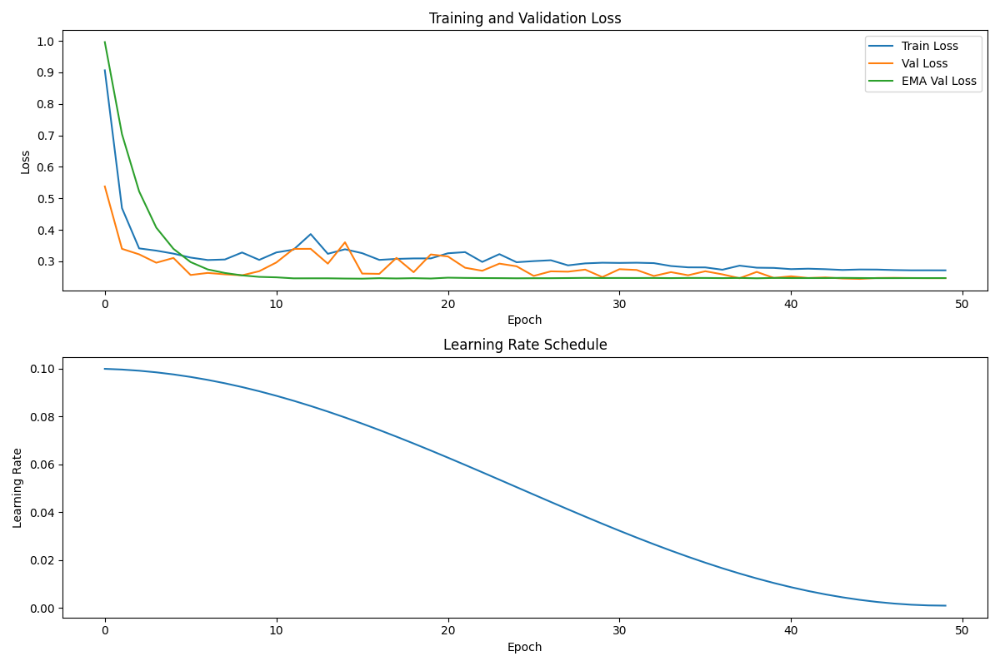

# Stochastic Gradient Descent: The general problem and implementation details

## Table of contents
1. [Introduction](#introduction)
2. [Stochastic Optimization Problems](#stochastic-optimization-problems)
3. [Stochastic Gradient Descent and Variants](#stochastic-gradient-descent-and-variants)
4. [Implementation Details in PyTorch](#implementation-details-in-pytorch)
5. [Advanced Tweaks](#advanced-tweaks)
6. [Conclusion](#conclusion)

## Introduction

In Lectures [6](6/notes.md) and [7](7/notes.md), we analyzed stochastic gradient descent (SGD) on simple problems. [Lecture 6](6/notes.md) examined SGD for mean estimation, showing how sampling individual data points can replace full-batch calculations while preserving convergence. [Lecture 7](7/notes.md) used the noisy quadratic model (NQM) to analyze how methods like momentum, exponential moving average (EMA), and preconditioning affect optimization, particularly for poorly conditioned problems.

Our analysis revealed several key properties: SGD with constant learning rate converges to a region around the optimum rather than the exact solution; this steady-state behavior can be managed through techniques like mini-batching and parameter averaging; and different algorithmic variants perform better under different batch size regimes. Specifically, EMA works best with small batch sizes by reducing steady-state risk, while momentum and preconditioning excel with large batch sizes by accelerating convergence from initialization.

These previous lectures focused on simple problems with analytical solutions – estimating a mean or minimizing a quadratic function. Practical machine learning involves more complex loss landscapes and models. Implementing these methods also depends on understanding details of libraries like PyTorch.

This lecture introduces general stochastic optimization problems and practical implementation in PyTorch. The first half generalizes stochastic optimization beyond mean estimation and quadratics to standard machine learning scenarios. We'll examine additional SGD variants, including weight decay and learning rate schedules. The second half covers implementation aspects: data loading, model definition, gradient computation, and parameter updates in PyTorch.

## Stochastic Optimization Problems

### General Formulation

Stochastic optimization encompasses problems where the objective function is an expectation over random inputs or can be approximated using random samples. In machine learning, we typically minimize an empirical risk of the form:

$$L(w) = \frac{1}{n}\sum_{i=1}^n \ell(w, x_i, y_i)$$

This objective function represents the average loss over a dataset of $n$ examples, where $w \in \mathbb{R}^d$ contains the model parameters (weights), $(x_i, y_i)$ is a training example with input $x_i$ and label $y_i$, and $\ell(w, x_i, y_i)$ measures the prediction error for a single example.

This formulation generalizes our previous mean estimation example ([Lecture 6](../6/notes.md)), the loss function was $\ell(w, x_i) = \frac{1}{2}(w - x_i)^2$ with a scalar parameter $w$. 
> In [Lecture 7](../7/notes.md), we analyzed the noisy quadratic model with loss function $L(w) = \frac{1}{2}(h_1 w_1^2 + h_2 w_2^2)$. Though not a stochastic optimization problem in the standard sense, we still applied stochastic gradient methods by assuming access to unbiased gradient estimators at each iteration.

The key challenge in stochastic optimization stems from the summation over $n$ examples. For large datasets, computing the full gradient:

$$\nabla L(w) = \frac{1}{n}\sum_{i=1}^n \nabla_w \ell(w, x_i, y_i)$$

becomes computationally prohibitive. Each gradient evaluation requires a pass through the entire dataset, which may contain millions of examples. The computational cost of a single gradient step scales linearly with $n$.

Traditional gradient descent iterates:

$$w_{k+1} = w_k - \alpha \nabla L(w_k)$$

This requires evaluating the full gradient at each step - processing all $n$ examples. For modern datasets where $n$ could be in the millions or billions, this approach quickly becomes infeasible.

The core insight of stochastic methods is that we can replace the exact gradient $\nabla L(w)$ with an unbiased estimate based on a small subset of examples. This maintains convergence guarantees while dramatically reducing the per-iteration computational cost.

For any indexed subset $B \subset \{1,2,...,n\}$, we can form an unbiased gradient estimate:

$$g(w, B) = \frac{1}{|B|}\sum_{i \in B} \nabla_w \ell(w, x_i, y_i)$$

This satisfies $\mathbb{E}[g(w, B)] = \nabla L(w)$ when $B$ is chosen uniformly at random. The variance of this estimator depends on the batch size $ \|B\| $ and the inherent variability in individual gradients. As we saw in previous lectures, this introduces a fundamental trade-off between computational efficiency and estimation accuracy.

### Example Problems

Let's examine concrete instances of stochastic optimization problems commonly encountered in machine learning. These examples illustrate how various models fit into our general framework.

#### Linear Regression

In linear regression, we predict a real-valued output as a linear function of input features:

$$f_w(x) = w^T x + b$$

For simplicity, we can absorb the bias term $b$ into $w$ by augmenting $x$ with a constant feature of 1. The squared error loss for a single example is:

$$\ell(w, x_i, y_i) = \frac{1}{2}(w^T x_i - y_i)^2$$

The full objective becomes:

$$L(w) = \frac{1}{2n}\sum_{i=1}^n (w^T x_i - y_i)^2 = \frac{1}{2n}\|Xw - y\|_2^2$$

where $X \in \mathbb{R}^{n \times d}$ stacks all input vectors as rows, and $y \in \mathbb{R}^n$ contains all target values. The gradient for a single example is:

$$\nabla_w \ell(w, x_i, y_i) = (w^T x_i - y_i)x_i$$

While this problem has a closed-form solution $(X^TX)^{-1}X^Ty$, computing it requires $O(nd^2 + d^3)$ operations. When $n$ or $d$ is large, stochastic methods become more practical, as we saw in [Lecture 3](../3/notes.md).

#### Logistic Regression

For binary classification where $y_i \in \{0,1\}$, logistic regression models the probability of class 1:

$$P(y=1|x) = \sigma(w^T x) = \frac{1}{1 + e^{-w^T x}}$$

where $\sigma(z)$ is the sigmoid function. We minimize the negative log-likelihood:

$$\ell(w, x_i, y_i) = -y_i \log(\sigma(w^T x_i)) - (1-y_i) \log(1-\sigma(w^T x_i))$$

This loss, called binary cross-entropy, measures the discrepancy between predicted probabilities and true labels. The gradient is:

$$\nabla_w \ell(w, x_i, y_i) = (\sigma(w^T x_i) - y_i)x_i$$

Unlike linear regression, logistic regression has no closed-form solution. Optimization requires iterative methods, and stochastic approaches scale efficiently to large datasets.

#### Neural Networks

Neural networks extend these ideas to more complex, non-linear models:

$$f_w(x) = f_L(f_{L-1}(...f_1(x; w_1)...; w_{L-1}); w_L)$$

where each $f_l$ is a layer with parameters $w_l$, and $w = (w_1, w_2, ..., w_L)$ collectively represents all parameters. Common layers include:

- Linear: $f_l(z) = W_l z + b_l$
- Activation: $f_l(z) = \phi(z)$ where $\phi$ is a non-linear function like ReLU: $\phi(z) = \max(0, z)$

The loss function depends on the task - mean squared error for regression or cross-entropy for classification. What's crucial is that, despite the model's complexity, the optimization problem still fits our general framework:

$$L(w) = \frac{1}{n}\sum_{i=1}^n \ell(w, x_i, y_i)$$

The per-example gradients $\nabla_w \ell(w, x_i, y_i)$ can be efficiently computed using backpropagation, allowing us to apply stochastic methods even to models with millions of parameters.

These examples demonstrate how diverse machine learning problems conform to the same mathematical structure - an average loss over training examples. This common structure enables us to apply the same stochastic optimization techniques across different models and tasks.

### Empirical vs. Population Risk

Machine learning aims to make predictions on unseen data, not just memorize training examples. This distinction leads to two critical concepts: empirical risk and population risk.

The **empirical risk** is what we've been discussing so far:

$$L_{\text{emp}}(w) = \frac{1}{n}\sum_{i=1}^n \ell(w, x_i, y_i)$$

It measures average performance on the training dataset. In contrast, the **population risk** (or true risk) measures expected performance on the entire distribution of possible examples:

$$L_{\text{pop}}(w) = \mathbb{E}_{(x,y) \sim \mathcal{D}}[\ell(w, x, y)]$$

where $\mathcal{D}$ is the underlying data distribution. The empirical risk $L_{\text{emp}}(w)$ is merely a finite-sample approximation of $L_{\text{pop}}(w)$.

In practice, we can only minimize the empirical risk since we don't have access to the full distribution. However, our actual goal is to minimize the population risk. This creates a fundamental tension in machine learning: the parameters that minimize empirical risk may not minimize population risk, especially when models are complex enough to memorize the training data.

Statistical learning theory provides bounds on the gap between empirical and population risk. For instance, under certain conditions, with probability at least $1-\delta$, we have:

$$L_{\text{pop}}(w) \leq L_{\text{emp}}(w) + \mathcal{O}\left(\sqrt{\frac{\text{complexity}(w) + \log(1/\delta)}{n}}\right)$$

where $\text{complexity}(w)$ measures the capacity or flexibility of the model class. This bound gets tighter as $n$ increases, but wider as model complexity increases.

Intriguingly, stochastic optimization methods like SGD can sometimes provide an *implicit* form of regularization that can improve generalization beyond what's achieved by minimizing empirical risk exactly. There are many explanations for why this may be the case. The most believable explanation to me is that SGD tends to converge to "low-complexity" solutions and such solutions generalize better. But the truth is no one knows why this happens. 

This relationship between optimization and generalization highlights a surprising fact: the "best" optimization algorithm from a pure convergence perspective isn't necessarily best for machine learning. Methods that converge more slowly or noisily may actually generalize better by avoiding overly complex solutions. This insight has implications for algorithm design and hyperparameter selection in practice.

## Stochastic Gradient Descent and Variants

### The Spectrum of Noise

Stochastic optimization methods exist on a spectrum based on the amount of noise in their gradient estimates. This noise comes from using subsets of data rather than the full dataset to compute gradient steps. Let's examine three points on this spectrum, from least to most noisy.

**Full Gradient Descent (GD)** uses the entire dataset to compute each gradient:

$$w_{k+1} = w_k - \alpha \nabla L(w_k) = w_k - \alpha \frac{1}{n}\sum_{i=1}^n \nabla \ell(w_k, x_i, y_i)$$

This approach provides exact gradient information but requires a full pass through the dataset for each iteration. The computational cost per step is $O(n m)$ where $n$ is the number of examples and $m$ is the cost of computing the gradient for a single example. For large datasets (billions of examples), this becomes prohibitively expensive.

**Mini-batch Stochastic Gradient Descent (mini-batch SGD)** computes gradients on randomly sampled subsets of data:

$$w_{k+1} = w_k - \alpha \frac{1}{|B_k|}\sum_{i \in B_k} \nabla \ell(w_k, x_i, y_i)$$

Here, $B_k \subset \{1,2,...,n\}$ is a random mini-batch of size $b = |B_k| \ll n$. The gradient estimate has:
- Mean: $\mathbb{E}[g(w_k)] = \nabla L(w_k)$ (unbiased)
- Variance: $\text{Var}[g(w_k)] \propto \frac{1}{b}$ (inversely proportional to batch size)

The computational cost per step drops to $O(bm)$, making each iteration much faster. However, the noisy gradient estimates introduce stochasticity into the optimization trajectory.

**Pure Stochastic Gradient Descent (pure SGD)** represents the extreme case where each gradient is computed on a single randomly selected example:

$$w_{k+1} = w_k - \alpha \nabla \ell(w_k, x_{i_k}, y_{i_k})$$

With $i_k$ chosen uniformly at random from $\{1,2,...,n\}$. This corresponds to mini-batch SGD with $b=1$. Pure SGD has:
- Fastest per-iteration computation ($O(m)$ operations)
- Highest variance in gradient estimates
- Noisiest optimization trajectory

The trade-off between these methods involves balancing computational cost against gradient accuracy. As we move from full GD to pure SGD, we reduce computation per iteration but increase variance. This affects convergence in several ways:

1. **Convergence rate**: With constant learning rate $\alpha$, all three methods initially converge at a fast rate (e.g., in [Lecture 6](../6/notes.md) we saw that the initialize error decays as $(1-\alpha h)^k$ for mean estimation problems). However, with larger learning rates, mini-batch and pure SGD can initially make faster progress by processing more examples in the same computation time.

2. **Steady-state behavior**: As shown in on the toy model in [Lecture 7](../7/notes.md), stochastic methods don't converge to the exact optimum with constant learning rates. Instead, they reach a "noise ball" with radius typically proportional to $\sqrt{\frac{\alpha}{b}}$, where larger batch sizes $b$ reduce the final error.

3. **Computational efficiency**: While SGD and mini-batch SGD make noisier progress, they process data more efficiently. In wall-clock time, they often reach approximate solutions faster than full GD.

The following table summarizes these trade-offs:

| Method | Batch Size | Per-step Cost | Gradient Variance | Steady-State Error |
|--------|------------|---------------|-------------------|-------------------|
| Full GD | $n$ | $O(n m)$ | Zero | Zero (with $\alpha$ small enough) |
| Mini-batch SGD | $b$ | $O(bm)$ | $O(1/b)$ | $O(\sqrt{\alpha/b})$ |
| Pure SGD | 1 | $O(m)$ | $O(1)$ | $O(\sqrt{\alpha})$ |

In practice, mini-batch SGD with carefully chosen batch size offers the best balance. If you look through training code, you'll see that common batch sizes range from 32 to 512, though larger values (1024-8192) have become popular for distributed training. The emergence of specialized hardware like GPUs has also influenced this choice, as specific batch sizes maximize computational efficiency on these devices.


#### Sampling Without Replacement: Epoch-based Shuffling

So far, our analysis of SGD assumed sampling mini-batches independently and uniformly at random *with replacement* from the dataset. In practice, however, implementations typically use *sampling without replacement*, also known as *epoch-based shuffling*. An *epoch* refers to one complete pass over the entire dataset.

Mathematically, epoch-based shuffling is performed as follows:

1. **Shuffle** the dataset indices at the start of each epoch. Formally, given the dataset $\{(x_i, y_i)\}_{i=1}^{n}$, generate a random permutation $\pi$ of the indices $\{1, 2, \dots, n\}$.

2. **Partition** this shuffled sequence into contiguous mini-batches of size $b$. Formally, the mini-batches for the epoch become:

$$
B_1 = \{\pi(1), \pi(2), \dots, \pi(b)\},\quad B_2 = \{\pi(b+1), \pi(b+2), \dots, \pi(2b)\},\quad \dots,\quad B_{\lceil n/b \rceil}
$$

3. **Perform a full pass** over the dataset, iteratively updating parameters for each batch $B_k$:

$$

w_{k+1} = w_k - \alpha \frac{1}{|B_k|}\sum_{i \in B_k}\nabla \ell(w_k, x_i, y_i), \quad k = 1, 2, \dots, \lceil n/b \rceil

$$


Under this approach, each example appears exactly once per epoch. Although the theoretical analysis of sampling without replacement is more challenging, empirical results typically favor this method.

### 3.2 Previously Discussed Tweaks

In [Lecture 7](../7/notes.md), we analyzed three important variants of SGD under the noisy quadratic model (NQM). Here we briefly recap these methods and their key properties on the NQM. We note that while the results of the NQM paper applied only to a simple quadratic optimization problem, a main contribution of the work was to show that the behavior of these methods transfers to deep learning problems. 

**Momentum** accelerates convergence by incorporating a running average of past gradients:

$$\begin{aligned}
m_{k+1} &= \beta m_k + g(w_k) \\
w_{k+1} &= w_k - \alpha m_{k+1}
\end{aligned}$$

where $g(w_k)$ is the stochastic gradient at iteration $k$, and $\beta \in [0, 1)$ is the momentum parameter. This modification has two key effects on NQM:

1. **Accelerated convergence**: Momentum reduces the impact of initialization error, particularly for ill-conditioned problems. Under the NQM, the convergence rate improves from $(1-\alpha h_i)^k$ to approximately $(1-\frac{\alpha h_i}{1-\beta})^k$ in the overdamped regime ($\beta < (1-\sqrt{\alpha h_i})^2$). This acceleration is especially valuable when the condition number $\kappa = \frac{h_1}{h_2}$ is large.

2. **Amplified steady-state risk**: Momentum increases the steady-state variance by a factor of approximately $\frac{1+\beta}{1-\beta}$, making the "noise ball" around the optimum larger.

These properties make momentum most beneficial in the large batch size regime, where steady-state risk is naturally small and the primary concern is reducing initialization error.

**Exponential Moving Average (EMA)** averages parameter values rather than gradients:

$$\begin{aligned}
w_{k+1} &= w_k - \alpha g(w_k) \\
\tilde{w}_{k+1} &= \gamma \tilde{w}_k + (1-\gamma) w_{k+1}
\end{aligned}$$

where $\gamma \in [0, 1)$ is the EMA decay parameter. The key properties of EMA on NQM include:

1. **Reduced steady-state risk**: EMA dampens parameter oscillations, reducing the steady-state variance by a factor of approximately $\frac{(1-\gamma)(1+(1-\alpha h_i)\gamma)}{(1+\gamma)(1-(1-\alpha h_i)\gamma)}$ without sacrificing convergence rate.

2. **Preserved convergence rate**: The initialization error still decays at approximately the same rate as standard SGD.

EMA is most effective in the small batch size regime, where steady-state risk dominates and reducing noise is the primary concern.

**Preconditioning** modifies the update rule of SGD by "rescaling" the gradient by the inverse of an invertible matrix $P$: 

$$
w_{k+1} = w_k - \alpha P^{-1} g(w_k)
$$

In machine learning practice, preconditioners are often taken to be diagonal due to the difficulty of inverting the matrix $P$. For example, we saw in [Lecture 7](../7/notes.md) that the preconditioner for the NQM was $P = \text{diag}(h_1, h_2)$. This ammounts to applying dimension-specific learning rates to balance convergence across different parameter components:

$$\begin{aligned}
w_{k+1,i} &= w_{k,i} - \alpha h_i^{-p} g_i(w_k) \\
\end{aligned}$$

where $p \in [0, 1]$ controls the degree of preconditioning. In NQM, we saw that this approach had two effects:

1. **Balanced convergence rates**: Preconditioning accelerates convergence in dimensions with small curvature ($h_i$ small), changing the rate from $(1-\alpha h_i)^k$ to $(1-\alpha h_i^{1-p})^k$. This helps address the condition number problem.

2. **Increased steady-state risk**: The steady-state variance increases, particularly in dimensions with small curvature, by a factor roughly proportional to $h_i^{-p}$.

Like momentum, preconditioning is most beneficial in the large batch size regime, where initialization error dominates and the increased steady-state risk is less problematic.

The table below summarizes these methods and their primary effects:

| Method | Updates Equation | Effect on Initialization Error | Effect on Steady-State Risk | Best Batch Size Regime |
|--------|------------------|--------------------------------|-----------------------------|-----------------------|
| Momentum | $m_{k+1} = \beta m_k + g(w_k)$ <br> $w_{k+1} = w_k - \alpha m_{k+1}$ | Reduces by accelerating convergence | Increases by factor $\frac{1+\beta}{1-\beta}$ | Large |
| EMA | $w_{k+1} = w_k - \alpha g(w_k)$ <br> $\tilde{w}\_{k+1} = \gamma \tilde{w}\_k + (1-\gamma) w\_{k+1}$ | Minimal effect | Reduces significantly | Small |
| Preconditioning | $w_{k+1} = w_{k} - \alpha P^{-1} g(w_k)$ | Reduces by balancing convergence rates | Increases, especially in low-curvature dimensions | Large |

Understanding these trade-offs helps select the appropriate method based on problem characteristics and computational constraints.

### Weight Decay

Weight decay is one of the most widely used regularization techniques in machine learning. Unlike the algorithmic modifications of SGD that we've discussed previously, weight decay directly modifies the objective function by adding a penalty on parameter magnitude:

$$L_{\text{wd}}(w) = L(w) + \frac{\lambda}{2}\|w\|_2^2 = \frac{1}{n}\sum_{i=1}^n \ell(w, x_i, y_i) + \frac{\lambda}{2}\sum_{j=1}^d w_j^2$$

Here, $\lambda > 0$ is the weight decay coefficient that controls the strength of regularization. This penalty encourages the optimization to find solutions with smaller parameter values. If you're a Bayesian, you can interpret this as effectively imposing a Gaussian prior on the parameters. But remember *you're not any particularly kind of person* and behaving as if you were is one way to limit growth in life.

> Caution: for adaptive optimizers like Adam, weight decay is not simply $\ell_2$ regularization of the parameters, although it may have a similar effect. We'll touch more on this in future lectures.

The gradient of this modified objective becomes:

$$\nabla L_{\text{wd}}(w) = \nabla L(w) + \lambda w$$

Consequently, the SGD update rule with weight decay is:

$$w_{k+1} = w_k - \alpha (\nabla L(w_k) + \lambda w_k) = (1 - \alpha\lambda)w_k - \alpha \nabla L(w_k)$$

This implementation reveals the origin of the term "weight decay": in each iteration, parameters are first scaled by a factor $(1-\alpha\lambda)$ before the gradient update. With $\alpha\lambda < 1$, this factor shrinks (decays) the weights toward zero.

Weight decay serves several important purpose: It directly penalizes model complexity. The $L_2$ penalty encourages the model to use all features moderately rather than relying heavily on a few. For quadratic problems, weight decay effectively adds $\lambda$ to all eigenvalues of the Hessian. This reduces the condition number, making optimization easier, particularly for ill-conditioned problems. The same benefit applies to problems beyond quadratic optimization. By limiting parameter magnitudes, weight decay can improve numerical stability during training, especially for deep networks.

Weight decay is not discussed in our NQM analysis in [Lecture 7](../7/notes.md). However, it can be analyzed in that framework by modifying the loss function to include the quadratic penalty. It's straightforward to check that the effect is to change the loss to 

$$
L(w) = \frac{1}{2}(h_1 + \lambda)w_1^2 + \frac{1}{2}(h_2 + \lambda)w_2^2,
$$

 which improves the condition number $\kappa = \frac{h_1}{h_2}$ from $h_1/h_2$ to $(h_1 + \lambda)/(h_2 + \lambda)$. Note that as $\lambda \to \infty$, the condition number approaches 1, making the problem perfectly conditioned. The issue with taking very large $\lambda$ is that it shifts the optimum away from the true minimum. So choosing the right $\lambda$ is a balance between improving conditioning and shifting the optimum too far away. 

In practice, weight decay values typically range from 1e-5 to 1e-3. A good choice of $\lambda$ depends on the dataset size, model architecture, and other regularization techniques employed.

### Learning Rate Schedules

Learning rate schedules systematically decrease the learning rate $\alpha$ during training. This addresses a fundamental limitation of constant learning rate SGD: the steady-state "noise ball" we analyzed in previous lectures. With constant $\alpha$, SGD converges to a region around the optimum with radius roughly proportional to $\sqrt{\alpha}$. Learning rate schedules can progressively shrink this noise ball, potentially reaching the exact optimum.

The basic approach replaces the constant learning rate $\alpha$ with a sequence $\{\alpha_k\}_{k=1}^{\infty}$ that decreases over time. The SGD update becomes:

$$w_{k+1} = w_k - \alpha_k g(w_k)$$

Several common schedules exist, each with different properties:


**Step Decay** reduces the learning rate by a factor $\gamma < 1$ every $s$ steps:

$$\alpha_k = \alpha_0 \cdot \gamma^{\lfloor k/s \rfloor}$$

For example, with $\gamma = 0.1$ and $s = 30$, the learning rate drops to 10% of its initial value after 30 iterations, to 1% after 60 iterations, and so on. This approach is simple and widely used, particularly in computer vision tasks.

**Exponential Decay** continuously decreases the learning rate by a multiplicative factor:

$$\alpha_k = \alpha_0 \cdot \gamma^k$$

where $0 < \gamma < 1$ controls the decay speed. This creates a smooth, exponential decrease rather than the sharp drops of step decay.

**$1/t$ Decay** follows a hyperbolic trajectory:

$$\alpha_k = \frac{\alpha_0}{1 + \beta k}$$

where $\beta > 0$ controls the decay rate. This schedule is particularly significant because it has theoretical convergence guarantees for convex problems. When $\beta$ is properly chosen, SGD with $1/t$ decay converges to the exact minimum at a rate of $O(1/k)$ for strongly convex functions.

**Cosine Annealing** follows a cosine function:

$$\alpha_k = \alpha_{\min} + \frac{1}{2}(\alpha_0 - \alpha_{\min})\left(1 + \cos(\frac{k\pi}{K})\right)$$

where $K$ is the total number of iterations and $\alpha_{\min}$ is the minimum learning rate. This creates a smooth decline that starts slow, accelerates in the middle, and then slows again near the end.
The theoretical motivation comes from optimization theory: constant learning rates produce iterates with variance lower-bounded by a positive constant proportional to $\alpha$. Decreasing $\alpha$ systematically shrinks this variance, preserving early rapid progress and later enabling convergence closer to the optimum.

Practically, learning rate schedules significantly improve the final accuracy of models. Step decay has historically been popular due to its simplicity and effectiveness. More recently, cosine annealing has shown strong empirical performance, particularly for deep learning tasks. The choice of schedule interacts with other optimization parameters:

- Initial learning rate $\alpha_0$: Must be carefully chosen regardless of schedule.
- Momentum: Often kept constant while learning rate decreases.
- Batch size: Indirectly affects schedules. Optimal schedule parameters (e.g., decay rate or timing) often depend on batch size, but no schedule type is inherently "better" for specific batch sizes.

Learning rate schedules dynamically manage the bias-variance trade-off: early large steps enable rapid progress, and later smaller steps ensure precise convergence to minima.


## Implementation Details in PyTorch

The following diagram illustrates the complete SGD training loop in PyTorch, showing how data flows through the model, gradients propagate backward, and parameters are updated. This diagram provides a roadmap for the implementation details we'll examine in the following sections.

```ASCII
                         SGD TRAINING LOOP IN PYTORCH
                         ============================

EPOCH LOOP +-------------------------------------------------------------+
           |                                                             |
           v                                                             |
    +-------------+                                                      |
    | DATASET     |        +------------------------+                    |
    |             |        | DATALOADER             |                    |
    | [x₁,y₁]     +------->| for batch_x, batch_y   |                    |
    | [x₂,y₂]     |        | in dataloader:         |                    |
    | [x₃,y₃]     |        +------------------------+                    |
    | ...         |                   |                                  |
    +-------------+                   | SAMPLING                         |
                                      | (w/ or w/o replacement)          |
                                      v                                  |
+-------------------+        +------------------+        +---------------+
| 5. PARAM UPDATE   |        | MINI-BATCH       |        |               |
|                   |        | [x₂,y₂]          |        |               |
| optimizer.step()  |        | [x₇,y₇]  SHUFFLE |        |               |
|                   |        | [x₄,y₄]  ↺↺↺↺↺↺  |        |               |
| w ← w - α∇L       |        +------------------+        |               |
|                   |                |                   |               |
| LEARNING RATE     |                |                   |               |
| SCHEDULER         |                v                   |               |
| scheduler.step()  |        +------------------+        |               |
|                   |        | 1. FORWARD PASS  |        |               |
+-------------------+        |                  |        |               |
        ^                    | outputs = model( |        |               |
        |                    |    batch_x)      |        |               |
        |                    |                  |        |               |
        |                    | nn.Module        |        |               |
        |                    +------------------+        |               |
        |                            |                   |               |
        |                            | ŷ (predictions)   |               |
        |                            v                   |               |
+-------------------+        +------------------+        |               |
| 4. BACKWARD PASS  |        | 2. LOSS CALC     |        |               |
|                   |        |                  |        |               |
| loss.backward()   |        | loss = F.mse_    |        |               |
|                   |        |   loss(ŷ, batch_y)|       |               |
| Creates:          |        |                  |        |               |
| param.grad        |        | + λ||w||² (decay)|        |               |
|                   |        +------------------+        |               |
| optimizer.        |                |                   |               |
| zero_grad()       |                | scalar loss       |               |
|                   |                v                   |               |
+-------------------+        +------------------+        |               |
        ^                    | 3. COMPUTATIONAL |        |               |
        |                    | GRAPH            |        |               |
        |                    |                  |        |               |
        |                    | (autograd builds |        |               |
        +--------------------+ differentiation  +--------+               |
                             | pathway)         |                        |
                             +------------------+                        |
                                                                         |
                                                                         |
BATCH ITERATION LOOP ----------------------------------------------+     |
                                                                   |     |
ONE COMPLETE SGD STEP                                              |     |
+----------------------------------------------------------------+ |     |
|                                                                | |     |
| # Zero gradients                                               | |     |
| optimizer.zero_grad()                                          | |     |
|                                                                | |     |
| # Forward pass                                                 | |     |
| outputs = model(batch_x)                                       | |     |
| loss = criterion(outputs, batch_y)                             | |     |
|                                                                | |     |
| # Backward pass                                                | |     |
| loss.backward()                                                | |     |
|                                                                | |     |
| # Update parameters                                            | |     |
| optimizer.step()                                               | |     |
+----------------------------------------------------------------+ |     |
                                                                   |     |
+-----------------------------------------------------------------+      |
                                                                         |
TRAINING LOOP COMPLETE ---------------------------------------------+----+

COLOR CODING:
- DATA FLOW: batch_x, batch_y, outputs (blue)
- GRADIENT FLOW: loss.backward(), param.grad (red)
- PARAMETER VALUES: model weights, optimizer state (green)
- CONTROL OPERATIONS: zero_grad(), step() (purple)
```

### Data Loading and Batch Sampling

PyTorch's data loading pipeline implements the sampling strategies we discussed theoretically, with important practical considerations. The system revolves around two key classes: `Dataset` (data container) and `DataLoader` (batch sampler).

First, let's understand how PyTorch implements mini-batch sampling:

```python
from torch.utils.data import Dataset, DataLoader
import torch

class SimpleDataset(Dataset):
    def __init__(self, features, labels):
        self.features = features
        self.labels = labels
        
    def __len__(self):
        return len(self.features)
    
    def __getitem__(self, idx):
        return self.features[idx], self.labels[idx]

# Create dummy data
features = torch.randn(1000, 10)  # 1000 samples, 10 features
labels = torch.randn(1000, 1)     # 1000 labels
```

The default `DataLoader` implements *sampling without replacement* (epoch-based shuffling) as described in section 3.1.1, rather than the with-replacement sampling assumed in our theoretical analysis:

```python
# Create dataset and dataloader with sampling WITHOUT replacement
dataset = SimpleDataset(features, labels)
dataloader = DataLoader(
    dataset, 
    batch_size=32,
    shuffle=True,     # Shuffle once per epoch
    num_workers=4,    # Parallel loading threads
    drop_last=False   # Keep partial final batch
)
```

When `shuffle=True`, PyTorch randomly permutes indices once per epoch, partitions them into batches of size `batch_size`, and yields these batches sequentially.

This corresponds exactly to the epoch-based shuffling from section 3.1.1:

```python
# Training loop with epoch-based shuffling
for epoch in range(num_epochs):
    # DataLoader internally shuffles indices once per epoch
    for batch_idx, (batch_features, batch_labels) in enumerate(dataloader):
        # Process batch
        pass
```

If you require true *sampling with replacement* (as in our theoretical analysis), you must implement a custom sampler:

```python
from torch.utils.data import RandomSampler

# Create sampler that samples WITH replacement
sampler = RandomSampler(
    dataset, 
    replacement=True,
    num_samples=len(dataset)  # Same number of samples per epoch
)

# DataLoader with with-replacement sampling
dataloader_with_replacement = DataLoader(
    dataset,
    batch_size=32,
    sampler=sampler,  # Cannot use both shuffle=True and sampler
    num_workers=4
)
```

Although sampling with replacement matches our theory, epoch-based shuffling is more common because it visits each example once per epoch, reduces variance slightly, and often performs better in practice.

For extremely large datasets that don't fit in memory, PyTorch supports on-demand loading:

```python
class LazyDataset(Dataset):
    def __init__(self, file_paths):
        self.file_paths = file_paths
        
    def __len__(self):
        return len(self.file_paths)
    
    def __getitem__(self, idx):
        # Replace load_file with your own data-loading function
        return load_file(self.file_paths[idx])
```

### Defining the Objective

The optimization objective in PyTorch consists of three components: the model architecture, the loss function, and the gradient computation mechanism. These components work together to create a computational graph that enables automatic differentiation. See for example Lectures [4](../4/notes.md) and [5](../5/notes.md) for more details on computational graphs.

Models in PyTorch are typically defined as subclasses of `nn.Module`, which provides a framework for organizing parameters and forward computations:

```python
import torch
import torch.nn as nn
import torch.nn.functional as F

class LinearRegression(nn.Module):
    def __init__(self, input_dim):
        super().__init__()
        self.linear = nn.Linear(input_dim, 1)  # Linear layer with bias
    
    def forward(self, x):
        return self.linear(x)  # Computes x @ weights.T + bias
```

The key aspects of this implementation include:
- The `__init__` method initializes model parameters
- PyTorch automatically registers these parameters for gradient tracking
- The `forward` method defines the computation from inputs to outputs
- Parameters are accessible via `model.parameters()` or specifically as `model.linear.weight`

To compute the loss, we combine model predictions with target values using functions from `torch.nn.functional`:

```python
# For regression
predictions = model(features)  # Forward pass
loss = F.mse_loss(predictions, targets)  # Mean squared error: (1/n)∑(y_pred - y)²

# For binary classification
predictions = model(features)
loss = F.binary_cross_entropy_with_logits(predictions, targets)
```

PyTorch includes most common loss functions, each implementing the mathematical formulations we covered in section 2.2. The loss value is a scalar tensor with gradient tracking enabled, forming the starting point for backpropagation.

The backward pass computes gradients through automatic differentiation:

```python
# Forward pass
predictions = model(features)
loss = F.mse_loss(predictions, targets)

# Backward pass
loss.backward()
```

This single `backward()` call leverages the computational graph built during the forward pass to compute gradients using the chain rule. PyTorch automatically calculates ∂loss/∂w for every parameter w in the model - precisely what we need for the SGD update rule.

After backpropagation, gradients are stored in the `.grad` attribute of each parameter:

```python
# Access gradients
for name, param in model.named_parameters():
    print(f"Parameter: {name}, Shape: {param.shape}")
    print(f"Gradient shape: {param.grad.shape}")
    print(f"Gradient: {param.grad}")
```

The forward and backward passes correspond directly to the two phases of our optimization algorithms:
1. Forward pass: Compute model predictions and loss (evaluate objective function)
2. Backward pass: Compute gradients (prepare for parameter updates)

This separation cleanly maps to the mathematical formulation of gradient-based optimization while handling the complexities of automatic differentiation behind the scenes.

The distinction between `nn.Module` subclasses (like `nn.Linear`) and functional interfaces (`F.linear`) is important. Module classes maintain parameters and state, while functional interfaces provide stateless operations. In practice, you'll typically define models using Module classes, then use functional interfaces for activation functions and loss computations.

### 4.3 Optimizers and Updating Parameters

After defining our model and loss function, we need a mechanism to update parameters based on computed gradients. PyTorch's `torch.optim` module provides implementations of various optimization algorithms. The simplest approach uses the SGD optimizer:

```python
import torch.optim as optim

# Create optimizer by passing model parameters and learning rate
optimizer = optim.SGD(model.parameters(), lr=0.01)
```

The `optimizer` object manages parameter updates based on the current values of their `.grad` attributes. Notice how little information the optimizer requires - just a reference to the model parameters and a learning rate. This works because all necessary gradient information is already stored in the `.grad` attributes of parameters after the backward pass.

With the optimizer defined, we can implement a complete training loop that performs gradient descent:

```python
for epoch in range(num_epochs):
    for batch_features, batch_labels in dataloader:
        # Zero gradients
        optimizer.zero_grad()
        
        # Forward pass
        outputs = model(batch_features)
        loss = F.mse_loss(outputs, batch_labels)
        
        # Backward pass
        loss.backward()
        
        # Update parameters
        optimizer.step()
        
        print(f"Epoch {epoch}, Loss: {loss.item()}")
```

This training loop captures the essence of stochastic gradient descent. Let's examine each component in detail:

The `optimizer.zero_grad()` call resets gradients to zero before each batch. This step is necessary because PyTorch accumulates gradients by default - without zeroing, each call to `backward()` would add to the existing gradients rather than replacing them. This accumulation feature is occasionally useful for complex architectures, but for standard SGD we typically want fresh gradients for each batch.

During the forward pass, we compute model predictions and the corresponding loss value. This step builds a computational graph that tracks operations for automatic differentiation. The loss tensor becomes the starting point for gradient computation.

The `loss.backward()` call initiates backpropagation through this computational graph. PyTorch automatically computes gradients for all parameters that require gradients and stores them in the `.grad` attribute of each parameter. This step implements the mathematical gradient $\nabla \ell(w, x_i, y_i)$ we've been discussing in our theoretical analysis.

Finally, `optimizer.step()` applies the parameter updates according to the specific optimization algorithm. For vanilla SGD, this implements the update rule $w_{k+1} = w_k - \alpha \nabla L(w_k)$. The optimizer uses the stored gradients to update parameters in-place.

This separation of gradient computation (`backward()`) from parameter updates (`step()`) is a key design choice in PyTorch. It offers flexibility to implement complex optimization strategies while keeping the basic training loop structure consistent.

A common mistake is forgetting to call `zero_grad()` before `backward()`. Without this reset, gradients from multiple batches would accumulate, effectively increasing the batch size but in an uncontrolled way. This typically leads to erratic training behavior and poor convergence.

We can inspect parameter values and their gradients at any point during training:

```python
for name, param in model.named_parameters():
    print(f"Parameter {name}:")
    print(f"  Value: {param.data}")
    print(f"  Gradient: {param.grad}")
    print(f"  Shape: {param.shape}")
```

The SGD optimizer supports several variations through additional parameters. For example, we can incorporate momentum by adding a single parameter:

```python
# SGD with momentum
optimizer = optim.SGD(model.parameters(), lr=0.01, momentum=0.9)
```

This implementation corresponds directly to the momentum algorithm we analyzed in previous lectures. When momentum=0.9, the optimizer accumulates a running average of gradients with a decay factor of 0.9. Comparing with [Lecture 7](../7/notes.md), momentum is simply the $\beta$ parameter.

Finally, we can add weight decay for L2 regularization:

```python
# SGD with weight decay
optimizer = optim.SGD(model.parameters(), lr=0.01, weight_decay=1e-4)
```

This matches our earlier mathematical formulation where the gradient update includes an additional $\lambda w$ term. The implementation applies this regularization during the parameter update without modifying the stored gradients.


### Learning Rate Schedulers

Following our theoretical discussion of learning rate schedules in [the section on learning rate schedules](#learning-rate-schedules), PyTorch provides implementation tools through the `torch.optim.lr_scheduler` module. These schedulers dynamically adjust the learning rate during training, effectively transitioning from larger steps early in training to smaller steps later:

```python
from torch.optim.lr_scheduler import StepLR, ExponentialLR, CosineAnnealingLR

# Create base optimizer first
optimizer = optim.SGD(model.parameters(), lr=0.1)
```

PyTorch offers several scheduler implementations that correspond directly to the mathematical formulations we covered earlier. The `StepLR` scheduler implements the stepped decay we discussed, reducing the learning rate by a multiplicative factor at specified intervals:

```python
# Learning rate drops by factor of 0.1 every 30 epochs
scheduler = StepLR(optimizer, step_size=30, gamma=0.1)
```

For exponential decay, the `ExponentialLR` scheduler multiplies the learning rate by a constant factor each epoch:

```python
# Learning rate decays by 5% each epoch
scheduler = ExponentialLR(optimizer, gamma=0.95)
```

The cosine annealing schedule, which has shown strong empirical performance in recent research, can be implemented with `CosineAnnealingLR`:

```python
# Learning rate follows cosine curve from initial value to near-zero over 100 epochs
scheduler = CosineAnnealingLR(optimizer, T_max=100)
```

The $1/t$ decay schedule we discussed in section 3.4 doesn't have a dedicated class in PyTorch, but we can easily implement it using the flexible `LambdaLR` scheduler. This scheduler accepts a function that computes the learning rate multiplier based on the epoch number:

```python
from torch.optim.lr_scheduler import LambdaLR

# Implement 1/t decay schedule: lr = initial_lr / (1 + beta * epoch)
beta = 0.01  # Controls decay speed
scheduler = LambdaLR(optimizer, lr_lambda=lambda epoch: 1.0 / (1.0 + beta * epoch))
```

This implements the inverse time decay schedule we discussed in section 3.4, where the learning rate drops proportionally to 1/t. The `beta` parameter controls how quickly the learning rate declines - larger values cause faster decay. This scheduler has theoretical guarantees for convex problems, enabling convergence to the exact optimum at a rate of O(1/k).

PyTorch also provides more sophisticated schedulers like `ReduceLROnPlateau`, which monitors a metric (typically validation loss, i.e., the value of the loss on a hold out sample) and reduces the learning rate when progress stalls:

```python
# Reduce learning rate when validation loss plateaus
scheduler = ReduceLROnPlateau(optimizer, mode='min', factor=0.1, patience=10)
```

The `patience` parameter determines how many epochs with no improvement to wait before reducing the learning rate, making this scheduler adaptive to the optimization trajectory.

To incorporate a scheduler into the training loop, you typically call its `step()` method once per epoch:

```python
for epoch in range(num_epochs):
    # Training loop for one epoch
    for batch_features, batch_labels in dataloader:
        optimizer.zero_grad()
        outputs = model(batch_features)
        loss = F.mse_loss(outputs, batch_labels)
        loss.backward()
        optimizer.step()
    
    # Update learning rate after processing the entire epoch
    scheduler.step()  # For most schedulers
    
    # For ReduceLROnPlateau, pass the quantity to monitor
    # scheduler.step(validation_loss)
    
    # Track current learning rate
    current_lr = scheduler.get_last_lr()[0]  # For most schedulers
    # current_lr = optimizer.param_groups[0]['lr']  # Works for all schedulers
    
    print(f"Epoch {epoch}, Loss: {loss.item()}, LR: {current_lr}")
```

Pay attention to when `scheduler.step()` is called. For epoch-based schedulers like `StepLR`, it should happen once after processing all batches in an epoch. Calling it too frequently (e.g., after each batch) would cause the learning rate to decay much faster than intended.

When using learning rate schedulers, there are some common pitfalls to avoid. First, don't forget to call `scheduler.step()` – a missing call means your learning rate never changes. Second, be careful about the initial learning rate; schedulers modify this value over time, but starting too high or too low can still derail training. Finally, remember that some schedulers (like `CosineAnnealingLR`) assume a fixed number of epochs, so if you stop training early or continue longer, the schedule might end prematurely or repeat.

## Advanced Tweaks

### Implementing EMA

We've previously discussed how Exponential Moving Average (EMA) can reduce steady-state risk without sacrificing convergence rate. Let's implement this technique in PyTorch.

The most straightforward approach is to maintain two copies of the model, the training model and an EMA version:

```python
import copy
import torch

# Create EMA model as a copy of the original
ema_model = copy.deepcopy(model)

# Disable gradient tracking for EMA parameters
for param in ema_model.parameters():
    param.requires_grad_(False)

# Update function
def update_ema(model, ema_model, decay=0.999):
    with torch.no_grad():
        for param, ema_param in zip(model.parameters(), ema_model.parameters()):
            ema_param.data = decay * ema_param.data + (1 - decay) * param.data
```

The core of EMA is the update function, which blends the current EMA weights with the training model weights according to the decay factor. Higher decay values (closer to 1) make the EMA more stable but slower to adapt. Common values range from 0.9 to 0.9999, with 0.999 being a solid default.

In the training loop, call the update function after each parameter update:

```python
for epoch in range(num_epochs):
    for batch_features, batch_labels in dataloader:
        # Regular SGD step
        optimizer.zero_grad()
        outputs = model(batch_features)
        loss = F.mse_loss(outputs, batch_labels)
        loss.backward()
        optimizer.step()
        
        # Update EMA model
        update_ema(model, ema_model)
    
    # Evaluate using EMA model
    ema_model.eval()
    with torch.no_grad():
        val_outputs = ema_model(val_features)
        val_loss = F.mse_loss(val_outputs, val_labels)
```

PyTorch also provides built-in utilities for parameter averaging through the `torch.optim.swa_utils` module. While originally designed for Stochastic Weight Averaging (SWA), this module works perfectly for EMA:

```python
from torch.optim.swa_utils import AveragedModel

# Create averaged model with decay factor
ema_model = AveragedModel(model, avg_fn=lambda avg_param, param, num_averaged:
                          0.999 * avg_param + (1 - 0.999) * param)

# Training loop
for epoch in range(num_epochs):
    for batch_features, batch_labels in dataloader:
        # Regular training step
        optimizer.zero_grad()
        outputs = model(batch_features)
        loss = F.mse_loss(outputs, batch_labels)
        loss.backward()
        optimizer.step()
        
        # Update EMA model 
        ema_model.update_parameters(model)
```

The `avg_fn` parameter defines our exponential moving average formula. If omitted, it defaults to straight averaging, which isn't what we want for EMA.

Evaluating models trained with EMA consistently shows improved performance, especially on test data. The smoothed parameter trajectory reduces overfitting to mini-batch noise, resulting in more robust models. This effect is most pronounced with small batch sizes, where gradient noise is highest.

Remember to always evaluate and save the EMA model for deployment, not the training model. The additional memory cost of maintaining two models is typically negligible compared to the performance gains, especially during inference when we only need the EMA version.


### Mixing Techniques

Each optimization technique we've discussed addresses specific challenges in the training process. Momentum accelerates convergence in poorly conditioned dimensions, weight decay provides regularization, learning rate schedules manage the convergence-precision tradeoff, and EMA stabilizes parameter trajectories. While combining these methods can yield powerful results, their interactions require careful consideration.

Implementing techniques incrementally helps clearly assess each component's contribution. Consider the following progressive implementation strategy:

```python
# Start with basic SGD
optimizer = optim.SGD(model.parameters(), lr=0.1)

# Later, add momentum to accelerate convergence
optimizer = optim.SGD(model.parameters(), lr=0.1, momentum=0.9)

# Add weight decay for regularization
optimizer = optim.SGD(model.parameters(), lr=0.1, momentum=0.9, weight_decay=1e-4)

# Incorporate a learning rate schedule
scheduler = CosineAnnealingLR(optimizer, T_max=100)
# Call scheduler.step() after each epoch

# Finally, implement EMA for parameter smoothing
ema_model = AveragedModel(model, avg_fn=lambda avg, param, _: 0.999 * avg + 0.001 * param)
# Update after each optimization step with: ema_model.update_parameters(model)
```

The integration of these components should be validated at each stage. When a technique fails to improve performance, revisit hyperparameter choices before proceeding further. For instance, if momentum seems ineffective, try different values (0.8-0.99) before concluding it's unsuitable for your problem.

Certain combinations are especially effective in specific contexts. For large-batch training, momentum and learning rate scheduling typically provide the greatest benefits. For small-batch regimes, EMA becomes increasingly valuable as it directly addresses gradient noise issues.

Remember that interactions between techniques may require hyperparameter adjustments. Adding momentum often necessitates reducing the learning rate, while implementing weight decay might require recalibration when used alongside momentum. These cascading adjustments underscore why incremental implementation and validation are crucial.

### Minimal Working Example

The following example trains a linear regression on synthetic data, combining momentum, weight decay, EMA, and a cosine-annealing schedule. You can test out the code in the [notebook](https://colab.research.google.com/github/damek/STAT-4830/blob/main/section/8/notebook.ipynb).

```python
import torch
import torch.nn as nn
import torch.optim as optim
from torch.utils.data import Dataset, DataLoader, TensorDataset
from torch.optim.lr_scheduler import CosineAnnealingLR
from torch.optim.swa_utils import AveragedModel
import matplotlib.pyplot as plt
import numpy as np

# set random seed for reproducibility
torch.manual_seed(42)
np.random.seed(42)

# 1. create synthetic dataset
def generate_data(n=1000, d=5, noise=0.5):
    # true weights and bias
    w_true = torch.randn(d, 1)
    b_true = torch.randn(1)
    
    # input features
    X = torch.randn(n, d)
    
    # target values with noise
    y = X @ w_true + b_true*torch.ones(n, 1) + noise * torch.randn(n, 1)
    
    return X, y, w_true, b_true

X, y, w_true, b_true = generate_data()

# split into train/val sets
train_size = int(0.8 * len(X))
X_train, y_train = X[:train_size], y[:train_size]
X_val, y_val = X[train_size:], y[train_size:]

# create data loaders
train_dataset = TensorDataset(X_train, y_train)
val_dataset = TensorDataset(X_val, y_val)

train_loader = DataLoader(train_dataset, batch_size=32, shuffle=True)
val_loader = DataLoader(val_dataset, batch_size=64)

# 2. define model
class LinearModel(nn.Module):
    def __init__(self, input_dim):
        super().__init__()
        self.linear = nn.Linear(input_dim, 1)
    
    def forward(self, x):
        return self.linear(x)

model = LinearModel(X.shape[1])

# 3. set up optimizer with momentum and weight decay
optimizer = optim.SGD(
    model.parameters(),
    lr=0.1,           # initial learning rate
    momentum=0.9,     # momentum coefficient
    weight_decay=1e-4 # L2 regularization
)

# 4. learning rate scheduler
scheduler = CosineAnnealingLR(optimizer, T_max=50, eta_min=0.001)

# 5. EMA model
ema_model = AveragedModel(model, avg_fn=lambda avg, param, _: 0.99 * avg + 0.01 * param)

# 6. train function
def train_epoch(model, ema_model, train_loader, optimizer, criterion):
    model.train()
    train_loss = 0.0
    
    for X_batch, y_batch in train_loader:
        # zero gradients
        optimizer.zero_grad()
        
        # forward pass
        outputs = model(X_batch)
        loss = criterion(outputs, y_batch)
        
        # backward pass and optimize
        loss.backward()
        optimizer.step()
        
        # update EMA model
        ema_model.update_parameters(model)
        
        train_loss += loss.item() * X_batch.size(0)
    
    return train_loss / len(train_loader.dataset)

# 7. validation function
def validate(model, val_loader, criterion):
    model.eval()
    val_loss = 0.0
    
    with torch.no_grad():
        for X_batch, y_batch in val_loader:
            outputs = model(X_batch)
            loss = criterion(outputs, y_batch)
            val_loss += loss.item() * X_batch.size(0)
    
    return val_loss / len(val_loader.dataset)

# 8. training loop
criterion = nn.MSELoss()
num_epochs = 50

# tracking metrics
train_losses = []
val_losses = []
val_losses_ema = []
learning_rates = []

# training
for epoch in range(num_epochs):
    # train for one epoch
    train_loss = train_epoch(model, ema_model, train_loader, optimizer, criterion)
    
    # validate standard model
    val_loss = validate(model, val_loader, criterion)
    
    # validate EMA model
    val_loss_ema = validate(ema_model.module, val_loader, criterion)
    
    # update learning rate
    scheduler.step()
    current_lr = scheduler.get_last_lr()[0]
    
    # store metrics
    train_losses.append(train_loss)
    val_losses.append(val_loss)
    val_losses_ema.append(val_loss_ema)
    learning_rates.append(current_lr)
    
    # display progress
    if (epoch+1) % 5 == 0:
        print(f"Epoch {epoch+1}/{num_epochs}, LR: {current_lr:.4f}")
        print(f"  Train Loss: {train_loss:.6f}")
        print(f"  Val Loss: {val_loss:.6f}")
        print(f"  EMA Val Loss: {val_loss_ema:.6f}")

# 9. plot results
plt.figure(figsize=(12, 8))

plt.subplot(2, 1, 1)
plt.plot(range(num_epochs), train_losses, label='Train Loss')
plt.plot(range(num_epochs), val_losses, label='Val Loss')
plt.plot(range(num_epochs), val_losses_ema, label='EMA Val Loss')
plt.xlabel('Epoch')
plt.ylabel('Loss')
plt.legend()
plt.title('Training and Validation Loss')

plt.subplot(2, 1, 2)
plt.plot(range(num_epochs), learning_rates)
plt.xlabel('Epoch')
plt.ylabel('Learning Rate')
plt.title('Learning Rate Schedule')

plt.tight_layout()
plt.show()

# 10. compare final weights to true weights
with torch.no_grad():
    print("\nTrue weights vs. Learned weights:")
    for i, (true, learned, ema_learned) in enumerate(zip(
            w_true, model.linear.weight[0], ema_model.module.linear.weight[0])):
        print(f"  w{i}: True={true.item():.4f}, Model={learned.item():.4f}, EMA={ema_learned.item():.4f}")
    
    print(f"  bias: True={b_true.item():.4f}, "
          f"Model={model.linear.bias.item():.4f}, "
          f"EMA={ema_model.module.linear.bias.item():.4f}")
```
Here is a graph generated by the above code:



The graph shows three key trends. The EMA model (green line) stabilizes quickly and maintains consistent validation loss. The standard model (orange line) exhibits more oscillation throughout training. The learning rate follows a cosine curve from 0.1 to 0.001 over 50 epochs.

By epoch 15, the EMA model reaches a validation loss of and standard validation losses reach similar validation losses. The standard model continues to fluctuate until later epochs. Terminal output confirms both models eventually recover the true weights with similar accuracy. The true value for $w_4$ (-1.1229) matches closely with both model estimates (-1.1252 and -1.1260).

This implementation demonstrates how the various optimization components function together in a complete training loop.