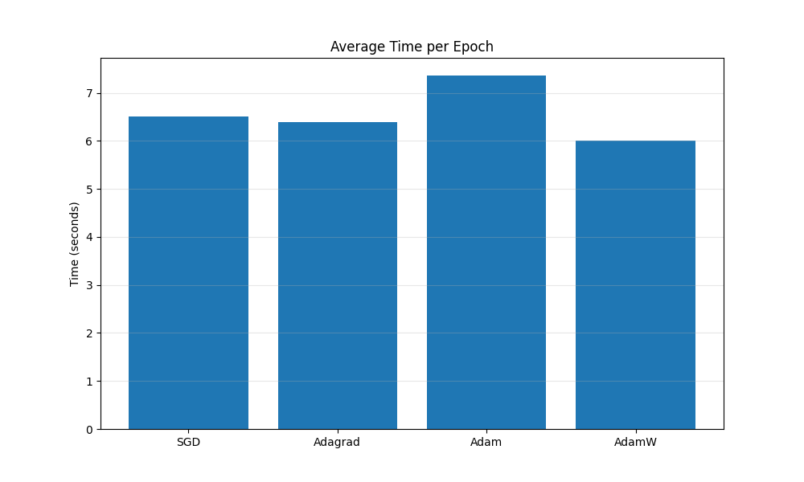

# Adaptive Optimization Methods

1. [Cheat Sheet](cheatsheet.md)
2. [notebook](https://colab.research.google.com/github/damek/STAT-4830/blob/main/section/9/notebook.ipynb)

## Table of contents
1. [Introduction and Motivation](#introduction-and-motivation)
2. [Algorithm Definitions](#algorithm-definitions)
3. [Theoretical Analysis](#theoretical-analysis)
4. [Practical Implementation](#practical-implementation)
5. [A Minimal Working Example](#a-minimal-working-example)
6. [References](#references)

## Introduction and Motivation

In previous lectures, we explored SGD and its convergence properties for large-scale optimization problems. We saw that for large-scale problems, SGD has a much lower per iteration cost compared to full-batch methods since it uses mini-batches or individual samples to estimate gradients. However, standard SGD has important limitations that can make it inefficient for certain problems.

One key limitation is SGD's sensitivity to feature scaling. When different input features have widely varying scales, the loss function can become elongated along certain dimensions, creating valleys and ravines in the optimization landscape. In such scenarios, SGD tends to oscillate across steep dimensions while making slow progress along flat ones. This is particularly problematic for deep learning models where parameter gradients can vary by several orders of magnitude across layers. 

This is a manifestation of "poor conditioning" of the loss function. The condition number $\kappa$ of a problem, defined as the ratio of the largest to smallest eigenvalues of the Hessian matrix, measures this difficulty. For problems with large $\kappa$, standard SGD with a constant learning rate faces a difficult trade-off: it must use a small enough learning rate to avoid divergence in the directions of large curvature, but this same small learning rate leads to slow progress in directions of small curvature.

To illustrate this issue, consider the simple quadratic problem from Lecture 7:

$$L(w) = \frac{1}{2}(h_1 w_1^2 + h_2 w_2^2)$$

where $h_1 \gg h_2 > 0$. The condition number here is $\kappa = h_1/h_2$. As we saw, when using a constant learning rate $\alpha$ chosen to ensure stability (i.e., $\alpha < 2/h_1$), the convergence rate of the component with smaller curvature becomes $(1 - \alpha h_2)^k \approx (1 - h_2/h_1)^k$. For large $\kappa$, this implies extremely slow convergence.

The insight behind adaptive optimization methods is simple: what if each parameter had its own learning rate that adapts during training? Specifically, these methods scale the learning rate for each parameter inversely proportional to some function of the historical gradient magnitudes for that parameter. Parameters with consistently large gradients get smaller learning rates, while parameters with small gradients receive larger learning rates. This approach naturally addresses both the scaling sensitivity and ill-conditioning problems.

The history of the adaptive methods we will discuss today begins with Adagrad (Duchi et al., 2011), which accumulates squared gradients in the denominator, effectively slowing down learning for frequently updated parameters. However, this accumulation never decreases, eventually causing learning to stall. RMSProp (Tieleman & Hinton, 2012) modified Adagrad to use an exponential moving average of squared gradients instead, preventing the learning rate from vanishing. Finally, Adam (Kingma & Ba, 2015) combined RMSProp's adaptive learning rates with momentum, while also incorporating "bias-correction" terms to improve early training dynamics. More recently, AdamW (Loshchilov & Hutter, 2019) decoupled weight decay from the adaptive update, yielding better regularization properties.

These adaptive methods have proven effective in practice, especially for deep learning. Adam, in particular, has become a default optimizer for training large-language models. 

In the following sections, we'll define these algorithms, discuss a bit of theory, and see some practical implementation details.

## Algorithm Definitions

### Adagrad

Adagrad was one of the first major adaptive optimization methods, introduced by Duchi et al. (2011). Unlike SGD, which applies the same learning rate to all parameters, Adagrad adapts the learning rate for each parameter based on the historical magnitudes of its gradients. Specifically, parameters that receive larger or more frequent updates have their learning rate reduced, while parameters with smaller or infrequent updates maintain larger learning rates.

To formalize this, let's consider an optimization problem with parameters $w \in \mathbb{R}^d$ and loss function $L(w)$, which can be written as an expectation over individual losses: 

$$L(w) = \mathbb{E}_{z \sim \mathcal{D}}[\ell(w, z)].$$

At iteration $t$, we compute a stochastic gradient $g_t = \nabla \ell(w_{t-1}, z_t)$ where $z_t$ is sampled from the data distribution $\mathcal{D}$.

The Adagrad update rule is:

$$w_{t,i} = w_{t-1,i} - \frac{\alpha}{\sqrt{G_{t,ii} + \epsilon}} \cdot g_{t,i}$$

Here, $w_{t,i}$ is the $i$-th component of the parameter vector at iteration $t$, $\alpha$ is a global learning rate, $g_{t,i}$ is the $i$-th component of the gradient at iteration $t$, and $\epsilon$ is a small constant (e.g., 10⁻⁸) added for numerical stability.

The key component is $G_{t,ii}$, which represents the sum of squared gradients for parameter $i$ up to iteration $t$:

$$G_{t,ii} = \sum_{j=1}^{t} g_{j,i}^2$$

This accumulation of squared gradients in the denominator causes the effective learning rate to decrease over time, with the rate of decrease being larger for parameters that consistently have large gradients. 

The usefulness of Adagrad is that it eliminates the need to manually tune the learning rate for different parameters. This is particularly useful for problems with sparse gradients, where some parameters may be updated infrequently. In such cases, when a parameter does receive an update, Adagrad gives it a larger effective learning rate compared to frequently updated parameters.

One issue to watch out for with Adagrad is that because $G_{t,ii}$ monotonically increases, the effective learning rate continually shrinks throughout training. Eventually, it becomes so small that learning effectively stops. This issue motivated the development of RMSProp and Adam, which we'll explore next.

### Adam

RMSProp addressed Adagrad's vanishing learning rate problem by replacing the sum of squared gradients with an exponential moving average (EMA). However, it lacked momentum, which had proven effective for SGD. Adam, introduced by Kingma and Ba (2015), combines RMSProp's adaptive learning rates with momentum to create a more comprehensive algorithm. Its name derives from "adaptive moment estimation," referring to the first and second moments of gradients that it tracks.

The Adam algorithm maintains two exponentially decaying averages: one for the gradients (first moment) and one for the squared gradients (second moment). These moving averages effectively estimate the mean and uncentered variance of the gradients. The update rule for Adam can be defined as follows:

First, we compute the exponentially weighted moving averages of gradients and squared gradients:

$$m_t = \beta_1 m_{t-1} + (1 - \beta_1) g_t$$

$$v_t = \beta_2 v_{t-1} + (1 - \beta_2) g_t^2$$

Here, $m_t$ represents the estimate of the first moment (mean) of the gradients, and $v_t$ is the estimate of the second moment (uncentered variance). The hyperparameters $\beta_1$ and $\beta_2$ control the exponential decay rates for these moment estimates, typically set to 0.9 and 0.999 respectively.

A key insight in Adam is the recognition that these moment estimates are biased toward zero during the initial iterations, especially when the decay rates are high (i.e., $\beta_1$ and $\beta_2$ close to 1). This occurs because the moving averages are initialized at zero and take time to "warm up." 

> Let me give you a more formal reason for this. Suppose that $m_0 = 0$ and $g_t = g$ for all $g$. Then consider
> $$ m_{t} = \beta_1 m_{t-1} + (1 - \beta_1) g = \beta_1^t m_0 + (1 - \beta_1) \sum_{i=0}^{t-1} \beta_1^i g = (1 - \beta_1) \sum_{i=0}^{t-1} \beta_1^i g $$
> 
> Noting that $\sum_{i=0}^{t-1} \beta_1^i = \frac{1 - \beta_1^t}{1 - \beta_1}$ we get
> 
> $$ m_{t} = (1 - \beta_1) \sum_{i=0}^{t-1} \beta_1^i g = (1 - \beta_1) \frac{1 - \beta_1^t}{1 - \beta_1} g = (1 - \beta_1^t) g$$
> 
> This shows that the estimate of the "true" gradient produced by momentum is scaled by $(1-\beta_1^t)$ even in this simple setting. Since $\beta_1$ is often chosen close to 1, this can lead to significant "bias" in early iterations. This explains why adam performs the following correction. 

To counteract this bias, Adam applies correction terms:

$$\hat{m}_t = \frac{m_t}{1 - \beta_1^t}$$

$$\hat{v}_t = \frac{v_t}{1 - \beta_2^t}$$

These bias-corrected estimates then feed into the parameter update:

$$w_t = w_{t-1} - \frac{\alpha}{\sqrt{\hat{v}_t} + \epsilon} \hat{m}_t$$

The division and square root operations are applied element-wise, and $\epsilon$ is a small constant (typically $10^{-8}$) to prevent division by zero.

Let's interpret this update rule: The term $\frac{\alpha}{\sqrt{\hat{v}_t} + \epsilon}$ functions as an adaptive learning rate for each parameter. Parameters with large historical gradients (high $\hat{v}_t$) receive smaller effective learning rates, while parameters with small or infrequent updates receive larger rates. Meanwhile, $\hat{m}_t$ provides a momentum-like smoothing of the gradient direction. This might help the method navigate narrow ravines more effectively.

The bias correction terms are important in the early stages of training. Without them, Adam would effectively use much smaller learning rates at the beginning, potentially slowing initial progress. As training progresses ($t$ increases), the correction terms approach 1, and their effect diminishes.

Adam introduces several hyperparameters: the step size $\alpha$, the decay rates $\beta_1$ and $\beta_2$, and the epsilon term $\epsilon$. This is a lot of parameters to tune and [they can all matter](https://arxiv.org/abs/1910.05446); we'll discuss tuning strategies more in a follow up lecture. In PyTorch the default values of $\beta_1 = 0.9$, $\beta_2 = 0.999$, and $\epsilon = 10^{-8}$. 

### AdamW

A subtle but important issue with Adam (and other adaptive methods) concerns the implementation of weight decay. In standard SGD, adding an L2 regularization term to the loss function is mathematically equivalent to applying weight decay directly to the parameters. However, Loshchilov and Hutter (2019) noted that this equivalence breaks down for adaptive methods like Adam.

To understand this distinction, recall that L2 regularization adds a term $\frac{\lambda}{2}\|w\|_2^2$ to the loss function. This modifies the gradient used in the update to:

$$g_t = \nabla \ell(w_{t-1}) + \lambda w_{t-1}$$

In SGD, this leads to an update equivalent to:

$$w_t = (1 - \alpha\lambda)w_{t-1} - \alpha\nabla \ell(w_{t-1})$$

The factor $(1 - \alpha\lambda)$ directly scales down the weights, hence the term "weight decay." However, in Adam, the regularization term is included in the gradient that gets adaptively scaled by $\frac{\alpha}{\sqrt{\hat{v}_t} + \epsilon}$. 

Instead of $\ell_2$ regularization, AdamW decouples weight decay from the gradient update:

$$w_t = (1 - \alpha\lambda)w_{t-1} - \frac{\alpha}{\sqrt{\hat{v}_t} + \epsilon}\hat{m}_t$$

This simple modification ensures consistent regularization across all parameters, regardless of their gradient history. The full AdamW update can be summarized as:

1. Compute gradient: $g_t = \nabla \ell(w_{t-1})$
2. Update momentum: $m_t = \beta_1 m_{t-1} + (1 - \beta_1) g_t$
3. Update velocity: $v_t = \beta_2 v_{t-1} + (1 - \beta_2) g_t^2$
4. Bias correction: $\hat{m}_t = \frac{m_t}{1 - \beta_1^t}$ and $\hat{v}_t = \frac{v_t}{1 - \beta_2^t}$
5. Apply weight decay: $w_t = (1 - \alpha\lambda)w_{t-1} - \frac{\alpha}{\sqrt{\hat{v}_t} + \epsilon}\hat{m}_t$

Why decouple? The authors of the original AdamW paper claim that 
> We provide empirical evidence that our proposed modification (i) decouples the optimal choice of weight decay factor from the setting of the learning rate for both standard SGD and Adam and (ii) substantially improves Adam’s generalization performance, allowing it to compete with SGD with momentum on image classification datasets (on which it was previously typically outperformed by the latter).

### A quick experiment


The figures above illustrate key properties of the adaptive optimization methods discussed in this section. Figure 2.1 demonstrates how Adagrad dynamically adjusts learning rates for different parameters based on their gradient history. Parameters that consistently receive larger gradients (green line) experience a rapid decrease in their effective learning rate, while parameters with smaller gradients (blue line) maintain higher learning rates throughout training. This parameter-specific adaptation helps Adagrad handle features of different scales without manual tuning, but the monotonically decreasing nature of these learning rates can eventually lead to training stagnation in practice.

Figure 2.2 contrasts the gradient accumulation approaches in Adagrad and Adam. The simple accumulation used in Adagrad (red line) continually increases as new gradients arrive, causing the effective learning rate to steadily decrease toward zero. In contrast, the exponential moving averages (EMAs) used in Adam (blue, green, and purple lines) maintain relatively stable values by giving more weight to recent gradients and gradually forgetting older ones. This property allows Adam to overcome Adagrad's vanishing learning rate problem. The figure also shows how different $\beta$ values control the EMA's sensitivity to gradient spikes, with larger values (like $\beta=0.999$) providing more smoothing but slower adaptation.

Figure 2.3 highlights the importance of bias correction in Adam. Without correction, both moment estimates (dashed lines) start near zero and only gradually approach their true values, effectively reducing the learning rate during early iterations. The bias-corrected estimates (solid lines) reach appropriate values much more quickly, enabling effective parameter updates from the beginning of training. This correction is particularly important when using large $\beta$ values, which would otherwise cause significant initialization bias.

## Theoretical Analysis

### Common Assumptions

To analyze the convergence properties of adaptive methods like Adagrad and Adam, we need to make certain assumptions about the optimization problem. These assumptions provide the theoretical framework necessary to establish convergence rates and understand the behavior of these algorithms in different settings.

For our analysis, we consider an objective function $L(w) = \mathbb{E}_{z \sim \mathcal{D}}[\ell(w, z)]$ where $w \in \mathbb{R}^d$ represents the parameters we're optimizing, $z$ represents the data samples drawn from some distribution $\mathcal{D}$, and $\ell(w, z)$ is the loss for a single sample. 

The first standard assumption is that the objective function is lower bounded. Formally, we assume there exists a finite value $L_*$ such that:

$$L(w) \geq L_* \quad \forall w \in \mathbb{R}^d$$

This assumption is reasonable for most practical problems and ensures that the optimization doesn't diverge to negative infinity.

The second key assumption is a bound on the gradients in the $\ell_\infty$ norm. Specifically, we assume there exists a constant $R$ such that:

$$\|\nabla \ell(w, z)\|_\infty \leq R \quad \forall w \in \mathbb{R}^d, z \in \mathcal{D}$$

This bound on the $\ell\_\infty$ norm (where $\|\|x\|\|\_\infty = \max\_i \|x\_i\|$) is somewhat unusual in optimization theory. Typical analyses of SGD often assume bounded second moments of gradients, but the $\ell_\infty$ bound is needed for analyzing adaptive methods because it directly affects how the adaptive learning rates behave. The coordinate-wise adaptation in algorithms like Adam and Adagrad makes the $\ell_\infty$ norm a natural choice for the analysis.

The third assumption is the smoothness of the objective function. We assume that the gradient of $L$ is Lipschitz continuous with constant $L$:

$$\|\nabla L(w) - \nabla L(w')\|_2 \leq L\|w - w'\|_2 \quad \forall w, w' \in \mathbb{R}^d$$

This smoothness condition ensures that the gradient doesn't change too rapidly, which is necessary for establishing the stability of the optimization process.

These three assumptions (lower boundedness, bounded gradients in $\ell_\infty$ norm, and smoothness) are sufficient to derive convergence rates for adaptive methods. For Adam, we typically use them to show convergence to a stationary point (where $\|\|\nabla L(w)\|\|^2$ is small) rather than to a global minimum. We'll now discuss a bit more about this convergence measure.

### Convergence Measure

When analyzing optimization algorithms, we need a way to measure how close we are to an optimal solution. For [convex problems](https://en.wikipedia.org/wiki/Convex_optimization), a topic we'll cover in later lectures, we might measure the distance to the optimal parameters $\| \|w - w^* \|\|^2$ or the optimality gap $L(w) - L(w^*)$. However, for general functions, we can't easily find global minima. Instead, we focus on finding "stationary points", i.e., points where the gradient is (approximately) zero.

A common measure used in the analysis of stochastic optimization methods, including adaptive ones, is the expected squared norm of the gradient $\mathbb{E}[\|\nabla L(w)\|^2]$. A smaller value indicates that we're closer to a stationary point. Theoretical analyses typically aim to bound this quantity as a function of the number of iterations or the computational budget.

One complication in the analysis arises from the stochastic nature of the algorithms. Since each iterate $w_t$ depends on random samples, it is itself a random variable. To handle this randomness, analyses often focus on a randomly selected iterate from the optimization trajectory. Specifically, for a total of $N$ iterations, we define a random index $\tau_N$ with values in $\{0, 1, ..., N-1\}$, and then bound $\mathbb{E}[\|\|\nabla L(w_{\tau_N})\|\|^2]$.

For adaptive methods like Adam, the sampling distribution for $\tau_N$ is typically chosen to reflect the algorithm's behavior. For instance, in the analysis of Adam with momentum parameter $\beta_1$, we might use:

$$P[\tau_N = j] \propto (1 - \beta_1^{N-j})$$

This choice gives less weight to the most recent iterates. If $\beta_1 = 0$ (no momentum), this reduces to uniform sampling, where each iterate has equal probability.

The convergence results for adaptive methods are typically expressed as upper bounds on $\mathbb{E}[\|\nabla L(w_{\tau_N})\|^2]$. For instance, a result might take the form:

$$\mathbb{E}[\|\nabla L(w_{\tau_N})\|^2] \leq \frac{C(L(w_0) - L_*)}{\sqrt{N}} + \frac{D \ln(N)}{\sqrt{N}}$$

Where $C$ and $D$ are constants that depend on algorithm parameters, problem dimension, and the bounds from our assumptions. The first term represents the contribution from the initialization, while the second term captures the effect of stochastic gradient noise. This is very similar to our decomposition of the "error" in SGD into "initialization error" and "steady state risk," which we saw in Lectures [6](../6/notes.md) and [7](../7/notes.md).

For the analysis to be meaningful, we need to ensure that these upper bounds can be made arbitrarily small by running the algorithm for enough iterations. The assumptions we introduced in the previous section allow us to establish that the constants in the bounds are finite and that the bounds decay appropriately with the number of iterations. 

By examining these bounds, we can compare the theoretical guarantees of different algorithms and understand how factors like the learning rate, momentum parameters, and problem dimension affect convergence. These results of course represent worst-case scenarios and may not fully capture the practical performance of these methods on specific problems.

### Main Results for Adagrad

Now that we've established our key assumptions and convergence measure, we can present the main theoretical results for Adagrad. The following theorem, adapted from Défossez et al. (2022), provides a bound on the expected squared gradient norm for Adagrad.

> The bounds from Défossez et al. (2022) are probably not the last word. A brief literature review yields this [this paper](https://proceedings.neurips.cc/paper_files/paper/2023/file/7ac19fdcdf4f311f3e3ef2e7ef4784d7-Paper-Conference.pdf), which appears to have tighter theory. I mainly chose Défossez et al. (2022) because it's conceptually clean.

For Adagrad with constant step size $\alpha > 0$, after $N$ iterations we have:

$$\mathbb{E}[\|\nabla L(w_{\tau_N})\|^2] \leq \frac{2R(L(w_0) - L_*)}{\alpha\sqrt{N}} + \frac{1}{\sqrt{N}}\left(4dR^2 + \alpha dRL\right)\ln\left(1 + \frac{NR^2}{\epsilon}\right)$$

This bound consists of two main terms. The first term, $\frac{2R(L(w_0) - L_*)}{\alpha\sqrt{N}}$, represents the contribution from the initialization. It depends on how far our initial parameter values $w_0$ are from optimality in terms of function value. This term decreases at a rate of $O(1/\sqrt{N})$, which means that the effect of initialization diminishes relatively quickly as we perform more iterations, provided the initial gap is not too large.

The second term, $\frac{1}{\sqrt{N}}\left(4dR^2 + \alpha dRL\right)\ln\left(1 + \frac{NR^2}{\epsilon}\right)$, represents the steady-state error due to stochastic gradient noise. This term also decreases at a rate of $O(\ln(N)/\sqrt{N})$, but notably includes a dependence on the dimension $d$ of the parameter space. This dimension dependence is unusual compared to typical SGD bounds and suggests that in the worst case Adagrad might be slower than SGD in very high-dimensional problems. 

However, SGD error bounds can depend linearly on the variance of the gradient, which can scale with $\|\|\nabla \ell(w, z)\|\|_2^2$. In the case where every component of $\nabla \ell(w, z)$ is bounded by $R$ it follows that we get the bound $\|\|\nabla \ell(w, z)\|\|_2^2 \leq dR^2$. In this case, the dependence on $d$ is comparable. However, if many of the components of the gradient are very small, then $\|\|\nabla \ell(w, z)\|\|_2^2$ can be much smaller than $dR^2$ and the Adagrad bound will be worse than SGD's bound.

The step size $\alpha$ affects both terms in interesting ways. A larger $\alpha$ reduces the initialization term but increases the steady-state error term. This creates a trade-off: larger learning rates lead to faster initial progress but potentially larger final error. Surprisingly, 

> Unlike standard SGD, however, Adagrad doesn't require the learning rate to decay over time to achieve convergence. The adaptive scaling automatically provides the necessary dampening effect.

The parameter $\epsilon$, which is added for numerical stability, appears in the logarithmic term. While it's often treated as a minor implementation detail, this bound shows that it does have a theoretical impact on convergence, albeit a relatively small one due to the logarithmic dependence.

### Main Results for Adam

Before presenting the main theoretical results for Adam, it's important to note that the analysis requires a slight modification to the standard Adam algorithm. In the original Adam paper, the update uses bias correction terms for both the first and second moment estimates. For theoretical analysis, Défossez et al. (2022) propose a simplified variant of Adam that only retains the bias correction term for the second moment estimate.

Specifically, instead of using the original Adam step size:

$$\alpha_{\text{original}} = \alpha \cdot \frac{1-\beta_1}{1-\beta_1^t} \cdot \frac{\sqrt{1-\beta_2^t}}{\sqrt{1-\beta_2}}$$

The analysis uses the modified step size:

$$\alpha_t = \alpha(1-\beta_1) \cdot \sqrt{\frac{1-\beta_2^t}{1-\beta_2}}$$

This simplification removes the correction term for the first moment ($\frac{1}{1-\beta_1^t}$) while retaining the correction for the second moment ($\sqrt{\frac{1-\beta_2^t}{1-\beta_2}}$). The authors experimentally verified that this modification has minimal impact on practical performance.

With this modification, the convergence bound for Adam without momentum ($\beta_1 = 0$) and step size as defined above is:

$$\mathbb{E}[\|\nabla L(w_{\tau_N})\|^2] \leq \frac{2R(L(w_0) - L_*)}{\alpha N} + E \cdot \left(\frac{1}{N}\ln\left(1 + \frac{R^2}{(1-\beta_2)\epsilon}\right) - \ln(\beta_2)\right)$$

Where:

$$E = \frac{4dR^2}{\sqrt{1-\beta_2}} + \frac{\alpha dRL}{1-\beta_2}$$

Comparing this bound to Adagrad's, we observe several key differences. First, the initialization term decreases at a rate of $O(1/N)$ rather than $O(1/\sqrt{N})$, indicating potentially faster reduction of the initialization error. On the other hand, the second term has two components. The part $E \cdot \frac{1}{N} \cdot \ln\left(1 + \frac{R^2}{(1 - \beta_2)\epsilon}\right)$ decreases at a rate of $O(\ln(N)/N)$ and represents the effect of gradient estimation noise for fixed $\beta_2$. The term $-\ln(\beta_2)$ is a constant that doesn't decrease with iterations. This means that as $N$ grows large, the bound approaches this constant value, creating a "noise floor" below which Adam with constant hyperparameters cannot go.

The parameter $\beta_2$ plays a crucial role in the bound. As $\beta_2$ approaches 1, the coefficient $E$ increases, potentially worsening the convergence. However, as $\beta_2$ tends to $0$, the term $-\ln(\beta_2)$ also grows, creating a trade-off. The step size also appears in $E$, with larger values increasing the coefficient and potentially slowing convergence.

The step size parameter $\alpha$ plays a similar role as in Adagrad: larger values reduce the initialization term but increase the steady-state error. However, the impact of $\alpha$ is now modulated by $\beta_2$ through the term $\alpha/(1-\beta_2)$. An interesting insight from this bound is that with appropriate parameter settings, Adam can achieve the same asymptotic convergence rate as Adagrad. Specifically, if we choose $\alpha \sim 1/\sqrt{N}$ and $\beta_2 = 1-1/N$, then Adam's bound simplifies to match Adagrad's $O(d\ln(N)/\sqrt{N})$ rate.

Summarizing these results, the authors write: 
> **Adam and Adagrad are twins.** Our analysis highlights an important fact: Adam is to Adagrad like constant step size SGD is to decaying step size SGD. While Adagrad is asymptotically optimal, it also leads to a slower decrease of the term proportional to $L(w_0) - L^*$, as $1/N$ instead of $1/N$ for Adam. During the initial phase of training, it is likely that this term dominates the loss, which could explain the popularity of Adam for training deep neural networks rather than Adagrad. With its default parameters, Adam will not converge. It is however possible to choose $\beta_2$ and $\alpha$ to achieve an asymptotic convergence rate of $O(d\ln(N)/\sqrt{N})$ for any time horizon, and for a known time horizon, they can be chosen to obtain the exact same bound as Adagrad.

### Impact of Momentum

Momentum is widely used in practice and often improves optimization performance empirically. However, existing theoretical analysis of Adam show a different picture: in the worst case, momentum can only deteriorate convergence guarantees, suggesting a gap between theory and practice. The results from Défossez et al. (2022) at least point in the right direction because they show that momentum is less detrimental to theoretical performance than previous analyses indicated.

For Adam with momentum parameter $0 \leq \beta_1 < \beta_2$, the convergence bound is:

$$\mathbb{E}[\|\nabla L(w_{\tau_N})\|^2] \leq \frac{2R(L(w_0) - L_*)}{\alpha\tilde{N}} + E\left(\frac{1}{\tilde{N}}\ln\left(1 + \frac{R^2}{(1-\beta_2)\epsilon}\right) - \frac{N}{\tilde{N}}\ln(\beta_2)\right)$$

where $\tilde{N} = N - \frac{\beta_1}{1-\beta_1}$ and:

$$E = \frac{\alpha dRL(1-\beta_1)}{(1-\beta_1/\beta_2)(1-\beta_2)} + \frac{12dR^2\sqrt{1-\beta_1}}{(1-\beta_1/\beta_2)^{3/2}\sqrt{1-\beta_2}} + \frac{2\alpha^2dL^2\beta_1}{(1-\beta_1/\beta_2)(1-\beta_2)^{3/2}}$$

Examining this bound reveals that increasing $\beta_1$ always worsens the theoretical guarantees. First, the effective number of iterations $\tilde{N}$ decreases as $\beta_1$ increases, reducing from $N$ when $\beta_1 = 0$ to potentially much smaller values as $\beta_1$ approaches 1. Second, the coefficient $E$ generally grows with increasing $\beta_1$, further degrading the bound.

The key contribution of Défossez et al. (2022) is showing that the dependency on $\beta_1$ is of the form $O((1-\beta_1)^{-1})$, which represents a significant improvement over previous theoretical results. Earlier work showed much worse dependencies: $O((1-\beta_1)^{-3})$ for Adagrad with momentum and $O((1-\beta_1)^{-5})$ for Adam with momentum. This means that while momentum still theoretically hurts convergence in the worst case, the effect is much less severe than previously thought.

Taking $\beta_1 = 0$ in the bound nearly recovers the no-momentum results from the previous sections, up to a constant factor in some terms. This provides a consistent theoretical picture where vanilla versions of the algorithms have the best worst-case guarantees, and adding momentum only increases the bounds.

## Practical Implementation

### PyTorch Implementation

Let's see how to implement the optimization algorithms we've discussed using PyTorch. PyTorch provides built-in implementations of these optimizers in its `torch.optim` module, but understanding their manual implementation helps clarify the underlying mechanisms.

We'll start with a minimal implementation of Adagrad. The core logic involves accumulating squared gradients and using them to scale the learning rates:

```python
def adagrad_update(params, grads, state, lr=0.01, eps=1e-8):
    """
    Basic Adagrad implementation
    
    Args:
        params: List of parameters
        grads: List of gradients
        state: List of accumulators for squared gradients
        lr: Learning rate
        eps: Small constant for numerical stability
    """
    for i, (param, grad) in enumerate(zip(params, grads)):
        # Initialize accumulator if needed
        if len(state) <= i:
            state.append(torch.zeros_like(param))
            
        # Accumulate squared gradients
        state[i].add_(grad * grad)
        
        # Compute update
        std = torch.sqrt(state[i] + eps)
        param.addcdiv_(grad, std, value=-lr)
    
    return params, state
```

This implementation follows the Adagrad update rule we defined earlier. For each parameter, we maintain a corresponding state vector that accumulates the squared gradients. We then compute the square root of this accumulation, add a small epsilon for numerical stability, and use this to scale the gradient before applying the update.

Next, let's implement Adam, which adds momentum and bias correction:

```python
def adam_update(params, grads, m_state, v_state, lr=0.001, 
                beta1=0.9, beta2=0.999, eps=1e-8, t=1):
    """
    Basic Adam implementation
    
    Args:
        params: List of parameters
        grads: List of gradients
        m_state: List of first moment estimators
        v_state: List of second moment estimators
        lr: Learning rate
        beta1: Exponential decay rate for first moment
        beta2: Exponential decay rate for second moment
        eps: Small constant for numerical stability
        t: Current iteration number (starting from 1)
    """
    # Compute bias correction terms
    bias_correction1 = 1 - beta1**t
    bias_correction2 = 1 - beta2**t
    
    for i, (param, grad) in enumerate(zip(params, grads)):
        # Initialize moment estimates if needed
        if len(m_state) <= i:
            m_state.append(torch.zeros_like(param))
            v_state.append(torch.zeros_like(param))
        
        # Update biased first moment estimate
        m_state[i].mul_(beta1).add_(grad, alpha=1-beta1)
        
        # Update biased second moment estimate
        v_state[i].mul_(beta2).add_(grad * grad, alpha=1-beta2)
        
        # Correct bias in first moment estimate
        m_hat = m_state[i] / bias_correction1
        
        # Correct bias in second moment estimate
        v_hat = v_state[i] / bias_correction2
        
        # Update parameters
        param.addcdiv_(m_hat, torch.sqrt(v_hat) + eps, value=-lr)
    
    return params, m_state, v_state
```

This implementation captures the key elements of Adam: maintaining exponentially moving averages of gradients and squared gradients, applying bias correction, and using these estimates to adapt the learning rate for each parameter.

For AdamW, we modify the Adam implementation to decouple weight decay from the adaptive update:

```python
def adamw_update(params, grads, m_state, v_state, lr=0.001, 
                 beta1=0.9, beta2=0.999, eps=1e-8, weight_decay=0.01, t=1):
    """
    Basic AdamW implementation
    
    Args:
        params: List of parameters
        grads: List of gradients
        m_state: List of first moment estimators
        v_state: List of second moment estimators
        lr: Learning rate
        beta1: Exponential decay rate for first moment
        beta2: Exponential decay rate for second moment
        eps: Small constant for numerical stability
        weight_decay: Weight decay coefficient
        t: Current iteration number (starting from 1)
    """
    # Compute bias correction terms
    bias_correction1 = 1 - beta1**t
    bias_correction2 = 1 - beta2**t
    
    for i, (param, grad) in enumerate(zip(params, grads)):
        # Initialize moment estimates if needed
        if len(m_state) <= i:
            m_state.append(torch.zeros_like(param))
            v_state.append(torch.zeros_like(param))
        
        # Apply weight decay (decoupled from adaptive updates)
        param.mul_(1 - lr * weight_decay)
        
        # Update biased first moment estimate
        m_state[i].mul_(beta1).add_(grad, alpha=1-beta1)
        
        # Update biased second moment estimate
        v_state[i].mul_(beta2).add_(grad * grad, alpha=1-beta2)
        
        # Correct bias in first moment estimate
        m_hat = m_state[i] / bias_correction1
        
        # Correct bias in second moment estimate
        v_hat = v_state[i] / bias_correction2
        
        # Update parameters
        param.addcdiv_(m_hat, torch.sqrt(v_hat) + eps, value=-lr)
    
    return params, m_state, v_state
```

The key difference in AdamW is the addition of the direct weight decay step, which multiplies each parameter by (1 - lr * weight_decay) before the adaptive update. This decouples the regularization effect from the adaptive learning rates.

In practice, we typically don't implement these optimizers manually but use PyTorch's built-in implementations. Here's how to use them:

```python
import torch
import torch.optim as optim

# Define a model
model = torch.nn.Linear(10, 1)

# Create optimizers
adagrad_opt = optim.Adagrad(model.parameters(), lr=0.01)
adam_opt = optim.Adam(model.parameters(), lr=0.001, betas=(0.9, 0.999), eps=1e-8)
adamw_opt = optim.AdamW(model.parameters(), lr=0.001, betas=(0.9, 0.999), 
                        eps=1e-8, weight_decay=0.01)

# Training loop
for X, y in dataloader:
    # Zero gradients
    adam_opt.zero_grad()
    
    # Forward pass and compute loss
    output = model(X)
    loss = criterion(output, y)
    
    # Backward pass
    loss.backward()
    
    # Update parameters
    adam_opt.step()
```

PyTorch's implementations include additional features like parameter groups (allowing different hyperparameters for different layers) and various optimizations for efficiency. The implementations match the mathematical formulations we've discussed, with minor variations to handle edge cases and improve numerical stability.


## A Minimal Working Example

Below is an implementation of a simple experiment comparing SGD, AdaGrad, Adam, and AdamW on a common benchmark. This experiment will allow us to visualize how each optimizer's convergence properties. You should mess around and change the parameters to see how the optimizers perform. 

We'll train a simple neural network to classify Fashion MNIST images - a dataset of 70,000 grayscale clothing images divided into 10 categories. The following self-contained script implements our experiment. You can view it on [colab here.](https://colab.research.google.com/github/damek/STAT-4830/blob/main/section/9/notebook.ipynb)

```python
import numpy as np
import matplotlib.pyplot as plt
import torch
import torch.nn as nn
import torch.nn.functional as F
from torch.utils.data import DataLoader
from torchvision import datasets, transforms
import time

# Set random seeds for reproducibility
torch.manual_seed(42)
np.random.seed(42)

# Define a simple neural network model
class SimpleNN(nn.Module):
    def __init__(self):
        super(SimpleNN, self).__init__()
        self.flatten = nn.Flatten()
        self.fc1 = nn.Linear(28*28, 256)
        self.fc2 = nn.Linear(256, 128)
        self.fc3 = nn.Linear(128, 10)
        
    def forward(self, x):
        x = self.flatten(x)
        x = F.relu(self.fc1(x))
        x = F.relu(self.fc2(x))
        x = self.fc3(x)
        return x

# Load Fashion MNIST dataset
def load_fashion_mnist(batch_size=128):
    transform = transforms.Compose([
        transforms.ToTensor(),
        transforms.Normalize((0.5,), (0.5,))
    ])
    
    train_dataset = datasets.FashionMNIST(
        root='./data', 
        train=True, 
        download=True, 
        transform=transform
    )
    
    test_dataset = datasets.FashionMNIST(
        root='./data', 
        train=False, 
        download=True, 
        transform=transform
    )
    
    train_loader = DataLoader(
        train_dataset, 
        batch_size=batch_size, 
        shuffle=True
    )
    
    test_loader = DataLoader(
        test_dataset, 
        batch_size=batch_size, 
        shuffle=False
    )
    
    return train_loader, test_loader

# Function to train the model with a specific optimizer
def train_model(model, optimizer_name, train_loader, test_loader, 
                learning_rate, epochs=10, device='cpu'):
    """
    Train a model with the specified optimizer and return training history.
    """
    model = model.to(device)
    criterion = nn.CrossEntropyLoss()
    
    # Initialize optimizer based on name
    if optimizer_name.lower() == 'sgd':
        optimizer = torch.optim.SGD(
            model.parameters(), 
            lr=learning_rate, 
            momentum=0.9,
            weight_decay=1e-4
        )
    elif optimizer_name.lower() == 'adagrad':
        optimizer = torch.optim.Adagrad(
            model.parameters(), 
            lr=learning_rate
        )
    elif optimizer_name.lower() == 'adam':
        optimizer = torch.optim.Adam(
            model.parameters(), 
            lr=learning_rate,
            betas=(0.9, 0.999),
            eps=1e-8
        )
    elif optimizer_name.lower() == 'adamw':
        optimizer = torch.optim.AdamW(
            model.parameters(), 
            lr=learning_rate,
            betas=(0.9, 0.999),
            weight_decay=1e-4,
            eps=1e-8
        )
    else:
        raise ValueError(f"Optimizer {optimizer_name} not supported")
    
    # Initialize history dictionary
    history = {
        'train_loss': [],
        'train_acc': [],
        'val_loss': [],
        'val_acc': [],
        'time_per_epoch': []
    }
    
    # Training loop
    for epoch in range(epochs):
        start_time = time.time()
        
        # Training phase
        model.train()
        train_loss = 0.0
        correct = 0
        total = 0
        
        for inputs, labels in train_loader:
            inputs, labels = inputs.to(device), labels.to(device)
            
            # Zero gradients
            optimizer.zero_grad()
            
            # Forward pass
            outputs = model(inputs)
            loss = criterion(outputs, labels)
            
            # Backward pass and optimize
            loss.backward()
            optimizer.step()
            
            # Track statistics
            train_loss += loss.item() * inputs.size(0)
            _, predicted = outputs.max(1)
            total += labels.size(0)
            correct += predicted.eq(labels).sum().item()
        
        train_loss = train_loss / len(train_loader.dataset)
        train_acc = correct / total
        
        # Validation phase
        model.eval()
        val_loss = 0.0
        correct = 0
        total = 0
        
        with torch.no_grad():
            for inputs, labels in test_loader:
                inputs, labels = inputs.to(device), labels.to(device)
                
                outputs = model(inputs)
                loss = criterion(outputs, labels)
                
                val_loss += loss.item() * inputs.size(0)
                _, predicted = outputs.max(1)
                total += labels.size(0)
                correct += predicted.eq(labels).sum().item()
        
        val_loss = val_loss / len(test_loader.dataset)
        val_acc = correct / total
        
        epoch_time = time.time() - start_time
        
        # Update history
        history['train_loss'].append(train_loss)
        history['train_acc'].append(train_acc)
        history['val_loss'].append(val_loss)
        history['val_acc'].append(val_acc)
        history['time_per_epoch'].append(epoch_time)
        
        print(f"Epoch {epoch+1}/{epochs} - {epoch_time:.2f}s - "
              f"Train Loss: {train_loss:.4f} - Train Acc: {train_acc:.4f} - "
              f"Val Loss: {val_loss:.4f} - Val Acc: {val_acc:.4f}")
    
    return history

# Main experiment function
def run_optimizer_comparison():
    print("Starting optimizer comparison experiment...")
    
    # Check for GPU
    device = torch.device('cuda' if torch.cuda.is_available() else 'cpu')
    print(f"Using device: {device}")
    
    # Load data
    train_loader, test_loader = load_fashion_mnist(batch_size=128)
    
    # Define optimizer configurations to test
    optimizer_configs = [
        {'name': 'SGD', 'lr': 0.01},
        {'name': 'Adagrad', 'lr': 0.01},
        {'name': 'Adam', 'lr': 0.001},
        {'name': 'AdamW', 'lr': 0.001}
    ]
    
    all_histories = {}
    
    # Train with each optimizer
    for config in optimizer_configs:
        print(f"\nTraining with {config['name']}...")
        model = SimpleNN()
        
        history = train_model(
            model=model,
            optimizer_name=config['name'],
            train_loader=train_loader,
            test_loader=test_loader,
            learning_rate=config['lr'],
            epochs=20,
            device=device
        )
        
        all_histories[config['name']] = history
    
    # Plot results
    plt.figure(figsize=(15, 10))
    
    # Plot training loss
    plt.subplot(2, 2, 1)
    for opt_name, history in all_histories.items():
        plt.plot(history['train_loss'], label=f"{opt_name}")
    plt.title('Training Loss')
    plt.xlabel('Epoch')
    plt.ylabel('Loss')
    plt.legend()
    
    # Plot validation loss
    plt.subplot(2, 2, 2)
    for opt_name, history in all_histories.items():
        plt.plot(history['val_loss'], label=f"{opt_name}")
    plt.title('Validation Loss')
    plt.xlabel('Epoch')
    plt.ylabel('Loss')
    plt.legend()
    
    # Plot training accuracy
    plt.subplot(2, 2, 3)
    for opt_name, history in all_histories.items():
        plt.plot(history['train_acc'], label=f"{opt_name}")
    plt.title('Training Accuracy')
    plt.xlabel('Epoch')
    plt.ylabel('Accuracy')
    plt.legend()
    
    # Plot validation accuracy
    plt.subplot(2, 2, 4)
    for opt_name, history in all_histories.items():
        plt.plot(history['val_acc'], label=f"{opt_name}")
    plt.title('Validation Accuracy')
    plt.xlabel('Epoch')
    plt.ylabel('Accuracy')
    plt.legend()
    
    plt.tight_layout()
    plt.savefig('optimizer_comparison.png')
    
    # Plot time per epoch
    plt.figure(figsize=(10, 6))
    avg_times = {opt: np.mean(hist['time_per_epoch']) for opt, hist in all_histories.items()}
    plt.bar(avg_times.keys(), avg_times.values())
    plt.title('Average Time per Epoch')
    plt.ylabel('Time (seconds)')
    plt.grid(axis='y', alpha=0.3)
    plt.savefig('optimizer_timing.png')
    
    
    print("\nExperiment complete. Results saved as PNG files")

if __name__ == "__main__":
    run_optimizer_comparison()
```

The script 

1. Defines a three-layer feedforward neural network
2. Loads and preprocesses the Fashion MNIST dataset
3. Trains identical model architectures with four different optimizers (SGD with momentum, AdaGrad, Adam, and AdamW)
4. Tracks training and validation metrics for each optimizer
5. Visualizes the results

The script plots both the timing per epoch and the training and validation loss and accuracy. 



The plots show that on this problem, all the methods are roughly comparable, with a slight advantage for the adaptive methods. It's incredibly difficult to compare optimization algorithms from an empirical perspective. The results depend on the model, the dataset, and the hyperparameters. Recently some researchers at Google, Meta, Dell, and in Academia have started the [algoperf benchmark](https://github.com/mlcommons/algorithmic-efficiency), which tests optimizers on a variety of medium scale machine learning tasks. They've also written a [paper](https://arxiv.org/abs/2306.07179) on the difficulty of benchmarking neural network training algorithms. We'll discuss some of these issues in a later lecture, but for now let this just serve as a warning that drawing conclusions from a few plots is hard!

## References

**[1]** Duchi, J., Hazan, E., & Singer, Y. (2011). *Adaptive subgradient methods for online learning and stochastic optimization*. Journal of Machine Learning Research, 12(Jul), 2121-2159. [Link](https://www.jmlr.org/papers/volume12/duchi11a/duchi11a.pdf)

**[2]** Tieleman, T., & Hinton, G. (2012). *Lecture 6.5—RMSProp: Divide the gradient by a running average of its recent magnitude*. COURSERA: Neural Networks for Machine Learning. [Link](https://www.cs.toronto.edu/~tijmen/csc321/slides/lecture_slides_lec6.pdf)

**[3]** Kingma, D. P., & Ba, J. (2015). *Adam: A method for stochastic optimization*. International Conference on Learning Representations (ICLR). [Link](https://arxiv.org/abs/1412.6980)

**[4]** Loshchilov, I., & Hutter, F. (2019). *Decoupled weight decay regularization*. International Conference on Learning Representations (ICLR). [Link](https://arxiv.org/abs/1711.05101)

**[5]** Défossez, A., Bottou, L., Bach, F., & Usunier, N. (2022). *A simple convergence proof of Adam and Adagrad*. Transactions on Machine Learning Research (TMLR). [Link](https://arxiv.org/abs/2003.02395)

**[6]** Zhang, G., Li, L., Nado, Z., Martens, J., Sachdeva, S., Dahl, G., Shallue, C., & McAllester, D. (2019). *Which algorithmic choices matter at which batch sizes? Insights from a noisy quadratic model*. Advances in Neural Information Processing Systems (NeurIPS). [Link](https://arxiv.org/abs/1907.04164)

**[7]** Choi, D., Shallue, C. J., Nado, Z., Lee, J., Maddison, C. J., & Dahl, G. E. (2020). *On empirical comparisons of optimizers for deep learning*. International Conference on Learning Representations (ICLR). [Link](https://arxiv.org/abs/1910.05446)