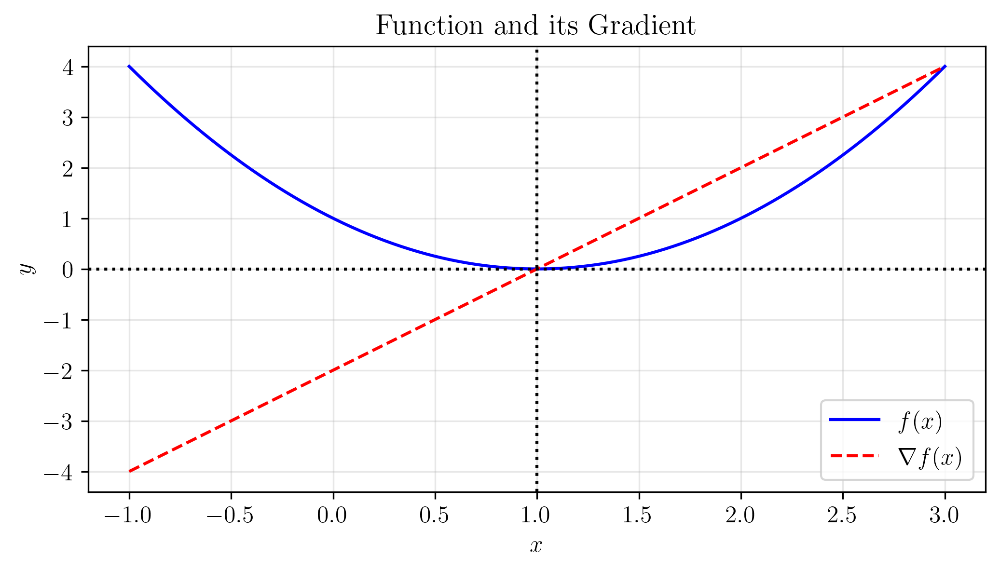
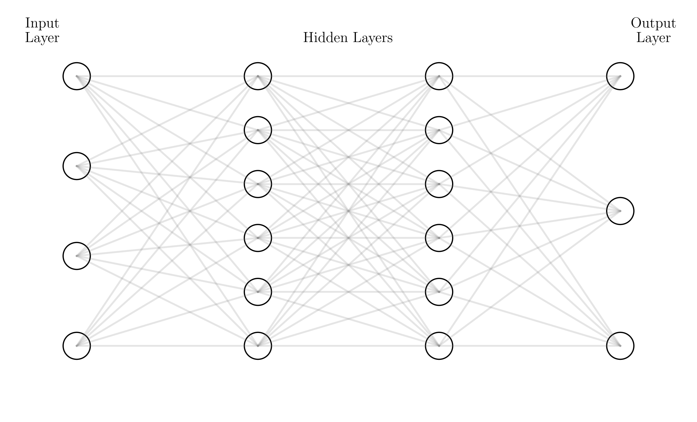

# Beyond Least Squares: Computing Gradients in PyTorch

## Notebooks and Slides
- [Lecture slides](slides.pdf)
- [Colab notebook](https://colab.research.google.com/github/damek/STAT-4830/blob/main/section/4/notebook.ipynb)

## Table of contents
1. [Introduction](#introduction)
2. [One-Dimensional Examples](#one-dimensional-examples)
3. [Common Pitfalls in Gradient Computation](#common-pitfalls-in-gradient-computation)
4. [Revisiting Least Squares](#revisiting-least-squares)
5. [Complex Loss Functions](#complex-loss-functions)
6. [Neural Network Architectures](#neural-network-architectures)
7. [Summary](#summary)

## Introduction

In our previous lecture, we computed gradients by hand for linear regression. Now we'll discover how PyTorch can compute these gradients automatically for any differentiable function. This capability transforms how we approach machine learning - instead of deriving gradients manually, we can focus on designing functions that capture what we want to measure.

## One-Dimensional Examples

Let's start with computing gradients for the simplest possible case: a one-dimensional function. Consider the quadratic function:

$$ f(x) = x^2 - 2x + 1 $$

We can compute its gradient:

$$ \nabla f(x) = 2x - 2 $$

Let's verify this using PyTorch's automatic differentiation:

```python
import torch

# Create a tensor with requires_grad=True to track computations
x = torch.tensor([0.0], requires_grad=True)

# Define our function
def f(x):
    return x**2 - 2*x + 1

# Compute function value
y = f(x)

# Compute gradient
y.backward()

print(f"At x = {x.item():.1f}")
print(f"f(x) = {y.item():.1f}")
print(f"∇f(x) = {x.grad.item():.1f}")  # gradient is -2 at x=0
```

This simple example reveals the key components of automatic differentiation. First, we mark input tensors as requiring gradients with `requires_grad=True`. Next, we build a computation graph by evaluating our function. Then, we call `backward()` to compute gradients through this graph. Finally, we access the computed gradients through the `.grad` attribute.

Let's visualize how the function and its gradient change as we vary x:



The visualization demonstrates the relationship between our function (shown in blue) and its gradient (shown in orange). The gradient's magnitude directly corresponds to the function's slope, reaching zero precisely where the function becomes flat. This geometric interpretation helps build intuition for gradient computation in higher dimensions.

Let's compare different methods of computing the gradient:


The comparison reveals three approaches to gradient computation. The analytical gradient provides the exact mathematical formula. PyTorch's automatic differentiation matches this analytical result perfectly while requiring much less manual effort. This demonstrates PyTorch's ability to compute exact gradients through automatic differentiation, making it a powerful tool for complex models.

These principles extend naturally to higher dimensions, where we'll encounter them again in neural networks. The key difference lies in the gradient's structure: instead of a single number, it becomes a vector pointing in the direction of steepest descent through high-dimensional space.

## Common Pitfalls in Gradient Computation

When using PyTorch's automatic differentiation, several common issues can trip up even experienced users. Let's explore these pitfalls and their solutions:

### 1. Breaking the Computational Graph

The most common mistake occurs when accidentally breaking the chain of computation that PyTorch uses to track gradients:

```python
# Wrong: breaks computational graph
x = torch.tensor([1.0], requires_grad=True)
y = x * 2
z = y.detach()  # Breaks the graph!
w = z * 3
w.backward()  # x.grad will be None

# Right: maintain computational graph
x = torch.tensor([1.0], requires_grad=True)
y = x * 2
w = y * 3
w.backward()  # x.grad will be 6
```

This example illustrates how PyTorch builds a graph of computations:


The visualization exposes the graph's critical components. Input nodes (x, w, y) serve as starting points for gradient computation. Operation nodes transform values through the forward pass. The backward pass flows gradients through this structure. Each node maintains its current value, knows how to compute gradients, and holds references to its inputs - all essential for automatic differentiation.

### 2. In-Place Operations

In-place operations (modifying a tensor directly) can break gradient computation:

```python
# Wrong: in-place operation
x = torch.tensor([1.0], requires_grad=True)
y = x * 2
y += 1  # In-place operation breaks graph
y.backward()  # Error!

# Right: create new tensor
x = torch.tensor([1.0], requires_grad=True)
y = x * 2
y = y + 1  # Creates new tensor
y.backward()  # Works correctly
```

### 3. Gradient Accumulation

Gradients accumulate by default - if you don't clear them, multiple backward passes add up:

```python
x = torch.tensor([1.0], requires_grad=True)
for _ in range(3):
    y = x * 2
    y.backward()  # Gradients accumulate!
print(x.grad)  # Prints 6 (2 + 2 + 2)

# Solution: Clear gradients between computations
x = torch.tensor([1.0], requires_grad=True)
for _ in range(3):
    x.grad = None  # Clear gradients
    y = x * 2
    y.backward()
print(x.grad)  # Prints 2
```

### 4. Scalar vs Vector Backward

PyTorch expects scalar outputs for `backward()` by default. For vector outputs, you need gradients of the same shape:

```python
# Wrong: vector output without gradient
x = torch.tensor([[1.0, 2.0]], requires_grad=True)
y = x * 2
y.backward()  # Error: grad can be implicitly created only for scalar outputs

# Right: provide gradient for vector output
x = torch.tensor([[1.0, 2.0]], requires_grad=True)
y = x * 2
y.backward(torch.ones_like(y))  # Works!
```

### 5. Leaf Node Errors

Only leaf nodes (tensors created by user) can require gradients:

```python
# Wrong: trying to set requires_grad on non-leaf tensor
x = torch.tensor([1.0])
y = x * 2
y.requires_grad_(True)  # Error: can't set requires_grad on non-leaf tensor

# Right: set requires_grad on leaf tensor
x = torch.tensor([1.0], requires_grad=True)
y = x * 2  # y inherits requires_grad
```

### 6. Memory Management

Keeping computational graphs in memory can consume significant RAM. Use `torch.no_grad()` when you don't need gradients:

```python
# Wasteful: tracks gradients during evaluation
def evaluate(model, data):
    return model(data)

# Efficient: disables gradient tracking
def evaluate(model, data):
    with torch.no_grad():
        return model(data)
```

Remember these key principles:
1. Keep the computational graph connected
2. Avoid in-place operations during gradient computation
3. Clear gradients between computations
4. Handle vector outputs correctly
5. Set `requires_grad` on leaf nodes
6. Use `no_grad()` for evaluation

## Revisiting Least Squares

Let's return to linear regression and see how PyTorch's automatic differentiation compares to our manual gradient calculations from the previous lecture. Consider the mean squared error function:

$$ f(w) = \frac{1}{2}\|Xw - y\|_2^2 $$

Last time, we derived its gradient by hand:

$$ \nabla_w f(w) = X^T(Xw - y) $$

Now let's compute this gradient using PyTorch's autograd:

```python
# Generate synthetic data
torch.manual_seed(42)
n_samples, n_features = 1000, 3
X = torch.randn(n_samples, n_features)
w_true = torch.tensor([1.0, -0.5, 0.25])
y = X @ w_true + 0.1 * torch.randn(n_samples)

# Initialize weights and enable gradient tracking
w = torch.zeros(n_features, requires_grad=True)

def mse_function(X, y, w):
    """Compute MSE function"""
    return 0.5 * torch.mean((X @ w - y)**2)

# Compute function value and gradient
f = mse_function(X, y, w)
f.backward()

print("PyTorch gradient:", w.grad)
# Compare with manual calculation
manual_grad = X.T @ (X @ w.detach() - y) / n_samples
print("Manual gradient:", manual_grad)
```

The gradients match exactly! This verifies that PyTorch's automatic differentiation correctly implements our mathematical derivation. But PyTorch offers several advantages:

1. **Automatic Chain Rule**
   Instead of deriving gradients by hand:
   ```python
   # PyTorch handles all of this automatically
   def complex_function(X, y, w):
       predictions = torch.sigmoid(X @ w)  # Non-linear activation
       return torch.mean((predictions - y)**2)
   ```

2. **Dynamic Computation Graphs**
   The same code works for different functions:
   ```python
   # Works for any differentiable function
   def general_function(model, X, y):
       return torch.mean((model(X) - y)**2)
   ```

3. **Efficient Implementation**
   PyTorch optimizes the computation:
   ```python
   # Efficient matrix operations
   X = torch.randn(10000, 100, requires_grad=True)
   w = torch.randn(100, 1, requires_grad=True)
   y = X @ w  # Uses optimized BLAS
   ```

Let's visualize how PyTorch builds the computational graph for our mean squared error function:


The graph shows:
1. Input nodes: X, w, and y
2. Operation nodes: matrix multiply, subtraction, square
3. Gradient flow: backward pass through the graph
4. Final scalar output

This automatic gradient computation becomes especially valuable as we move to more complex functions. Instead of deriving gradients manually (which becomes intractable for deep networks), we can focus on designing the right function and let PyTorch handle the calculus.

## Complex Loss Functions

Moving beyond quadratic functions, we'll explore more sophisticated computations. For nonlinear regression and classification, we'll see how PyTorch computes gradients for nested computations while maintaining clear, readable code.

### Nonlinear Regression

Consider predicting daily temperature variations. The temperature $y_i$ at time $t_i$ follows a sinusoidal pattern:

$$ f_\theta(t) = \theta_{\text{offset}} + \theta_{\text{amplitude}}\sin(2\pi t/24 + \theta_{\text{phase}}) $$

Computing gradients for this function requires applying the chain rule through multiple operations:

$$ \frac{\partial f_\theta}{\partial \theta_{\text{offset}}} = 1 $$
$$ \frac{\partial f_\theta}{\partial \theta_{\text{amplitude}}} = \sin(2\pi t/24 + \theta_{\text{phase}}) $$
$$ \frac{\partial f_\theta}{\partial \theta_{\text{phase}}} = \theta_{\text{amplitude}}\cos(2\pi t/24 + \theta_{\text{phase}}) $$

PyTorch computes these gradients automatically:

```python
def temperature_model(t, params):
    offset, amplitude, phase = params
    return offset + amplitude * torch.sin(2*torch.pi*t/24 + phase)

# Time points throughout the day
t = torch.linspace(0, 24, 100)
params = torch.tensor([20.0, 5.0, 0.0], requires_grad=True)

# Compute temperature predictions
temps = temperature_model(t, params)

# Compute gradients through the model
temps.sum().backward()
print("Gradients:", params.grad)
```

Let's visualize the temperature function and its gradients:


The plot shows how each parameter affects the temperature curve. The offset shifts the entire curve up or down, the amplitude controls the range of variation, and the phase shifts the peaks and troughs. PyTorch's automatic differentiation computes exact gradients through this nonlinear function, enabling us to understand how each parameter influences the predictions.

### Classification with Cross-Entropy Loss

For binary classification, we use the cross-entropy function:

$$ f(w) = -\frac{1}{n}\sum_{i=1}^n [y_i \log(\sigma(x_i^T w)) + (1-y_i)\log(1-\sigma(x_i^T w))] + \frac{\lambda}{2}\|w\|^2 $$

where $\sigma(z) = \frac{1}{1+e^{-z}}$ is the sigmoid function. Computing the gradient requires applying the chain rule through both the sigmoid and logarithm:

$$ \frac{\partial f}{\partial w} = -\frac{1}{n}\sum_{i=1}^n x_i[y_i(1-\sigma(x_i^T w)) - (1-y_i)\sigma(x_i^T w)] + \lambda w $$

PyTorch computes this gradient automatically:

```python
def cross_entropy_function(X, y, w, lambda_reg=0.1):
    """Compute cross-entropy with regularization"""
    logits = X @ w
    probs = torch.sigmoid(logits)
    reg = 0.5 * lambda_reg * torch.sum(w**2)
    return -torch.mean(y * torch.log(probs) + (1-y) * torch.log(1-probs)) + reg

# Initialize parameters
w = torch.zeros(n_features, requires_grad=True)

# Compute function value and gradient
f = cross_entropy_function(X, y, w)
f.backward()
print("Gradient:", w.grad)
```

The gradient computation flows backward through:
1. Regularization term (quadratic in w)
2. Logarithm of probabilities
3. Sigmoid activation
4. Linear combination of features

PyTorch handles this entire chain of computations automatically, freeing us from manual derivation of complex gradients.

## Neural Network Architectures

Neural networks extend our previous models by composing multiple layers of nonlinear transformations. Let's explore different architectures and see how PyTorch handles their increasing complexity.

### Feedforward Networks

The simplest neural network adds a "hidden layer" between input and output:

```python
class SimpleNN(torch.nn.Module):
    def __init__(self, input_dim, hidden_dim, output_dim):
        super().__init__()
        self.layer1 = torch.nn.Linear(input_dim, hidden_dim)
        self.layer2 = torch.nn.Linear(hidden_dim, output_dim)
        self.activation = torch.nn.ReLU()
    
    def forward(self, x):
        h = self.activation(self.layer1(x))
        return self.layer2(h)
```

Let's visualize this architecture:



The diagram shows:
1. Input layer (features)
2. Hidden layers with nonlinear activations
3. Output layer (predictions)
4. All connections between layers

Each layer performs:
```python
h = activation(W x + b)
```
where:
- W is a weight matrix
- b is a bias vector
- activation adds nonlinearity

### Deep Networks

Adding more layers creates a deep network:

```python
class DeepNN(torch.nn.Module):
    def __init__(self, layer_dims):
        super().__init__()
        self.layers = torch.nn.ModuleList()
        for i in range(len(layer_dims)-1):
            self.layers.append(torch.nn.Linear(layer_dims[i], layer_dims[i+1]))
        self.activation = torch.nn.ReLU()
    
    def forward(self, x):
        for layer in self.layers[:-1]:
            x = self.activation(layer(x))
        return self.layers[-1](x)  # No activation on final layer

# Example: 5 layers with different widths
model = DeepNN([784, 512, 256, 128, 10])
```

The key insight is that PyTorch automatically computes gradients through these complex architectures. Each layer's parameters are updated based on their contribution to reducing the loss, determined through backpropagation.

### Residual Networks (ResNets)

Deep networks can be hard to train. ResNets add "skip connections" that help gradients flow:

```python
class ResidualBlock(torch.nn.Module):
    def __init__(self, dim):
        super().__init__()
        self.layer1 = torch.nn.Linear(dim, dim)
        self.layer2 = torch.nn.Linear(dim, dim)
        self.activation = torch.nn.ReLU()
    
    def forward(self, x):
        # Skip connection: add input to output
        h = self.activation(self.layer1(x))
        return x + self.layer2(h)  # Skip connection
```


The diagram highlights:
1. Residual blocks with skip connections
2. Information flow through both paths
3. Addition operation combining paths
4. Repeated block structure

These skip connections create additional paths for gradients to flow, making deep networks easier to train.

## Summary

This lecture explored how PyTorch computes gradients for any differentiable function. Key concepts:

### Automatic Differentiation
PyTorch builds computational graphs that track operations and enable automatic gradient computation. The framework:
- Records computation history in tensors
- Forms dynamic graphs of operations
- Computes exact gradients through backward passes
- Manages memory efficiently during computation

### Common Pitfalls
Several issues can disrupt gradient computation:
- Breaking computational graph connections
- Using in-place operations that modify tensors
- Not clearing accumulated gradients
- Mishandling vector outputs
- Attempting to modify non-leaf tensors
- Keeping unnecessary graphs in memory

### Function Design
PyTorch supports a wide range of differentiable functions:
- Simple quadratic functions
- Composite functions with multiple terms
- Functions with nested nonlinearities
- Complex neural network architectures

### Neural Networks
Modern architectures combine multiple differentiable operations:
- Linear transformations between layers
- Nonlinear activation functions
- Skip connections for gradient flow
- Regularization techniques

### Best Practices
When computing gradients:
- Verify gradient computations against manual calculations
- Monitor gradient magnitudes during computation
- Compare automatic and numerical gradients
- Visualize computation graphs for complex functions

Next lecture, we'll explore more advanced optimization techniques, including adaptive methods like Adam and techniques for handling constraints. We'll see how these methods build on the gradient computation foundations established here. 